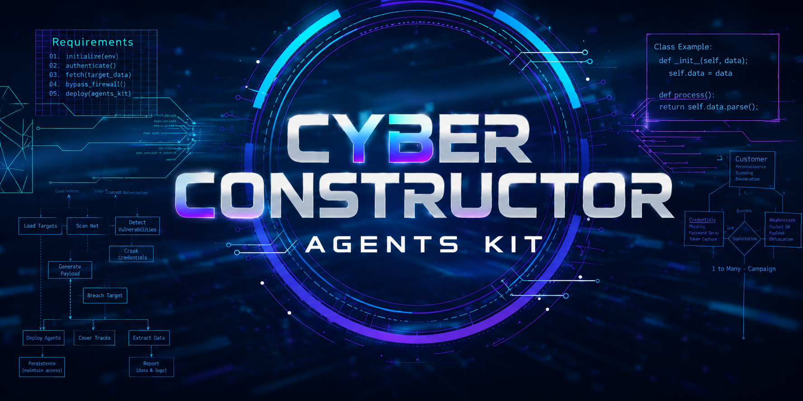
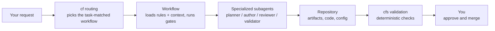
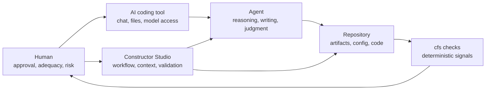
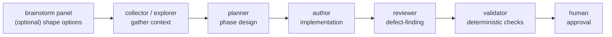
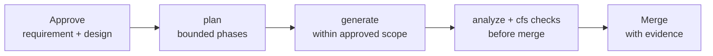

# <p align="center"></p>
 
 [](LICENSE)
  
  
**Version**: see badge above for the current release

**Status**: Active

**Audience**: Developers, product managers, architects, technical leads, and teams adopting the current CLI and AI coding tool workflow

> **Convention**: 💬 = paste into AI coding tool chat. 🖥 = run in terminal.
>
> **Scope**: This README describes the current repository-oriented distribution: the `cfs` CLI, repository-local setup, generated host integrations, and agent-facing workflows and skills. Constructor Studio is also planned for macOS, Windows, and web application experiences; those app surfaces will be documented when available.

## Overview

Constructor Studio is a workflow, context, and validation layer for AI-assisted software delivery.

It turns AI coding work from one long, memory-heavy chat into routed workflows with explicit context loading, approval gates, deterministic checks, and reviewable file-backed evidence. Traceability is built into that workflow: stable identifiers and references connect requirements, design, plans, and implementation as the work evolves.

For teams already using an AI coding tool, Constructor Studio provides the operating controls needed to keep multi-step work bounded, explainable, reviewable, and enforceable as artifacts and implementation change:

- **workflow routing and context loading** so each task starts with the right rules, references, gates, and role separation
- **templates, checklists, and staged workflows** to gate planning, generation, review, explanation, debugging, and validation through explicit stages
- **deterministic `cfs` validation** to check structure, references, consistency, traceability, and generated integration surfaces locally and in CI
- **stable identifiers and cross-link validation** to preserve alignment across requirements, design, plans, and code when that enforcement surface is configured

**Jump to:** [Product shape](#product-shape) | [Fit and non-fit](#fit-and-non-fit) | [Operating model](#operating-model) | [Traceability and validation model](#traceability-and-validation-model) | [Workflow model](#workflow-model) | [Typical delivery sequence](#typical-delivery-sequence) | [Supported hosts](#supported-hosts) | [Evaluate Constructor Studio](#evaluate-constructor-studio) | [Installation and setup reference](#installation-and-setup-reference)

## Product shape

At its center, Constructor Studio is an operating layer around your AI coding tool: the same workflow, context, and validation layer described above. It routes each request into a task-matched workflow and loads the right rules and context. For larger work, it can split the job across specialized subagents — planner, author, reviewer, validator — under explicit gates. Artifact-backed delivery and traceability are one supported way of working on top of that layer, not the whole product. The same engine also drives planning, code and document authoring, review, explanation, and validation.

The diagram below shows how one request moves through that layer:



### Authoritative delivery artifacts

- **Requirements and design artifacts** become the approved, file-backed source of scope, intent, and constraints for downstream work.
- **Plans** turn that approved intent into bounded execution shape before implementation sprawls across one long chat.
- **Checklists** make review and validation expectations visible instead of leaving them implicit in chat or memory.
- **Implementation changes** are reviewed against those approved artifacts rather than as isolated code diffs.

### What Constructor Studio adds to a repo

After `cfs init` and `cfs generate-agents`, Constructor Studio typically adds a setup directory named `.cf-studio/`, generated AI coding tool integration files, and user-editable configuration under `config/` inside that setup directory.

`.cf-studio/` is the normal default for user projects. Self-hosted development in this repository uses `.bootstrap/` as a repo-specific exception described in **[CONTRIBUTING.md](CONTRIBUTING.md)**.

This repo-installed control surface is how Constructor Studio becomes operationally real inside a repository rather than staying a chat convention. It is also the first concrete proof surface most teams can inspect directly: what is generated, what remains user-editable, what is optional, and what deterministic validation can see.

- **Generated** — runtime files, generated AI coding tool integration files, and repository wiring; these are gitignored by default and can be repaired by Studio
- **User-editable** — project configuration, rules, and any kit content you choose to track in git
- **Optional** — installed kit content extends the base platform only when you want a more opinionated delivery model
- **Validator-visible** — artifacts, plans, and configuration participate in deterministic `cfs` checks when those configured surfaces are in use

| Surface | Typical location | Ownership |
|---|---|---|
| Setup directory | `.cf-studio/` | Created by setup; contains generated runtime files and user-editable config |
| Runtime files | `.cf-studio/.core/`, `.cf-studio/.gen/` | Generated by Studio; gitignored by default; repaired by `cfs init`/`cfs update` |
| Host integration files | `.windsurf/`, `.cursor/`, `.claude/`, `.github/`, `.codex/`, `.agents/` | Generated by `cfs generate-agents`; gitignored by default; regenerate when host integration changes |
| Project config | `.cf-studio/config/` | User-editable and reviewable in the repo |
| Installed kit content | `.cf-studio/config/kits/{slug}/` | Tracked or ignored per kit; tracked kits are editable repo content, ignored kits are generated local content |
| Install metadata | `.cf-studio/version.toml`, `.cf-studio/whatsnew.toml` | Generated by Studio; records the pinned engine version and seen What's New entries |
| Self-hosted bootstrap copy in this repo only | `.bootstrap/` | Contributor-only special case; not the normal user-project layout |

### Core platform and optional kits

Constructor Studio has two main parts:

- **Core platform** — the repository wiring, workflow routing, configuration surfaces, deterministic validation, and chat-facing skill that make the delivery model operational and repeatable
- **Kits** — optional add-ons that specialize that same delivery model with domain-specific templates, rules, workflows, and validation material

Most teams should start with the core platform and add a kit later only if they want a ready-made delivery model for a specific domain or way of working. Kits extend the same underlying system rather than introducing a separate product shape.

### How teams encounter Constructor Studio

In the current repository-oriented distribution, teams usually encounter and touch Constructor Studio through seven main surfaces in the repository and toolchain:

| Surface | Form | Role |
|---|---|---|
| Guided chat entry | `cf help` | Fastest way to get oriented inside a repo when you are new to Constructor Studio or unsure which route to use |
| Core workflow chat surface | `cf plan: ...`, `cf generate: ...`, `cf analyze: ...` | Main chat entry for bounded planning, creation/update work, and validation/review |
| Specialized chat routes | `cf explore: ...`, `cf brainstorm: ...`, `cf auto-config`, `cf map: ...` | Discovery, ideation, project inference/setup, and dependency-graph tasks |
| Advanced maintainer routes | `cf write-skills: ...`, `cf debug-prompts` | Prompt, skill, workflow, and agent-instruction authoring or step-through debugging |
| Deterministic CLI | `cfs <command>` | Setup, validation, health checks, agent regeneration, delegation, map rendering, and repeatable local or CI checks |
| Generated AI coding tool integration files | generated files in the repository | Connect the repository or workspace to supported tools without manual setup in each host |
| Optional kit content | installed kit content | Add domain-specific templates, rules, workflows, and validation material |

## Fit and non-fit

Use Constructor Studio if you already work with an AI coding tool and the cost of ambiguity, rework, or review failure is high enough to justify more structure and control.

### Helps most when you are responsible for

- **Implementation work** that needs to stay bounded, inspectable, and safer to continue across more than one step
- **Alignment across handoffs or review checkpoints** so requirements, design, plans, and implementation do not drift apart
- **Review or delivery accountability** when approved scope needs reviewable evidence, clearer status surfaces, or deterministic checks before merge

### Good fit when

- you have a multi-step, higher-risk, or review-sensitive change where the cost of ambiguity or rework is higher than the cost of added structure
- the work needs bounded execution and reviewable alignment across approved inputs, implementation, and review, not just a quick diff
- you are working in a brownfield or unfamiliar area and need understanding before editing, not just speed while editing
- coordination, handoffs, or deterministic validation materially reduce risk before review or merge

### Not the best fit when

- the task is a tiny edit, throwaway spike, or open-ended exploration
- the change is already well understood, low risk, and fast to make locally without added coordination or review structure
- speed matters more than structure and the shape of the work is still unclear
- you do not want artifact-backed process, staged review, or deterministic validation overhead even when the task is non-trivial
- your team rejects workflow discipline or does not want to maintain the delivery surfaces that make review and validation easier

### Where value appears first

- a first bounded plan that makes a risky or unfamiliar change easier to execute in stages
- a first inspectable understanding surface for an unfamiliar area before you start changing code
- a first deterministic validation result or drift signal before review or merge instead of trusting one generation pass
- a first reviewable linkage between approved inputs and the implementation under review

## Operating model

### System boundary and control model

Constructor Studio is best understood as the **workflow, context, and validation layer around your AI coding tool**.

Four actors shape the operating model:

- **AI coding tool** — provides the environment, chat interface, and model access.
- **Agent** — performs the reasoning and writing inside that environment.
- **Constructor Studio** — governs the repo-attached workflow, configuration, and validation surface.
- **Human** — decides approval, adequacy, risk acceptance, and merge readiness.

Constructor Studio makes that surface explicit. It controls what context and rules load, what artifacts or checkpoints the task uses, and what deterministic checks `cfs` can run later. It does not supply the model's intelligence. It does not decide whether the final implementation is correct, well-designed, or ready to merge.



Constructor Studio owns the repeatable workflow and validation boundary. The agent still owns non-deterministic reasoning and writing, and the human still owns acceptance.

 - **Use the agent for**
   - reasoning
   - writing
   - transformation
   - implementation judgment

 - **Use Constructor Studio for**
   - workflow selection and task framing
   - task-matched context and rule loading
   - templates, rules, and checklists
   - governing the repo-attached workflow, configuration, and validation surface around the work
   - bounding larger tasks into more controllable execution steps

### Multi-subagent operating model where supported

For non-trivial work, Constructor Studio often works best when the host can split the job across specialized subagents or clearly separated passes instead of one long mixed-purpose thread.

The roles cover context gathering, planning, authoring, review, validation, and — in some workflows — a brainstorm panel for early options. The diagram below shows how they hand off.



This separation improves context isolation. Each step can use task-matched instructions, review stays independent from authorship, and validation becomes its own discipline.

This is an operating model, not a guarantee. It does not replace human approval, and it does not prove correctness. Where a host lacks native subagent support or strong orchestration control, Constructor Studio degrades gracefully by keeping the same roles as separate chats, passes, or manual checkpoints.

### Deterministic vs non-deterministic boundary
 
 For the same configured project surface and the same command or request shape, Constructor Studio should make the same routing, context-loading, and check-execution decisions.

 - **Deterministic**
   - config and resource resolution
   - routing into workflows and specialized commands
   - loading the same configured context and rules for the same task shape
   - invoking the same checks against the same configured project surface

 - **Non-deterministic**
   - the agent's reasoning, writing quality, design quality, and implementation judgment
   - adequacy of the final solution
   - human approval, review, and merge decisions

 This does not imply the same reasoning trace, implementation approach, code, or solution quality from run to run.

 Constructor Studio can constrain process, route work, and surface evidence repeatably, but it cannot guarantee implementation quality or replace human review.

 - **What tradeoff does Constructor Studio make?**
   - more maintained artifacts, explicit checkpoints, and review surface in exchange for more control, auditability, and repeatability

 For the full fit / non-fit guidance, practical anti-patterns, planning heuristics, and workflow-choice rules, use **[guides/USAGE-GUIDE.md](guides/USAGE-GUIDE.md)**.

## Traceability and validation model

 Constructor Studio is strongest when the delivery surface is explicit and checkable.

 In plain terms: the work leaves a file-backed trail. Both a human and `cfs` can re-check that trail, so drift shows up as a concrete signal instead of lost context.

 The inspectable surface is the file-backed repository material a human can open, diff, review, and compare over time. The configured enforcement surface is the validator-visible subset of that material that the repository has explicitly chosen to subject to deterministic `cfs` checks.

### Inspectable delivery surface

 This is everything a human can open, diff, and review over time:

 - **File-backed artifacts** keep requirements, design, plans, and implementation visible as inspectable delivery inputs and outputs.
 - **Stable identifiers and cross-links** connect those artifacts through one shared traceability surface.
 - **Templates, checklists, and file-backed plans** create review surfaces that can be inspected, diffed, and repeated.
 - **Validation and review outputs** become visible evidence alongside the work products they refer to.
 - **Drift signals** become operationally visible through broken links, failed checks, and missing required structure instead of being reconstructed ad hoc later.

### Configured enforcement surface

 Only part of that inspectable surface is actually enforced — the part you configure `cfs` to check:

 - **Not every inspectable artifact is automatically enforced**; deterministic enforcement applies only to file-backed, validator-visible material the repository has configured `cfs` to check.
 - **Enforceable means configured + validator-visible + deterministic** rather than inferred from everything a human can see in the repository.
 - **IDs, required links, document structure, plans, and stage completeness** become enforceable when they are part of that configured validation surface.
 - **The same configured surface can be checked locally and in CI** so enforcement is repeatable instead of chat-dependent.

### Evidence chain across a change

 Here is how a single change stays linked from approved scope through to validation:

 - **Requirement** captures the approved scope.
 - **Design** records the intended structure, constraints, or boundary decisions.
 - **Plan** breaks the change into bounded execution steps.
 - **Implementation** provides traceable linked evidence back to that approved scope.
 - **Validation result** shows whether the configured structure, links, and review surfaces still hold.

 The chain exists through explicit linked artifacts, stable identifiers or references, file-backed plans or checkpoints, and validation outputs tied to the configured surface. It helps surface drift and broken alignment operationally; it does not prove semantic equivalence between the requirement and the implementation.

### What `cfs` enforces

 These are the main deterministic conformance classes applied to that configured surface.

 | Conformance class | What `cfs` checks | Why it matters |
 |---|---|---|
 | Artifact and document structure | Required shape, expected sections, and validator-visible files | Catches malformed or incomplete artifacts before review |
 | Identifier and reference integrity | IDs and cross-links across requirements, design, plans, and code | Flags dangling or mismatched references early |
 | Required links and traceability | Links that keep artifacts aligned through the same stable identifiers | Surfaces missing alignment between approved scope and implementation |
 | TOC and document consistency | Table-of-contents and document checks where configured | Keeps long documents navigable and in sync with their headings |
 | Plan, checklist, and stage completeness | File-backed plan, checklist, and stage state when configured | Shows whether bounded work is actually finished, not just claimed |

### What Constructor Studio cannot prove

 - **Behavioral correctness, absence of defects, and implementation quality** remain non-deterministic and still require review.
 - **Soundness of design decisions and adequacy of tests** remain judgment-based even when the artifacts, structure, and links are checkable.
 - **Business or product adequacy** remains outside deterministic proof.
 - **Human approval, merge, and ship decisions** remain judgment-based even when the evidence surface is strong.

 Constructor Studio can surface missing, broken, stale, or inconsistent evidence without proving that the implementation is correct or adequate.

## Workflow model

Use `cf ...` in AI coding tool chat and `cfs ...` in the terminal.

Constructor Studio has three core workflows, plus specialized chat routes and CLI utilities around them. Each core workflow has a portable chat form and, in some hosts, a matching slash-command alias.

| Workflow | Portable chat form | Matching alias in some hosts | Use it when |
|---|---|---|---|
| Plan | `cf plan: ...` | `/cf-plan` | the task is too large, risky, or context-heavy for one conversation |
| Generate | `cf generate: ...` | `/cf-generate` | you want to create, update, implement, or configure something |
| Analyze | `cf analyze: ...` | `/cf-analyze` | you want to validate, review, inspect, compare, or audit |

The portable `cf <workflow>: ...` form is the best default. Slash commands are host-specific aliases, not separate capabilities.

`plan`, `generate`, and `analyze` are reusable workflow modes, not a fixed mandatory sequence. They define how work is framed; the next section shows one common delivery order in which teams often combine them.

Specialized chat routes build on that same model:

| Capability | Portable chat form | Use it when |
|---|---|---|
| Help | `cf help` | you want guided onboarding to Constructor Studio itself before picking a workflow |
| Explore | `cf explore: ...` | you need project or artifact discovery before planning, generating, or reviewing |
| Brainstorm | `cf brainstorm: ...` | the option space is still open and you want structured ideation before locking scope |
| Brave New World | `cf brave-new-world` | you want Studio to auto-select safe, reversible workflow choices and still ask for risky ones |
| Auto-config | `cf auto-config` | you want Constructor Studio to scan a project and infer or refresh rules/config for brownfield work |
| Code | `cf coding: ...` | you are authoring, implementing, refactoring, fixing, or reviewing source code with code-quality and bug-finding checks |
| Docs | `cf write-docs: ...` | you are writing, revising, or reviewing documentation, guides, reports, READMEs, or other project documents |
| Explain | `cf analyze: explain <target>` | you want an interactive walkthrough, onboarding session, or teaching flow instead of defect review |
| Map | `cf map: ...` | you want to render or inspect the dependency graph and route follow-up analysis through the map |

Advanced maintainer routes:

| Capability | Portable chat form | Use it when |
|---|---|---|
| Write skills | `cf write-skills: ...` | you are authoring, transforming, or reviewing prompt, workflow, skill, or agent instruction files |
| Debug prompts | `cf debug-prompts` | you want to step through a skill, workflow, or prompt execution in-session |

Common `cfs` utilities around those chat workflows:

| Utility surface | Terminal form | Use it when |
|---|---|---|
| CLI discovery | `cfs --help`, `cfs info`, `cfs agents` | you need command discovery, project status, or generated-agent inspection |
| Setup and regeneration | `cfs init`, `cfs generate-agents` | you are bootstrapping a repo or regenerating host integrations |
| Validation | `cfs validate`, `cfs validate-toc`, `cfs check-language` | you want deterministic checks before or after review |
| Dependency graph | `cfs map` | you want a rendered map artifact in HTML or JSON |
| Health and delegation | `cfs doctor`, `cfs delegate <plan-dir>` | you want environment preflight or supervised RalphEx handoff |
| Large-input packaging | `cfs chunk-input ...` | a large prompt, document, or diff must be chunked before planning or generation |

### Brave New World autonomous defaults

`cf brave-new-world` enables an optional session overlay that reduces repeated low-risk questions. When enabled, Studio may choose a visible workflow option for you only when that option is non-destructive and reversible.

It does **not** approve risky actions. Studio still asks before destructive file operations, dependency installs or updates, network or permission escalation, credential handling, deployment, publication, git staging, commits, pushes, or choices that need fresh human judgment.

Use it when you want faster flow through safe routing, planning, discovery, review-scope, or validation-retry prompts. Turn it off with `turn off Brave New World`.

### Language complexity (global UX setting)

All Constructor Studio output (chat and artifacts) respects a configurable `language_complexity` level:

- **`low`** — short sentences, common words only; for non-native A2-B1 readers.
- **`middle`** (default) — everyday vocabulary, ≤25-word sentences, technical terms with a brief gloss; for non-native B2 and mixed audiences.
- **`high`** — full register, idioms and academic vocabulary allowed; for native or specialist audiences.

Set the level in `{cf-studio-path}/config/core.toml` (`{cf-studio-path}` is your setup directory — `.cf-studio/` by default) under `[language] complexity = "middle"`. To change it mid-session, say `change language complexity to {low|middle|high}`; `remember new language complexity` persists it. Source quotes from input artifacts stay verbatim. See [`requirements/language-complexity.md`](requirements/language-complexity.md) for the full spec.

### Explain mode (storytelling companion)

`analyze` has an interactive **storytelling** companion that teaches you about an artifact, PR, or codebase region at a pace you control. Start it with **`cf analyze: explain <target>`**. Any explain-style verb works: `walk me through`, `teach me`, `present`, `onboard me to`, `quiz me on`, or `explain --resume {session-id}`.

It first asks you to pick one of six modes:

- `presentation` — explain and teach
- `review` — a panel critiques the artifact with comments tied to specific lines
- `onboarding` — orient a new joiner
- `decision` — alternatives plus a recommendation
- `socratic` — the agent quizzes you
- `change-impact` — what changed and what it affects

It then delivers the content in small, no-scroll portions. Navigation is simple (Next / Deeper / Lateral / Recap / Ask / Wrap), with audience-adapted diagrams and clickable source links. You choose where each output goes: chat-only, save-to-file, or post-to-resource.

You can also produce a hand-off-able **package** (READMEs, training material, guides) instead of a chat session. Use `cf generate: explain package for <target>`, `cf generate: make a README from <target>`, or `cf generate: build onboarding doc set for <target>`. It writes a navigable folder of Markdown files under `{cf-studio-path}/.cache/explain/packages/`.

Plain `cf analyze: review my changes` keeps the standard analyze contract (defect-finding with `Fix Prompt` / `Plan Prompt`); explain mode requires explicit explain-family verbs.

Full methodology spec: [`requirements/storytelling.md`](requirements/storytelling.md) (router) + three always-loaded modules ([`storytelling-phases.md`](requirements/storytelling-phases.md), [`storytelling-modes.md`](requirements/storytelling-modes.md), [`storytelling-preferences.md`](requirements/storytelling-preferences.md)) + one conditional module ([`storytelling-export.md`](requirements/storytelling-export.md), loaded only when `EXPLAIN_EXPORT=true`).

For default routing priorities and detailed workflow-choice advice, use **[guides/USAGE-GUIDE.md](guides/USAGE-GUIDE.md)**.

## Typical delivery sequence

This is one common order for combining the workflows when an early idea or PoC needs to become a production-ready change without losing scope or design intent.

Not every task starts at `plan`. In practice, many teams first use `cf help`, `cf explore: ...`, `cf brainstorm: ...`, or `cf auto-config` to get into the right lane before they plan, generate, or analyze.

In practice, teams usually move through four visible stages:

1. **Approve the requirement and design** so the change starts from explicit scope and constraints.
2. **Use `plan` to split larger work into bounded phases** before execution sprawls across one long chat.
3. **Use `generate` within approved scope** so implementation stays tied to the intended change.
4. **Use `analyze` and deterministic checks before merge** so review sees both the implementation and its validation surface.



In practice, this creates clearer boundaries, earlier drift detection, and more reliable review evidence than one long mixed-purpose chat.

## Supported hosts
 
Constructor Studio works across multiple AI coding tools through the same portable `cf` workflow model, but some hosts preserve its workflow boundaries more fully than others. The differences are mainly in orchestration control, workflow separation, subagent support, manual discipline burden, and first-run clarity. When a host cannot support the full multi-subagent model directly, the same separation can still be maintained through narrower prompts, separate chats, and explicit validation or review checkpoints.
 
 | Host | Workflow support profile | Operational tradeoff |
 |---|---|---|
 | Claude Code | Strongest starting point for the full Constructor Studio workflow | Preserves workflow separation, subagent-assisted isolation, and separate generation/review passes with the least manual reconstruction |
 | Cursor | Good editor-first support for everyday Constructor Studio use | Portable workflows still work well, but orchestration boundaries and isolation are less explicit than in stronger workflow-oriented hosts |
 | GitHub Copilot | Usable for structured GitHub-centered Constructor Studio work | The same portable workflow model applies, but phase separation and task orchestration need more manual steering than in Claude Code |
 | OpenAI Codex | Best for bounded, tightly scoped Constructor Studio work | Works best when workflow boundaries are narrow and explicit; less natural for broader multi-stage delivery flow. Defaults to an autonomous mode that skips instructions — turn it off at session start (send `disable autonomous mode`) before using Studio skills |
 | Windsurf | Usable when you enforce workflow discipline manually | Portable workflows still apply, but weaker isolation means generation and review should stay in separate chats by convention |
 
 If you are unsure where to start, **Claude Code** currently gives the clearest first experience for the full Constructor Studio workflow because it best preserves workflow separation, orchestration control, and subagent-assisted isolation.
 
 For host-specific setup guidance, deeper tradeoffs, and the full support matrix, use **[guides/AGENT-TOOLS.md](guides/AGENT-TOOLS.md)**.
 
## Evaluate Constructor Studio
  
  Use this path if you are evaluating Constructor Studio in a real repository and want one concrete result quickly.
 
### Minimal evaluation path
 
  1. **Pick one real repository and one narrow real input** such as a requirement, design note, or change request that should produce a bounded, reviewable output.
  2. **Complete the one-time setup for that repository** using the installation and setup reference below so the repo is initialized and ready for Constructor Studio.
  3. **Activate Constructor Studio in chat** with 💬 `cf` in the AI coding tool attached to that repository.
  4. **Run one focused request** with 💬 `cf analyze: ...` when you want an inspectable assessment of the input, or 💬 `cf plan: ...` when you want bounded execution steps before implementation.
 
### Validation checkpoint
 
  - **Run one deterministic check** with 🖥 `cfs validate --local-only` when you want to verify only the current repository, or 🖥 `cfs validate` when cross-repo or workspace resolution is part of the trial.
  - **Use that validation step as the proof surface of the trial**; this is where Constructor Studio shows that it produced deterministic, validator-visible signals instead of only conversational output.
  - **Treat either a clean pass or an actionable failure as useful evidence**; the most useful failures are localized, inspectable, and actionable rather than vague.
 
### What success looks like
 
  - **The output stays anchored** to the real requirement, design note, or change request you started from.
  - **One bounded and reviewable output appears** such as a plan, inspectable summary, or validation surface you could act on immediately.
  - **One deterministic validation signal appears** as either a clean local pass or a concrete failure you can inspect and act on.
  - **The next decision is clearer** than it was before the trial, whether that means continue, narrow scope, or stop.
 
### What to inspect after the trial
 
  - **Scope anchoring** — whether the output stayed tied to the real requirement, design note, or change request.
  - **Reviewability** — whether the resulting artifacts, plans, or validation outputs are easier to inspect than one long mixed-purpose chat.
  - **Evidence quality** — whether the outputs or failures are localized, inspectable, and usable by someone other than the original chat author.
  - **Signal-to-effort** — whether the trial produced enough useful signal to justify the setup and process overhead.
  - **Trust signal** — whether you would trust the resulting surface enough to continue with a larger change.
 
  **Jump to:** [Installation and setup reference](#installation-and-setup-reference) | [Configuration files](#configuration-files) | [Extended operating modes](#extended-operating-modes) | [Project extensibility](#project-extensibility) | [Further reading](#further-reading)

## Installation and setup reference

### Prerequisites
 For a first trial, you need Python 3.11+, Git, and one supported AI coding tool such as Claude Code, Cursor, Windsurf, GitHub Copilot, or OpenAI Codex.

 Python 3.11+ is the runtime for Constructor Studio's repository-local scripts and CI, even when you do not install `cfs` globally yourself.
 
 `pipx` is recommended when you want to install the `cfs` CLI globally and run it yourself. `gh` is optional for PR review and PR status workflows.
 
### Setup paths and commands
 
 Choose the path that matches the repository state.

- **If the repository already includes Constructor Studio**
  - ensure Python 3.11+ is available for the repository-local scripts and CI
  - clone or open the repository in your supported AI coding tool
  - activate Constructor Studio in chat with 💬 `cf`
  - send one focused request with 💬 `cf help`, 💬 `cf explore: ...`, 💬 `cf analyze: ...`, or 💬 `cf plan: ...`

 - **If the repository does not yet include Constructor Studio**
   - install `cfs` globally if you want to bootstrap the repository yourself
   - run the one-time repository setup steps below
   - then activate Constructor Studio in chat and send the first focused request
 
 If you need to bootstrap the repository yourself, use this one-time path:
 
 1. **Install the CLI**

    🖥 **Terminal** (pre-release — install from GitHub):
    ```bash
    pipx install git+https://github.com/constructorfabric/studio.git
    cfs --version
    ```

    A PyPI release (`pipx install constructor-studio`) is planned; for now, install from GitHub using the command above. Track progress in the [issues list](https://github.com/constructorfabric/studio/issues).

    After install, you have two binaries: `cfs` (short) and `constructor-studio` (long). Examples below use `cfs`.

 2. **Initialize the repository**

    🖥 **Terminal**:
    ```bash
    cfs init
    cfs generate-agents
    ```

   `cfs init` and `cfs generate-agents` are one-time repository bootstrap steps, not steps every downstream user must repeat. `cfs init` is also safe to rerun later: in an initialized repository it repairs generated Studio runtime files and agent integrations using the version already pinned in the project.

    This creates a default setup directory `.cf-studio/`, generated AI coding tool integration files, and user-editable configuration under `config/` inside that setup directory. Generated runtime files and generated agent integrations are gitignored by default. Kit files are tracked or ignored per kit, depending on the choices you make during setup.

    Studio also writes install-root metadata files. `.cf-studio/version.toml` records the pinned Studio engine request used to repair the repository later. `.cf-studio/whatsnew.toml` records core What's New entries already shown by `cfs update`.

3. **Activate Constructor Studio** in the AI coding tool chat:
    ```text
    cf
    ```

4. **Run one focused request** with 💬 `cf help`, 💬 `cf explore: ...`, 💬 `cf analyze: ...`, or 💬 `cf plan: ...`

For detailed host-specific setup, troubleshooting, and operational walkthroughs, use **[guides/AGENT-TOOLS.md](guides/AGENT-TOOLS.md)** and **[guides/USAGE-GUIDE.md](guides/USAGE-GUIDE.md)**.

## Mirror overrides

 Constructor Studio lets you globally remap any default URL to a fork using `cfs mirror override`:

 ```bash
 cfs mirror override github.com/constructorfabric/studio github.com/ainetx/studio
 cfs mirror list       # print current overrides
 cfs mirror remove github.com/constructorfabric/studio
 cfs mirror clear      # delete all overrides
 ```

 Overrides are stored in `${XDG_CONFIG_HOME:-~/.config}/constructor-studio/mirrors.toml` (XDG-style primary) with a brand-home fallback at `~/.constructor-studio/mirrors.toml`. The read-merge / write-primary dual-location semantics and full URL matching rules are documented in [ADR-0020](architecture/ADR/0020-cpt-studio-adr-rebrand-and-mirror-override-v1.md).

## Configuration files
 
 The main top-level user-editable configuration lives under `config/` inside your Constructor Studio setup directory. Other parts of the setup directory contain generated or supporting material, and installed kits can add tracked editable surfaces or ignored generated local surfaces.
 
 A quick ownership rule:

| Surface | Ownership |
|---|---|
| `.cf-studio/config/` | User-editable control surface |
| `.cf-studio/.core/`, `.cf-studio/.gen/` | Generated runtime files; gitignored by default |
| `.cf-studio/version.toml`, `.cf-studio/whatsnew.toml` | Generated install metadata for pinned repair/update behavior and seen What's New entries |
| `.cf-studio/config/kits/{slug}/` | Tracked or ignored per kit |
| Host integration files such as `.windsurf/`, `.cursor/`, `.claude/`, `.github/`, `.codex/`, `.agents/` | Generated by `cfs generate-agents`; gitignored by default |
| `.bootstrap/` | Self-hosted contributor-only context |

 You do not need full configuration mastery immediately. Treat these as the main top-level control files you can inspect, review, edit, and version in the repository.
 
 | File | What it controls |
 |---|---|
 | `core.toml` | Top-level project settings, installed kits, and workspace registration |
 | `artifacts.toml` | The project's artifact model, codebase mappings, and traceability structure |
 | `AGENTS.md` | Task navigation rules that tell the agent which files to load for each job |
 | `SKILL.md` | Always-on project instructions that apply across requests |
 | `rules/*.md` | Optional topic-specific rules the agent loads for relevant tasks |
 
 For full configuration details, advanced surfaces, and editing patterns, see **[Configuration guide](guides/CONFIGURATION.md)**.
 
## Extended operating modes

 You do not need these on day one. Add them when your use case justifies the extra surface area.

### Multi-repo workspaces

Constructor Studio supports **multi-repo workspaces** so related docs, code, and shared kit assets can live in separate repositories and still stay aligned.

Use this when cross-repo alignment matters for your delivery model — for example, when shared kit assets, documentation, or traceability links must stay consistent across multiple repositories.

Workspaces expand the reachable repository set. They do not replace project-level extensibility inside one repository.

For practical guidance, see **[guides/USAGE-GUIDE.md](guides/USAGE-GUIDE.md)**. For the full model and configuration rules, see **[requirements/workspace-setup.md](requirements/workspace-setup.md)**.

### RalphEx delegation

RalphEx support is optional.

RalphEx is an autonomous execution agent that can take bounded, pre-approved tasks from Constructor Studio and run them under human-supervised handoff.

When available, Constructor Studio can hand off selected execution work to RalphEx under human supervision.

Use this when you want supervised execution handoff for bounded tasks instead of keeping all work interactive inside the current AI coding tool.

For when to delegate and how human review fits, see **[guides/USAGE-GUIDE.md](guides/USAGE-GUIDE.md)**.

## Project extensibility

Constructor Studio supports **project-level extensibility**, not just installable kits.

Constructor Studio can also load project-defined skills, subagents, workflows, and rules, so teams can extend behavior without packaging everything as a kit.

Project extensibility changes the behavior available inside one repository. Workspaces connect multiple repositories. Teams can use both together: keep cross-repo traceability through workspaces while extending the local project behavior through project-defined skills, workflows, and rules.

For the full model and examples, see **[guides/PROJECT-EXTENSIBILITY.md](guides/PROJECT-EXTENSIBILITY.md)**.

## Further reading

Recommended reading path: **README -> [Usage guide](guides/USAGE-GUIDE.md) -> [Agent tools guide](guides/AGENT-TOOLS.md) -> [Configuration guide](guides/CONFIGURATION.md)**.

- **Start here next**
  - **[Usage guide](guides/USAGE-GUIDE.md)**
  - **[Agent tools guide](guides/AGENT-TOOLS.md)**
  - **[Configuration guide](guides/CONFIGURATION.md)**

- **Deeper reference**
  - **[Workspace setup reference](requirements/workspace-setup.md)**
  - **[Project extensibility guide](guides/PROJECT-EXTENSIBILITY.md)**
  - **[Migrating from Cypilot](guides/MIGRATING-FROM-CYPILOT.md)**
  - **[Historical story-driven walkthrough](guides/STORY.md)**
  - **[Requirements and checklists](requirements/)**
  - **[Architecture and ADRs](architecture/)**

---

## Feedback and issues

If you think a workflow is unclear, instructions behave incorrectly, a script behaves incorrectly, or important corner cases are missing, please open a GitHub issue.

- **Issues list:** [github.com/constructorfabric/studio/issues](https://github.com/constructorfabric/studio/issues)
- **Create a new issue:** [github.com/constructorfabric/studio/issues/new/choose](https://github.com/constructorfabric/studio/issues/new/choose)

The most useful issue reports usually include:

- **A short summary**
- **Affected file, workflow, script, or exact command**
- **Minimal reproduction steps**
- **Expected vs actual behavior**
- **Evidence** such as exact command output, logs, validator output, screenshots, or a minimal prompt or plan slice
- **Environment details** such as OS, AI coding tool, model, and Constructor Studio version if known

---

## Contributing

If you want to contribute, start with **[CONTRIBUTING.md](CONTRIBUTING.md)**.

---

## Glossary

| Acronym | Expansion | Notes |
|---|---|---|
| CPT | Canonical Provenance Trace | Identifier scheme `cpt-{system}-{kind}-{slug}-v{N}`; tag scheme `cpt-{role}-{...}-v{N}`. |
| CDSL | Constructor DSL | Structured language used in FEATURE behavioral specs and traceability-linked implementation flows. See `architecture/specs/CDSL.md`. |
| CFS | Constructor Studio CLI surface | The CLI binary is `cfs`. Prefer the short form in commands and examples. |
| PDSL | Prompt DSL | Structured format used in Constructor Studio workflow and skill files: explicit `UNIT`, `DO`, `MENU`, `STATE`, and `STOP_TURN` blocks instead of free-form prose. See `architecture/specs/PDSL.md`. |
| SDLC | Software Development Lifecycle | The optional SDLC kit provides domain-specific templates for PRD → DESIGN → DECOMPOSITION → FEATURE delivery. |

Key terms used throughout this README:

| Term | Meaning |
|---|---|
| Operating layer | The workflow, context, and validation layer Constructor Studio adds around your AI coding tool; it routes work and loads rules, but does not supply the model's intelligence. |
| Traceability | The links between requirements, design, plans, and code through stable identifiers, so you can follow a change back to its approved scope. |
| Artifact-backed delivery | Working through file-backed requirements, design, plans, and checklists instead of only chat, so the work is inspectable and reviewable. |
| Conformance class | A category of deterministic check `cfs` applies (for example, document structure or reference integrity). |
| Validator-visible | The subset of repository material the project has configured `cfs` to check; only this subset is deterministically enforced. |
| Subagent | A specialized, isolated worker (planner, author, reviewer, validator, and others) the studio can dispatch for one part of a task. |
| Kit | An optional add-on that specializes the delivery model with domain-specific templates, rules, workflows, and validation material. |
| Workspace | A multi-repo setup that keeps related repositories aligned for cross-repo traceability. |

---

## License

Constructor Studio is licensed under the **Apache License 2.0**. See **[LICENSE](LICENSE)** for details.
