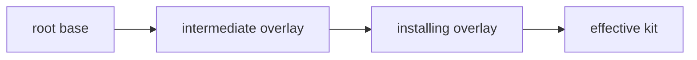

# ADR-0025: Overlay Kits: Single-Base Inheritance Resolved at Install Time

**ID**: `cpt-studio-adr-overlay-kits`

<!-- toc -->

- [Context and Problem Statement](#context-and-problem-statement)
- [Decision Drivers](#decision-drivers)
- [Considered Options](#considered-options)
- [Decision Outcome](#decision-outcome)
  - [Single inheritance, chains allowed](#single-inheritance-chains-allowed)
  - [Resolution order](#resolution-order)
  - [The pin: the extends block](#the-pin-the-extends-block)
  - [Resolution is explicit, not inside the loader](#resolution-is-explicit-not-inside-the-loader)
  - [Merge by resource id](#merge-by-resource-id)
  - [Cycles](#cycles)
  - [Inherited layers are materialised under the overlay's kit directory](#inherited-layers-are-materialised-under-the-overlays-kit-directory)
  - [Public component names use the owner kit's slug](#public-component-names-use-the-owner-kits-slug)
  - [The tool-risk fingerprint covers the effective model](#the-tool-risk-fingerprint-covers-the-effective-model)
  - [Out of scope](#out-of-scope)
  - [Consequences](#consequences)
  - [Confirmation](#confirmation)
- [Pros and Cons of the Options](#pros-and-cons-of-the-options)
  - [Single-base overlay, resolved explicitly at install (chosen)](#single-base-overlay-resolved-explicitly-at-install-chosen)
  - [Keep kits flat and fork](#keep-kits-flat-and-fork)
  - [Multiple bases](#multiple-bases)
  - [Resolve inside the loader from a shared cache](#resolve-inside-the-loader-from-a-shared-cache)
- [More Information](#more-information)
- [Traceability](#traceability)

<!-- /toc -->

## Context and Problem Statement

Kits are flat and self-contained. A team that wants "the SDLC kit plus our
sections" has to fork the whole kit, and from that moment it stops receiving
upstream improvements: every fix to a template, rule or skill has to be merged by
hand, so forks drift and are rarely updated.

GitHub issue constructorfabric/studio#139 asks for overlay kits: a kit declares one
base kit, overrides, adds or suppresses resources by id, and keeps receiving
upstream changes. It is delivered in three phases (#427 foundation, #428 behaviour,
#429 lifecycle); this record is the foundation decision (#427). This slice covers the declaration,
version gate and normalize part of #173; the resolver contract is specified here but
not implemented, and lands in a later slice of phase 1 (#427) before #428 builds on it. The
design has to satisfy five requirements from the issue: a kit with no base must
resolve exactly as today; resolution must be deterministic; unsafe inputs (cycles,
unknown override targets, `latest` bases) must be rejected before anything is
installed; it must work in register and copy mode with local and remote bases; and
every effective resource must be traceable to its owner kit.

The kit loader is read by many commands, several of which must never touch the
network. Where resolution happens, and what identifies the base, are the decisions that
are expensive to reverse once overlays exist in the wild.

## Decision Drivers

- A kit with no base resolves byte-for-byte as today.
- Same overlay plus same base content (the declared ref plus the resolved commit identity recorded at install and update, landing with #180 and #182) always yields the same effective kit.
- Unsafe overlays fail before any file is installed, never leaving a partial kit.
- An older CLI must refuse an overlay rather than install it incompletely. Today an
  unknown kit-level manifest key only warns.
- A typo in an override id must not silently create a new resource.
- Read-only commands (`cfs info`, `cfs resolve-vars`, update risk model) must not
  gain network access.
- Skills shipped by inherited layers must keep resolving each other by name.

## Considered Options

- **Single-base overlay, resolved explicitly at install** (chosen).
- **Keep kits flat and fork** — document forking as the supported answer.
- **Multiple bases** — a kit lists several bases, merged in order.
- **Resolve inside the loader from a shared cache** — `load_kit_model` follows
  `extends` and reads inherited layers from a content-addressed cache.

## Decision Outcome

Chosen: **single-base overlay, resolved explicitly at install, update and kit
validation**, because it is the only option that delivers upstream updates without
giving the read-only commands a network dependency or a conflict-resolution model
nobody has asked for.

### Single inheritance, chains allowed

A kit declares exactly one base. The base may itself be an overlay, so chains
(overlay of an overlay) are allowed. Multiple bases are rejected: they would need
conflict-resolution rules for two bases defining the same id, and there is no
demonstrated need for them.

### Resolution order

Layers apply base first, then overlay; the overlay wins. Resolution is a pure
function of the overlay and the base content, so the same inputs always produce the
same effective kit. The base content is identified by the declared ref plus the
resolved commit identity recorded at install and update, which land with issues #180
and #182; nothing is recorded by this slice.



### The pin: the extends block

The base is declared on the kit entry in the kit manifest:

```toml
manifest_version = "1.1"

[kits.extends]
source   = "github:org/studio-sdlc"
ref      = "v2.3.0"          # required; only "latest" is rejected
kit      = "sdlc"            # optional: selects one kit of a multi-kit base manifest
suppress = ["prd-metrics"]   # optional: inherited resource ids to drop
```

`ref` is mandatory and `latest` is rejected, because `latest` names no particular
base. Any other non-empty ref is accepted at declaration, including a branch or a
symbolic ref such as `main` or `HEAD`: kit sources already accept a tag, branch, ref
or commit SHA, and the offline loader cannot tell a tag from a branch. Determinism
comes from the ref plus the resolved commit identity recorded at install and update
(landing with #180 and #182), not from the declaration alone; update and drift
reporting (#181) is what surfaces a base that has moved. `manifest_version =
"1.1"` is required whenever `extends` is present or a resource declares `additive`. The
extends-requires-1.1 check is a new check inside the manifest version validation
(`_validate_canonical_manifest_version` in `utils/kit_model.py`). An older CLI, which
supports only `1.0`, stops at the existing unsupported-version check of that
validation with its upgrade hint, instead of installing a partial kit while warning
about an unknown key. `manifest_version` is a single file-level field, so when any
kit in a multi-kit manifest declares `extends` or `additive` the whole file needs
`1.1` and an older CLI cannot read any kit in it; authors who need sibling kits
readable by an older CLI ship them in a separate manifest. Until base resolution is implemented, install, update and
`validate-kits` in path mode also reject any kit that declares `extends`, so an
overlay never installs as a partial kit. `validate-kits` in registered mode does not
apply this check yet; it is part of the later install and validate-kits work.

### Resolution is explicit, not inside the loader

`resolve_kit_chain(model, locate_base)` is called only by install, update and
`validate-kits` in path mode. `load_kit_model` in `utils/kit_model.py` keeps
returning the declared model, because it is also read by `cfs info`,
`cfs resolve-vars`, `cfs kit normalize`, the update risk model and the
public-component gate, none of which may reach the network. Installed-mode readers
are meant to use the persisted inventory and must be moved onto it by a later phase
(#428/#429); `load_installed_kit_model` still ends in `load_kit_model` today.
`cfs kit normalize` round-trips the `extends` block rather than erasing it.

### Merge by resource id

- The same id overrides the inherited resource. A kind mismatch is an error. An
  override of a public resource inherits the base's generated name.
- An id absent from the base is an error unless the resource declares
  `additive = true`. Additive-by-default would turn a typo in an override id into a
  silent new resource, which the safety requirement rules out.
- An additive resource may not reuse an inherited install path.
- An unknown `suppress` target is an error.

### Cycles

A cycle is rejected with the rendered chain (`a -> b -> a`) and a depth cap,
matching the include-cycle and depth guard already in `utils/manifest.py`. Both
checks run before anything is fetched into the installation.

### Inherited layers are materialised under the overlay's kit directory

Inherited layers are copied under the overlay's own kit directory, not into a
content-addressed cache. With a cache, every reader would have to handle a missing
or evicted entry, and every single-root path join (`kit_source / resource.source`)
would have to become multi-root. Instead every effective resource records its owner
kit and layer root, and the repeated join moves behind one helper. This is also
what makes every resource traceable to its owner.

### Public component names use the owner kit's slug

Public component names are prefixed with the owner kit's slug, not the installing
kit's. Prefixing with the installing slug would rewrite an inherited
`cf-sdlc-doc-prd` into `cf-<overlay>-cf-sdlc-doc-prd` and break cross-references
between the shipped skills.

### The tool-risk fingerprint covers the effective model

The tool-risk fingerprint is computed over the effective model, so an agent
contributed by a base layer still reaches the approval gate when an update changes
it.

### Out of scope

Constraints entry-level merge (#178), `validate-kits` behaviour (#179), install and
provenance (#180), update and drift (#181) and remote bases (#182) are decided
separately in the later phases. This record fixes only the contract they build on.

### Consequences

- Good, because teams extend a kit by declaring differences and still take
  upstream improvements by moving the `ref`.
- Good, because a kit with no `extends` takes none of the new paths.
- Good, because read-only commands stay offline and unchanged.
- Good, because unsafe overlays fail before install, and an older CLI refuses them
  through the version gate.
- Bad, because the effective kit exists only after an explicit resolution step, and
  a new caller that forgets to call `resolve_kit_chain` silently sees the declared
  model.
- Bad, because materialising layers duplicates inherited files on disk per overlay.
- Bad, because the additive flag adds a line the author must write for every new
  resource.
- Bad, because an overlay author on a tag must bump `ref` deliberately to take an
  upstream change, while an author on a branch sees a moved base only through update
  and drift reporting (#181).

### Confirmation

Present in this change (#427):

- Unit tests cover declaration parsing, rejection of `latest` variants, acceptance of branch-like refs such as `main` and `HEAD` by design,
  rejection of unknown keys, the manifest `1.1` version gate, normalize round trip
  and idempotence, and that the output of a kit without `extends` is pinned.
- A test asserts that `load_kit_model` performs no network or base lookup.

To land with the resolver:

- Unit tests for chain order, override, kind mismatch, additive, path collision,
  unknown suppress target, and cycle and depth cap.
- A golden test asserting that a kit without `extends` resolves identically before
  and after the change.

Ongoing:

- Review of any new `load_kit_model` caller checks which model it needs, declared
  or effective.

## Pros and Cons of the Options

### Single-base overlay, resolved explicitly at install (chosen)

- Good, because it meets deterministic resolution and pre-install rejection.
- Good, because the version gate protects older CLIs.
- Good, because no read-only command gains network access.
- Bad, because explicit resolution must be remembered by each new caller.
- Bad, because inherited layers are duplicated on disk.

### Keep kits flat and fork

- Good, because it changes nothing and cannot regress.
- Bad, because forks stop receiving upstream improvements, which is the problem
  this record exists to solve.
- Bad, because a fork leaves no record of what differs from upstream.

### Multiple bases

- Good, because it allows composing several upstream kits.
- Bad, because two bases defining the same id need conflict-resolution rules, and
  there is no demonstrated need for them.
- Bad, because ordering between bases becomes part of the base identity and of every diff.

### Resolve inside the loader from a shared cache

- Good, because every caller sees the effective kit without remembering a step.
- Bad, because `cfs info`, `cfs resolve-vars` and the update risk model would
  acquire a network dependency or a missing-cache failure mode.
- Bad, because every single-root path join would have to become multi-root.

## More Information

Related decisions and documents: ADR-0019
(`cpt-studio-adr-unified-manifest-hierarchy`) for the manifest hierarchy and
include guards, `architecture/features/kit-management.md` for kit install and
update, and `architecture/DESIGN.md` for the Kit Manager. Tracking:
constructorfabric/studio#139, with phase issues #427, #428, #429.

## Traceability

- **PRD**: [PRD.md](../PRD.md)
- **DESIGN**: [DESIGN.md](../DESIGN.md)

This decision directly addresses the following requirements or design elements:

* `cpt-studio-fr-core-kits` — kits gain an inheritance mechanism, so teams extend a
  kit without forking it.
* `cpt-studio-fr-core-kit-manifest` — the manifest gains `[kits.extends]` and the
  `1.1` version gate.
* `cpt-studio-usecase-kit-manage` — install and update resolve the overlay chain
  before registering the kit.
