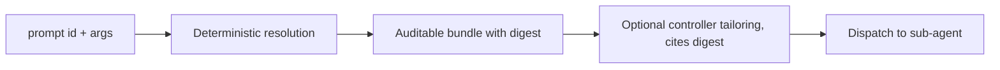

# ADR-0026: Deterministic Prompt Resolution with Optional Controller Tailoring

**ID**: `cpt-studio-adr-deterministic-prompt-resolution`

<!-- toc -->

- [Context and Problem Statement](#context-and-problem-statement)
- [Decision Drivers](#decision-drivers)
- [Considered Options](#considered-options)
- [Decision Outcome](#decision-outcome)
  - [scp_boundary](#scp_boundary)
  - [bundle_vs_pack](#bundle_vs_pack)
  - [get_callers](#get_callers)
  - [decision_record](#decision_record)
  - [core_prompt_ids](#core_prompt_ids)
  - [digest_definition](#digest_definition)
  - [core_layer](#core_layer)
  - [guard_grammar](#guard_grammar)
  - [unknown_state_rule](#unknown_state_rule)
  - [kit_registration](#kit_registration)
  - [kit_source_of_truth](#kit_source_of_truth)
  - [output_convention](#output_convention)
  - [asset_scope](#asset_scope)
  - [path_confinement](#path_confinement)
  - [Consequences](#consequences)
  - [Confirmation](#confirmation)
- [Pros and Cons of the Options](#pros-and-cons-of-the-options)
  - [Keep model-driven loading](#keep-model-driven-loading)
  - [A resolver that returns a final dispatch prompt](#a-resolver-that-returns-a-final-dispatch-prompt)
  - [Two-stage design (chosen)](#two-stage-design-chosen)
- [Evidence](#evidence)
- [Follow-up: the Shared Context Pack amendment](#follow-up-the-shared-context-pack-amendment)
- [Delivery Order](#delivery-order)
- [Applicability and Scope](#applicability-and-scope)
- [Open Questions](#open-questions)
- [More Information](#more-information)
- [Traceability](#traceability)

<!-- /toc -->

## Context and Problem Statement

Public skills obtain their instructions by opening prompt files one at a time and
re-deriving variables themselves. Each skill follows `LOAD` directives, decides
which guarded branches apply, and rebuilds the same context on every run. The
work is repeated, it is not reproducible (observation, unmeasured: two runs can
load different files for the same inputs), and nothing records which instructions a run actually saw.
Issue #310 (https://github.com/constructorfabric/studio/issues/310) asks for `cfs prompts get|list|search|help|explain`, a resolver that
returns fully resolved instructions in one call.

The Shared Context Pack spec (`architecture/specs/shared-context-pack.md`)
describes how a controller prepares a sub-agent dispatch. It currently lists
"forcing a deterministic slot-filling compiler for final prompt assembly" as a
non-goal, and `FinalPromptSynthesis` has the controller model synthesize the
final dispatch prompt from selected assets. A resolver has to fit that spec
without contradicting it, so this record must say where deterministic work stops
and controller judgement starts.

The audience is Studio maintainers. The record exists so that a reviewer who did
not follow issue #310 can see the 14 decisions, the measurements behind them,
and the questions that are still open. The maintainer review of 2026-10-06 on
issue #310 shaped the design, in particular the delivery order below.

Terms used in this record, mapped to the Shared Context Pack spec:

- **Bundle** (this record) versus **pack** (spec): the bundle is the output of
  the resolver; the pack is the controller's session object. They are separate.
- **Asset** (this record) is a prompt asset (`prompt_assets[]` in the spec).
- **Entrypoint** (this record): a prompt file under `skills/` or `workflows/`
  from which the `LOAD` closure starts. It is broader than the spec's "agent
  prompt source", which covers only `skills/studio/agents/*.md`.
- **SCP** is the Shared Context Pack (the spec above).
- **PDSL** is the prompt contract language used in `skills/` and `workflows/`
  (see `architecture/specs/PDSL.md`).

## Decision Drivers

In priority order:

1. Resolution of a prompt must be reproducible: same inputs, same bundle.
2. A run must be auditable: a reviewer can see exactly which instructions were
   supplied, and a later synthesis step can cite them.
3. The Shared Context Pack must stay consistent: the controller keeps the final
   say over a dispatch prompt.
4. As many guarded `LOAD` lines as possible must resolve without model
   involvement (a line-share goal; no token measurement exists, open question 2).
   The 82.5% ceiling is not a forecast (see Evidence for its population).
5. A resolver that reads from disk must not be steerable outside the core or kit
   root.
6. The change must be adoptable in stages, in the order set by the review.
7. Reuse existing primitives (layer discovery, manifest provenance, the `LOAD`
   scan) instead of building a parallel mechanism.

## Considered Options

- **Keep model-driven loading** — skills continue to open prompt files and
  derive variables themselves.
- **A resolver that returns a final dispatch prompt** — one deterministic
  compiler produces the text that is dispatched.
- **Two-stage design: deterministic resolution, then optional controller
  synthesis** (chosen).

## Decision Outcome

Chosen option: "Two-stage design: deterministic resolution, then optional
controller tailoring", because it is the only option that delivers reproducible
and auditable resolution (drivers 1 and 2) while leaving the final dispatch
prompt with the controller (driver 3).

Stage one is a deterministic resolver, `cfs prompts`, that returns an auditable
bundle with a composite digest. Stage two is optional controller tailoring that
cites the digest and then dispatches. The bundle is inputs to synthesis, not the
dispatch prompt itself.

Working position (PROPOSAL, pending open question 5): the resolved bundle is
always produced and is the source of truth. "Optional" refers to tailoring only:
the controller MAY tailor or compress the bundle for a specific dispatch, but the
final dispatch prompt always cites the bundle digest and is never a bare
unreferenced prompt. When no tailoring happens, a leaf receives the bundle's
prompt content as the fully materialized prompt, consistent with the spec's rule
that leaf agents receive a fully materialized prompt.

**Primary decision and constraints.** The primary decision is the two-stage
boundary (`scp_boundary`). The other 13 keys are constraints that make that
boundary implementable (shape of the bundle, ID scheme, guard evaluation, error
handling, kit handling, confinement). They are kept in one record because they
constrain one another: the digest, the deferred branches and the callers cannot
be accepted separately from the boundary (for example, the digest depends on the
guard grammar through bundle ordering).

Waiver request (PROPOSAL): the ADR rules ask for one decision per record and to
skip implementation-detail decisions. This record REQUESTS a maintainer waiver of
that rule; no waiver has been granted. If it is not granted, the proposed split
is: ADR A = `scp_boundary`, `bundle_vs_pack`, `get_callers`, `decision_record`,
`digest_definition`, `guard_grammar`, `unknown_state_rule`; ADR B =
`core_prompt_ids`, `core_layer`, `kit_registration`, `kit_source_of_truth`,
`output_convention`, `asset_scope`, `path_confinement`.

The 14 decisions follow. Each is keyed as in the #310 discussion. This ADR is the self-contained record
of the decisions and restates every one of them; the discussion is summarized in
the status comment on issue #310
(https://github.com/constructorfabric/studio/issues/310#issuecomment-6054327028)
and the maintainer review on the same issue.

### scp_boundary

Two stages: deterministic resolution, then optional controller tailoring that
cites the bundle digest. The Shared Context Pack (SCP) is amended accordingly (see
"Follow-up: the Shared Context Pack amendment").

- Rationale: it gives reproducibility and an audit trail without taking away the
  controller's ability to tailor a dispatch.
- Consequence: the spec gains a stage boundary it does not have today.

### bundle_vs_pack

Bundle entries are shaped after the pack's `prompt_assets[]` entries and carry
`asset_id`, `origin`, `etag` and `sections`, plus one composite content digest
for the bundle.

- `etag` here is the per-asset content hash (SHA-256 over the LF-normalized
  asset text). The spec defines `etag` as `sha256(path:size:mtime-or-content)`;
  the bundle form is content-only, so it does not change with path, size or
  mtime. The two forms are therefore not interchangeable without a decision in
  the spec amendment.
- Spec fields a bundle entry omits at entry level: `asset_type`, `path`,
  `title`, `tags` and `body` (section bodies are carried inside `sections`).
  Inserting a bundle entry into a pack needs those fields filled; how is not
  decided here (unverified: that they can all be derived from the asset id and
  path); see the follow-up amendment list.
- Rationale: reusing the pack's asset shape means that, for the fields the bundle
  carries, a bundle feeds the pack without a shape converter. The digest is the only new
  field; the omitted fields and the `etag` form are the only gaps.
- Consequence: the bundle and the pack stay separate objects; the bundle is not a
  second pack.

### get_callers

`get` is controller-only. Deferred branches are structured `deferred[]` metadata
(`branch_id`, `condition`, `prompt_id`, `required_args`). This is enforced by
spec and lint, with no runtime caller check.

- Rationale: it matches the leaf boundary already in the spec (leaf agents never
  discover prompt dependencies) and avoids a runtime check that cannot be made
  reliable.
- Consequence: the rule is only as strong as the lint (open question 1).

### decision_record

This record is a new ADR (numbered 0026 provisionally), followed by an amendment
to `architecture/specs/shared-context-pack.md`.

- Rationale: the boundary is an architecture decision with alternatives; the spec
  should describe the result, not argue for it.
- Consequence: the number may change at PR time (see More Information). This
  record supersedes no earlier ADR and is superseded by none.

### core_prompt_ids

IDs are derived from the scanned prompt tree as `core/<kind>/<path>`. An alias
table exists only for entrypoints. There is no registry file.

- Rationale: a registry file would be a second source of truth that drifts from
  the tree.
- Consequence: renaming or moving a prompt file changes its ID; aliases cover the
  entrypoints that callers depend on.

### digest_definition

The digest is SHA-256 over canonical JSON (LF newlines) containing: schema
version, prompt id, normalized args, per-asset content hash in order, appends
with owning layer, and only the substituted variables. The per-asset content hash
is computed over LF-normalized text, so a CRLF checkout of the same content gives
the same digest. File mtime and size are only a cache fast path, never part of
the digest. The cache lives in a per-project cache directory (location decided at
implementation). The fast path skips re-reading only when size and mtime are
unchanged; a mismatch, or any argument or schema change, forces a re-hash.

- Rationale: content-addressed input makes the digest stable across machines and
  checkouts; including only substituted variables keeps unrelated state out.
- Consequence: any change to the listed inputs changes the digest, so a change to
  the canonical form is a schema-version change.

### core_layer

The resolver prepends core as an implicit bottom layer and reuses
`discover_layers()`. `ManifestLayer` is unchanged.

- Rationale: the existing layer merge and provenance logic is reused as is.
- Consequence: core is a layer only inside the resolver; the manifest model does
  not gain a new layer type.

### guard_grammar

**Proposed amendment, pending maintainer confirmation.** This decision amends the
#310 discussion, using measurements taken on 2026-10-07 and repeated on
2026-10-08 (see Evidence). The #310 discussion evaluated only a typed subset
(`state_var ==/!= literal` with AND/OR/NOT) and treated everything else as free
text. The measurements show that subset alone defers most guarded loads, so the
resolver is proposed to evaluate three classes deterministically:

- (a) typed state comparisons (`VAR ==/!= literal`, alone or combined with
  AND/OR/NOT);
- (b) loaded-set membership, i.e. "X is not yet loaded". "Loaded" means "already
  included in this bundle". Session-level dedupe (assets the model already holds
  from earlier calls) stays with the controller, outside the resolver;
- (c) everything else is free text and is deferred.

Two requirements apply:

- Typed-guard state (class a) is supplied as arguments to `get`
  (`--arg key=value`). Which of the 28 typed guards can be satisfied this way is
  not yet measured.
- A guard names a unit ("<Unit> is not yet loaded"); the resolver needs a
  declared unit-to-asset mapping. A unit name with no mapping is treated as free
  text and deferred.

Resolution ceiling: 99 of 120 guarded loads (82.5%) if all 71 membership guards
resolve; the range is 0 to 99 of 120 (0% to 82.5%). The population is the guarded
loads counted in `skills/` and `workflows/` (the entrypoint population); files
reached only through the wider closure (e.g. under `requirements/` or
`architecture/specs/`) were not measured. The ceiling of 99 requires ALL 28
typed guards AND ALL 71 membership guards to resolve; the floor is 0 (no state
supplied and no unit mapping). 21 defer in every case. The static
pre-check remains a required test: it snapshots the three class counts across the
scanned tree so a change in the ratio is visible in CI.

- Rationale: a typed-only grammar would defer 92 of 120 (76.7%) and leave a
  much smaller resolvable line share. Class (b) is cheap to evaluate against the bundle because
  the bundle knows which assets it holds, subject to the unit-to-asset mapping.
- Consequence: a bundle's contents depend on the order in which assets are added
  (membership is evaluated against assets already present), so ordering must be
  deterministic and part of the digest, which `digest_definition` already
  provides ("per-asset content hash in order").

### unknown_state_rule

An unknown-state or free-text guard goes to `deferred[]`. A missing required arg
detected by the command returns a JSON ERROR with exit 1, with no partial bundle.
Only `LOAD`s can be deferred or omitted; `RULES` and gates are always inlined.

- Exit codes follow `architecture/specs/cli.md`: invalid or missing arguments
  detected by the command are exit 1; an unknown prompt ID ("item not found") is
  exit 2; an argument the parser itself rejects is exit 2 with nothing on stdout
  (this holds if `cfs prompts` uses argparse like the query commands in cli.md;
  adding `prompts` to cli.md is part of the stage-two change).
  This corrects the earlier #310 wording, which gave exit 2 for a
  missing required arg.
- Rationale: failing closed on missing input prevents a bundle that looks
  complete and is not; inlining rules and gates means deferral can never remove a
  constraint.
- Consequence: callers must supply required args up front; deferral is limited to
  loads.

### kit_registration

Kit prompts use the existing resource model, with IDs
`<kit-slug>/<kind>/<path>` (the owner slug for overlay-inherited prompts).
`core/*` is reserved, and collisions are hard errors. Core replace and named
extension slots are deferred.

- Rationale: no new registration mechanism; the reserved prefix keeps kit prompts
  from shadowing core.
- Consequence: overlay-inherited prompts depend on overlay kits (planned/related:
  ADR-0025 and issue #427, https://github.com/constructorfabric/studio/issues/427).

### kit_source_of_truth

The resolver reads installed kit layers now, behind one lookup function, and
moves to the persisted inventory when #428/#429 ship
(https://github.com/constructorfabric/studio/issues/428, https://github.com/constructorfabric/studio/issues/429).

- Rationale: it unblocks kit prompts without waiting for the inventory, and the
  single lookup function keeps the later switch local.
- Consequence: until then the resolver can only see kits installed in the
  current project.

### output_convention

JSON on stdout for all five subcommands; the per-command
`{"status":"ERROR","message":...}` shape used in cli.md; no human mode for now. Exit codes follow
`architecture/specs/cli.md` ("Exit Codes" and the per-command **Exit** lines):

- 0: success, item found.
- 1: runtime error or invalid argument detected by the command, including a
  missing or invalid prompt argument (JSON ERROR on stdout).
- 2: item not found (unknown prompt ID), or an argument the parser rejects (the
  latter prints nothing on stdout).

This corrects the earlier #310 wording on exit codes.

- Rationale: callers are skills and controllers, not people at a terminal.
- Consequence: a human-readable mode would be a later, additive change.

### asset_scope

Entrypoints are `skills/` and `workflows/`. Assets are the transitive `LOAD`
closure, including `requirements/` and `architecture/specs` targets. The
resolver has its own configurable scan roots. Gate behaviour and its scan roots
are unchanged.

- Rationale: the closure is what a skill would otherwise open by hand. Leaving
  gate behaviour and its scan roots alone avoids coupling a gate to a new
  consumer.
- Consequence: the resolver's scan scope can differ from the gates' scan scope.

### path_confinement

Every `LOAD` target is canonicalized and confined: symlinks are resolved first,
then the resolved path must lie inside the core or kit root. Any path that
escapes is a hard failure. Phase 1 covers `LOAD` edges only; AGENTS.md "open and
follow" rules are a documented gap. `LOAD` targets are controlled by prompt
authors (kit authors, for kit prompts), so a kit is an untrusted-input source
for this check.

- Rationale: see Evidence item 1. The `LOAD_TARGET` pattern admits `..`
  segments, which is harmless for an in-memory lookup and unsafe for a disk
  read; a symlink inside a root can point outside it.
- Consequence: instructions that tell a model to open a file without a `LOAD`
  directive are not covered in this phase.

### Consequences

- Good, because skills obtain resolved instructions in one call, and a run can
  state the digest of the instructions it used.
- Good, because up to 82.5% of the guarded loads counted in `skills/` and
  `workflows/` (a ceiling that requires all 28 typed and all 71 membership guards
  to resolve; the floor is 0%) can resolve without the model. This is a line
  share; no token measurement exists (open question 2).
- Good, because the path-escape risk is closed for `LOAD` edges before any disk
  read exists.
- Bad, because at least 21 guarded loads still defer to the controller, so the
  controller still reads some instructions itself; more defer if typed-guard
  state is not supplied.
- Bad, because the lint that enforces "`get` is controller-only" is not yet
  defined (open question 1), so for now that boundary rests on the spec alone.
- Bad, because the AGENTS.md "open and follow" rules are outside path
  confinement in phase 1.
- Risk: the dedupe class (b) makes bundle content order-dependent. Mitigation:
  deterministic ordering, with order captured in the digest.
- Risk: the 82.5% ceiling is a point-in-time measurement from one regex pass over
  the entrypoint population only.
  Mitigation: the static pre-check snapshots guard classes in CI.
- Risk: a stale cache hash (size and mtime unchanged but content changed) would
  yield a wrong digest. Mitigation: the fast path only skips re-reading when size
  and mtime are unchanged, a mismatch or any argument or schema change forces a
  re-hash, and the cache is safe to delete.
- Risk: the resolver reading installed kit layers (interim) diverges from the
  persisted inventory later. Mitigation: one lookup function.

### Confirmation

- The static pre-check over the scanned tree is a required test. It compares a
  snapshot of the three class counts (typed, loaded-set, free-text) and fails if
  a count differs from the snapshot or if a guard fails to parse.
- A test covers path confinement, including the `..` example in Evidence item 1
  and a symlink inside the root that points outside it (must fail), and the
  prefix case: a sibling directory whose name starts with the root's name (for
  example `root-evil` next to `root`) must fail.
- Tests pin the digest inputs: the same inputs produce the same digest, and a
  change to any listed input changes it. A CRLF-versus-LF test checks that the
  same content with CRLF and with LF line endings gives the same per-asset hash
  and the same digest.
- A test covers the missing-required-arg case (JSON ERROR, exit 1, no partial
  bundle), an unknown prompt ID (asserts the exit code 2 only, until the stdout
  shape is decided: open question 4), and a parser-rejected argument (exit 2,
  nothing on stdout).
- A cache test: a file changed with the same size and mtime is a known limit of
  the fast path (document it); a changed size or mtime, or a changed argument or
  schema version, forces a re-hash and a new digest; deleting the cache does not
  change the digest.
- A test covers class (b) phrasings: "<Unit> is not yet loaded" with a mapped
  unit, with an unmapped unit (deferred as free text), and the bare
  "WHEN not yet loaded" form.
- Review of the spec amendment (stage one) and the lint (stage three) confirms
  the `get_callers` rule.

## Pros and Cons of the Options

The per-option evaluation is below. The deciding factors were
reproducibility and auditability (favoring a deterministic stage), consistency
with the Shared Context Pack (favoring synthesis staying with the controller),
and the guard measurements (showing that a deterministic stage can resolve a
large share of guards without a typed-only grammar, up to a ceiling).

### Keep model-driven loading

- Good, because nothing changes and no new surface needs maintenance.
- Neutral, because the guard classes above suggest the model is doing
  mechanical work (dedupe checks and state comparisons); this is an observation,
  unmeasured.
- Bad, because the same files are re-opened and the same variables re-derived on
  every run.
- Bad, because there is no record of which instructions a run saw, and no
  baseline: `decision_log.record_read()` has no production callers (tests call
  it).

### A resolver that returns a final dispatch prompt

- Good, because a single call yields the exact text to dispatch, with the most
  determinism and the simplest caller contract.
- Good, because the output is fully reproducible and auditable end to end, and
  the controller does less work per dispatch.
- Neutral, because the 21 free-text guards would need a policy (defer or drop)
  in any design; a compiler has no model to interpret them.
- Bad, and decisive, because the controller loses the ability to tailor the
  dispatch to task state. The rejection rests mainly on this loss, not on the
  size of the spec change.
- Spec impact (same lines as the chosen option, see the follow-up): this option
  would replace the non-goal, the `FinalPromptSynthesis` rule and the two
  lifecycle statements outright (the controller no longer synthesizes); the chosen
  option narrows the same four lines.

### Two-stage design (chosen)

- Good, because the deterministic part is reproducible and digest-addressed,
  while judgement stays with the controller.
- Good, because it fits the spec's boundary with a narrow amendment instead of a
  reversal.
- Good, because deferral keeps free-text guards visible as structured
  `deferred[]` entries rather than guessing.
- Bad, because two stages are harder to explain than one, and the controller must
  cite the digest correctly for the audit trail to mean anything.
- Bad, because it adds a CLI surface (five subcommands) and a lint rule to
  maintain.

## Evidence

Measured on 2026-10-07 and repeated on 2026-10-08, on the tree of upstream/main
commit 797cb625 (2026-10-08), over `skills/` and `workflows/`. The figures below
are the entrypoint population; files reached only through the wider closure (e.g.
under `requirements/` or `architecture/specs/`) were not measured.

Method (stated once, for all figures): for each file, the text inside `pdsl` code fences was scanned with
the `LOAD_TARGET` regex. A guarded `LOAD` is a `LOAD` line that contains `WHEN`.
Guarded lines were classified by a regex heuristic into three classes: typed
state comparison (`VAR ==/!= literal`, alone or combined with AND/OR/NOT),
"<Unit> is not yet loaded" phrasing, and other (free text).

Scope limit: only `LOAD {cf-studio-path}/.core/*.md` targets are counted.
Variable loads (for example `LOAD {adr_template}`) and kit loads are not
counted.

1. **Path traversal.** The `LOAD_TARGET` regex class `[\w./-]+` captures `..`
   segments: `LOAD {cf-studio-path}/.core/../../etc/x.md` yields
   `../../etc/x.md`. The existing use is safe because the captured target is only
   used as an in-memory dictionary key. A resolver that reads the target from
   disk is not safe, hence `path_confinement`.
2. **`LOAD` volume.** 266 files were scanned; 165 of them contain at least one
   `LOAD` line and 57 contain a guarded `LOAD`. There are 522 `LOAD` lines across
   165 of 266 scanned files; 402 unguarded and 120 guarded. An earlier
   prose-inclusive grep count (about 1316 lines across 426 files) overcounts and
   should not be cited.
3. **Guard classes of the 120 guarded loads.** 28 typed state comparisons
   (`VAR ==/!= literal`, with AND/OR/NOT); 71 "<Unit> is not yet loaded"
   idempotence guards; 21 other (free text). This split comes from a regex
   heuristic in one pass; no hand-checked sample confirmed the 28/71/21 split. A typed-only grammar
   would defer 92 of 120 (76.7%). With the proposed grammar, 99 of 120 (82.5%)
   resolve if ALL 28 typed guards and ALL 71 membership guards resolve, and 21
   defer. 82.5% is a ceiling for the entrypoint population, and the range is 0 to 99 of 120 (0% to 82.5%): it
   assumes the guard state values are known at resolve time, and which of the 28
   typed guards can be satisfied by `--arg key=value` is not yet measured.

## Follow-up: the Shared Context Pack amendment

A separate change amends `architecture/specs/shared-context-pack.md`. It will:

- define the two-stage boundary between deterministic resolution and controller
  synthesis;
- define `prompt_context_view`, which the spec does not define today;
- change the non-goal ("forcing a deterministic slot-filling compiler for
  final prompt assembly", as of the current spec at line 49), and the matching
  `NEVER require deterministic slot-filling semantics` rule in
  `FinalPromptSynthesis`, by keeping the spec's "do not require" phrasing and ADDING that
  deterministic resolution of prompt assets into a bundle is in scope (no
  strengthening to "forbid"; any text in this record saying otherwise is
  superseded by this line);
- reconcile the bundle `etag` (content hash) with the spec's `etag` form
  `sha256(path:size:mtime-or-content)` and decide which spec asset fields
  (asset_type, path, title, tags, body) a bundle entry carries;
- reconcile the lifecycle statements that assume the controller reads prompt
  assets itself: "REQUIRE controller loads required prompt assets from disk"
  and "ALWAYS keep prompt-asset loading controller-owned". Proposed relationship: the controller calls `cfs prompts get`; the
  call is made by the controller, so loading stays controller-owned, and the
  resolver's disk read is the controller's load carried out by a deterministic
  tool. The exact rewording is for the amendment and is not decided here.

The leaf boundary (`LeafAgentExecutionBoundary`) is unchanged: a dispatched
sub-agent still receives a fully materialized prompt and loads nothing itself.

## Delivery Order

Stage order, as set in the maintainer review of 2026-10-06 on issue #310:

1. ADR and spec alignment (this record, then the amendment).
2. Core resolver (the output schema is open: open question 4).
3. Reference migration and lint (depends on open questions 1 and 2).
4. Kit-owned prompts (interim read of installed layers; the persisted inventory
   depends on #428/#429).
5. Controlled core extensions (deferred).

`cfs prompts call` is deferred to Phase 2 of the issue and is not decided here.

## Applicability and Scope

Checklist domains not addressed elsewhere in this record:

- SEC: handled by `path_confinement`. Residual risks, PROPOSALS open to
  maintainer review: (1) check-then-read race between canonicalization and read
  (mitigation: read through the resolved path, never re-resolve); (2) path-prefix
  comparison (use a separator-aware containment test on resolved paths, and a
  case-aware comparison on case-insensitive filesystems); (3) kit-supplied prompt
  content flows into controller prompts (kit content is untrusted input; the
  resolver does not sanitize or interpret it, and the bundle's provenance names
  the contributing kit); (4) `--arg` values are substituted into prompts and enter
  the digest (values are treated as data; only declared variables are
  substituted).
- INT: a new CLI contract and JSON output (`output_convention`); a spec
  amendment; five existing consumers of `prompt_context_view` (see Traceability);
  skills migrate in stage three.
- PERF: N/A; no runtime performance requirement is set. The
  resolver is a local file scan (unverified: no timing measurement was taken).
- REL: N/A; the resolver keeps no durable state of record (an optional cache that
  is safe to delete) and fails closed on bad input (`unknown_state_rule`).
- DATA: N/A; no durable data store is added (the optional per-project cache is
  safe to delete and is never part of the digest).
- OPS: no deployment change; a CI pre-check and a lint rule are added in later
  stages.
- COMPL: N/A; no compliance requirement applies.
- UX: skill authors are affected by the stage-three migration; end-user UX is
  unchanged (the callers are skills and controllers, `output_convention`).
- BIZ: N/A; internal tooling.
- MAINT: handled by reuse of existing primitives (driver 7) and by the
  single-lookup-function rule for kits; the maintenance cost is the new CLI
  surface and lint rule noted in Pros and Cons.
- TEST: handled in Confirmation; the CI pre-check is the main regression guard.

Supersession: this record supersedes no earlier ADR, and no earlier ADR is
superseded by it.

Review triggers (PROPOSAL): revisit this record if (a) the resolvable share of
guarded loads measured on the implementation falls below 50% (provisional figure,
to be confirmed at review); (b) the spec amendment is rejected; (c) the
overlay-kit registration model changes. First scheduled review: when the
stage-two PR is opened.

Assumptions: the 2026-10-08 measurements describe the tree as it will be when the
resolver ships; ADR-0025 (overlay kits) lands in roughly its planned shape; kit
authors are not fully trusted for `LOAD` targets.

## Open Questions

Owner for every question (PROPOSED): issue #310 assignee until reassigned; to be
decided before the stage-two (core resolver) PR is opened.

1. **Lint definition.** What counts as a "direct prompt read" when skills use
   `LOAD` directives themselves?
2. **Measurement baseline.** `decision_log.record_read()` has no production
   callers, so no "before" exists to measure savings against.
3. **Extension slots.** The slot syntax, and the project-level opt-in trust
   contract for core extensions (milestone: delivery stage 5).
4. **Output schema.** The exact JSON output schema for `get` (milestone: delivery
   stage 2). The stdout shape for the unknown-prompt-ID (exit 2) and error cases
   is also undecided.
5. **Controller synthesis.** Is the controller required to produce a synthesized
   prompt, or may the bundle be dispatched as is?
6. **Unit-less form.** What is the outcome of the bare unit-less "WHEN not yet
   loaded" form?
7. **Mixed guards.** How is a guard that combines class (b) with class (a), for
   example "X is not yet loaded AND VAR == y", classified? Proposal: defer unless
   every term resolves.
8. **Unit-to-asset mapping.** Where is the mapping declared, and who owns it?
9. **Guard-state arguments.** Do they count as "required args" (error) or as
   optional state (defer)? The `unknown_state_rule` text stays a proposal until
   this is answered.
10. **Canonical form.** The exact canonical JSON form (for example RFC 8785), the
    traversal order, and whether `deferred[]` is a digest input. "Canonical JSON,
    LF" in `digest_definition` is the proposal.

## More Information

- Source of decisions: the #310 discussion (five-role panel review of 2026-10-07
  and the maintainer review of 2026-10-06), summarized in the status comment
  https://github.com/constructorfabric/studio/issues/310#issuecomment-6054327028
  on https://github.com/constructorfabric/studio/issues/310. This ADR restates
  every decision and does not depend on any untracked file. The explorer counts
  in that discussion were unverified; the numbers in Evidence were measured
  separately and supersede them.
- Not verified in this record: that the proposed class (b) detection matches
  every "is not yet loaded" phrasing (the 71 count comes from one heuristic
  pass); that `prompt_context_view` has no other definition outside
  the files listed in Traceability.
- Related, planned: ADR-0025 (overlay kits, issue #427). Renumbering rule: the
  number changes only if another record takes 0026; then only the title and
  filename change, because the `**ID**` line has no number.
- The rules.md p1-p9 marker is omitted from the ID line to match ADR-0023 and
  ADR-0024.

## Traceability

- **Design**: [DESIGN.md](../DESIGN.md) — two entries were added there for this
  decision.
- **Issues**: [#310](https://github.com/constructorfabric/studio/issues/310)
  (the resolver request); [#427](https://github.com/constructorfabric/studio/issues/427)
  (overlay kits); [#428](https://github.com/constructorfabric/studio/issues/428)
  and [#429](https://github.com/constructorfabric/studio/issues/429) (persisted
  kit inventory).
- **Spec amended by follow-up**: [shared-context-pack.md](../specs/shared-context-pack.md)
  — gains the two-stage boundary and `prompt_context_view`; its leaf boundary is
  unchanged.
- Scope of impact: adds the `cfs prompts` command family and a lint rule; does
  not change gate behaviour, `ManifestLayer`, or the leaf-agent boundary.
  Existing consumers of `prompt_context_view` in scope of the amendment
  (enumeration method: tracked files found with `git grep prompt_context_view`,
  excluding .bootstrap/.plans history):
  `requirements/storytelling.md`, `requirements/reverse-engineering.md`,
  `requirements/shared/runtime-activation-contract.md`,
  `skills/studio/modules/explain-export-completion.md`, and
  `.bootstrap/config/AGENTS.md` (line 18). `AGENTS.md` mentions the term at about line 18 without defining it, and
  the spec does not define it either (a grep of `shared-context-pack.md` found no
  match).
