# Technical Design — Constructor Studio


<!-- toc -->

- [1. Architecture Overview](#1-architecture-overview)
  - [1.1 Architectural Vision](#11-architectural-vision)
  - [1.2 Architecture Drivers](#12-architecture-drivers)
  - [1.3 Architecture Layers](#13-architecture-layers)
- [2. Principles & Constraints](#2-principles--constraints)
  - [2.1 Design Principles](#21-design-principles)
  - [2.2 Constraints](#22-constraints)
- [3. Technical Architecture](#3-technical-architecture)
  - [3.1 Domain Model](#31-domain-model)
  - [3.2 Component Model](#32-component-model)
  - [3.3 API Contracts](#33-api-contracts)
  - [3.4 Internal Dependencies](#34-internal-dependencies)
  - [3.5 External Dependencies](#35-external-dependencies)
  - [3.6 Interactions & Sequences](#36-interactions--sequences)
  - [3.7 Database schemas & tables](#37-database-schemas--tables)
- [4. Additional context](#4-additional-context)
  - [Performance Considerations](#performance-considerations)
  - [Extensibility Model](#extensibility-model)
  - [Migration Strategy](#migration-strategy)
  - [Testing Approach](#testing-approach)
  - [Non-Applicable Design Domains](#non-applicable-design-domains)
- [5. Traceability](#5-traceability)
  - [Specifications](#specifications)

<!-- /toc -->

## 1. Architecture Overview

### 1.1 Architectural Vision

Studio uses a layered architecture with a thin global CLI proxy at the top, a deterministic skill engine at the core, and a kit system for domain-specific functionality. The architecture maximizes determinism: all validation, scanning, and transformation is handled by Python scripts with JSON output; LLMs are reserved only for reasoning tasks within agent workflows.

The system separates concerns into five layers: Global CLI Proxy (installation, caching, version management), Core Skill Engine (command routing, deterministic execution), Kit System (GitHub-based kit installation, domain-specific file packages: rules, templates, checklists, constraints, workflows), Config Management (structured config directory, schema validation), and Agent Integration (multi-agent entry point generation). Each layer has clear boundaries and communicates through well-defined interfaces.

Each kit is a file package: a collection of artifact definitions (rules, checklists, templates, examples, constraints, workflows, scripts) installable from GitHub repositories and copied into the kit's config directory (default: `{cf-studio-path}/config/kits/<slug>/`) during installation. Kit git ownership is per kit: tracked kits use file-level diff on update, while ignored kits are generated/ephemeral and may be overwritten without per-file prompts. `install.kit_tracking` is only a default/backcompat policy; each kit registration can override it with `kits.<slug>.tracking`. The core knows about kits through registration in `{cf-studio-path}/config/core.toml` with source provenance, display/backcompat version, content identity, verification state, tracking policy, and resource bindings. Studio core does not bundle any domain-specific kits — all kits are external packages. During `cfs init`, the user is prompted to install the SDLC kit (`constructorfabric/studio-kit-sdlc`) with `[a]ccept / [d]ecline`. A plugin system for custom hooks and CLI subcommands is planned for p2.

### 1.2 Architecture Drivers

#### Functional Drivers

##### Global CLI Installer

- [x] `p1` - `cpt-studio-fr-core-installer`

**Design Response**: Thin proxy shell with local cache at `~/.cf-studio/cache/`. On every invocation the proxy ensures a cached skill bundle exists, routes commands to the project-installed or cached skill, and performs non-blocking background version checks. The proxy contains zero skill logic.

For GitHub-backed cache sources, GitHub Release/tag resolution is the version authority. The proxy records structured provenance for the cached bundle, including requested source, effective source after mirror/fork override, resolved tag or release, asset/content digest when available, install timestamp, and verification state. Local/path cache modes are explicitly non-GitHub and report `verified = unknown` unless a local content digest is available.

##### Usage Telemetry

- [x] `p1` - `cpt-studio-fr-core-telemetry`

**Design Response**: Telemetry module (`studio_proxy.telemetry`) in the CLI Proxy layer. On every invocation, `main()` spawns a daemon thread that: (1) collects git identity and remote URL via a single `git config --get-regexp` call, (2) appends a JSONL record to `~/.cf-studio/logs/YYYY-MM-DD.log`, (3) rotates old log files when a new day's file is created (at most once per day), (4) optionally POSTs an OTLP Logs JSON payload to `CFS_TELEMETRY_URL`. The daemon thread is fire-and-forget — if the main process exits before the HTTP call completes, the thread is silently killed. All errors are caught and logged to the local log file. Zero impact on command latency. Controlled by three env vars: `CFS_TELEMETRY` (disable), `CFS_TELEMETRY_URL` (endpoint), `CFS_TELEMETRY_RETENTION_DAYS` (rotation, default 5 days). Stdlib-only: `urllib.request`, `threading`, `subprocess`, `json`.

##### Project Initialization

- [x] `p1` - `cpt-studio-fr-core-init`

**Design Response**: Interactive bootstrapper that copies the skill from cache into the project, creates the `config/` and `.gen/` directory structure, writes a managed `.gitignore` block for generated/runtime surfaces, and generates agent entry points. The dialog asks for install directory, agent selection, and the default kit tracking policy (`--kit-tracking tracked|ignored`), with explicit per-kit overrides supported as `--kit-tracking <kit>=tracked|ignored`. Installed kits copy all kit files (rules, templates, checklists, examples, constraints, workflows, scripts) into the kit's config directory and record their own `tracking` policy. A repeat `cfs init` in an initialized project enters repair mode: it restores `.core/`, `.gen/`, managed `.gitignore`, and generated agent outputs from the project-pinned Studio version/source metadata without silently upgrading.

##### Config Directory

- [x] `p1` - `cpt-studio-fr-core-config`

**Design Response**: The config directory (`{cf-studio-path}/config/`) holds all project configuration. `core.toml` stores the project root, project-pinned Studio version/source metadata for repair mode, a default kit tracking policy, and kit registrations, including format, path, version, per-kit `tracking`, structured source provenance, content identity, verification state, and resource bindings for manifest-driven kits. `artifacts.toml` stores the artifact registry — including system definitions (name, slug, kit), autodetect rules, ignore patterns, and codebase definitions. System identity is defined exclusively in `artifacts.toml` `[[systems]]` (see `cpt-studio-adr-remove-system-from-core-toml`). `AGENTS.md` and `SKILL.md` are user-editable extension points for agent navigation rules and skill instructions respectively. `{cf-studio-path}/config/kits/<slug>/` directories hold all kit files — artifacts, workflows, per-kit SKILL.md, constraints, and scripts. Kits with `tracking = "tracked"` are user-editable source and preserved across updates via interactive diff. Kits with `tracking = "ignored"` are generated/ephemeral and may be recreated or overwritten without per-file prompts. Kit-specific config files (e.g., `pr-review.toml`) also live in `config/`. `{cf-studio-path}/.gen/` holds only auto-generated aggregate files (`AGENTS.md`, `SKILL.md`, `README.md`) assembled from installed kits. All TOML config files use deterministic serialization.

Source provenance distinguishes requested source from effective source. For mirrored or forked GitHub sources, the effective source after override is the authority used for release/tag lookup, update checks, and reporting. Local/path sources are stored as non-GitHub provenance and are never interpreted as GitHub release-backed installs.

##### Deterministic Skill Engine

- [x] `p1` - `cpt-studio-fr-core-skill-engine`

**Design Response**: Python command router that dispatches to command handlers. All commands output JSON. Exit codes follow the convention: 0=PASS, 1=filesystem error, 2=FAIL. SKILL.md serves as the agent entry point with command reference and execution protocol.

##### Generic Workflows

- [x] `p1` - `cpt-studio-fr-core-workflows`

**Design Response**: Two universal Markdown workflows (generate and analyze) with a common execution protocol. Workflows are loaded and interpreted by AI agents, not by the tool itself. The tool provides deterministic commands that workflows invoke.

##### Execution Plans

- [ ] `p1` - `cpt-studio-fr-core-execution-plans`

**Design Response**: A third universal Markdown workflow (`plan.md`) that extends the generate/analyze system with phase-based task decomposition. The plan workflow reads all kit dependencies (template, rules, checklist, constraints) for the target artifact, decomposes the task into phases using type-specific strategies (template sections for generation, checklist categories for analysis, CDSL blocks for implementation), and "compiles" each phase into a self-contained phase file. Phase files are compiled prompts: all rules, constraints, and context are pre-resolved and inlined so the file requires zero external references. Phase files follow a strict template (`requirements/plan-template.md`) with TOML frontmatter, inlined rules, binary acceptance criteria, and a completion report format. Decomposition strategies are defined in `requirements/plan-decomposition.md`. Plans are stored in `{cf-studio-path}/.plans/{task-slug}/` (git-ignored) with a `plan.toml` manifest tracking phase lifecycle. No Python code or CLI commands — purely prompt-level, agent-interpreted. Budget enforcement: ≤500 lines target, ≤1000 max per phase file.

Accepted delegated execution extends this model by allowing Studio-authored plan outputs to be exported into executor-specific grammars, beginning with ralphex Markdown plans under `docs/plans/`, while Studio remains authoritative for decomposition, phase compilation, and deterministic validation commands.

##### Multi-Agent Integration

- [x] `p1` - `cpt-studio-fr-core-agents`

**Design Response**: Agent Generator component produces entry points in each agent's native format — workflow proxies in tool-native directories and shared skill stubs in `.agents/skills/`. Workflow proxies: `.windsurf/workflows/` (Windsurf), `.cursor/commands/` (Cursor), `.claude/commands/` (Claude), `.github/prompts/` (Copilot). Workflow proxies and shared skill stubs reference the core SKILL.md. OpenAI agents use shared `.agents/skills/` only. The `generate-agents` command fully overwrites entry points on each invocation; `agents` is read-only listing (shows generated files without writing). Executor delegation is intentionally separate from this agent-entry-point surface: host-tool shims stay chat-facing integrations, while ralphex is exposed only through a dedicated delegation skill and exported plan artifacts.

##### Extensible Kit System

- [x] `p1` - `cpt-studio-fr-core-kits`

**Design Response**: Kit Manager handles kit lifecycle: installation from GitHub repositories (`cfs kit install <owner/repo[@version]>`) or explicit local paths, copying kit files into the kit's config directory, registration in `core.toml` with structured provenance and content identity, and version tracking via GitHub releases/tags for GitHub-backed kits. Each kit is a collection of ready-to-use files (rules, templates, checklists, examples, constraints, workflows, scripts). Kit updates download the new version from GitHub and display version-specific release notes from `whatsnew.toml` (if present) before the interactive file-level diff — showing all entries between the installed version and the new version, allowing users to review changes before proceeding. File-level diff compares each file in the new version against the user's installed copy, and all changed files are presented as unified diffs with interactive accept/decline/accept-all/decline-all/modify prompts. GitHub-backed kit updates resolve against the effective GitHub source and its release/tag authority. Local/path kits are explicitly non-GitHub: they may be copied and diffed, but they do not receive GitHub release notes, tag verification, or remote update checks. Studio core bundles no kits — all kits are external GitHub packages. A plugin system for custom CLI subcommands and hooks is planned for p2.

##### Declarative Kit Installation Manifest

- [ ] `p1` - `cpt-studio-fr-core-kit-manifest`

**Design Response**: A kit MAY include a declarative installation manifest at its root. New kits use canonical `.cf-studio-kit.toml`; legacy `manifest.toml` v1/v2 remains a compatibility input normalized into the same `KitModel`. Canonical manifests MUST declare top-level `manifest_version = "1.0"` before any `[[kits]]` entries; missing or unsupported canonical manifest versions are blocking errors that instruct the user to update Constructor Studio (`pipx upgrade constructor-studio`) before retrying. When manifest-style input is present, the normalized manifest governs the entire installation and update process — only resources declared in the model are installed, and each resource is placed at its declared, registered, or user-overridden effective path. When absent, the Kit Manager falls back to legacy behavior: copy predefined content directories (`artifacts/`, `codebase/`, `scripts/`, `workflows`) and content files (`constraints.toml`, `SKILL.md`, `AGENTS.md`) into the kit's config directory.

The normalized manifest declares every resource the kit provides. Each resource has: an **identifier** (e.g., `adr_template_path`) used as a template variable `{adr_template_path}` in kit files and workflows, a **source** path (relative to kit package root), an optional **install/default destination**, a **type** (`file` or `directory`), and a **`user_modifiable`** flag. If `user_modifiable = true`, the system prompts the user for the effective destination during copy-mode installation; if `false`, the resource is placed at the default path silently. Local path installs may also register eligible in-project resources in place instead of copying them.

Public resources (`skill`, `agent`, `rule`) and nested subagents generate agent-facing names as `cf-{kit-slug}-{id}` by default. A canonical resource or nested subagent may set `prefix_generated_name = false` to publish its `id` as-is. Installation fails before writing files when that generated public name conflicts with another public component in the installing kit or an already registered kit.

Legacy manifests may declare a **kit root** (`root`) as the base directory for resources (default: `{cf-studio-path}/config/kits/{slug}`). Canonical `.cf-studio-kit.toml` records author-facing source and install defaults; effective installed or registered paths are stored as installation state in `core.toml`, not as `binding_path` values in the manifest.

**Resolved resource paths** are stored in `{cf-studio-path}/config/core.toml` under the kit's `[kits.{slug}.resources]` section as `identifier = "resolved_path"` pairs. Paths are stored **relative to `{cf-studio-path}` whenever that representation is valid**. Paths may contain `..` components for resources placed outside the adapter tree (e.g., `../architecture/templates/ADR/template.md`). When a relative path cannot be formed cleanly for the current platform/path pair (for example, cross-drive locations that cause `relpath` to fail), the normalized absolute path is stored instead. The kit's top-level `kits.{slug}.path` remains the authoritative installed kit root, and resource bindings are the authoritative per-resource destinations. At runtime, relative bindings are resolved via `({cf-studio-path} / binding).resolve()`, while absolute bindings are used as-is. The `cfs info` command outputs all resolved resource variables for each installed kit, enabling agents and scripts to discover resource locations programmatically.

**Template variable resolution**: Kit files (rules.md, SKILL.md, workflows, etc.) and the execution protocol can reference resource identifiers as `{identifier}` template variables. Installation preserves kit source files byte-for-byte except for accepted file-level diff changes; it does not rewrite template variables inside resources. Runtime commands and `cfs resolve-vars` resolve resource variables from `core.toml` so agents and scripts operate on the correct paths regardless of user customization.

**Update behavior**: On `cfs kit update`, the Kit Manager reads the canonical or legacy manifest from the new kit version, normalizes it into `KitModel`, and compares it to the stored resource paths from `core.toml`. Existing resources are updated at their registered paths via file-level diff. New resources (present in the new model but not in `core.toml`) trigger an interactive prompt asking the user for a destination path, then register the path. Removed resources (present in `core.toml` but absent from the new model) produce a warning; normal update preserves the path registration and does not auto-delete user files.

**Legacy install migration**: When a kit update introduces canonical `.cf-studio-kit.toml` or legacy `manifest.toml` but the existing `core.toml` kit entry has no `[kits.{slug}.resources]` section (legacy install with only a root `path`), the Kit Manager auto-populates all resource bindings by computing each resource's path from the existing authoritative kit root in `kits.{slug}.path` plus normalized install/default paths. This ensures all tracked resources are registered without requiring re-installation and preserves custom installed roots instead of resetting them to `config/kits/{slug}`. User-modifiable resources that already exist at their computed default paths are registered silently; only truly new resources (files not present on disk) trigger a path prompt.

**Legacy manifest format** (`manifest.toml`, normalized to `KitModel`):

```toml
[manifest]
version = "1.0"
root = "{cf-studio-path}/config/kits/{slug}"
user_modifiable = true

[[resources]]
id = "adr_artifacts"
description = "ADR artifact definitions (template, rules, checklist, examples)"
source = "artifacts/ADR"
default_path = "artifacts/ADR"
type = "directory"
user_modifiable = true

[[resources]]
id = "constraints"
description = "Kit structural constraints"
source = "constraints.toml"
default_path = "constraints.toml"
type = "file"
user_modifiable = false
```

**Validation**: The manifest is validated against `kit-manifest.schema.json` during kit installation and update. Schema checks: all `id` values are unique, all `source` paths exist in the kit package, `default_path` values are valid relative paths, `type` matches the actual source (file vs directory).

##### ID and Traceability System

- [x] `p1` - `cpt-studio-fr-core-traceability`

**Design Response**: Traceability Engine scans artifacts for `cpt-{system}-{kind}-{slug}` IDs, resolves cross-references, detects code tags (`@cpt-*`), and provides query commands (list-ids, where-defined, where-used, get-content). Validation enforces constraints from `constraints.toml`.

##### Studio DSL (CDSL)

- [x] `p1` - `cpt-studio-fr-core-cdsl`

**Design Response**: CDSL is a plain English specification language embedded in Markdown. The tool parses CDSL instruction markers (`- [ ] Inst-label:`) for implementation tracking. CDSL validation is part of the Validator component's template compliance checks.

##### SDLC Kit & Related Requirements (EXTRACTED — External Package)

> **EXTRACTED per `cpt-studio-adr-extract-sdlc-kit`**: The SDLC kit has been moved to a separate GitHub repository (`constructorfabric/studio-kit-sdlc`). All SDLC-specific design responses (kit plugin, artifact validation, PR review workflow) are now owned by the kit's own repository. Studio core prompts to install this kit during `cfs init` with `[a]ccept / [d]ecline`. The core Validator component provides generic structural and cross-artifact validation for any installed kit's artifacts.

##### Version Detection and Updates

- [ ] `p2` - `cpt-studio-fr-core-version`

**Design Response**: The `update` command copies the cached skill into the project, detects directory layout and automatically restructures if the old layout is detected, migrates `{cf-studio-path}/config/core.toml` (including removal of the legacy `[system]` section per `cpt-studio-adr-remove-system-from-core-toml`), migrates bundled kit references to GitHub sources for projects upgrading from versions < 3.0.8 (see `cpt-studio-adr-extract-sdlc-kit`), rewrites the managed `.gitignore` block, persists current project-pinned Studio version/source metadata, and regenerates agent entry points. The update command does NOT update kit files by default. Kit updates are a separate operation via `cfs kit update`, or an explicit top-level opt-in via `cfs update --with-kits yes|true`. Config migration preserves all user settings. Version information is accessible via `--version`.

Version output distinguishes package metadata from installed state. `--version` reports the proxy/package version, cache bundle state, and project-installed core state separately. Reported installed-state items include provenance and verification status (`verified`, `unverified`, or `unknown`) when known so users can tell the difference between package metadata, locally installed files, and release/tag-verified content. Per-kit provenance remains stored in `core.toml` and is surfaced through kit update/report paths rather than the proxy-level `--version` output.

##### CLI Configuration Interface

- [ ] `p2` - `cpt-studio-fr-core-cli-config`

**Design Response**: Core CLI commands manage `core.toml` (kit registrations, resource bindings, ignore lists) and `artifacts.toml` (system definitions, autodetect rules). System identity is managed in `artifacts.toml` only (see `cpt-studio-adr-remove-system-from-core-toml`). All config changes are validated against schemas before application. Dry-run mode is supported. Kit-specific CLI subcommands are planned for p2.

##### VS Code Plugin

- [ ] `p2` - `cpt-studio-fr-core-vscode-plugin`

**Design Response**: VS Code extension delegates all validation to the installed Studio skill (`cfs validate`). The plugin reads config from the project's install directory, provides ID syntax highlighting, go-to-definition, real-time validation, autocompletion, hover info, CodeLens, traceability tree view, and quick fixes.

##### Artifact Pipeline (EXTRACTED — External Package)

> **EXTRACTED per `cpt-studio-adr-extract-sdlc-kit`**: The SDLC artifact pipeline is now defined by the SDLC kit (`constructorfabric/studio-kit-sdlc`). Studio core provides generic generate/analyze workflows that work with any installed kit.

##### Artifact Blueprint (DEPRECATED)

- [x] `p1` - ~~cpt-studio-fr-core-blueprint~~ (DEPRECATED)

> **DEPRECATED per `cpt-studio-adr-remove-blueprint-system`**: The Blueprint Processor and blueprint files have been removed. Kits are now direct file packages — all kit resources (per-artifact rules, templates, checklists, examples; kit-wide constraints, conf, SKILL, AGENTS; optional workflows, scripts, codebase) are maintained as ready-to-use files in `{cf-studio-path}/config/kits/<slug>/`. There is no generation step. Kit updates use file-level diff (see `cpt-studio-fr-core-resource-diff`).

**Kit file structure**: Each kit is a directory containing per-artifact subdirectories (`artifacts/<KIND>/rules.md`, `artifacts/<KIND>/template.md`, `artifacts/<KIND>/checklist.md`, `artifacts/<KIND>/examples/example.md`), kit-wide files (`constraints.toml`, `conf.toml`, `SKILL.md`), and optional directories (`workflows/`, `scripts/`, `codebase/`). Each kit entry records `tracking = "tracked"` or `tracking = "ignored"`. Tracked kit files are user-editable and preserved across updates via interactive diff. Ignored kit files are treated as generated/ephemeral and may be recreated or overwritten without per-file prompts.

**SKILL extensions**: Kit `SKILL.md` files in `{cf-studio-path}/config/kits/<slug>/SKILL.md` are aggregated into `{cf-studio-path}/config/SKILL.md` during init/kit-install. The main SKILL.md navigates to `{cf-studio-path}/config/SKILL.md`, ensuring AI agents discover kit capabilities.

**System prompt extensions**: Kit `AGENTS.md` content is appended to `{cf-studio-path}/config/AGENTS.md` during init/kit-install. Loaded via Protocol Guard, directives are automatically active.

**Workflow registrations**: Kit workflow files in `{cf-studio-path}/config/kits/<slug>/workflows/{name}.md` are registered with the Agent Generator, which creates entry points in each agent's native format using Studio-owned names (e.g., `.windsurf/workflows/cf-{name}.md`).

##### Generated Resource Editing & Interactive Diff

- [x] `p1` - `cpt-studio-fr-core-resource-diff`

**Design Response**: The Resource Diff Engine handles interactive conflict resolution for tracked kit file updates and user-owned generated resource regeneration. The engine compares source files against the user's installed copies. If content differs, it presents a unified diff (similar to `git diff`) and an interactive CLI prompt with five modes: `[a]ccept` (overwrite with new), `[d]ecline` (keep current), `[A]ccept-all` (overwrite all remaining), `[D]ecline-all` (keep all remaining), `[m]odify` (open the file in the user's editor for manual resolution). Before iterating per-file, the engine displays a summary of all changes (added, removed, modified, unchanged counts). Ignored/generated surfaces, including ignored kits, are outside this safety contract and may be recreated or overwritten without per-file prompts.

##### Directory Layout Migration

- [ ] `p1` - `cpt-studio-fr-core-layout-migration`

**Design Response**: The Layout Migrator is a component in the Kit Manager that detects the old directory layout and performs automatic restructuring (generated outputs from `.gen/kits/` to `config/kits/`). This is an internal v3 restructuring, not a version bump. Detection: if `{cf-studio-path}/.gen/kits/{slug}/` exists → old layout. Migration steps: (1) backup affected directories, (2) move `.gen/kits/{slug}/` → `config/kits/{slug}/` (generated outputs), (3) remove old `kits/{slug}/` reference copies if present, (4) remove `.gen/kits/` directory (preserve `.gen/AGENTS.md`, `.gen/SKILL.md`, `.gen/README.md`), (5) update `core.toml` kit registrations. Rollback: if any step fails, restore from backup and report error. Runs automatically during `cfs update`.

##### Remaining SDLC Requirements (EXTRACTED — External Package)

> **EXTRACTED per `cpt-studio-adr-extract-sdlc-kit`**: All remaining SDLC-specific requirements (cross-artifact validation, PR status, code generation, brownfield support, feature lifecycle, PR config, quickstart guides) have been moved to the SDLC kit repository (`constructorfabric/studio-kit-sdlc`). The core Validator provides generic cross-artifact validation for any installed kit's artifacts.

##### Utility Commands

- [x] `p1` - `cpt-studio-fr-core-toc`
- [ ] `p2` - `cpt-studio-fr-core-template-qa`
- [ ] `p2` - `cpt-studio-fr-core-doctor`
- [ ] `p3` - `cpt-studio-fr-core-hooks`
- [ ] `p3` - `cpt-studio-fr-core-completions`

**Design Response**: Utility commands are implemented as standalone handlers in the Skill Engine with no architectural impact beyond the standard command routing pattern. `validate-kits` validates kit structure, templates, and examples (`self-check` remains a legacy alias). `doctor` checks environment health (Python version, git, gh, agents, config integrity). Hook management and shell completions remain planned utility surfaces, not current CLI commands.

##### Spec Coverage

- [x] `p1` - `cpt-studio-fr-core-traceability`

**Design Response**: The `spec-coverage` command reuses the Traceability Engine's code scanning infrastructure to measure two metrics: **coverage percentage** (ratio of lines within `@cpt-begin`/`@cpt-end` blocks to total effective lines) and **granularity score** (instruction density — ideally 1 block marker per 10 lines). Output mirrors `coverage.py` JSON format with per-file and summary statistics. Threshold enforcement via `--min-coverage` and `--min-granularity` flags enables CI gating. Implementation lives in `skills/.../utils/coverage.py` (scanner + metrics) and `skills/.../commands/spec_coverage.py` (CLI entry point).

##### Multi-Repo Workspace Federation

- [x] `p1` - `cpt-studio-fr-core-workspace`
- [x] `p1` - `cpt-studio-fr-core-traceability`
- [x] `p1` - `cpt-studio-fr-core-workspace-git-sources`
- [x] `p1` - `cpt-studio-fr-core-workspace-cross-repo-editing`

##### Dependency Mapping

- [x] `p1` - `cpt-studio-fr-core-dependency-mapping`

**Design Response**: The `cfs map` subcommand walks the project, scans markdown for cpt-ID definitions and references and source files for `@cpt-*` markers, resolves markdown links (with template-variable substitution), composes a directed graph with three edge types (`file-link`, `cpt-doc`, `cpt-impl`), emits phantom-cpt nodes for unresolved ids, and renders either an interactive self-contained HTML viewer or canonical JSON. Implementation: dedicated module `commands/map/` with single-responsibility files for scan, links, cpt_edges, categorize, enrich, layout, render_html, render_json. See `cpt-studio-component-map-renderer`.

**Design Response**: Workspace federation enables cross-repo artifact traceability without merging adapters. The architecture introduces five new data types — `WorkspaceConfig`, `SourceEntry`, `TraceabilityConfig`, `ResolveConfig`, `NamespaceRule` — and two runtime types — `WorkspaceContext` (wraps `StudioContext`) and `SourceContext`. Context loading gains a workspace upgrade step: after building the primary `StudioContext`, `WorkspaceContext.load()` discovers workspace config via the core.toml `workspace` key (string path or inline dict). Each named source is resolved to a `SourceContext` with reachability status. `resolve_artifact_path` returns `Optional[Path]` — `None` when a source is explicitly set but unreachable, preventing silent fallback to local paths. Two traceability settings (`cross_repo`, `resolve_remote_ids`) independently control path resolution and remote ID expansion. CLI commands (`workspace-init`, `workspace-add` with `--inline` flag for inline mode, `workspace-info`, `workspace-sync`) manage workspace config, while `validate --local-only` restricts to single-repo mode and `list-ids --source` filters by source. Scan failures emit stderr warnings rather than silently swallowing exceptions.

**Git URL sources**: Standalone workspace files (`.studio-workspace.toml`) gain Git URL source support alongside local paths. `SourceEntry` extends with optional `url` and `branch` fields. A new `ResolveConfig` (with `workdir`, `namespace_rules`) and `NamespaceRule` (host pattern → `{org}/{repo}` path template) govern how URLs map to local directory paths. The resolution algorithm (`cpt-studio-algo-workspace-resolve-git-url`) parses the URL, applies namespace templating, and either returns the path to an existing local clone or performs a fresh `git clone` via `subprocess` (stdlib-only). Existing repos are never fetched during resolution — use `workspace-sync` to explicitly update worktrees. Inline workspace definitions reject `url` fields — inline mode stays local-paths-only. `path` and `url` are mutually exclusive (enforced by CLI via `argparse`).

**Cross-repo editing**: When editing files in a remote source, the system applies the remote source's own adapter context rather than the primary repo's. `SourceContext` gains a lazy-loaded `adapter_context` field holding the source's full `StudioContext`. Three algorithms drive this: `cpt-studio-algo-workspace-resolve-git-url` takes a `SourceEntry`, `ResolveConfig`, and workspace parent path, parses the URL, applies namespace templating, and returns `Optional[Path]` to a local clone (None on unparseable URL, path traversal, or clone failure). `cpt-studio-algo-workspace-resolve-adapter-context` takes a `SourceContext` and returns `Optional[StudioContext]` — loads a source's adapter (config, kits, templates, rules, constraints) on first access with result cached on `SourceContext` (None when unreachable, missing adapter dir, or load failure). `cpt-studio-algo-workspace-determine-target` takes a target file path and `WorkspaceContext`, matches the path to a source via longest-prefix match, and returns `(Optional[SourceContext], StudioContext)` — `(None, primary)` when no source matches, `(sc, primary)` when matched but no adapter. When a remote source has no Studio adapter, the system falls back to the primary repo's adapter for that source. The primary repo's adapter remains active for workspace-level operations and its own files.

##### Global Mirror Override

- [ ] `p1` - `cpt-studio-fr-core-mirror-override`

**Design Response**: Implementation lives in `src/studio_proxy/mirrors.py` (Python stdlib only, no third-party dependencies), exporting `load_overrides()`, `apply_override(url) -> url`, `set_override(old, new)`, `remove_override(old)`, and `list_overrides()`. The module reads from two config file locations using read-merge / write-primary semantics: the XDG primary path (`${XDG_CONFIG_HOME:-~/.config}/constructor-studio/mirrors.toml`) is read first (lower precedence), then the brand-home fallback (`~/.constructor-studio/mirrors.toml`, higher precedence); on duplicate `from` keys the brand-home entry wins. Writes go to the brand-home file if it already exists, else to the XDG path, else create the XDG path (preferred for new installs). `apply_override(url)` MUST be called at every URL construction point: `cache.py` `_resolve_api_base` (GitHub API base URL), `cache.py` `download_and_cache` (asset download URL), `init` and `update` command URL forwarding, and kit `source = "github:..."` resolution in autodetect logic. See ADR-0020 (`cpt-studio-adr-rebrand-and-mirror-override`).

#### NFR Allocation

| NFR ID | NFR Summary | Allocated To | Design Response | Verification Approach |
|--------|-------------|--------------|-----------------|----------------------|
| `cpt-studio-nfr-validation-performance` | Single artifact validation ≤ 3s | `cpt-studio-component-validator` | Single-pass scanning, no external calls, in-memory processing, no LLM dependency | Benchmark test with largest project artifact |
| `cpt-studio-nfr-security-integrity` | No untrusted code execution, deterministic results, no secrets in config | `cpt-studio-component-config-manager`, `cpt-studio-component-validator` | Validator reads files as text only — no eval/exec. Config Manager rejects files containing known secret patterns. All commands are pure functions of input state | Determinism test: same repo state → same validation output |
| `cpt-studio-nfr-reliability-recoverability` | Actionable failure guidance, no settings loss on migration | `cpt-studio-component-config-manager`, `cpt-studio-component-skill-engine` | Config migration creates backup before applying changes. All error messages include file path, line number, and remediation steps | Migration test: upgrade config across 3 versions, verify no settings lost |
| `cpt-studio-nfr-adoption-usability` | ≤ 5 decisions in init, ≤ 3 clarifying questions per workflow | `cpt-studio-component-cli-proxy`, `cpt-studio-component-skill-engine` | Init uses sensible defaults (all agents, all kits). CLI provides `--help` with usage examples for every command | Count decisions in init flow; count agent questions per workflow |
| `cpt-studio-nfr-dry` | Every rule configured in exactly one place; no duplication | `cpt-studio-component-config-manager`, `cpt-studio-component-kit-manager` | Config is the single source of truth; kit constraints reference config, never duplicate it. Kit files are user-editable originals, not copies | Review config + constraints for duplicate rule definitions |
| `cpt-studio-nfr-simplicity` | No unnecessary abstractions; minimal dependencies | All components | Python stdlib-only (see `cpt-studio-adr-python-stdlib-only`). Each component has a single responsibility. New abstractions require explicit justification | Dependency audit; component responsibility review |
| `cpt-studio-nfr-ci-automation-first` | CLI tool usable in CI without human interaction; deterministic operations | `cpt-studio-component-skill-engine`, `cpt-studio-component-validator` | All validation and scanning commands are deterministic pure functions. Exit codes follow convention (0=PASS, 2=FAIL). Machine-readable output for all commands | CI integration test: run validation in non-interactive mode |
| `cpt-studio-nfr-zero-harm` | No process imposition; lint pattern; no breakage | `cpt-studio-component-validator`, `cpt-studio-component-skill-engine` | Validator is advisory — never modifies files. Workflows are opt-in. Kit rules are configurable. Tool never touches code, builds, or tests | Verify no file mutations during validation; verify custom kit support |
| `cpt-studio-nfr-upgradability` | Single-command upgrade; backward compatible; user edits preserved | `cpt-studio-component-kit-manager`, `cpt-studio-component-config-manager` | Kit updates use file-level diff with interactive prompts. Config migration creates backup and preserves all user settings. `.core/` replaced atomically | Upgrade test: modify kit files, upgrade, verify edits preserved |

#### Architecture Decisions

The following architecture decision records (ADRs) drive the design:

- `cpt-studio-adr-remove-blueprint-system` — replace blueprint system with direct file package model
- `cpt-studio-adr-python-stdlib-only` — Python 3.11+ with standard library only
- `cpt-studio-adr-pipx-distribution` — pipx as global CLI distribution
- `cpt-studio-adr-toml-json-formats` — TOML for config, dual-mode CLI output
- `cpt-studio-adr-markdown-contract` — Markdown as universal contract format
- `cpt-studio-adr-gh-cli-integration` — GitHub CLI for GitHub integration
- `cpt-studio-adr-proxy-cli-pattern` — stateless proxy pattern for global CLI
- `cpt-studio-adr-three-directory-layout` — three-directory layout (.core/.gen/config)
- `cpt-studio-adr-two-workflow-model` — two-workflow model (generate/analyze)
- `cpt-studio-adr-skill-md-entry-point` — SKILL.md as single agent entry point
- `cpt-studio-adr-structured-id-format` — structured cpt-* ID format with @cpt-* code tags
- `cpt-studio-adr-git-style-conflict-markers` — git-style conflict markers for interactive merge
- `cpt-studio-adr-extract-sdlc-kit` — extract SDLC kit to separate GitHub repository
- `cpt-studio-adr-remove-system-from-core-toml` — remove `[system]` from core.toml; artifacts.toml is single source for system identity
- `cpt-studio-adr-prefer-cpt-cli-for-agents` — prefer `cpt` CLI over direct script invocation in agent prompts; graceful fallback to raw Python path
- `cpt-studio-adr-ai-cli-extensibility-subagents` — generate isolated subagent definitions (codegen, PR review) for tools that support them; Claude Code as canonical format with per-tool adaptation
- `cpt-studio-adr-execution-plans` — automated execution plans with compiled phase files for context-bounded agent tasks; decomposition by template sections, checklist categories, or CDSL blocks
- `cpt-studio-adr-ralphex-delegation-skill` — integrate ralphex through a dedicated delegation skill that preserves Studio as the source of truth for planning, SDLC assets, and validation contracts while delegating autonomous execution
- `cpt-studio-adr-unified-manifest-hierarchy` — unified manifest.toml v2.0 with six-layer walk-up discovery for project-level extensibility
- `cpt-studio-adr-rebrand-and-mirror-override` — rebrand to Constructor Studio (`cfs`) and global mirror-override capability
- `cpt-studio-adr-github-release-version-authority` — GitHub Release/tag provenance as the version authority for GitHub-backed proxy and kit state

### 1.3 Architecture Layers

The architecture is organized into five layers stacked top-to-bottom, where each layer depends only on the layer directly below it.

At the top sits the **AI Agent layer** — external coding assistants (Windsurf, Cursor, Claude Code, GitHub Copilot, OpenAI Codex) that read SKILL.md as their entry point and invoke Studio commands. Immediately below is the **Agent Entry Points layer**: generated files in agent-native directories (`.windsurf/`, `.cursor/`, `.claude/`, `.github/`) that contain workflow proxies and skill shims translating agent-specific formats into Studio CLI calls. Optional autonomous executors such as ralphex remain outside this generated entry-point surface and are reached only through explicit delegation contracts compiled by Studio.

The **Global CLI Proxy layer** (`cfs` (with `studio` / `cpt` as aliases), installed via pipx) is a thin stateless shell. It resolves the target skill — either from the project's local install directory or from the global cache (`~/.cf-studio/cache/`) — and forwards the invocation. The proxy contains zero skill logic.

Its package version is derived from SCM tag metadata at build/install time, so maintainers do not update a checked-in `pyproject.toml` version for releases. Its installed-content version authority is the configured effective source: GitHub releases/tags for GitHub-backed bundles, and local content identity only for explicit local/path modes. Mirror and fork overrides are resolved before authority checks, so reporting never treats the pre-override URL as authoritative.

Below the proxy is the **Core Skill Engine layer** — the heart of the system. It owns the command router, JSON output serialization, SKILL.md, workflows, and the execution protocol. Three core components live here: the **Validator** (deterministic structural and cross-artifact checks), the **Traceability Engine** (ID scanning, resolution, and coverage analysis), and the **Config Manager** (schema-validated TOML config read/write with migration support; system identity sourced from `artifacts.toml`, kit registrations from `core.toml`). When delegation is requested, this layer remains the source of truth for rule resolution, plan compilation, validation contracts, and export metadata; external executors consume only the bounded delegated artifacts rather than the full adapter state.

At the bottom is the **Kit layer**. The **Kit Manager** handles kit installation from GitHub repositories or local paths, registration with structured source provenance and content identity, file-level diff updates, kit config relocation, and layout migration. Each kit is an independently installable file package. Studio core bundles no kits — during `cfs init`, the user is prompted to install the SDLC kit (`constructorfabric/studio-kit-sdlc`) with `[a]ccept / [d]ecline`. A plugin system for custom hooks and CLI subcommands is planned for p2.

- [ ] `p3` - **ID**: `cpt-studio-tech-python-stdlib`

| Layer | Responsibility | Technology |
|-------|---------------|------------|
| Global CLI Proxy | Installation entry point, cache management, version checks, command routing | Python (pipx-installable package) |
| Core Skill Engine | Command dispatch, JSON output, deterministic execution, workflow loading | Python 3.11+ stdlib |
| Kit System | Domain-specific file packages (rules, templates, checklists, constraints, workflows) | Markdown + TOML files, Kit Manager |
| Config Management | Config directory operations, schema validation, deterministic serialization | TOML, Python stdlib (tomllib 3.11+) |
| Agent Integration | Entry point generation in native agent formats | Python, Markdown templates |

## 2. Principles & Constraints

### 2.1 Design Principles

#### Determinism First

- [x] `p1` - **ID**: `cpt-studio-principle-determinism-first`

Everything that can be validated, checked, or enforced without an LLM MUST be handled by deterministic scripts. The LLM is reserved only for tasks requiring reasoning, creativity, or natural language understanding. This ensures reproducible results: same input → same output, regardless of which AI agent runs the command.

#### Kit-Centric

- [x] `p1` - **ID**: `cpt-studio-principle-kit-centric`

All domain-specific value is delivered by kits. Kits are file packages containing rules, templates, checklists, examples, constraints, and workflows. Core provides infrastructure (ID system, workflows, config, agent integration, Kit Manager); kits provide the content and semantics. This separation ensures that new domains can be supported by adding a new kit as a directory of ready-to-use files.

#### Traceability by Design

- [x] `p1` - **ID**: `cpt-studio-principle-traceability-by-design`

All design elements use structured `cpt-*` IDs following the format `cpt-{system}-{kind}-{slug}`. Code tags (`@cpt-*`) link implementation to design. Cross-references between artifacts are validated deterministically. The ID system is the backbone of Studio's value proposition — it enables automated verification that code implements what was designed.

#### Plugin Extensibility

- [x] `p1` - **ID**: `cpt-studio-principle-plugin-extensibility`

Kits are file packages that provide artifact definitions (rules, templates, checklists, examples, constraints, workflows). Core does not interpret kit-specific semantics — it only knows that a kit is registered and where its files live. User customizations to kit files are preserved across updates through file-level diff — all changed files are presented as unified diffs with interactive accept/decline/modify prompts. Generated resources in the kit's config directory are also user-editable with interactive diff on regeneration. A plugin system for custom markers and hooks is planned for p2.

#### Machine-Readable Output

- [x] `p2` - **ID**: `cpt-studio-principle-machine-readable`

All CLI commands output JSON to stdout. Config files use TOML with deterministic serialization. Validation results include file paths and line numbers. This enables programmatic consumption by CI pipelines, IDE plugins, and agent workflows without parsing human-readable text.

#### Tool-Managed Config

- [x] `p2` - **ID**: `cpt-studio-principle-tool-managed-config`

Config files are edited exclusively by the tool, never manually. All changes go through CLI commands that validate against schemas before writing. This prevents configuration drift, ensures schema compliance, and enables reliable migration between versions.

#### Skill-Documented

- [x] `p2` - **ID**: `cpt-studio-principle-skill-documented`

All tool capabilities MUST be fully documented in the agent-facing SKILL.md. SKILL.md is the single entry point for AI agents — it enumerates all commands, workflows, and integration points so agents can discover and use the tool's full functionality without external documentation.

#### DRY (Don't Repeat Yourself)

- [x] `p1` - **ID**: `cpt-studio-principle-dry`

Every piece of knowledge — a template, a rule, a checklist criterion, a config schema — MUST have exactly one authoritative source. Kits generate resources from a single definition; agent entry points are generated from one template per agent; validation rules live in constraints.toml, not duplicated across code. If something needs to change, it changes in one place.

#### Occam's Razor

- [x] `p1` - **ID**: `cpt-studio-principle-occams-razor`

The simplest solution that satisfies the requirements is the correct one. No abstraction layers, extension points, or generalization beyond what is needed today. Prefer flat structures over nested, single-pass algorithms over multi-phase, plain functions over class hierarchies. Complexity must be justified by a concrete requirement, not by speculative future needs.

#### CI & Automation First, LLM Last Resort

- [x] `p1` - **ID**: `cpt-studio-principle-ci-automation-first`

Every check, validation, and enforcement MUST be implementable as a deterministic CI step. LLM-based analysis is used only when deterministic methods are provably insufficient (e.g., semantic quality review, natural language understanding). If a task can be expressed as a regex, a schema check, or a graph traversal — it MUST NOT require an LLM. This ensures that quality gates are reproducible, fast, and free of hallucination risk.

#### Zero Harm, Only Benefits

- [x] `p1` - **ID**: `cpt-studio-principle-zero-harm`

Adopting Studio MUST NOT impose costs on the development workflow. No mandatory file renames, no forced directory structures outside the Studio install directory and `config/`, no blocking CI gates by default, no slowdowns to existing processes. Every feature is opt-in and additive. If a team removes Studio, their project continues to work exactly as before — only the `{cf-studio-path}/` directory and generated agent files are left behind.

#### No Manual Maintenance

- [x] `p2` - **ID**: `cpt-studio-principle-no-manual-maintenance`

Nothing that can be automated MUST require manual upkeep. Agent entry points are regenerated on `update`. Tracked kit files are updated via file-level diff; ignored kit files are regenerated by policy. Config migrations run automatically. Shell completions are generated from command definitions. If a human must remember to update something after a version change, that is a bug in the tool.

### 2.2 Constraints

#### Python Standard Library Only

- [x] `p1` - **ID**: `cpt-studio-constraint-python-stdlib`

Core skill engine uses Python 3.11+ standard library only (requires `tomllib` from stdlib). No third-party dependencies in core. This ensures the tool works in any Python 3.11+ environment without dependency conflicts. Kits may declare their own dependencies, managed separately. See `cpt-studio-adr-python-stdlib-only` for decision rationale.

#### Markdown as Contract

- [x] `p1` - **ID**: `cpt-studio-constraint-markdown-contract`

Artifacts are Markdown files with structured `cpt-*` IDs. Markdown is the contract format between humans, agents, and the tool. Workflows, templates, checklists, and rules are all Markdown. This leverages the universal readability of Markdown while enabling deterministic parsing of structured elements. See `cpt-studio-adr-markdown-contract` for decision rationale.

#### Git Project Heuristics

- [x] `p2` - **ID**: `cpt-studio-constraint-git-project-heuristics`

Git is the primary project detection mechanism (`.git` directory provides project root detection and version control integration). Non-Git projects are supported but without Git-based heuristics — the tool falls back to the current working directory as project root.

#### Cross-Platform Native Support

- [x] `p1` - **ID**: `cpt-studio-constraint-cross-platform`

CLI proxy and skill engine must work natively on Linux, Windows, and macOS without platform-specific workarounds or conditional dependencies. File paths use `pathlib`, subprocess calls avoid shell-specific syntax, and no OS-specific system calls are used. This constraint applies to all core components and kits.

#### No Weakening of Rules

- [x] `p1` - **ID**: `cpt-studio-constraint-no-weakening`

Validation rules cannot be bypassed or weakened in STRICT mode. The deterministic gate must pass before semantic review proceeds. This constraint ensures that the quality floor is maintained — agents cannot skip validation steps or downgrade severity of issues.

## 3. Technical Architecture

### 3.1 Domain Model

**Technology**: Python dataclasses, TOML

**Location**: In-memory models built from filesystem state (no persistent database)

**Machine-Readable Schemas**:
- **Config schema**: `{cf-studio-path}/config/core.toml` structure defined by [core-config.schema.json]({cf-studio-path}/.core/schemas/core-config.schema.json)
- **Kit constraints schema**: [kit-constraints.schema.json]({cf-studio-path}/.core/schemas/kit-constraints.schema.json)
- **Artifact registry**: [artifacts.toml]({cf-studio-path}/config/artifacts.toml) — system, autodetect, and codebase definitions
- **Python types**: `skills/studio/scripts/studio/` — dataclass definitions for in-memory models

**Specifications** (see [specs/](./specs/) for full documents):
- **CLI**: [cli.md](./specs/cli.md) — complete CLI interface specification
- **Kit specification**: [kit/](./specs/kit/) — kit structure, file package format, constraint semantics, validation
  - [kit.md](./specs/kit/kit.md) — kit overview, directory structure, taxonomy, extension protocol
  - [blueprint.md](./specs/kit/blueprint.md) — DEPRECATED: blueprint format documentation (kept for reference)
  - [rules.md](./specs/kit/rules.md) — generated rules.md format
  - [checklist.md](./specs/kit/checklist.md) — generated checklist.md format
  - [template.md](./specs/kit/template.md) — generated template.md format
  - [constraints.md](./specs/kit/constraints.md) — generated constraints.toml format, validation semantics
  - [example.md](./specs/kit/example.md) — generated example.md format
- **Identifiers & Traceability**: [traceability.md](./specs/traceability.md) — ID formats, naming conventions, task markers, code traceability markers, validation
- **CDSL**: [CDSL.md](./specs/CDSL.md) — behavioral specification language syntax
- **Artifacts registry**: [artifacts-registry.md](./specs/artifacts-registry.md) — artifacts.toml structure and agent operations
- **System prompts**: [sysprompts.md](./specs/sysprompts.md) — `{cf-studio-path}/config/sysprompts/` and `config/AGENTS.md` format
- **Workspace**: core architecture in [DESIGN.md §1.2](#multi-repo-workspace-federation); implementation details in [features/workspace.md](./features/workspace.md) — workspace config, source resolution, algorithms (`resolve-git-url`, `resolve-adapter-context`, `determine-target`, `infer-role`)

**Core Entities**:

| Entity | Description | Source |
|--------|-------------|--------|
| System | A named project or subsystem with slug, kit assignment, and autodetect rules | `{cf-studio-path}/config/artifacts.toml` → `[[systems]]` (per ADR-0014) |
| Artifact | A Markdown file of a specific kind (PRD, DESIGN, ADR, etc.) belonging to a system | Filesystem, registered via autodetect |
| Kit | A file package with artifact definitions (rules, templates, checklists, examples, constraints, workflows); all files in kit config directory | `{cf-studio-path}/config/core.toml` → kits{}, `{cf-studio-path}/config/kits/<slug>/` |
| Identifier | A `cpt-*` ID with kind, slug, definition location (file + line), and references | Scanned from artifact Markdown |
| Config | Structured TOML in `config/` directory — core.toml + per-kit configs | Filesystem |
| AgentEntryPoint | Generated file in an agent's native format (workflow proxy, skill shim, or rule file) | Generated into `.windsurf/`, `.cursor/`, etc. |
| Blueprint | DEPRECATED per `cpt-studio-adr-remove-blueprint-system` — removed from architecture. Kit resources are now maintained as direct files. | N/A |
| Constraint | Kit-wide rules for ID kinds, headings, and cross-artifact references | `{cf-studio-path}/config/kits/<slug>/constraints.toml` |
| Workflow | A Markdown file with frontmatter, phases, and validation criteria | `{cf-studio-path}/.core/workflows/` |
| Manifest | Optional declarative installation config declaring kit resources, their identifiers, source paths, install/default paths, types, and user-modifiability flags. New kits use canonical `.cf-studio-kit.toml`; legacy `manifest.toml` v1/v2 remains a compatibility input normalized to `KitModel`. Governs installation and update when present; absent -> legacy copy behavior | Kit source root `.cf-studio-kit.toml` or legacy `manifest.toml`, normalized and validated as `KitModel` |
| ResourceBinding | A resolved mapping from a manifest resource identifier to its actual filesystem path in the project. Stored in `core.toml` under `[kits.{slug}.resources]` | `{cf-studio-path}/config/core.toml` → kits.{slug}.resources |
| WorkspaceConfig | Parsed workspace configuration with version, sources, traceability settings, and optional git URL resolve config. Can be standalone (`.studio-workspace.toml`) or inline (`config/core.toml` `[workspace]`) | `.studio-workspace.toml` or `config/core.toml` |
| SourceEntry | A named source repo in the workspace with path, role (`artifacts`/`codebase`/`kits`/`full`), optional adapter, and optional Git URL + branch | `WorkspaceConfig.sources{}` |
| TraceabilityConfig | Workspace-level traceability settings: `cross_repo` and `resolve_remote_ids` booleans controlling cross-repo ID resolution | `WorkspaceConfig.traceability` |
| ResolveConfig | Workspace-level git URL resolution settings: workdir path and namespace rules for mapping hosts to local directory templates | `WorkspaceConfig.resolve` |
| NamespaceRule | Maps a Git host (e.g. `gitlab.com`) to a local directory template (e.g. `{org}/{repo}`) for deterministic worktree placement | `ResolveConfig.namespace[]` |
| SourceContext | Runtime context for a single workspace source: resolved path, adapter dir, loaded metadata, kits, reachability status | Built by context loader from `SourceEntry` |
| WorkspaceContext | Multi-repo workspace runtime context wrapping a primary `StudioContext` and remote `SourceContext` entries with traceability flags | Built by context loader when workspace config is found |
| SourceProvenance | Structured source metadata: source type, requested source, effective source after mirror/fork override, resolved ref/tag, install/update mode, and verification state | `core.toml`, cache metadata |
| ContentIdentity | Stable identity for installed content, such as release tag, commit/ref when known, asset digest or tree digest, and timestamp | `core.toml`, kit `conf.toml`, cache metadata |
| VersionReport | Runtime view separating package metadata, cached bundle state, project-installed core state, and installed kit states | `cfs --version`, `cfs info` |

**Relationships**:
- System → Kit: each system is assigned to exactly one kit (by slug)
- System → Artifact[]: a system contains zero or more artifacts, discovered via autodetect rules
- System → Codebase[]: a system tracks zero or more codebase directories
- Kit → Files: each kit owns its files in its config directory (default: `{cf-studio-path}/config/kits/<slug>/`, relocatable)
- Kit → Artifact Resources: each kit has per-artifact resource files (rules.md, template.md, checklist.md, examples/) for each artifact kind it defines
- Kit → Constraints: kit-wide `constraints.toml` defines allowed/required ID kinds per artifact kind
- Kit → SKILL extension: kit `SKILL.md` composes into the main SKILL.md
- Kit -> Manifest: a kit MAY have one canonical `.cf-studio-kit.toml` manifest or one legacy `manifest.toml` compatibility manifest (0..1 effective normalized model). If present, it declares all resources and governs installation
- Kit → ResourceBinding[]: a manifest-driven kit has zero or more resolved resource bindings stored in `core.toml` under `[kits.{slug}.resources]`. Each binding maps a resource identifier to a filesystem path
- Artifact → Identifier[]: each artifact contains zero or more ID definitions and references
- Identifier → Identifier: cross-references between definitions and references across artifacts
- Constraint → Identifier: constraints define which ID kinds are allowed/required per artifact kind
- Workflow → Constraint: workflows are validated against kit constraints
- Manifest → ResourceBinding[]: a manifest declares resources, which are resolved to resource bindings
- ResourceBinding → Manifest: each resource binding is derived from a manifest resource declaration
- WorkspaceConfig → SourceEntry[]: a workspace contains one or more named sources
- WorkspaceConfig → TraceabilityConfig: workspace has one traceability settings object
- WorkspaceConfig → ResolveConfig: workspace optionally has git URL resolution config
- ResolveConfig → NamespaceRule[]: resolve config contains zero or more host-to-template mappings
- NamespaceRule → ResolveConfig: each namespace rule is part of a resolve config
- SourceContext → StudioContext: each reachable source lazily resolves its own adapter context; unreachable sources skip adapter resolution
- WorkspaceContext → StudioContext: workspace wraps one primary context (the current repo)
- WorkspaceContext → SourceContext[]: every SourceEntry produces a SourceContext; unreachable sources have `reachable=false` and `path=None` (never omitted)
- SourceProvenance → ContentIdentity: each verified GitHub-backed provenance record resolves to a content identity when GitHub provides a commit, tag, asset digest, archive digest, or equivalent tree identity
- VersionReport → SourceProvenance[]: version output presents package metadata separately from cache, project core, and kit provenance records

### 3.2 Component Model

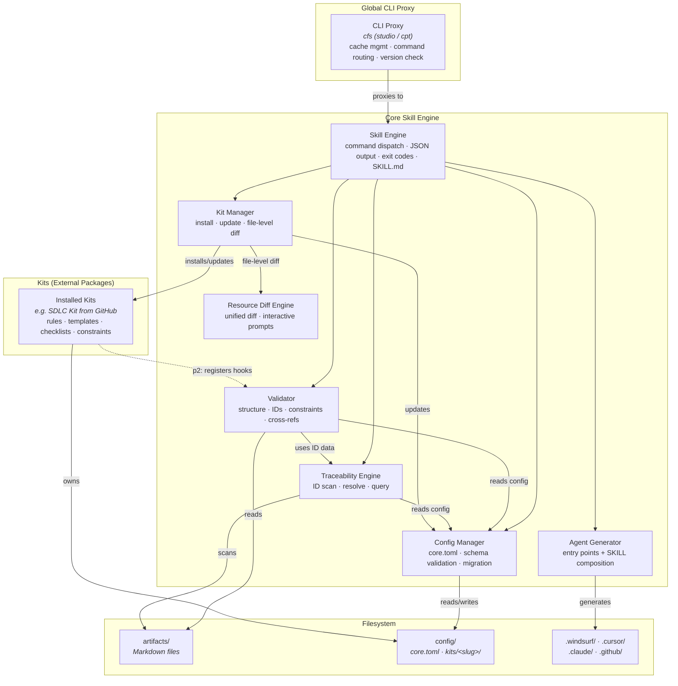

#### CLI Proxy

- [x] `p1` - **ID**: `cpt-studio-component-cli-proxy`

##### Why this component exists

Provides a stable global entry point (`cfs` (with `studio`/`cpt` as aliases)) that works both inside and outside projects. Manages the skill bundle cache so users don't need to manually download or update the tool.

##### Responsibility scope

- Maintain local skill bundle cache (`~/.cf-studio/cache/`)
- Route commands to project-installed skill (if inside a project) or cached skill (if outside)
- Perform non-blocking background version checks
- Display version update notices when cached version is newer than project version
- Collect and emit usage telemetry (local JSONL logs + optional OTLP HTTP) via non-blocking daemon thread
- Resolve GitHub-backed cache versions from the effective GitHub source's release/tag authority
- Persist cache provenance and content identity for version reporting
- Distinguish tag-derived package version, cached bundle version, project-installed version, and verification state in `--version`

##### Responsibility boundaries

Does NOT contain any skill logic, workflow logic, or command implementations. Does NOT interpret command arguments — passes them through to the resolved skill. Does NOT modify project files. Telemetry MUST NOT block, slow down, or affect command execution in any way.

##### Related components (by ID)

- `cpt-studio-component-skill-engine` — proxies all commands to this component

#### Skill Engine

- [x] `p1` - **ID**: `cpt-studio-component-skill-engine`

##### Why this component exists

Central command dispatcher that provides a uniform interface for all Studio functionality. Ensures all commands follow the same conventions (JSON output, exit codes, deterministic behavior).

##### Responsibility scope

- Parse and route CLI commands to appropriate handlers
- Enforce JSON output format for all commands
- Manage exit code conventions (0=PASS, 1=error, 2=FAIL)
- Load and expose SKILL.md as the agent entry point
- Register kit commands at runtime (p2: kit plugin CLI subcommands)
- Route `cfs delegate` commands to the delegation handler (see `cpt-studio-adr-ralphex-delegation-skill`)

##### Responsibility boundaries

Does NOT execute workflows (workflows are interpreted by AI agents). Does NOT contain domain-specific validation logic (delegated to kits). Does NOT manage config schema — delegates to Config Manager.

##### Related components (by ID)

- `cpt-studio-component-cli-proxy` — receives commands from proxy
- `cpt-studio-component-validator` — delegates validation commands
- `cpt-studio-component-traceability-engine` — delegates ID query commands
- `cpt-studio-component-config-manager` — delegates config commands
- `cpt-studio-component-kit-manager` — manages kit lifecycle
- `cpt-studio-component-agent-generator` — delegates agent commands

#### Validator

- [x] `p1` - **ID**: `cpt-studio-component-validator`

##### Why this component exists

Provides the deterministic quality gate that ensures artifacts meet structural requirements without relying on an LLM. This is the core of Studio's value — catching issues that agents miss or hallucinate.

##### Responsibility scope

- Template structure compliance checking (heading patterns, required sections)
- ID format validation (`cpt-{system}-{kind}-{slug}` pattern)
- Priority marker validation
- Placeholder detection (TODO, TBD, FIXME)
- Cross-reference validation (covered_by, checked consistency)
- Constraint enforcement from `constraints.toml` (headings scoping, reference rules). For manifest-driven kits, the path to `constraints.toml` is resolved from the kit's resource bindings in `core.toml`
- Kit structural validation (`validate-kits`): verify kit directory exists with required files. For manifest-driven kits, resolves paths to constraints, templates, and examples from resource bindings in `core.toml` instead of assuming the default kit directory structure
- TOC validation (`validate-toc`): verify anchors resolve, all headings covered, TOC not stale
- Stable error codes (`error_codes.py`): machine-readable codes for all validation issues, used by fixing prompts and downstream consumers
- Fixing prompt generation (`fixing.py`): enrich errors with actionable prompts for LLM agents
- Single-pass scanning for performance (≤ 3s per artifact)

##### Responsibility boundaries

Does NOT perform semantic validation (checklist review is done by AI agents). Does NOT modify artifacts — read-only analysis. Does NOT validate code files directly.

##### Related components (by ID)

- `cpt-studio-component-skill-engine` — receives validation commands
- `cpt-studio-component-traceability-engine` — uses ID scanning results
- `cpt-studio-component-config-manager` — reads config for system/artifact resolution; reads resource bindings for manifest-driven kit path resolution
- Installed kits may register validation hooks via constraints.toml

#### Traceability Engine

- [x] `p1` - **ID**: `cpt-studio-component-traceability-engine`

##### Why this component exists

Implements the ID system that links design elements to code. Without this component, there is no automated way to verify that code implements what was designed.

##### Responsibility scope

- Scan artifacts for ID definitions (`**ID**: \`cpt-...\``) and references (backticked `cpt-...`)
- Scan code for traceability tags (`@cpt-*`) with language-aware comment detection (`language_config.py`)
- Resolve cross-references between definitions and references
- Provide query commands: `list-ids`, `list-id-kinds`, `where-defined`, `where-used`, `get-content`
- Support ID versioning (`-vN` suffix)
- Markdown structure parsing (`parsing.py`): section extraction, heading analysis, content block identification
- Spec coverage analysis: measure CDSL marker coverage percentage and instruction granularity per code file

##### Responsibility boundaries

Does NOT define which ID kinds are valid — that comes from kit constraints. Does NOT enforce cross-artifact reference rules — that's the Validator's job (using data from this engine). Does NOT modify files.

##### Related components (by ID)

- `cpt-studio-component-validator` — provides ID scan data for validation
- `cpt-studio-component-skill-engine` — receives query commands
- `cpt-studio-component-config-manager` — reads config for system/artifact resolution

#### Config Manager

- [x] `p1` - **ID**: `cpt-studio-component-config-manager`

##### Why this component exists

Ensures config integrity by centralizing all config file operations behind schema validation. Prevents configuration drift and enables reliable migration between versions.

##### Responsibility scope

- CRUD operations on `{cf-studio-path}/config/core.toml` (system definitions, kit registrations, ignore lists, resource bindings)
- Resource binding management: read/write `[kits.{slug}.resources]` section in `core.toml` — stores resolved resource identifier → path mappings for manifest-driven kits. Provides a lookup API so other components (Skill Engine, workflows) can resolve `{identifier}` template variables to filesystem paths
- Persist resolved `ralphex` executable path in `core.toml` so future delegation does not require re-discovery (see `cpt-studio-adr-ralphex-delegation-skill`)
- Schema validation before any write operation (including resource bindings validated against `core-config.schema.json`)
- Deterministic TOML serialization
- Config migration between versions (with backup before migration)
- JSON → TOML format migration during `cfs update`: detect legacy `.json` files, convert to `.toml`, validate, remove originals
- Backward-compatible config loading: read `.toml` first, fall back to `.json` with deprecation warning
- Provide CLI commands for config inspection (`info`, `resolve-vars`)

##### Responsibility boundaries

Does NOT manage kit file content. Does NOT interpret kit-specific semantics.

##### Related components (by ID)

- `cpt-studio-component-skill-engine` — receives config commands
- `cpt-studio-component-kit-manager` — coordinates kit config creation during installation
- `cpt-studio-component-validator` — provides config data for validation context

#### Kit Manager

- [x] `p1` - **ID**: `cpt-studio-component-kit-manager`

##### Why this component exists

Manages the kit lifecycle — installing, registering, and updating kits. Enables the extensible architecture where new domains can be added by providing a new kit as a directory of ready-to-use files.

##### Responsibility scope

- Kit installation from GitHub or local directories: download kit from a GitHub source (`cfs kit install <owner/repo[@version]>`) or install from a local directory (`cfs kit install --path <dir>`), copy all kit files from source into `{cf-studio-path}/config/kits/{slug}/`, register in `core.toml` with source and version metadata plus kit tracking policy, regenerate `.gen/AGENTS.md` and `.gen/SKILL.md` to include the new kit's navigation and skill routing. In tracked mode, files in the kit's config directory are user-editable and preserved across updates via interactive diff; in ignored mode, they are generated/ephemeral and overwriteable
- Manifest-driven installation (see `cpt-studio-fr-core-kit-manifest`): the Kit Manager loads kit sources through a normalized `KitModel`. New kits use canonical `.cf-studio-kit.toml`; legacy `manifest.toml` v1/v2, ADR-0019 component manifests, and `conf.toml + layout` kits remain compatibility inputs. The Kit Manager validates the normalized model, reads all declared resources, prompts for effective destinations or local copy/register mode when required, copies or registers each resource, resolves template variables (`{identifier}`) from effective resource bindings, and registers resolved paths, install mode, hashes, provenance, and warnings in `core.toml` under `[kits.{slug}.resources]`. If no manifest-style input is present, it falls back to legacy predefined content directories and files.
- Kit registration: add kit entry to `{cf-studio-path}/config/core.toml` with config output path, source provenance (`github`, `local_path`, or other explicit source type), requested source, effective source after mirror/fork override, version/ref, content identity, verification state, and resolved resource paths (`resources` map)
- Version tracking: for GitHub-backed kits, resolve versions through the effective GitHub source's releases/tags; for local/path kits, record local provenance and content identity without GitHub update semantics. Kit source, version/ref, identity, and verification state are tracked in `core.toml`; kit-local metadata may also be stored in `{cf-studio-path}/config/kits/{slug}/conf.toml`
- Update modes: tracked kits use force (`--force`) or interactive file-level diff — compares each file in the new version against user's installed copy, shows unified diffs, prompts with accept/decline/accept-all/decline-all/modify via Resource Diff Engine. Ignored kits are generated/ephemeral and may be overwritten without per-file prompts. For manifest-driven tracked kits, updates apply diffs to the registered resource paths (not just the kit directory), detect new resources in the updated manifest (prompt user for path and register), and warn about resources removed from the manifest (preserve existing paths in `core.toml`). When updating a legacy-installed kit (no `resources` section in `core.toml`) and the new version introduces a manifest, auto-populate all resource bindings from existing kit root + manifest defaults before applying diffs
- Resource path exposure: resolved resource variables are returned by `cfs info` as part of kit information, enabling agents and scripts to discover resource locations programmatically
- Layout restructuring: detect old directory layout and automatically restructure (move generated outputs from `.gen/kits/` to `config/kits/`, clean up `.gen/kits/`)
- Kit structural validation (`validate-kits` command): verify kit directory exists with required files (`conf.toml`, `constraints.toml`, `artifacts/` directory); for manifest-driven kits, additionally verify all registered resource paths exist on disk
- Plugin loading (p2): discover and load kit Python entry points at runtime

##### Responsibility boundaries

Does NOT own kit resource content — kit files are maintained directly. Does NOT perform kit-specific validation beyond structural checks. Does NOT interpret resource content — only manages resource placement and path registration.

##### Related components (by ID)

- `cpt-studio-component-skill-engine` — receives kit management commands
- `cpt-studio-component-config-manager` — updates core.toml during kit registration
- Installed kits (e.g., SDLC kit from `constructorfabric/studio-kit-sdlc`) — managed by this component

#### Agent Generator

- [x] `p1` - **ID**: `cpt-studio-component-agent-generator`

##### Why this component exists

Bridges the gap between Studio's unified skill system and the diverse file format requirements of different AI coding assistants. Without this component, users would need to manually create and maintain agent-specific files.

##### Responsibility scope

- Generate workflow entry points in each agent's native format from kit workflow files (e.g., `.windsurf/workflows/cf-{name}.md` → `config/kits/<slug>/workflows/{name}.md`)
- Generate shared skill stubs in `.agents/skills/{id}/SKILL.md` for all non-Claude agents, referencing the core SKILL.md
- Compose SKILL.md: collect kit SKILL.md extensions and assemble them into the main SKILL.md alongside core commands
- Generate skill shims that reference the composed SKILL.md
- Support 5 agents: Windsurf (`.windsurf/workflows/` + `.agents/skills/`), Cursor (`.cursor/commands/` + `.agents/skills/`), Claude (`.claude/commands/` + `.claude/agents/`), Copilot (`.github/prompts/` + `.github/agents/` + `.agents/skills/`), OpenAI (`.agents/skills/` only)
- Full overwrite on each invocation for generator-owned `cf-*` outputs (no merge with existing files)
- Normalize generated agent output names so new files use a `cf-` prefix or a dedicated Studio-owned path; migrate legacy non-prefixed generated storytelling files only when ownership checks prove they are generated, and preserve user-edited files
- Support `--agent` flag for single-agent regeneration

##### Responsibility boundaries

Does NOT maintain agent-specific state. Does NOT define SKILL extension content — collects from kit files. Does NOT persist agent selection in config.

##### Related components (by ID)

- `cpt-studio-component-skill-engine` — receives `generate-agents` command (generation) and `agents` command (read-only listing)
- `cpt-studio-component-kit-manager` — provides kit SKILL.md extensions for composition
- `cpt-studio-component-config-manager` — reads config for project context

#### Map Renderer

- [x] `p1` - **ID**: `cpt-studio-component-map-renderer`

##### Why this component exists

Provides the interactive dependency visualization layer of Studio. It consumes the graph of nodes and edges produced by the Traceability Engine and renders it into either a self-contained HTML viewer or a canonical JSON payload. Without this component, phantom cpt-ID detection and architecture graph navigation would require manual inspection.

##### Responsibility scope

- Walk project markdown files and registered source codebase entries to produce `Node` objects (`markdown`, `source`, `phantom-cpt` kinds)
- Extract cpt-ID definitions and cross-references from markdown (via `scan_cpt_ids`); extract scope and block markers from source code (via `CodeFile.from_path`)
- Build `cpt-impl` edges (source → markdown definition), `cpt-doc` edges (markdown → markdown reference), and `file-link` edges (markdown hyperlink → markdown)
- Detect phantom cpt-IDs (used but undefined) and emit `phantom-cpt` nodes with dangling edges
- Categorize nodes via three-step chain: explicit override (`md-map.toml`) → artifacts.toml registry prefix match → parent directory name
- Enrich edges with definition context using `get_content_scoped` for tooltip display
- Compute rectpack-based category layout targeting 16:9 aspect ratio with affinity-ordered placement
- Serialize to canonical JSON (version, nodes, edges, dangling_cpt_uses, categories, layout)
- Render self-contained HTML viewer with bundled vis-network, viewer JS/CSS, and JSON payload (inline or sidecar)
- Support workspace federation (multi-source scanning) and `--no-source` / `--local-only` flags

##### Responsibility boundaries

Does NOT perform artifact structural validation (delegated to Validator). Does NOT modify any source files or artifacts (read-only analysis). Does NOT store map data persistently — output is written to user-specified path only.

##### Related components (by ID)

- `cpt-studio-component-skill-engine` — receives `map` command
- `cpt-studio-component-traceability-engine` — provides `scan_cpt_ids`, `get_content_scoped`, `CodeFile` scanning infrastructure
- `cpt-studio-component-config-manager` — reads `artifacts.toml` for codebase definitions and category registry

#### External Kits

The following kits are external packages that can be installed and managed by the Kit Manager:

* SDLC Kit (`constructorfabric/studio-kit-sdlc`): provides SDLC-specific workflows and validation rules

### 3.3 API Contracts

- [ ] `p1` - **ID**: `cpt-studio-interface-cli-json`

**Type**: CLI (command-line interface)
**Stability**: stable
**Format**: All commands output JSON to stdout

**Core Commands**:

| Command | Description | Exit Code |
|---------|-------------|-----------|
| `validate [--artifact <path>] [--local-only] [--source S]` | Validate artifacts (single or all); `--local-only` skips cross-repo workspace validation, `--source` targets a specific workspace source | 0=PASS, 2=FAIL |
| `list-ids [--kind K] [--pattern P] [--source S]` | List IDs matching criteria; `--source` filters by workspace source | 0 |
| `where-defined --id <id>` | Find where an ID is defined | 0=found, 2=not found |
| `where-used --id <id>` | Find where an ID is referenced | 0 |
| `get-content --id <id>` | Get content block for an ID | 0=found, 2=not found |
| `info` | Show adapter status, registry, and resolved resource variables per kit | 0 |
| `agents [--agent A]` | Show generated agent integration files (read-only listing; no files written) | 0 |
| `generate-agents [--agent A] [--dry-run]` | Generate or update agent integration files (full overwrite on each invocation) | 0 |
| `doctor` | Environment health check | 0=healthy, 2=issues |
| `init` | Initialize project | 0 |
| `update` | Update project skill to cached version | 0 |
| `toc` | Generate/update table of contents in artifact | 0 |
| `validate-toc` | Validate table of contents consistency | 0=PASS, 2=FAIL |
| `list-id-kinds` | List all known ID kind tokens | 0 |
| `validate-kits` | Validate kit structural correctness | 0=PASS, 2=FAIL |
| `kit install` | Install a kit (copy files, register in core.toml) | 0 |
| `kit update [--force]` | Update kit files (interactive: file-level diff; force: overwrite) | 0 |
| `workspace-init [--root] [--output] [--inline] [--force] [--max-depth N] [--dry-run]` | Scan nested sub-dirs, generate workspace config | 0, 1=error |
| `workspace-add --name N (--path P \| --url U) [--branch] [--role] [--adapter] [--inline] [--force]` | Add a source to workspace config | 0, 1=error, 2=invalid args |
| `workspace-info` | Display workspace status and per-source details | 0, 1=error |
| `workspace-sync [--source N] [--dry-run] [--force]` | Fetch and update Git URL sources | 0, 1=error, 2=all failed |

**Kit Commands (SDLC) — EXTRACTED**:

> **EXTRACTED per `cpt-studio-adr-extract-sdlc-kit`**: Kit-specific CLI subcommands are owned by their respective kits. The following commands are provided by the SDLC kit (`constructorfabric/studio-kit-sdlc`) when installed:

| Command | Description | Exit Code |
|---------|-------------|-----------|
| ~~`sdlc autodetect show --system S`~~ | Show autodetect rules for a system | 0 |
| ~~`sdlc autodetect add-artifact`~~ | Add artifact autodetect rule | 0 |
| ~~`sdlc autodetect add-codebase`~~ | Add codebase definition | 0 |
| ~~`sdlc pr-review <number>`~~ | Review a PR | 0 |
| ~~`sdlc pr-status <number>`~~ | Check PR status | 0 |

- [ ] `p2` - **ID**: `cpt-studio-interface-github-gh-cli`

**Direction**: required from client
**Protocol/Format**: GitHub REST/GraphQL API accessed through `gh` CLI v2.0+
**Used by**: SDLC Kit (PR review/status workflows)

### 3.4 Internal Dependencies

No internal module dependencies beyond the component relationships documented in Section 3.2. All components are part of a single Python package and communicate through direct function calls within the same process.

**Dependency Rules**:
- Components access each other through well-defined interfaces (not internal implementation details)
- Validator and Traceability Engine share scan results through a common data model (ID definitions, references)
- Kit plugins register hooks at startup — core components invoke hooks through a registry, not direct imports
- No circular dependencies: core components do not depend on kit plugins; plugins depend on core interfaces

### 3.5 External Dependencies

#### GitHub API (via `gh` CLI)

| Dependency | Interface Used | Purpose |
|------------|---------------|---------|
| `gh` CLI v2.0+ | CLI subprocess invocation | Fetch PR diffs, metadata, comments, and status for SDLC kit PR review/status workflows |

**Dependency Rules**:
- `gh` CLI is optional — only required for PR review/status workflows
- `cfs doctor` checks `gh` availability and authentication status
- PR workflows fail gracefully with actionable error message if `gh` is not available

#### ralphex CLI (optional)

| Dependency | Interface Used | Purpose |
|------------|---------------|---------|
| `ralphex` CLI | CLI subprocess invocation plus project-local `docs/plans/` and `.ralphex/` files | Execute delegated Studio plans in fresh Claude Code sessions with task-by-task validation, review orchestration, and optional worktree/dashboard modes |

**Dependency Rules**:
- `ralphex` is optional — only required when the user explicitly chooses delegated execution
- Studio discovers `ralphex` on `PATH` first, then may reuse a previously configured absolute executable path
- Project-local initialization via `ralphex --init` materializes `.ralphex/config`, `.ralphex/prompts/`, and `.ralphex/agents/`; these files are derived executor overrides, not canonical Studio SDLC sources
- ralphex config precedence is: CLI flags > local `.ralphex/` config > global `~/.config/ralphex/` config > embedded defaults
- Studio MUST NOT vendor `ralphex` into the Python package or make it a required runtime dependency
- Exported `docs/plans/` files, optional `docs/plans/completed/` lifecycle outputs, and optional `.ralphex/` prompts or agents are derived artifacts compiled from canonical Studio sources; they are not a second SDLC source of truth
- Missing or incompatible `ralphex` installations fail with diagnostics and setup guidance instead of changing baseline generate/analyze/plan behavior

#### pipx (recommended)

| Dependency | Interface Used | Purpose |
|------------|---------------|---------|
| pipx | Package installer | Global CLI proxy installation in isolated environment |

**Dependency Rules**:
- pipx is recommended but not required — manual installation is possible
- `cfs doctor` checks pipx availability

#### Python Runtime

| Dependency | Interface Used | Purpose |
|------------|---------------|---------|
| Python 3.11+ | Runtime environment | Execute all Studio skill scripts and kit plugins (requires `tomllib` from stdlib) |

**Dependency Rules**:
- Core uses stdlib only — no pip dependencies
- `cfs doctor` checks Python version compatibility

### 3.6 Interactions & Sequences

#### Project Initialization

**ID**: `cpt-studio-seq-init`

**Use cases**: `cpt-studio-usecase-init`

**Actors**: `cpt-studio-actor-user`, `cpt-studio-actor-studio-cli`

```mermaid
sequenceDiagram
    User->>CLI Proxy: cfs init
    CLI Proxy->>Skill Engine: init command
    Skill Engine->>Skill Engine: detect existing Studio install
    alt existing project detected
        Skill Engine->>Config Manager: resolve pinned Studio version/source metadata
        alt metadata available
            Skill Engine->>Skill Engine: repair .core/, .gen/, .gitignore, generated agents
            Skill Engine-->>User: "Constructor Studio repaired; version unchanged"
        else metadata unavailable
            Skill Engine-->>User: NEEDS_UPDATE_METADATA
        end
    else new project
        Skill Engine->>User: "Install directory?" (default: studio)
        User-->>Skill Engine: confirms
        Skill Engine->>User: "Which agents?" (default: all)
        User-->>Skill Engine: selects agents
        Skill Engine->>User: "Track editable kit files in git?" (default: yes)
        User-->>Skill Engine: selects kit-tracking policy
        Skill Engine->>Skill Engine: define root system (name/slug from directory)
        Skill Engine->>Config Manager: create config/, .gen/ directories
        Config Manager->>Config Manager: write core.toml (root system, kit tracking, pinned metadata, no kits)
        Config Manager->>Config Manager: write artifacts.toml (root system, autodetect defaults)
        Config Manager->>Config Manager: write managed .gitignore block
        Skill Engine->>Skill Engine: regenerate .gen/AGENTS.md, .gen/SKILL.md
        Skill Engine->>Agent Generator: generate entry points
        Agent Generator->>Agent Generator: write .windsurf/, .cursor/, etc.
        Skill Engine->>Skill Engine: inject root AGENTS.md entry
        Config Manager->>Config Manager: write config/AGENTS.md (default WHEN rules)
        Skill Engine->>User: "Install SDLC kit? [a]ccept [d]ecline"
        alt user accepts
            User-->>Skill Engine: [a]ccept
            Skill Engine->>Kit Manager: install kit from github:constructorfabric/studio-kit-sdlc
            Kit Manager->>Kit Manager: download kit source
            alt canonical or legacy manifest input present in kit source
                Kit Manager->>Kit Manager: normalize manifest/layout into KitModel
                Kit Manager->>Kit Manager: validate normalized resources
                loop each user_modifiable resource
                    Kit Manager->>User: "Path for {description}?" (default: {default_path})
                    User-->>Kit Manager: accepts or overrides path
                end
                Kit Manager->>Kit Manager: copy resources to resolved paths
                Kit Manager->>Kit Manager: resolve {identifier} template variables in kit files
                Kit Manager->>Config Manager: register kit + resource bindings in core.toml
            else no manifest-style input (legacy mode)
                Kit Manager->>Kit Manager: copy files to config/kits/sdlc/
                Kit Manager->>Config Manager: register kit in core.toml with source + version
            end
            Kit Manager->>Kit Manager: compose SKILL.md and AGENTS.md extensions
            Skill Engine->>Skill Engine: regenerate .gen/AGENTS.md, .gen/SKILL.md
            Skill Engine->>Agent Generator: regenerate entry points (include kit workflows)
            Skill Engine-->>User: "Studio initialized with SDLC kit"
        else user declines
            User-->>Skill Engine: [d]ecline
            Skill Engine-->>User: "Studio initialized. Install kits later: cfs kit install <owner/repo[@version]>"
        end
    end
```

**Description**: User initializes Studio in a project. The skill engine asks for install directory, agent selection, and kit tracking policy. It defines a **root system** (name and slug derived from the project directory name), creates core configs (`core.toml` with root system, pinned Studio metadata, and kit tracking policy; `artifacts.toml` with default autodetect rules), writes the managed `.gitignore` block, generates agent entry points, and sets up `{cf-studio-path}/config/AGENTS.md` with default WHEN rules. After core setup, the tool prompts `Install SDLC kit? [a]ccept [d]ecline`. If accepted, the kit is downloaded from GitHub. If the kit source contains canonical `.cf-studio-kit.toml` or legacy `manifest.toml`, the Kit Manager normalizes and validates the model, reads declared resources, prompts the user for destination paths or copy/register mode when required, copies or registers each resource, resolves template variables in kit files, and registers all resource bindings in `core.toml`. If no manifest-style input is present, files are copied to the default kit config directory. If declined, the user can install kits later via `cfs kit install`. Repeat `cfs init` repairs generated surfaces using the pinned metadata and does not upgrade implicitly.

**Root AGENTS.md / CLAUDE.md injection**: During initialization (and verified on every CLI invocation), the engine ensures the project root `AGENTS.md` and `CLAUDE.md` files contain the same managed block with only the configured adapter path:

````markdown
<!-- @cf:root-agents -->
```toml
cf-studio-path = ".bootstrap"
```
<!-- /@cf:root-agents -->
````

The block is inserted at the **beginning** of each file. If a file does not exist, it is created. The managed content is a TOML fence that declares only `cf-studio-path`, and the path reflects the actual install directory. Content between the `<!-- @cf:root-agents -->` and `<!-- /@cf:root-agents -->` comment markers is fully managed by Studio — it is overwritten on every check, so manual edits inside the block are discarded.

**Integrity invariant**: every Studio CLI command (not just `init`) verifies the root `AGENTS.md` and `CLAUDE.md` blocks exist and are correct before proceeding. If a block is missing or the path is stale (e.g., install directory changed), the engine silently re-injects it. This guarantees that root agent files always expose the current `cf-studio-path` without duplicating navigation rules.

#### Artifact Validation

**ID**: `cpt-studio-seq-validate`

**Use cases**: `cpt-studio-usecase-validate`

**Actors**: `cpt-studio-actor-user`, `cpt-studio-actor-ci-pipeline`

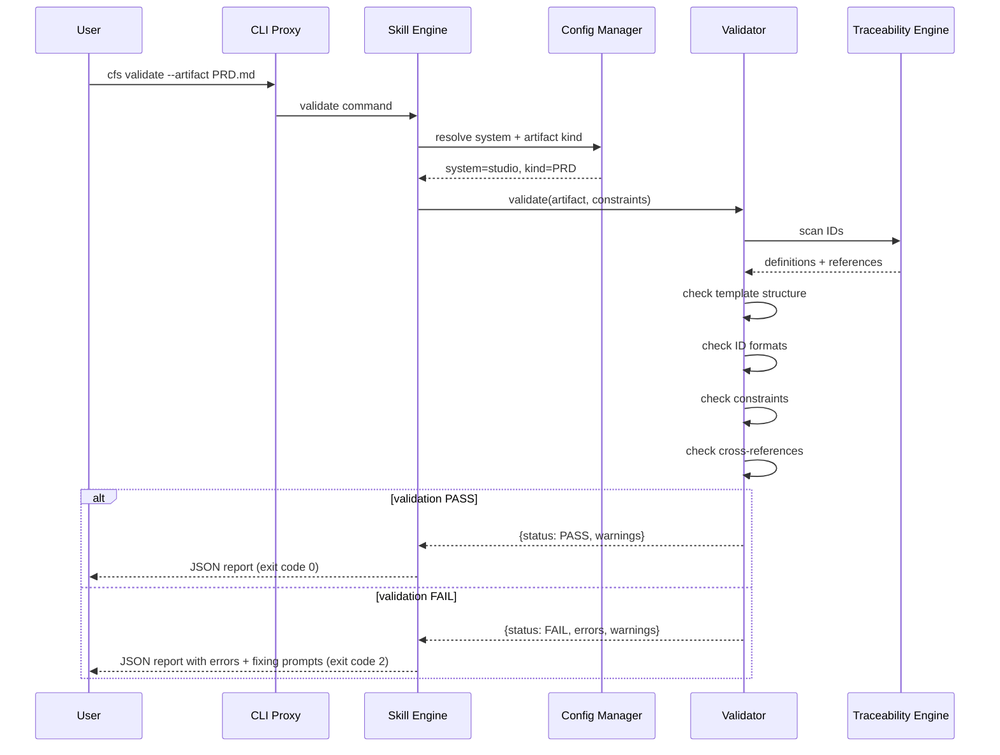

**Description**: Single artifact validation flow. The validator performs a single-pass scan, using the traceability engine for ID resolution, and returns a structured JSON report with PASS/FAIL status.

#### Agent Workflow Execution (Generate)

**ID**: `cpt-studio-seq-generate-workflow`

**Use cases**: `cpt-studio-usecase-create-artifact`

**Actors**: `cpt-studio-actor-user`, `cpt-studio-actor-ai-agent`

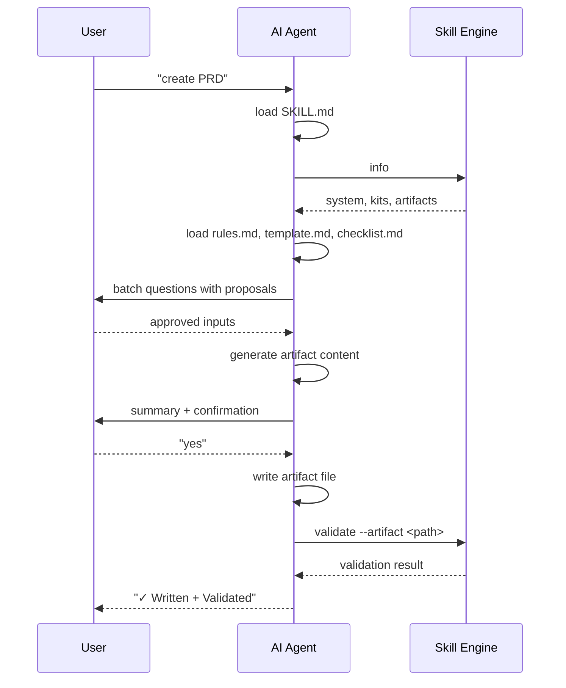

**Description**: Artifact generation is orchestrated by the AI agent, not the tool. The agent reads workflows and rules as instructions, collects information from the user, generates content, writes files, and invokes deterministic validation.

#### PR Review

**ID**: `cpt-studio-seq-pr-review`

**Use cases**: `cpt-studio-usecase-pr-review`

**Actors**: `cpt-studio-actor-user`, `cpt-studio-actor-ai-agent`

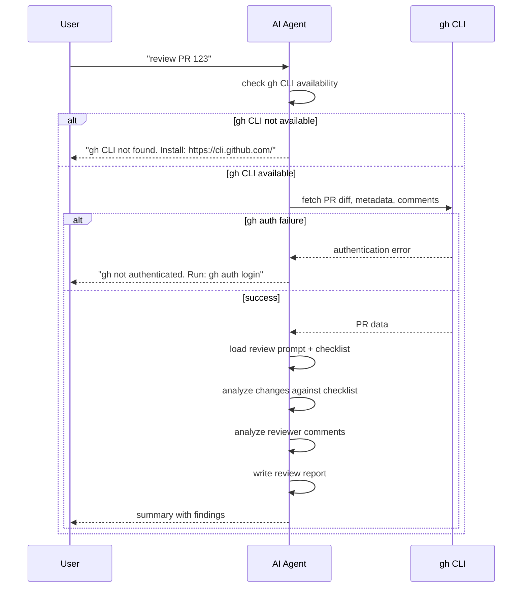

**Description**: PR review is driven by the AI agent using `gh` CLI for data fetching. The tool provides configurable prompts and checklists; the agent performs the analysis and writes a structured report.

#### Delegated Plan Execution (ralphex)

**ID**: `cpt-studio-seq-ralphex-delegation`

**Use cases**: `cpt-studio-usecase-create-artifact`, `cpt-studio-usecase-update`

**Actors**: `cpt-studio-actor-user`, `cpt-studio-actor-ai-agent`

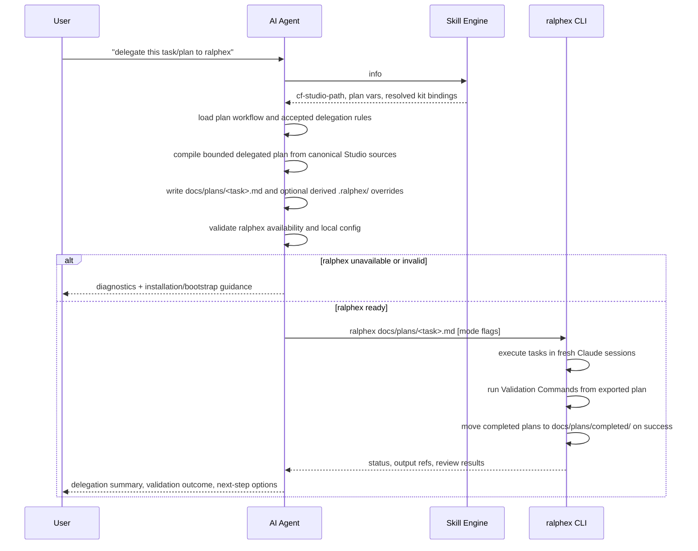

**Description**: Delegated execution keeps Studio responsible for intent routing, SDLC slice selection, plan compilation, and deterministic validation contracts. ralphex becomes an optional external executor that consumes the exported plan and any derived `.ralphex/` overrides, performs autonomous execution, and returns run status without becoming the source of truth for rules or workflow semantics. Review-only mode is the main special case: `ralphex --review` can operate without a plan file and compare the current branch to the default branch, while an optional plan file serves only as extra review context. Worktree-enabled task execution uses `.ralphex/worktrees/<branch>` as the executor-owned isolation path.

#### Version Update

**ID**: `cpt-studio-seq-update`

**Use cases**: `cpt-studio-usecase-update`

**Actors**: `cpt-studio-actor-user`, `cpt-studio-actor-studio-cli`

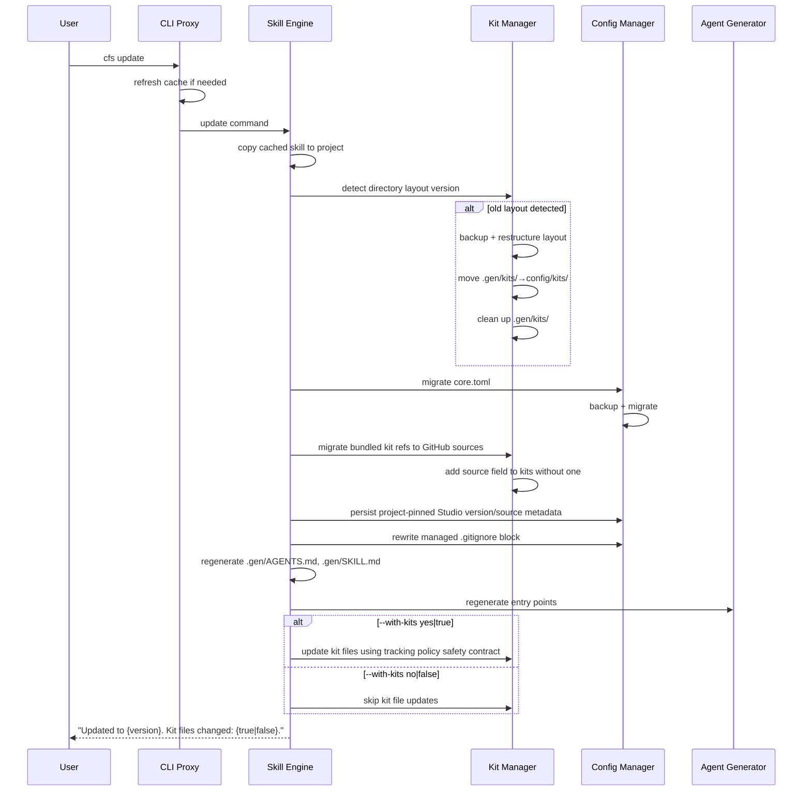

**Description**: Update copies the cached skill into the project, detects directory layout (triggering automatic restructuring if old layout detected), migrates config files (with backup), migrates bundled kit references to GitHub sources (for projects upgrading from versions < 3.0.8), rewrites the managed `.gitignore` block, persists repair metadata, and regenerates agent entry points for compatibility. Kit file updates are skipped by default and run only via `cfs kit update` or `cfs update --with-kits yes|true`.

#### ID Resolution Query

**ID**: `cpt-studio-seq-traceability-query`

**Use cases**: `cpt-studio-usecase-validate`

**Actors**: `cpt-studio-actor-user`, `cpt-studio-actor-ai-agent`

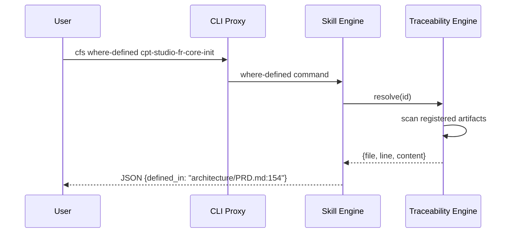

**Description**: ID resolution query scans all registered artifacts to find where an ID is defined. Used by agents for navigation and by the validator for cross-reference checking.

#### Workspace Initialization

**ID**: `cpt-studio-seq-workspace-init`

**Use cases**: `cpt-studio-usecase-workspace-init`

**Actors**: `cpt-studio-actor-user`, `cpt-studio-actor-studio-cli`

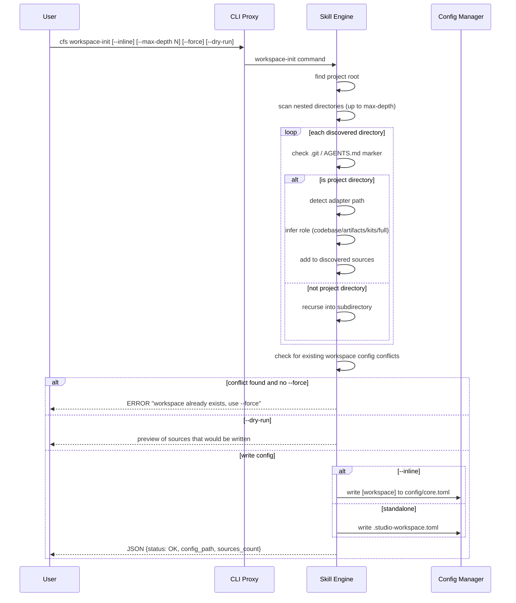

**Description**: Workspace initialization scans the project tree for nested repositories, infers source roles from directory structure, and writes a workspace configuration file. The `--inline` flag controls whether config is embedded in `core.toml` or written as a standalone file. The `--max-depth` flag limits recursion depth (default 3). Symlinks are skipped during scanning. Role inference (`cpt-studio-algo-workspace-infer-role`) checks for source directories (`src/`, `lib/`, `app/`, `pkg/`), documentation directories (`docs/`, `architecture/`, `requirements/`), and a `kits/` directory — repos with multiple capability types get role `full`; single-capability repos get the matching role; repos with no recognized directories default to `full`.

#### Add Workspace Source

**ID**: `cpt-studio-seq-workspace-add`

**Use cases**: `cpt-studio-usecase-workspace-add`

**Actors**: `cpt-studio-actor-user`, `cpt-studio-actor-studio-cli`

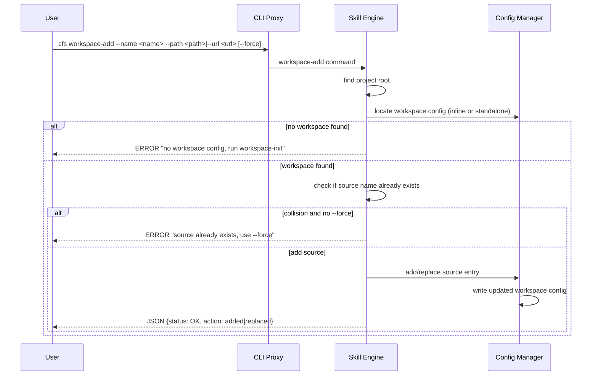

**Description**: Adds a local path or Git URL source to an existing workspace configuration. The command auto-detects whether the workspace uses inline or standalone config. Source name collisions require the `--force` flag to replace.

#### Workspace Info

**ID**: `cpt-studio-seq-workspace-info`

**Use cases**: `cpt-studio-usecase-workspace-info`

**Actors**: `cpt-studio-actor-user`, `cpt-studio-actor-studio-cli`

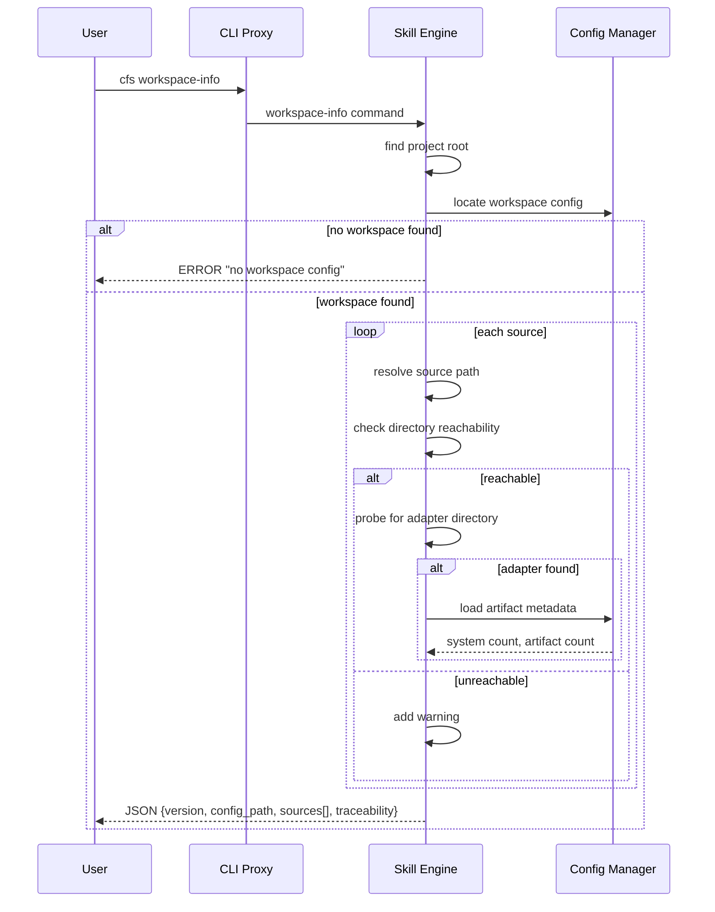

**Description**: Reports workspace health by resolving each source path, checking reachability, probing for adapters, and loading artifact metadata. Returns a comprehensive status including per-source info (reachability, adapter presence, artifact counts) and workspace-level traceability settings.

#### Workspace Sync

**ID**: `cpt-studio-seq-workspace-sync`

**Use cases**: `cpt-studio-usecase-workspace-sync`

**Actors**: `cpt-studio-actor-user`, `cpt-studio-actor-studio-cli`

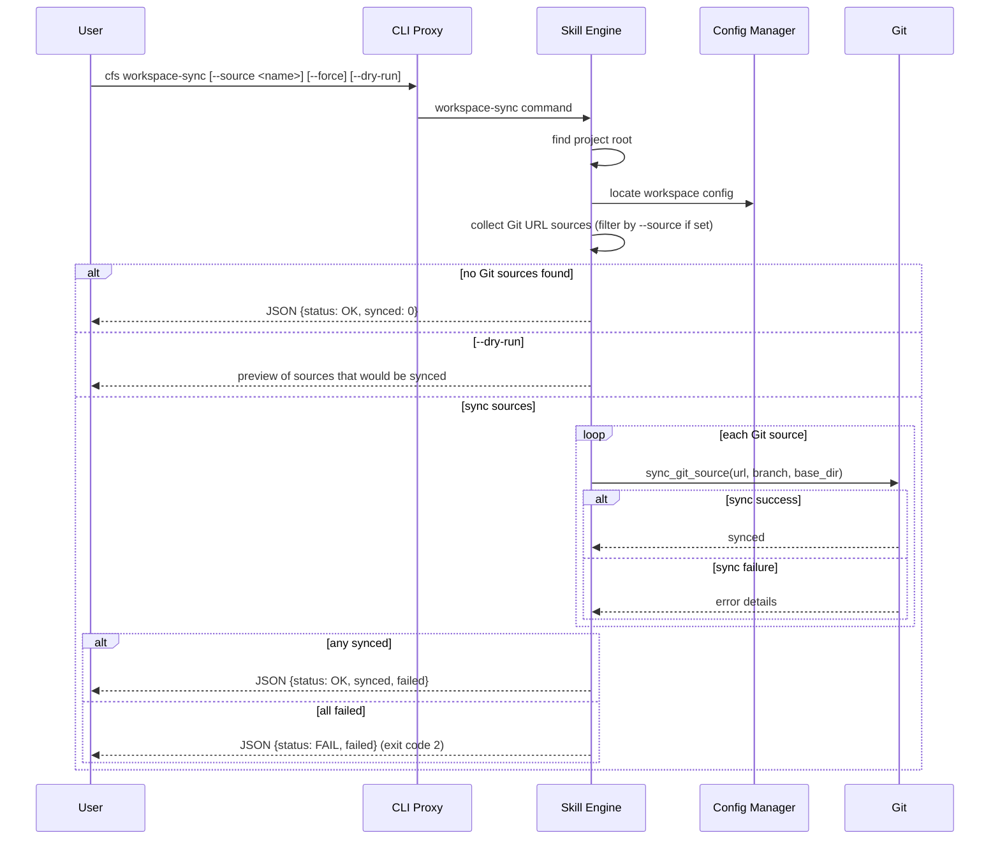

**Description**: Fetches and updates Git URL workspace sources. Each source is synced via `cpt-studio-algo-workspace-sync-git-source`. Only sources with a configured URL are eligible for sync. The `--source` flag targets a single source. The command reports per-source sync results and fails (exit code 2) only if all sources fail.

### 3.7 Database schemas & tables

Not applicable — Studio does not use a database. All persistent state is stored in the filesystem:

- **`{cf-studio-path}/config/core.toml`** — core config (system definitions, kit registrations with config paths and resolved resource bindings, ignore lists). For manifest-driven kits, the `[kits.{slug}.resources]` section stores identifier → path mappings (e.g., `adr_artifacts = "architecture/ADR"`)
- **`{cf-studio-path}/config/artifacts.toml`** — artifact registry (systems, artifacts, codebases)
- **Project `.gitignore` managed block** — exact project-relative ignore entries for `.core/`, `.gen/`, generated agent outputs, and each concrete kit path whose `kits.<slug>.tracking = "ignored"`; entries are overwriteable generated surfaces
- **`{cf-studio-path}/config/kits/<slug>/`** — per-kit files (conf.toml, SKILL.md, constraints.toml, artifacts/, codebase/, workflows/, scripts/) — tracked/user-editable by default and preserved via interactive diff; generated/ephemeral only when that kit's `tracking = "ignored"`
- **`{cf-studio-path}/.gen/`** — top-level auto-generated files only (AGENTS.md, SKILL.md, README.md)
- **`~/.cf-studio/cache/`** — global skill bundle cache
- **Markdown artifacts** — source of truth for design (PRD.md, DESIGN.md, etc.)

## 4. Additional context

### Performance Considerations

The validator uses single-pass scanning to meet the ≤ 3 second requirement. Artifacts are read once into memory, and all checks (template structure, ID format, constraints, cross-references) are performed in a single traversal. No external calls (network, database, LLM) are made during validation.

### Extensibility Model

The kit plugin system is designed for extension at four levels:

1. **Kit-level**: New kits can be created for entirely new domains (e.g., API design, infrastructure-as-code). Each kit is a self-contained package installable from GitHub.
2. **Artifact-level**: Within a kit, new artifact kinds can be added via config. Kits may support adding custom artifact types through plugin CLI commands.
3. **Resource-level**: Within an artifact kind, users can override templates, extend checklists, modify rules, and embed custom prompts. Overrides are preserved across updates.
4. **Placement-level**: Kits with a canonical `.cf-studio-kit.toml` or legacy manifest allow users to customize where each resource is placed in the project during installation, or register eligible local resources in place. Resource identifiers become template variables resolvable by workflows and the execution protocol, enabling kit resources to be scattered across the project tree (not just under the kit config directory).

### Migration Strategy

Config migration follows a forward-only strategy:
1. Each version of `core.toml` has a schema version field
2. Migration scripts transform config from version N to N+1
3. Kit plugins provide their own migration scripts
4. Before any migration, a backup is created
5. If migration fails, the backup is restored and the user is notified

#### Directory Layout Restructuring

The new layout consolidates all kit files into `config/kits/`, removes reference copies (replaced by file-level diff), and moves generated outputs from `.gen/kits/` to `config/kits/`. This is an internal v3 restructuring that runs automatically during `cfs update`. The Layout Migrator (part of Kit Manager) performs this:

| Source (old) | Destination (new) | Action |
|-------------|------------------|--------|
| `.gen/kits/{slug}/` | `config/kits/{slug}/` | Move (generated outputs) |
| `kits/{slug}/` (reference copies) | — | Remove (replaced by file-level diff) |
| `.gen/kits/` | — | Remove directory (top-level `.gen/` files preserved) |

**Detection**: Old layout is detected when `{cf-studio-path}/.gen/kits/{slug}/` exists.

**Triggers**: Automatically during `cfs update` when old layout is detected.

#### JSON → TOML Format Migration

All configuration and constraint files are migrating from JSON to TOML:

| File (old) | File (new) | Owner |
|------------|------------|-------|
| `config/core.json` | `{cf-studio-path}/config/core.toml` | Config Manager |
| `{cf-studio-path}/config/kits/<slug>/*.json` | `{cf-studio-path}/config/kits/<slug>/*.toml` | Kit plugins |
| `constraints.json` | `constraints.toml` | Kit Manager |
| `.studio-adapter/artifacts.toml` | `{cf-studio-path}/config/artifacts.toml` | Config Manager |

**Rationale**: TOML is human-readable, supports comments, and is used consistently for all Studio configuration files. JSON remains the CLI output format (stdout).

**Migrator** (automatic during `cfs update`):
1. Detect existing `.json` config files in `config/` and `.studio-adapter/`
   - `.studio-adapter/artifacts.toml` migrates to `{cf-studio-path}/config/artifacts.toml` (new location)
2. For each file: parse JSON → serialize as TOML → write `.toml` alongside `.json`
3. Validate the new `.toml` file against the schema
4. If validation passes: remove the `.json` file
5. If validation fails: keep `.json`, report error, skip that file
6. `constraints.toml` is a kit file — updated via file-level diff during kit update
7. The migrator runs automatically during `cfs update` when upgrading from a JSON-based version
8. Explicit standalone migration is not exposed as a separate CLI command; use `cfs update` to run the current migrator path.

**Backward compatibility**: the Config Manager reads `.toml` first; if not found, falls back to `.json` and emits a deprecation warning that the next `cfs update` will migrate legacy config.

### Testing Approach

Component-level tests use fixture artifacts (synthetic Markdown files and TOML configs in `tests/fixtures/`). Mock boundaries:

- **Validator tests**: use fixture artifacts with known structural issues; no filesystem mocking needed (real temp files)
- **Traceability Engine tests**: use fixture artifacts with known ID patterns; verify scan results against expected definitions/references
- **Config Manager tests**: use temporary config directories; verify schema validation, serialization determinism, and migration correctness
- **CLI integration tests**: invoke the skill engine as a subprocess with fixture projects; verify JSON output and exit codes
- **Kit plugin tests**: use fixture kit directories; verify resource generation, CLI subcommand registration, and migration scripts
- **PR review tests**: mock `gh` CLI subprocess calls; verify prompt loading and report structure

Test data strategy: all test fixtures are self-contained in `tests/` — no dependency on the live `architecture/` or `config/` directories. Tests verify determinism by running the same input twice and asserting identical output.

### Non-Applicable Design Domains

The following design domains do not require dedicated architecture sections. Each bullet explains why the domain is either not applicable or is sufficiently addressed by existing sections:

- **Security Architecture** (SEC): Studio is a local CLI tool with no authentication, authorization, or data protection requirements. It does not handle user credentials, PII, or network security. The only security consideration (no secrets in config, no untrusted code execution) is addressed in the NFR allocation.
- **Performance Architecture** (PERF): Studio processes single repositories locally with single-pass in-memory scanning. There is no caching strategy, database access optimization, or scalability architecture needed. The ≤ 3s validation target is met by design (single-pass, stdlib-only, no external calls).
- **Reliability Architecture** (REL): Studio runs as a local CLI tool, not a service. There are no fault tolerance, redundancy, or disaster recovery requirements. Config migration with backup addresses the only recoverability concern.
- **Data Architecture** (DATA): No database. All state is in the filesystem (Markdown + TOML). No data partitioning, replication, sharding, or archival needed.
- **Integration Architecture** (INT): External integrations are `gh` CLI for PR review and `ralphex` CLI for delegated plan execution (`cpt-studio-seq-ralphex-delegation`). Both are optional subprocess calls with graceful failure handling and environment diagnostics via `cfs doctor`. The delegation contract is bounded to exported plan files and derived `.ralphex/` overrides — no integration middleware, event architecture, or API gateway is needed, but the contract boundary, discovery logic, and export grammar are architecturally significant (see §3.5 ralphex CLI dependency rules and §3.6 Delegated Plan Execution sequence).
- **Operations Architecture** (OPS): Installed locally via pipx. The optional `ralphex` integration adds environment handling responsibilities: executable discovery on `PATH`, persisted executable-path recording in config, project-local `.ralphex/` bootstrap via `ralphex --init`, and diagnostic guidance when `ralphex` is missing or incompatible (see §3.5 ralphex CLI dependency rules). No deployment topology, container orchestration, observability infrastructure, or monitoring is needed.
- **Compliance Architecture** (COMPL): No regulated data, no compliance certifications, no privacy architecture needed.
- **Usability Architecture** (UX): CLI tool with no frontend. No state management, responsive design, or progressive enhancement needed.

## 5. Traceability

- **PRD**: [PRD.md](./PRD.md)
- **ADRs**: [ADR/](./ADR/):
  - `cpt-studio-adr-remove-blueprint-system` — replace blueprint system with direct file package model
  - `cpt-studio-adr-python-stdlib-only` — Python 3.11+ with standard library only
  - `cpt-studio-adr-pipx-distribution` — pipx as global CLI distribution
  - `cpt-studio-adr-toml-json-formats` — TOML for config, JSON for CLI output
  - `cpt-studio-adr-markdown-contract` — Markdown as universal contract format
  - `cpt-studio-adr-gh-cli-integration` — GitHub CLI for GitHub integration
  - `cpt-studio-adr-proxy-cli-pattern` — stateless proxy pattern for global CLI
  - `cpt-studio-adr-three-directory-layout` — three-directory layout (.core/.gen/config)
  - `cpt-studio-adr-two-workflow-model` — two-workflow model (generate/analyze)
  - `cpt-studio-adr-skill-md-entry-point` — SKILL.md as single agent entry point
  - `cpt-studio-adr-structured-id-format` — structured cpt-* ID format with @cpt-* code tags
  - `cpt-studio-adr-git-style-conflict-markers` — git-style conflict markers for interactive merge
  - `cpt-studio-adr-prefer-cpt-cli-for-agents` — prefer `cpt` CLI over direct script invocation in agent prompts; graceful fallback to raw Python path
  - `cpt-studio-adr-ralphex-delegation-skill` — dedicated `cf-ralphex` skill with bounded delegation contract for autonomous plan execution via ralphex
- **Features**: [features/](./features/) — `core-infra.md`, `kit-management.md`, `traceability-validation.md`, `agent-integration.md`, `version-config.md`, `developer-experience.md`, `spec-coverage.md`, `v2-v3-migration.md`, `workspace.md`, `ralphex-delegation.md`, `subagent-registration.md`

### Specifications

| Spec | File | Drives |
|------|------|--------|
| CLI Interface | [specs/cli.md](./specs/cli.md) | `cpt-studio-interface-cli-json`, `cpt-studio-fr-core-installer`, `cpt-studio-fr-core-init`, `cpt-studio-fr-core-cli-config` |
| Kit Specification | [specs/kit/](./specs/kit/) | `cpt-studio-fr-core-kits`, `cpt-studio-fr-core-kit-manifest`, `cpt-studio-component-kit-manager`, `cpt-studio-component-validator` |
| Identifiers & Traceability | [specs/traceability.md](./specs/traceability.md) | `cpt-studio-fr-core-traceability`, `cpt-studio-component-traceability-engine` |
| CDSL | [specs/CDSL.md](./specs/CDSL.md) | `cpt-studio-fr-core-cdsl` |
| Artifacts Registry | [specs/artifacts-registry.md](./specs/artifacts-registry.md) | `cpt-studio-fr-core-config`, `cpt-studio-component-config-manager` |
| System Prompts | [specs/sysprompts.md](./specs/sysprompts.md) | `cpt-studio-fr-core-config`, `cpt-studio-fr-core-workflows` |
| Workspace (inline) | [DESIGN.md §1.2 Multi-Repo Workspace Federation](#multi-repo-workspace-federation) | `cpt-studio-fr-core-workspace`, `cpt-studio-fr-core-workspace-git-sources`, `cpt-studio-fr-core-workspace-cross-repo-editing`; algorithms: `cpt-studio-algo-workspace-resolve-git-url`, `cpt-studio-algo-workspace-resolve-adapter-context`, `cpt-studio-algo-workspace-determine-target`, `cpt-studio-algo-workspace-infer-role` |
