# Feature: Agent Integration & Workflows


<!-- toc -->

- [1. Feature Context](#1-feature-context)
  - [1. Overview](#1-overview)
  - [2. Purpose](#2-purpose)
  - [3. Actors](#3-actors)
  - [4. References](#4-references)
- [2. Actor Flows (CDSL)](#2-actor-flows-cdsl)
  - [Generate Agent Entry Points](#generate-agent-entry-points)
  - [Generate Explicit OpenCode Entry Points](#generate-explicit-opencode-entry-points)
  - [Inspect OpenCode Integration State](#inspect-opencode-integration-state)
  - [Execute Generic Workflow](#execute-generic-workflow)
- [3. Processes / Business Logic (CDSL)](#3-processes--business-logic-cdsl)
  - [Discover Supported Agents](#discover-supported-agents)
  - [Generate Agent Shims](#generate-agent-shims)
  - [Generate Skill Entrypoints](#generate-skill-entrypoints)
  - [Generate OpenCode-Owned Subagents](#generate-opencode-owned-subagents)
  - [List Workflow Files](#list-workflow-files)
- [4. States (CDSL)](#4-states-cdsl)
  - [Agent Entry Point State](#agent-entry-point-state)
  - [OpenCode Integration State](#opencode-integration-state)
- [5. Definitions of Done](#5-definitions-of-done)
  - [Agent Entry Point Generation](#agent-entry-point-generation)
  - [Skill Entrypoint Generation](#skill-entrypoint-generation)
  - [Workflow Discovery](#workflow-discovery)
  - [OpenCode Integration](#opencode-integration)
- [6. Implementation Modules](#6-implementation-modules)
- [7. Acceptance Criteria](#7-acceptance-criteria)

<!-- /toc -->

- [ ] `p1` - **ID**: `cpt-studio-featstatus-agent-integration`

## 1. Feature Context

- [x] `p1` - `cpt-studio-feature-agent-integration`

### 1. Overview

Bridges Studio's unified skill system to diverse AI coding assistants by generating agent-native entry points, composing SKILL.md from kit `@cpt:skill` sections, and providing generic generate/analyze workflows. Each agent has its own file format and directory convention — this feature handles all the translation.

**Boundary clarification**: This feature covers **chat-facing agent entry points** — skill shims, workflow proxies, and rules files that AI assistants consume directly in their native IDE/chat context. **External executor delegation** (e.g., handing a compiled plan to ralphex for autonomous execution) is a separate concern owned by `cpt-studio-feature-ralphex-delegation`. The two surfaces are complementary: agent entry points enable interactive Studio usage within a chat session, while executor delegation enables offline autonomous execution of exported plans (see `cpt-studio-adr-ralphex-delegation-skill`).

### 2. Purpose

Without this feature, users would need to manually create and maintain agent-specific files for each AI assistant. Addresses PRD requirements for multi-agent support (`cpt-studio-fr-core-agents`), the pending explicit OpenCode path (`cpt-studio-fr-core-opencode`), and generic workflows (`cpt-studio-fr-core-workflows`).

### 3. Actors

| Actor | Role in Feature |
|-------|-----------------|
| `cpt-studio-actor-user` | Runs `cfs generate-agents` to generate/regenerate entry points and `cfs agents` to inspect generated outputs |
| `cpt-studio-actor-ai-agent` | Consumes generated entry points, follows workflows |
| `cpt-studio-actor-studio-cli` | Executes agent generation command |

### 4. References

- **PRD**: [PRD.md](../PRD.md) — `cpt-studio-fr-core-agents`, `cpt-studio-fr-core-opencode`, `cpt-studio-fr-core-workflows`
- **Design**: [DESIGN.md](../DESIGN.md) — `cpt-studio-component-agent-generator`
- **Dependencies**: `cpt-studio-feature-blueprint-system`

## 2. Actor Flows (CDSL)

### Generate Agent Entry Points

- [x] `p1` - **ID**: `cpt-studio-flow-agent-integration-generate`

**Actor**: `cpt-studio-actor-user`

**Success Scenarios**:
- User runs `cfs generate-agents` → entry points generated for the current default selected set: Windsurf, Cursor, Claude, Copilot, and OpenAI; OpenCode remains excluded unless explicitly selected
- User runs `cfs generate-agents --agent windsurf` → entry points generated for single agent only
- User runs `cfs generate-agents --dry-run` → shows what would be generated without writing files

**Error Scenarios**:
- Studio not initialized → error with hint to run `cfs init`
- Kit has no `@cpt:workflow` markers → generates entry points without kit-specific workflows

**Steps**:
1. [x] - `p1` - User invokes `cfs generate-agents [--agent A] [--dry-run]` - `inst-user-agents`
2. [x] - `p1` - Resolve project root and studio directory - `inst-resolve-project`
3. [x] - `p1` - Ensure studio files are local to project (copy if external) - `inst-ensure-local`
4. [x] - `p1` - Discover all workflow files from `.core/workflows/` and `.gen/kits/*/workflows/` - `inst-discover-workflows`
5. [x] - `p1` - Collect `@cpt:skill` content from `.gen/kits/*/SKILL.md` - `inst-collect-skill`
6. [x] - `p1` - Collect `@cpt:system-prompt` content from `.gen/AGENTS.md` - `inst-collect-sysprompt`
7. [x] - `p1` - **FOR EACH** agent in the current default selected set (or filtered by `--agent`), excluding the separately pending explicit OpenCode path - `inst-for-each-agent`
   1. [x] - `p1` - Generate agent-native entry points (skill shims, workflow proxies, rules) - `inst-generate-entry-points`
   2. [x] - `p1` - Write files to agent directory (e.g., `.windsurf/workflows/`, `.cursor/commands/`) - `inst-write-files`
8. [x] - `p1` - Compose and write main SKILL.md from collected skill sections - `inst-compose-skill`
9. [x] - `p1` - Inject the same managed `cf-studio-path` block into root AGENTS.md and CLAUDE.md - `inst-inject-agents`
10. [x] - `p1` - **RETURN** generation report (agents, files written, workflows discovered) - `inst-return-report`

**Supporting**:
- [x] - `p1` - Entry-point function signature and docstring for `cmd_generate_agents` - `inst-user-agents-entry`
- [x] - `p1` - Return exit code (0 success, 1 errors) after generation completes - `inst-return-exit-code`

### Generate Explicit OpenCode Entry Points

- [ ] `p1` - **ID**: `cpt-studio-flow-agent-integration-generate-opencode`

**Actor**: `cpt-studio-actor-user`

**Success Scenarios**:
- User runs `cfs generate-agents --agent opencode` or `cfs generate-agents --opencode` → only the pending OpenCode target is selected; the default selected set remains unchanged
- Studio reuses native `.agents/skills` discovery and writes only marker-owned `.opencode/agents/cf-*.md` files plus `.opencode/.cf-studio-installed`

**Error Scenarios**:
- An unmarked `.opencode/agents/cf-*.md` exists → generation returns an explicit partial result and preserves the file

**Steps**:
1. [ ] - `p1` - User invokes `cfs generate-agents --agent opencode` or `cfs generate-agents --opencode` - `inst-opencode-explicit-select`
2. [ ] - `p1` - Resolve the OpenCode v1.18.4 compatibility boundary and native `.agents/skills` inputs - `inst-opencode-resolve-compatibility`
3. [ ] - `p1` - **IF** the command did not explicitly select OpenCode, **RETURN** without adding OpenCode to the default target set - `inst-opencode-if-explicit-selection`
4. [ ] - `p1` - Inspect `.opencode/.cf-studio-installed` and the per-file ownership marker before rebuilding any `.opencode/agents/cf-*.md` output - `inst-opencode-inspect-ownership`
5. [ ] - `p1` - **IF** an unmarked `cf-*` target collides, preserve the user file and **RETURN** an explicit partial result without overwrite or deletion - `inst-opencode-if-unmarked-collision`
6. [ ] - `p1` - Rebuild only marker-owned OpenCode subagent files and the directory sentinel; preserve all other `.opencode/` content - `inst-opencode-rebuild-owned`
7. [ ] - `p1` - **RETURN** selected, generated, partial, and collision state without generating `.opencode/commands` or modifying root `AGENTS.md`, `opencode.json`, installation, runtime execution, or model/provider defaults - `inst-opencode-return-generation`

### Inspect OpenCode Integration State

- [ ] `p1` - **ID**: `cpt-studio-flow-agent-integration-inspect-opencode`

**Actor**: `cpt-studio-actor-user`

**Steps**:
1. [ ] - `p1` - User invokes `cfs agents --agent opencode` - `inst-opencode-status-invoke`
2. [ ] - `p1` - Read the OpenCode sentinel, owned-file markers, and collision evidence without changing any project file - `inst-opencode-status-read-only`
3. [ ] - `p1` - **RETURN** selected, generated, partial, and collision state in a read-only report - `inst-opencode-status-return`

### Execute Generic Workflow

- [x] `p1` - **ID**: `cpt-studio-flow-agent-integration-workflow`

**Actor**: `cpt-studio-actor-ai-agent`

**Success Scenarios**:
- Agent triggers generate workflow → loads SKILL.md, resolves kit, loads rules/template/checklist/example
- Agent triggers analyze workflow → loads SKILL.md, runs validation, presents report
- Agent triggers explore workflow → emits a resource map/context summary, offers an explicit save bundle location (`{cf-studio-path}/.cache/explore/{slug}-{ISO}/` by default or a user-selected folder), and writes only after confirmation while keeping explorer output in `resource_context`
- Agent invokes `/cf` or the root skill without a routable request → clarification
  exposes the full route family instead of a partial workflow subset, including
  delegation, phase compile/execute, brainstorm, PDSL, plan, explore, generate,
  analyze/explain, workspace, map, auto-config, migration, and installed-kit
  shortcut examples such as PR review/status.
- Agent invokes `/cf` or a thin router for a cross-cutting request → the router
  offers all relevant companion workflows, supports explicit multi-select, then
  loads each selected workflow's prerequisites and gates in order without
  bypassing approval or STOP_TURN boundaries.

**Steps**:
1. - `p1` - Agent loads SKILL.md navigation hub - `inst-load-skill`
2. - `p1` - Agent resolves workflow file from `.core/workflows/` or `.gen/kits/*/workflows/` - `inst-resolve-workflow`
3. - `p1` - Agent follows workflow execution protocol - `inst-follow-protocol`
4. - `p1` - Explore workflow save behavior stays orchestrator-owned: after emitting the resource map/context summary, the agent offers explicit save options, defaults to `{cf-studio-path}/.cache/explore/{slug}-{ISO}/`, may accept a user-selected folder, writes `result.json`, `resource-map.md`, and `summary.md` only after confirmation, and does not merge explorer output into `SHARED_CONTEXT_PACK` - `inst-explore-save-offer`
5. - `p1` - If routing is ambiguous, agent presents every core route family
   plus direct installed-kit shortcut examples before asking the user to choose
   or restate a concrete request - `inst-clarify-full-route-family`
6. [ ] - `p1` - If no concrete intent is supplied, agent first presents the full
   workflow menu with a `describe intent / help me choose` option; when the
   user supplies free-text intent, agent re-runs matching and presents a second
   menu with suitable workflows and companion multi-skill choices -
   `inst-cf-intent-clarify-after-menu`
7. [ ] - `p1` - If a task maps to multiple domains, agent offers compatible
   companion workflows as a multi-select menu and invokes every selected
   workflow sequentially, preserving each workflow's prerequisites, gates,
   STOP_TURN boundaries, and approval requirements - `inst-companion-multi-select`
8. [ ] - `p1` - Root `cf` keeps only always-on bootstrap/routing/memory/command
   rules; every conditional module is loaded through `ConditionalModuleLoading`
   before use, and a rule may be moved out of the root skill only when its
   trigger can be stated as one short stable `BEFORE`/`WHEN` loading rule -
   `inst-cf-conditional-module-loading`
9. [ ] - `p1` - During cf load, agent reports both loaded always-on sources and
   the conditional-module trigger table so the user can see which modules will
   load when their conditions fire - `inst-cf-module-load-report`
   approvals, and terminal boundaries - `inst-companion-multiselect`

## 3. Processes / Business Logic (CDSL)

### Discover Supported Agents

- [x] `p1` - **ID**: `cpt-studio-algo-agent-integration-discover-agents`

1. [x] - `p1` - Define the current default registry: windsurf, cursor, claude, copilot, openai. OpenCode is a first-class sixth host only through the separately pending explicit-selection path; it is not an OpenAI/Codex alias or a default target. Detection uses Constructor Studio-specific generated files per default agent (e.g. `.claude/skills/cf/SKILL.md`, `.windsurf/workflows/cf.md`, `.cursor/commands/cf.md`, `.github/.constructor-studio-installed` or legacy Studio-managed `copilot-instructions.md` for Copilot, `.codex/.cf-installed` or `.codex/agents/` with content or legacy `.agents/skills/cf/SKILL.md` for OpenAI) — not generic tool directories. The shared OpenAI fallback is valid only when no other agent's primary or legacy Studio marker is present. User-authored files are never overwritten, and legacy manifest skill files are removed only when they are provably generated copies or pure generated stubs. - `inst-define-registry`
2. - `p1` - **IF** `--agent` flag provided, filter to a single default agent; explicit OpenCode selection follows `cpt-studio-flow-agent-integration-generate-opencode` - `inst-if-filter`
3. - `p1` - **RETURN** list of agents to generate for - `inst-return-agents`
4. [x] - `p1` - Resolve config/kits/ directory and registered kit dirs from core.toml for workflow/skill discovery - `inst-resolve-kits`
5. [x] - `p1` - Registered kit path resolution honors register-mode entries persisted as `..` when the resolved path stays inside the project root, so same-project canonical kits remain discoverable to `generate-agents` - `inst-resolve-register-project-root-kit`
6. [x] - `p1` - Parse CLI arguments, resolve project root, studio root, load agent config (shared context for agents commands) - `inst-resolve-context`

**Supporting**:
- [x] - `p1` - Module-level constant for all recognized agent names - `inst-define-registry-const`
- [x] - `p1` - Per-tool Constructor Studio-specific install marker file paths (primary + pre-rebrand legacy paths) and derived non-OpenAI marker list for disambiguation - `inst-agent-install-markers`
- [x] - `p1` - Helper to detect any non-OpenAI Constructor Studio install signal (primary markers, legacy follow-link skill files, Copilot instructions header, prompts file) - `inst-non-openai-install-signal`
- [x] - `p1` - Helper to check whether a specific agent has a Constructor Studio install under the project root (primary markers first, then per-agent legacy fallbacks) - `inst-is-agent-installed`
- [x] - `p1` - Load or build the agents config from a JSON file or defaults; returns `(cfg_path, cfg)` or None on error - `inst-load-agents-cfg`
- [x] - `p1` - Helper to resolve studio root from `__file__` ancestry - `inst-resolve-context-helper`

### Generate Agent Shims

- [x] `p1` - **ID**: `cpt-studio-algo-agent-integration-generate-shims`

1. [x] - `p1` - For each workflow, create agent-native proxy file referencing the workflow path - `inst-create-proxy`
2. - `p1` - For each agent, create skill shim referencing composed SKILL.md - `inst-create-skill-shim`
3. - `p1` - Use `@/` project-root-relative paths in all references - `inst-use-relative-paths`
4. [x] - `p1` - Path helpers: compute `{cf-studio-path}/`-prefixed relative paths and safe relpath for agent instructions - `inst-path-helpers`
5. [x] - `p1` - Ensure studio files are local: copy relevant subset into project when studio root is external - `inst-ensure-local-copy`
6. [x] - `p1` - Parse YAML frontmatter, strip/quote values, render agent-native templates with variable substitution - `inst-parse-frontmatter`
7. [x] - `p1` - Read-only `cmd_agents` command: list generated agent integration files per agent - `inst-cmd-agents-list`
8. [x] - `p1` - Build result dict and human-friendly formatters for generate-agents and agents commands - `inst-format-output`

**Supporting**:
- [x] - `p1` - Legacy tool-specific skill paths and pre-rebrand `studio-*` sub-agent glob patterns per agent, used for cleanup during regeneration - `inst-legacy-skill-paths`
- [x] - `p1` - Delete pre-rebrand `studio-*.<ext>` sub-agent files for an agent, skipping any file with user-added content - `inst-cleanup-legacy-subagents`
- [x] - `p1` - Per-tool legacy `.studio-installed` marker file paths (copilot and openai only) - `inst-legacy-marker-paths`
- [x] - `p1` - Delete pre-rebrand `.studio-installed` integration markers for an agent when file starts with `# Studio` - `inst-cleanup-legacy-markers`
- [x] - `p1` - Delete pre-rebrand per-workflow skill directories (e.g. `.claude/skills/cypilot-analyze/`) when every contained file is a pure generator stub - `inst-cleanup-legacy-skill-dirs`
- [x] - `p1` - Compute per-tool skill output paths (set of absolute paths the agent's skill files would land at) for ownership-aware regeneration - `inst-compute-skill-output-paths`
- [x] - `p1` - Delete a generated proxy file only when its on-disk byte-for-byte content matches the regenerator output for the same logical target — preserves user edits - `inst-delete-generated-file-if-owned`
- [x] - `p1` - Preserve unverifiable generated files (content cannot be reconstructed because the source has moved or been removed) and surface them in the manifest rather than deleting blindly - `inst-preserve-unverifiable-generated-file`
- [x] - `p1` - Delete legacy `.toml` proxy files (Codex nested-table layout) when the on-disk TOML matches the expected pre-rebrand stub structure - `inst-delete-generated-legacy-file`
- [x] - `p1` - Extract the follow-link target path from a generated routing file (returns `None` for non-Studio-generated content); supports current and legacy template prefixes (`{cf-studio-path}/`, `{cf-constructor-path}/`, `{cf-path}/`, `{studio-path}/`, `{studio_path}/`, `{cypilot_path}/`) - `inst-extract-studio-follow-target`
- [x] - `p1` - Strict ownership gate `_is_pure_studio_generated(content, expected_name)`: returns True only when the file is a current-vintage generator stub with the canonical follow-link target and no user edits in the body - `inst-is-pure-studio-generated`
- [x] - `p1` - Relaxed legacy ownership gate `_is_legacy_generator_stub(content)`: returns True when the follow-link target uses a strictly-legacy template prefix and the body is empty save for the follow link or an H1 slug heading; current-vintage marker alone is not sufficient — prevents misclassifying freshly-generated `cypilot-*`-named files - `inst-is-legacy-generator-stub`
- [x] - `p1` - TOML-aware relaxed legacy ownership gate for Codex `.toml` proxy files: requires the developer_instructions value to reference a strictly-legacy template prefix; tolerant of the well-known TOML key set (`name`, `description`, `developer_instructions`) - `inst-is-legacy-generator-toml-stub`
- [x] - `p1` - Strict TOML ownership gate `_is_pure_studio_generated_toml(content, expected_content)`: byte-identical match against the regenerator's current output for the same Codex subagent; safe-deletion gate - `inst-is-pure-studio-generated-toml`
- [x] - `p1` - Reconstruct the expected pre-rebrand Codex TOML stub for a given current target, used to detect stale TOML proxies that pre-date the rebrand's path-template refresh - `inst-expected-stale-studio-generated-toml`
- [x] - `p1` - Filesystem probe: return True when a file's body contains a follow-link line for the given target path — read-side helper for ownership-aware deletion - `inst-file-has-studio-follow-link`
- [x] - `p1` - Installation marker paths and stub content for agents that share generic directories (openai and copilot) - `inst-install-markers-table`
- [x] - `p1` - Extract per-agent config, skill output paths set, and initialize workflow/skills result dicts from the agent config - `inst-agent-cfg-extract`
- [x] - `p1` - Invoke `_generate_kit_workflow_skills` for the current agent to emit `.agents/skills/` entries for all discovered kit workflows - `inst-kit-workflow-skills`
- [x] - `p1` - Write the Constructor Studio-specific install marker file for agents that share generic directories (openai, copilot) - `inst-write-install-marker`
- [x] - `p1` - Generate sub-agent proxy files for all discovered kit agents: TOML per-agent for OpenAI/Codex, Markdown+YAML frontmatter for Claude/Cursor/Copilot; clean up stale legacy files - `inst-subagent-generation`
- [x] - `p1` - Assemble and return the per-agent result dict with workflow, skills, and subagents counts and error status - `inst-agent-result`
- [x] - `p1` - Imports, constants, and `_validate_agent_entry` for agent datamodel - `inst-agents-datamodel`
- [x] - `p1` - Per-tool template functions (Claude, Cursor, Copilot) and `_TOOL_AGENT_CONFIG` registry - `inst-create-proxy-templates`
- [x] - `p1` - File I/O helpers: `_load_json_file` and `_write_or_skip` for agent output management - `inst-write-helpers`
- [x] - `p1` - Valid value sets for agent fields (mode, role, target, provider, model tier, effort, context) - `inst-agent-field-validators`
- [x] - `p1` - Bare-name → canonical `cf:tier:*` aliases for backward-compatible model values - `inst-agent-model-aliases`
- [x] - `p1` - Per-tool supported-provider set and native-provider default tables - `inst-tool-provider-tables`
- [x] - `p1` - Model matrix cell for (claude, anthropic): tier-to-model base + role/target overrides - `inst-matrix-claude-anthropic`
- [x] - `p1` - Model matrix cell for (codex, openai): tier-to-model base + role/target overrides - `inst-matrix-codex-openai`
- [x] - `p1` - Model matrix cell for (cursor, anthropic): tier-to-model base + role/target overrides - `inst-matrix-cursor-anthropic`
- [x] - `p1` - Model matrix cell for (cursor, openai): tier-to-model base + role/target overrides - `inst-matrix-cursor-openai`
- [x] - `p1` - Model matrix cell for (copilot, anthropic): tier-to-model base + role/target overrides - `inst-matrix-copilot-anthropic`
- [x] - `p1` - Model matrix cell for (copilot, openai): tier-to-model base + role/target overrides - `inst-matrix-copilot-openai`
- [x] - `p1` - Per-tool `cf:auto` literal mapping (degrade to inherit where tool has no `auto`) - `inst-auto-value-map`
- [x] - `p1` - `_resolve_model_id` translating (tool, provider, tier, role, target) to concrete model id - `inst-resolve-model-id`
- [x] - `p1` - Codex `context_window` → token-count map for `model_context_window` lines - `inst-codex-context-tokens`
- [x] - `p1` - Codex `reasoning_effort` → `model_reasoning_effort` value map (max → xhigh) - `inst-codex-effort-map`
- [x] - `p1` - HTML comment helper for `reasoning_effort`/`context_window` on tools that ignore these fields - `inst-unsupported-field-comment`

### Generate Skill Entrypoints

- [x] `p1` - **ID**: `cpt-studio-algo-agent-integration-compose-skill`

1. - `p1` - Discover public core and kit skill/workflow entrypoints from registered sources - `inst-read-kit-skills`
2. - `p1` - Assemble per-agent skill entrypoint files that follow the canonical Studio workflow or skill source - `inst-assemble-sections`
3. - `p1` - Write skill entrypoints into agent integration paths, never into `.gen/` aggregates - `inst-write-skill`
4. - `p1` - Generated skill/workflow entrypoints MUST prepend a local bootstrap unit that loads and runs `{cf-studio-path}/.core/skills/studio/modules/runtime/required-bootstrap.md` before transferring control to the target skill/workflow; the required bootstrap MUST activate PDSL execution semantics, Studio instruction memory, command resolution, template-variable resolution support, content-memory rules, and resource-context memory rules - `inst-required-bootstrap-unit`

### Generate OpenCode-Owned Subagents

- [ ] `p1` - **ID**: `cpt-studio-algo-agent-integration-generate-opencode`

1. [ ] - `p1` - Accept OpenCode only from canonical `--agent opencode` or convenience `--opencode`; leave the default selected set unchanged - `inst-opencode-accept-explicit-target`
2. [ ] - `p1` - Reuse native `.agents/skills` discovery and translate only the current `agents.toml` generator path for the verified v1.18.4 boundary - `inst-opencode-reuse-native-skills`
3. [ ] - `p1` - Generate only `.opencode/agents/cf-*.md` files with a per-file Studio ownership marker and native subagent behavior; emit no model or provider default - `inst-opencode-render-subagents`
4. [ ] - `p1` - Create or refresh `.opencode/.cf-studio-installed` only as the Studio directory sentinel - `inst-opencode-write-sentinel`
5. [ ] - `p1` - **IF** an existing `cf-*` file lacks the ownership marker, preserve it and **RETURN** partial with its collision recorded - `inst-opencode-preserve-unmarked-collision`
6. [ ] - `p1` - Rebuild or remove only marker-owned OpenCode subagent files; preserve unmarked files and all other OpenCode configuration - `inst-opencode-owned-rebuild-only`
7. [ ] - `p1` - **RETURN** deterministic selected, generated, partial, and collision results; v2 manifest translation, fixture refresh outside a deliberate named tag/commit update, and live runtime execution remain deferred - `inst-opencode-return-deterministic-result`

**Supporting**:
- [ ] - `p1` - The compatibility fixture resides at `tests/fixtures/opencode/v1.18.4/` and its attribution-preserving `compatibility.json` identifies the source tag or commit and evidence - `inst-opencode-fixture-boundary`
- [ ] - `p1` - Initial checks use only deterministic, network-free fixture inputs and never install or execute OpenCode - `inst-opencode-network-free-checks`

### List Workflow Files

- [x] `p1` - **ID**: `cpt-studio-algo-agent-integration-list-workflows`

1. [x] - `p1` - Scan `.core/workflows/` for core workflows (analyze.md, generate.md) - `inst-scan-core-workflows`
2. - `p1` - Scan `.gen/kits/*/workflows/` for kit-generated workflows - `inst-scan-kit-workflows`
3. - `p1` - **RETURN** merged list with deduplication - `inst-return-workflows`

**Supporting**:
- [x] - `p1` - Per-tool output path patterns for kit workflow skill files (claude → `.claude/skills/`, all others → `.agents/skills/`) - `inst-kit-workflow-skill-paths`
- [x] - `p1` - Generate skill-file entries for discovered kit workflows on skill-native tools (no workflows config), writing one skill file per kit workflow per agent - `inst-generate-kit-workflow-skills`

## 4. States (CDSL)

### Agent Entry Point State

- [x] `p1` - **ID**: `cpt-studio-state-agent-integration-entry-points`

```
[NOT_GENERATED] --generate-agents--> [GENERATED] --generate-agents--> [REGENERATED]
[GENERATED] --kit-install--> [STALE] --generate-agents--> [REGENERATED]
```

### OpenCode Integration State

- [ ] `p1` - **ID**: `cpt-studio-state-agent-integration-opencode`

```mermaid
stateDiagram-v2
    [*] --> NotSelected
    NotSelected --> Selected: --agent opencode or --opencode
    Selected --> Generated: owned targets generated
    Selected --> Partial: unmarked cf-* collision
    Generated --> Generated: rebuild marker-owned targets
    Generated --> Partial: unmarked cf-* collision
    Partial --> Partial: preserve collision
    Partial --> Generated: user resolves or removes unmarked collision and reruns explicit OpenCode selection; Studio never resolves it
```



The `Partial` state is a successful preservation outcome with an explicit collision report; it never authorizes overwrite or deletion of unmarked OpenCode content.
Recovery from `Partial` to `Generated` occurs only after the user resolves or removes the unmarked collision and reruns an explicit OpenCode selection; Studio never resolves or removes the collision.

## 5. Definitions of Done

### Agent Entry Point Generation

- [x] `p1` - **ID**: `cpt-studio-dod-agent-integration-entry-points`

- [x] - `p1` - `cfs generate-agents` generates entry points for the five-agent default selected set: Windsurf, Cursor, Claude, Copilot, and OpenAI; OpenCode is excluded until explicitly selected
- [x] - `p1` - `cfs generate-agents --agent windsurf` generates only Windsurf entry points
- [x] - `p1` - `cfs agents` lists generated files without writing or updating anything
- [x] - `p1` - Generated files use `@/` project-root-relative paths
- [x] - `p1` - Existing-host regeneration overwrites only outputs established as generator-owned; the pending OpenCode path has its own marker-only ownership rule
- [x] - `p1` - `--dry-run` flag shows what would be generated without writing

### Skill Entrypoint Generation

- [x] `p1` - **ID**: `cpt-studio-dod-agent-integration-skill-composition`

- [x] - `p1` - Agent integration files include core skill/workflow entrypoints
- [x] - `p1` - Agent integration files include public skill/workflow entrypoints from installed kits
- [x] - `p1` - No generated skill or workflow entrypoint is written to a generated aggregate under `.gen/`
- [x] - `p1` - Root skill metadata advertises all chat-facing route families
  rather than only plan/generate/analyze/workspace shortcuts
- [x] - `p1` - Generated skill/workflow entrypoints keep the canonical controlling-protocol target in the generated bootstrap unit for ownership/detection compatibility while executing `required-bootstrap.md` first; legacy `ALWAYS open and follow` remains recognized as a fallback

### Workflow Discovery

- [x] `p1` - **ID**: `cpt-studio-dod-agent-integration-workflow-discovery`

- [x] - `p1` - Core workflows discovered from `.core/workflows/`
- [x] - `p1` - Kit workflows discovered from `.gen/kits/*/workflows/`
- [x] - `p1` - Agent proxies route to correct workflow paths

### OpenCode Integration

- [ ] `p1` - **ID**: `cpt-studio-dod-agent-integration-opencode`

- [ ] - `p1` - OpenCode is selectable only with `--agent opencode` or `--opencode`, and the default selected set remains the established five hosts
- [ ] - `p1` - `cfs agents --agent opencode` is read-only and reports selected, generated, partial, and collision state
- [ ] - `p1` - The OpenCode path reuses `.agents/skills` and generates only marker-owned `.opencode/agents/cf-*.md` plus `.opencode/.cf-studio-installed`
- [ ] - `p1` - An unmarked OpenCode `cf-*` collision yields explicit partial status without overwrite or deletion; unmarked user contents remain preserved
- [ ] - `p1` - OpenCode generation creates no `.opencode/commands`, root `AGENTS.md`, `opencode.json`, installation/runtime execution, or model/provider defaults
- [ ] - `p1` - Fixture-backed checks are deterministic and network-free at `tests/fixtures/opencode/v1.18.4/`; `compatibility.json` preserves source attribution, and refreshes occur only through a deliberate named tag or commit update
- [ ] - `p1` - v2 manifest translation and live OpenCode runtime execution remain deferred
- [ ] - `p1` - `guides/AGENT-TOOLS.md` documents the pending v1.18.4 OpenCode boundary: opt-in selection and default exclusion, verified capabilities and limits, Studio ownership and collision reporting, and the absence of live-runtime or v2 claims

## 6. Implementation Modules

| Module | Path | Responsibility |
|--------|------|----------------|
| Agents Command | `skills/.../commands/agents.py` | Agent entry point generation, SKILL.md composition, workflow discovery |

## 7. Acceptance Criteria

- [x] `cfs generate-agents` produces valid entry points for the default selected set: Windsurf, Cursor, Claude, Copilot, and OpenAI
- [x] `cfs agents` reports generated integration files in read-only mode
- [x] Agent entry points correctly reference SKILL.md and workflow files
- [x] SKILL.md composition includes all installed kit skill sections
- [x] Ambiguous `/cf` clarification surfaces all core route families and
  installed-kit shortcut examples
- [x] `--dry-run` mode shows planned output without writing files
- [x] Re-running `cfs generate-agents` after kit install produces updated entry points
- [ ] OpenCode is a pending sixth first-class host available only through `--agent opencode` or `--opencode`; it is not included in default generation
- [ ] `cfs agents --agent opencode` read-only reports selected, generated, partial, and collision state
- [ ] Pending OpenCode generation reuses `.agents/skills`, writes only marker-owned `.opencode/agents/cf-*.md` and `.opencode/.cf-studio-installed`, and preserves all unmarked user content
- [ ] An unmarked `cf-*` collision returns an explicit partial result without overwrite or deletion
- [ ] Pending OpenCode support makes no `.opencode/commands`, root `AGENTS.md`, `opencode.json`, installation/runtime, or model/provider-default claim
- [ ] Deterministic, network-free checks use the attribution-preserving v1.18.4 fixture; v2 manifest translation and live runtime execution are deferred
- [ ] `guides/AGENT-TOOLS.md` documents the pending v1.18.4 OpenCode boundary, including opt-in/default exclusion, verified capabilities and limits, Studio ownership/collision reporting, and no live-runtime or v2 claims
