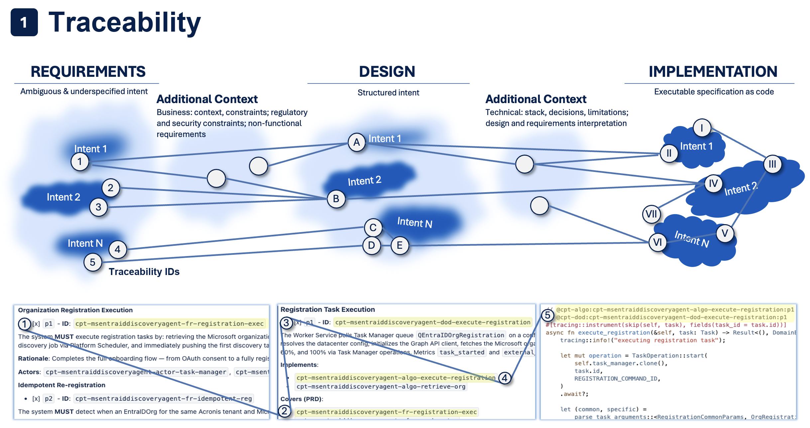

# Configuring Cyber Constructor


<!-- toc -->

- [1. Configuration surface model](#1-configuration-surface-model)
  - [ID format](#id-format)
  - [ID kinds (in `constraints.toml`)](#id-kinds-in-constraintstoml)
  - [What `cfc validate` checks](#what-cfc-validate-checks)
  - [Nested identifiers](#nested-identifiers)
  - [CDSL and instruction-level traceability](#cdsl-and-instruction-level-traceability)
  - [Traceability mode (in `artifacts.toml`)](#traceability-mode-in-artifactstoml)
  - [Code markers](#code-markers)
  - [ID search and navigation](#id-search-and-navigation)
- [4. Artifact Templates, Rules, Checklists, Constraints](#4-artifact-templates-rules-checklists-constraints)
- [5. Code Generation and Review](#5-code-generation-and-review)
- [7. Systems, Autodetect, and Codebase Registration](#7-systems-autodetect-and-codebase-registration)
  - [Autodetect patterns](#autodetect-patterns)
  - [Codebase entries](#codebase-entries)
- [Further Reading](#further-reading)

<!-- /toc -->

How to customize Cyber Constructor through its repository-backed configuration surface: kits, artifacts, rules, workflow resources, and skill instructions.

> **Convention**: 💬 = paste into AI coding tool chat. 🖥️ = run in terminal.

This guide assumes you already know the README setup and workflow model.

The canonical operating surface is:

- 🖥️ `cfc ...` in the terminal for setup, validation, kit management, and registry inspection
- 💬 `cf-constructor plan: ...`, 💬 `cf-constructor generate: ...`, and 💬 `cf-constructor analyze: ...` in your AI coding tool chat for workflow-driven work

This guide is only about the configuration those workflows use.

---
## 1. Configuration surface model

 Cyber Constructor stores editable project configuration under `config/` inside the setup directory chosen at `cfc init`. In ordinary repositories the default setup directory is `.cf-constructor/`. This repository uses `.bootstrap/` only as a self-hosted contributor special case described in **[../CONTRIBUTING.md](../CONTRIBUTING.md)**.

 At a high level:

- **`config/`** contains the main editable control files
- **other setup-directory content** may be generated or supporting material rather than day-to-day configuration
- **installed kits** add editable configuration under `config/kits/{slug}/`

| Surface | Typical location | How to treat it |
|---|---|---|
| Project configuration | `.cf-constructor/config/` | Main user-editable control surface |
| Installed kit content | `.cf-constructor/config/kits/{slug}/` | Editable local kit surface inside the project |
| Host integration files | `.windsurf/`, `.cursor/`, `.claude/`, `.github/`, `.codex/`, `.agents/` | Generated by `cfc generate-agents`; regenerate when host setup changes |
| Self-hosted bootstrap copy in this repository only | `.bootstrap/` | Contributor-only special case, not the normal project layout |

`cfc generate-agents` regenerates host integration files. `cfc update` and `cfc kit update` are update surfaces rather than primary editing surfaces, so inspect their output and diffs before accepting changes.

The built-in SDLC kit is optional, but it is a good starting point when you want a ready-made artifact, traceability, and workflow model that you can then customize or use as the basis for your own kit.

Use the README for the quickstart setup path. Use this guide when you want to inspect or change the configuration surface itself.

 ---

 ## 2. Agent Behavior — Navigation, Skills, Rules
 
 These settings control **what context and instructions Cyber Constructor loads** when the agent works on your project. Without them, the agent relies more heavily on generic defaults. With them, it consistently applies your team's domain knowledge, coding standards, and project-specific context.

**Use cases**: a fintech team needs the agent to always consider compliance docs; a platform team wants every generated service to follow their internal SDK patterns; a solo developer wants consistent naming conventions across sessions.

 ### Navigation rules (`config/AGENTS.md`)
 
 Tell the agent which files to load for which tasks. This is the most impactful setting — it determines what context the agent sees for specific domains.
 
- 💬 `cf-constructor generate: update config/AGENTS.md so authentication work always loads docs/security.md`
- 💬 `cf-constructor generate: update config/AGENTS.md so testing tasks always load docs/test-patterns.md`
- 💬 `cf-constructor generate: update config/AGENTS.md so PR review tasks always load docs/review-guidelines.md`

 ### Skill instructions (`config/SKILL.md`)
 
 Always-on instructions loaded into the agent's context on every request. Use these for project-wide invariants that apply everywhere — API envelope format, error handling strategy, logging approach.
 
- 💬 `cf-constructor generate: update config/SKILL.md so all REST endpoints return a JSON envelope with data, error, and meta`
- 💬 `cf-constructor generate: update config/SKILL.md so print() is never used for logging and the logger module is required instead`

 ### Project rules (`config/rules/`)
 
 Per-topic convention files — conventions, architecture, testing, patterns. The agent loads relevant rules based on the task. Unlike skill instructions (always loaded), rules are topic-scoped and can be more detailed without bloating every request.
 
- 💬 `cf-constructor generate: update config/rules/conventions.md so all function names use snake_case with no abbreviations`
- 💬 `cf-constructor generate: update config/rules/architecture.md so services communicate through the message bus and not through direct imports`
- 💬 `cf-constructor generate: update config/rules/testing.md so every public function requires at least one unit test`
- 💬 `cf-constructor auto-config`
- 💬 `cf-constructor generate: refine the inferred rules after auto-config for this project`

---

 ## 3. Identifiers & Traceability

 Identifiers are the backbone of Cyber Constructor's **requirements-to-code traceability**. Every requirement, component, flow, and task gets a unique `@cpt-*` ID. These IDs connect design artifacts to each other and to implementation code, enabling automated validation that nothing is forgotten.

**Why configure this**: different projects need different traceability depth. A regulated medical device needs full code-level traceability for every requirement. An internal tool might only need document-level cross-references. A prototype might want traceability turned off entirely.

**What it affects**: `cfc validate` checks ID integrity and cross-references. `cfc spec-coverage` reports which design IDs have matching code markers. The agent uses ID kinds and templates when generating artifacts.



The diagram shows the three-layer chain: **Requirements** (PRD — ambiguous intents) → **Design** (DECOMPOSITION, DESIGN, FEATURE — structured specs with `cpt-*` IDs) → **Implementation** (code with `@cpt-*` markers). Each numbered circle is a traceable ID that flows through all layers.

Configuration lives in two places:

- **`constraints.toml`** (in kit) — defines ID kinds, naming templates, cross-reference rules, code traceability
- **`artifacts.toml`** (in config) — sets traceability mode per artifact (`FULL` or `DOCS-ONLY`)

### ID format

All IDs follow: `` `cpt-{system}-{kind}-{slug}` ``

Example: `cpt-myapp-fr-user-auth`, `cpt-myapp-flow-login`, `cpt-myapp-algo-password-hash`

### ID kinds (in `constraints.toml`)

ID kinds define **what types of identifiers** exist for each artifact. For example, a FEATURE artifact might have `flow`, `algo`, `dod`, and `state` ID kinds — each with different traceability requirements.

 Each ID kind has configurable properties:

| Property | What it controls |
|---|---|
| `template` | Naming pattern, e.g. `cpt-{system}-fr-{slug}` |
| `required` | Whether at least one ID of this kind must exist |
| `to_code` | Whether `@cpt-*` code markers are required for this kind |
| `task` | Whether IDs use `[ ]`/`[x]` checkboxes for tracking |
| `priority` | Whether IDs use `p1`–`p9` priority markers |
| `headings` | Which constraint headings can contain these IDs |
| `references.TARGET.coverage` | Whether cross-references to the target artifact are mandatory |

- 💬 `cf-constructor generate: update FEATURE constraints.toml to add an api-endpoint ID kind with template cpt-{system}-api-{feature-slug}-{slug} and to_code = true`
- 💬 `cf-constructor generate: update the algo ID kind in FEATURE constraints.toml so to_code = false`
- 💬 `cf-constructor generate: update the dod ID kind in FEATURE constraints.toml so task = false and priority = false`
- 💬 `cf-constructor generate: update constraints.toml so DESIGN component IDs must reference DECOMPOSITION with coverage = true`

### What `cfc validate` checks

When you run `cfc validate`, the tool performs these checks on IDs:

- **ID format** — every ID matches `cpt-{system}-{kind}-{slug}` and the `template` for its kind
- **Cross-references** — if `coverage = true`, the target artifact must contain a reference to this ID. Missing reference = validation error
- **Task checkboxes** (`task = true`) — IDs use `[ ]` (not done) / `[x]` (done) checkboxes. Validation enforces consistency: if a reference is marked `[x]`, the definition must also be `[x]`. A reference with `[x]` pointing to a definition with `[ ]` is an error
- **Priority markers** (`priority = true`) — IDs use `` `p1` ``–`` `p9` `` markers. These are informational for ordering; validation checks they are present when required
- **Code markers** (`to_code = true`, traceability `FULL`) — validation checks that:
  - Definition has `[x]` checkbox → code `@cpt-*` marker **must** exist
  - Definition has `[ ]` checkbox → code marker **must not** exist (not implemented yet)
  - Definition has no checkbox → code marker **must** exist
  - Every `@cpt-begin` has a matching `@cpt-end`, no empty blocks, no orphan markers

### Nested identifiers

IDs form a hierarchy that mirrors your project structure. The depth depends on how many levels you define in `artifacts.toml`:

| Level | Pattern | Example |
|---|---|---|
| System | `cpt-{system}-{kind}-{slug}` | `cpt-saas-fr-user-auth` |
| Subsystem | `cpt-{system}-{subsystem}-{kind}-{slug}` | `cpt-saas-core-comp-api-gateway` |
| Component | `cpt-{system}-{subsystem}-{component}-{kind}-{slug}` | `cpt-saas-core-auth-flow-login` |

Cross-references flow **top-down**: a PRD defines requirements → DECOMPOSITION references them → DESIGN references DECOMPOSITION → FEATURE references DESIGN. Each level adds its slug to the ID prefix, creating a traceable chain from business requirements to implementation tasks.

### CDSL and instruction-level traceability

Inside FEATURE artifacts, behavioral sections (flows, algorithms, state machines) are written in **CDSL** — a plain-English specification language. Every CDSL step has its own checkbox, phase, and instruction ID:

```
1. [x] - `p1` - Validate user credentials - `inst-validate`
2. [ ] - `p2` - Generate session token - `inst-gen-token`
3. [x] - `p1` - Log audit trail - `inst-audit`
```

- **`[ ]` / `[x]`** — implementation status. `[x]` = implemented, `[ ]` = not yet
- **`p1`–`p9`** — implementation phase (which sprint/iteration)
- **`inst-{id}`** — unique instruction ID within the flow scope

These instruction IDs map directly to **code block markers**. The full code marker combines the artifact ID + phase + instruction:

```python
# @cpt-flow:cpt-myapp-feature-auth-flow-login:p1          ← scope (function level)
def login_flow(request):
    # @cpt-begin:cpt-myapp-feature-auth-flow-login:p1:inst-validate   ← step 1
    if not request.username:
        raise ValidationError("Missing credentials")
    # @cpt-end:cpt-myapp-feature-auth-flow-login:p1:inst-validate

    # @cpt-begin:cpt-myapp-feature-auth-flow-login:p1:inst-audit      ← step 3
    audit_log.record(request.username, "login_attempt")
    # @cpt-end:cpt-myapp-feature-auth-flow-login:p1:inst-audit
```

Validation connects the chain: CDSL step `[x]` on `inst-validate` → code marker `@cpt-begin:...:inst-validate` must exist. Step `[ ]` on `inst-gen-token` → code marker must **not** exist yet. This gives you per-instruction implementation tracking.

- 💬 `cf-constructor generate: create a FEATURE for user authentication` — generates a FEATURE with CDSL flows
- 💬 `cf-constructor generate: implement code from cpt-myapp-feature-auth-flow-login for phase p1` — generates code with markers for all `[x]` p1 steps

### Traceability mode (in `artifacts.toml`)

Controls whether code `@cpt-*` markers are validated for an artifact type. Change this when you want to relax or tighten validation per artifact kind — e.g., ADRs typically don't need code markers, but FEATURE specs usually do.

 - **`FULL`** — all checks above are active, including code marker validation
 - **`DOCS-ONLY`** — code markers are prohibited; only document-level ID and cross-reference checks apply
 
- 💬 `cf-constructor generate: update artifacts.toml so FEATURE artifacts use DOCS-ONLY traceability`
- 💬 `cf-constructor generate: update artifacts.toml so ADR artifacts use FULL traceability`

### Code markers

When `to_code = true`, implementation code must contain `@cpt-*` markers linking back to artifact IDs. This creates a bidirectional link: from the design document you can find the code, and from the code you can find the requirement. Useful for impact analysis ("what code implements this requirement?") and orphan detection ("is this code still needed?").

 ```python
 # @cpt-flow:cpt-myapp-feature-auth-flow-login:p1        ← scope marker
 def login_flow(request):
     # @cpt-begin:cpt-myapp-feature-auth-flow-login:p1:inst-validate  ← block start
    if not request.username:
        raise ValidationError("Missing username")
    # @cpt-end:cpt-myapp-feature-auth-flow-login:p1:inst-validate    ← block end
 ```
 
- 💬 `cf-constructor generate: implement code from cpt-myapp-feature-auth-flow-login with code traceability markers`
- 💬 `cf-constructor analyze: report which IDs are still missing code markers`

- 🖥️ `cfc validate` — validates artifact IDs, cross-references, and code markers
- 🖥️ `cfc spec-coverage` — shows which `to_code` IDs have/lack code markers

### ID search and navigation

- 🖥️ `cfc list-ids` — list all IDs across all artifacts
- 🖥️ `cfc list-ids --kind fr` — list only functional requirement IDs
- 🖥️ `cfc where-defined --id cpt-myapp-fr-user-auth` — find where an ID is defined
- 🖥️ `cfc where-used --id cpt-myapp-fr-user-auth` — find all references to an ID

- 💬 `cf-constructor analyze: find all IDs of kind flow in the auth feature`
- 💬 `cf-constructor analyze: show which artifacts reference cpt-myapp-fr-user-auth`
- 💬 `cf-constructor analyze: check cross-reference coverage for DESIGN components`

---

## 4. Artifact Templates, Rules, Checklists, Constraints
 
 These resources control **how artifacts are generated and validated**. Templates define the structure, rules define generation/validation behavior, checklists define what the agent checks during review, and constraints define the structural schema.

**Why configure this**: your team may need extra sections (e.g., compliance, migration plan), stricter validation (e.g., every ADR must list alternatives), or domain-specific review criteria (e.g., check for GDPR implications). Editing these resources ensures every artifact follows your standards — whether generated by a junior developer or a senior architect.

 **What it affects**: `cf-constructor generate: ...` uses templates when generating artifacts. `cfc validate` checks artifacts against constraints. The agent uses rules during generation and checklists during review.

Each artifact kind (ADR, PRD, DESIGN, FEATURE, etc.) has resource files. Paths are in `config/core.toml` under `[kits.sdlc.resources]`.

- 🖥️ `cfc resolve-vars --flat | grep adr` — find where ADR resources live

 ### Templates — control artifact generation structure
 
 Templates define what sections a new artifact gets. Edit these when the default structure doesn't match your process — e.g., your ADRs need a "Migration Plan", or your PRDs need a "Compliance" section.
 
- 💬 `cf-constructor generate: update the ADR template so it adds a required ## Migration Plan section after ## Consequences`
- 💬 `cf-constructor generate: update the PRD template so it adds a ## Compliance Requirements section`
- 💬 `cf-constructor generate: update the FEATURE template so it adds a ## Performance Targets section`

 ### Rules — control generation and validation behavior
 
 Rules tell the agent what to enforce when generating or validating an artifact. They are more specific than templates — e.g., "every flow must have error handling" or "components must list dependencies".
 
- 💬 `cf-constructor generate: update ADR rules so the Migration Plan section must contain at least one checklist item`
- 💬 `cf-constructor generate: update FEATURE rules so every flow must have at least one error-handling path`
- 💬 `cf-constructor generate: update DESIGN rules so components must list all dependencies explicitly`

 ### Checklists — control semantic review criteria
 
 Checklists are used by the agent during artifact review (`cf-constructor analyze`). They define what the agent should verify beyond structural constraints — business logic, completeness, consistency.
 
- 💬 `cf-constructor generate: update the DESIGN review checklist so it verifies timeout and retry configuration for external API calls`
- 💬 `cf-constructor generate: update the FEATURE review checklist so every DoD item is checked for a priority marker`
- 💬 `cf-constructor generate: update the ADR review checklist so alternatives must be evaluated with pros and cons`

 ### Structural constraints — control heading structure, ID placement
 
 Constraints define the exact heading structure that `cfc validate` enforces. They are the most strict form of validation — a missing required heading fails validation. Edit these when you add new template sections that should be mandatory.
 
 Each heading entry in `constraints.toml` needs `id`, `level`, `required`, `pattern`.
 
- 💬 `cf-constructor generate: update ADR constraints.toml so a required level-2 heading Migration Plan with id adr-migration-plan is enforced`
- 💬 `cf-constructor generate: update FEATURE constraints.toml so ## Performance Targets is optional instead of required`

- 🖥️ `cfc validate-kits` — validate constraint definitions
- 🖥️ `cfc validate` — validate artifacts against constraints

---

## 5. Code Generation and Review

These settings control **how the agent writes and reviews code**. Code rules apply when the agent generates or modifies source files. The code review checklist applies when the agent reviews code (e.g., during `cf-constructor analyze` on a source file).

**Why configure this**: prevent common mistakes before they happen. If your team has had incidents with SQL injection, add a rule forbidding string interpolation in queries. If secrets have leaked, add a review checklist item. These rules act as a persistent safety net that applies to every code change.

 ### Code generation rules
 
 Apply when the agent writes or modifies source code. Use these for security policies, style enforcement, and antipattern prevention.
 
- 💬 `cf-constructor generate: update codebase rules so database queries always use parameterized statements and never string interpolation`
- 💬 `cf-constructor generate: update codebase rules so async functions require explicit timeout handling`
- 💬 `cf-constructor generate: update codebase rules so internal modules are never imported through relative paths`

 ### Code review checklist
 
 Used when the agent reviews code. Each item becomes a check the agent performs and reports on.
 
- 💬 `cf-constructor generate: update the code review checklist so it verifies no secrets or API keys are hardcoded`
- 💬 `cf-constructor generate: update the code review checklist so all new public functions are checked for docstrings`
- 💬 `cf-constructor generate: update the code review checklist so error messages are checked for correlation IDs`

---

 ## 6. Workflow customization

 Workflow resources are **configuration inputs for the canonical `plan`, `generate`, and `analyze` workflows**. They do not replace the workflow model from the README; they customize how those workflows behave for your installed kits and project rules.

**Why configure this**: if the default workflow misses a step your team cares about (e.g., checking for migration files, asking about backward compatibility), you can add it. If a step is unnecessary for your project, you can remove it.

 **What it affects**: every `cf-constructor plan: ...`, `cf-constructor generate: ...`, and `cf-constructor analyze: ...` request uses these workflow resources when the active kit or project configuration routes to them. Changes here affect the agent's behavior globally for that workflow type.

 Paths are in `core.toml` as `kits.sdlc.resources.workflow_*`.
 
- 💬 `cf-constructor generate: update the PR review workflow so it checks whether migration files changed after fetching the diff`
- 💬 `cf-constructor generate: update the generate workflow so it always asks about backward compatibility before writing`

---

## 7. Systems, Autodetect, and Codebase Registration

The artifacts registry (`config/artifacts.toml`) tells Cyber Constructor **what your project looks like** — where artifacts live, where source code lives, and how they're organized.

**Why configure this**: Cyber Constructor can only validate and trace what it knows about. If you add a new microservice, a new artifact directory, or switch from Python to Go, you need to update the registry. Without it, `cfc validate` won't find your artifacts and `cfc spec-coverage` won't scan your code.

**Use cases**: monorepo with multiple services; project adding a new language; team splitting a service into sub-modules; migrating ADRs to a different directory structure.

It has three layers:

 ### Systems
 
 A system is a top-level grouping with a `name`, `slug`, and `kit`. The slug becomes part of every ID (`cpt-{slug}-...`). Most projects have one system; monorepos may have several.
 
- 💬 `cf-constructor generate: update artifacts.toml to add a new billing system with slug billing, kit sdlc, and artifacts rooted at billing/architecture`

### Autodetect patterns

Autodetect tells Cyber Constructor where to find artifacts and codebases automatically using glob patterns. This is the preferred way to register artifacts — when you add a new FEATURE spec file matching the pattern, Cyber Constructor picks it up without config changes.

Each artifact pattern has:

| Property | What it controls |
|---|---|
| `pattern` | Glob pattern relative to `artifacts_root`, e.g. `PRD.md`, `ADR/**/*.md`, `features/*.md` |
| `traceability` | `FULL` (code markers validated) or `DOCS-ONLY` (no code markers) |
| `required` | Whether the artifact must exist |

- 💬 `cf-constructor generate: update artifacts.toml so FEATURE autodetect uses pattern features/*.md with FULL traceability and required = false`
- 💬 `cf-constructor generate: update artifacts.toml so ADR autodetect uses pattern decisions/**/*.md`
- 💬 `cf-constructor generate: update artifacts.toml so PRD autodetect sets required = true`

 You can also register a specific artifact manually (not via autodetect):
 
- 💬 `cf-constructor generate: update artifacts.toml to register Execution Plans at architecture/features/execution-plans.md as FEATURE with DOCS-ONLY traceability`

### Codebase entries

Each codebase entry tells Cyber Constructor where source code lives and how to parse comments for `@cpt-*` markers. Without a codebase entry, `cfc spec-coverage` and `cfc validate` can't find your code markers.

| Property | What it controls |
|---|---|
| `name` | Display name, e.g. "Backend" |
| `path` | Directory path relative to system root |
| `extensions` | File extensions to scan, e.g. `[".py"]`, `[".ts", ".tsx"]` |
| `singleLineComments` | Comment prefixes, e.g. `["#"]`, `["//"]` |
| `multiLineComments` | Multi-line comment delimiters, e.g. `[{start = '"""', end = '"""'}]` |

- 💬 `cf-constructor generate: update artifacts.toml to add a Frontend codebase at web/src using TypeScript extensions and // comments`
- 💬 `cf-constructor generate: update artifacts.toml to add a Mobile codebase at mobile/lib using Dart extensions and // comments`
- 💬 `cf-constructor generate: update artifacts.toml so the Backend codebase includes Python triple-quote multiline comments`

 ### Ignore patterns
 
 Exclude files from validation. Use this for test fixtures with synthetic `@cpt-*` markers, generated files, or legacy code you don't want validated yet.
 
- 💬 `cf-constructor generate: update artifacts.toml to ignore tests/test_fixtures/** with reason synthetic test data`

- 🖥️ `cfc validate` — validate registry and all artifacts

---

 ## 8. Kit Management
 
 Kits are direct file packages that provide templates, rules, checklists, constraints, workflows, scripts, and skill surfaces under `config/kits/{slug}/`. When a kit is updated upstream, `cpt kit update` shows a file-level diff so you can accept or decline each change.

 **Why configure this**: keep your artifact standards up to date with the latest kit version; install a custom kit for your organization; start from the SDLC kit and customize it into your own delivery model.

🖥️ **Terminal only**:
```bash
cfc kit install /path/to/my-kit    # install a kit
cfc kit update                      # update kit files (interactive diff)
cfc update                          # update Cyber Constructor core + all kits
```

---

 ## Quick Reference — Terminal
 
 | What you want | Command |
 |---|---|
| Install a kit | `cfc kit install <path>` |
| Update kit files | `cfc kit update` |
| Update core + kits | `cfc update` |
| Validate artifacts + code | `cfc validate` |
| Validate kit config | `cfc validate-kits` |
| ID coverage in code | `cfc spec-coverage` |
| List all IDs | `cfc list-ids` |
| List IDs by kind | `cfc list-ids --kind <kind>` |
| Find ID definition | `cfc where-defined --id <id>` |
| Find ID references | `cfc where-used --id <id>` |
| See current config | `cfc info` |
| Resolve resource paths | `cfc resolve-vars --flat` |
| Generate agent files | `cfc generate-agents --agent windsurf` |

 ## Quick Reference — Prompts
 
 | Category | Prompt |
 |---|---|
| **Agent behavior** | |
| Auto-config project rules | `cf-constructor auto-config` |
| Navigation rule | `cf-constructor generate: update config/AGENTS.md so <task type> always loads <file>` |
| Skill instruction | `cf-constructor generate: update config/SKILL.md so <instruction> always applies` |
| Topic rule | `cf-constructor generate: update config/rules/<topic>.md so <rule> applies` |
| **Identifiers and traceability** | |
| Add ID kind | `cf-constructor generate: update <KIND> constraints.toml to add a new ID kind "<kind>" with template "cpt-{system}-<kind>-{slug}"` |
| Change to_code | `cf-constructor generate: update <KIND> constraints.toml so "<kind>" uses to_code = <true/false>` |
| Add cross-ref rule | `cf-constructor generate: update constraints.toml so <KIND> <kind> IDs must reference <TARGET> with coverage = true` |
| Change traceability | `cf-constructor generate: update artifacts.toml so <KIND> artifacts use <FULL/DOCS-ONLY> traceability` |
| Find missing markers | `cf-constructor analyze: report which IDs are missing code markers` |
| **Artifact resources** | |
| Edit template | `cf-constructor generate: update the <KIND> template so it adds <heading or section>` |
| Edit rules | `cf-constructor generate: update <KIND> rules so <rule> is enforced` |
| Edit checklist | `cf-constructor generate: update the <KIND> review checklist so it verifies <criteria>` |
| Edit constraints | `cf-constructor generate: update <KIND> constraints.toml so <heading or requirement> is enforced` |
| **Code resources** | |
| Code rule | `cf-constructor generate: update codebase rules so <rule> is enforced` |
| Code checklist | `cf-constructor generate: update the code review checklist so it verifies <criteria>` |
| **Registry** | |
| Add system | `cf-constructor generate: update artifacts.toml to add a new system "<name>" with slug "<slug>" and kit "<kit>"` |
| Add autodetect | `cf-constructor generate: update artifacts.toml so <KIND> autodetect uses pattern "<glob>" with traceability <FULL/DOCS-ONLY>` |
| Add manual artifact | `cf-constructor generate: update artifacts.toml to register "<name>" at <path> as kind <KIND>` |
| Add codebase | `cf-constructor generate: update artifacts.toml to add a codebase at <path> with the right extensions and comment syntax` |
| Add ignore pattern | `cf-constructor generate: update artifacts.toml to ignore <glob> with reason "<reason>"` |
| **Workflow resources** | |
| Update workflow resource | `cf-constructor generate: update the <workflow> workflow resource so it enforces <behavior>` |

---

## Further Reading

| Topic | Spec / Schema |
|---|---|
| core.toml format | `schemas/core-config.schema.json` |
| artifacts.toml format | `schemas/artifacts.schema.json`, `architecture/specs/artifacts-registry.md` |
| Kit system | `architecture/specs/kit/kit.md` |
| Templates | `architecture/specs/kit/template.md` |
| Rules | `architecture/specs/kit/rules.md` |
| Checklists | `architecture/specs/kit/checklist.md` |
| Constraints & IDs | `architecture/specs/kit/constraints.md`, `schemas/kit-constraints.schema.json` |
| Traceability & markers | `architecture/specs/traceability.md` |
| CDSL language | `architecture/specs/CDSL.md` |
| CLI commands | `architecture/specs/cli.md` |
| System prompts | `architecture/specs/sysprompts.md` |
| Workspace config | `schemas/workspace.schema.json` |
