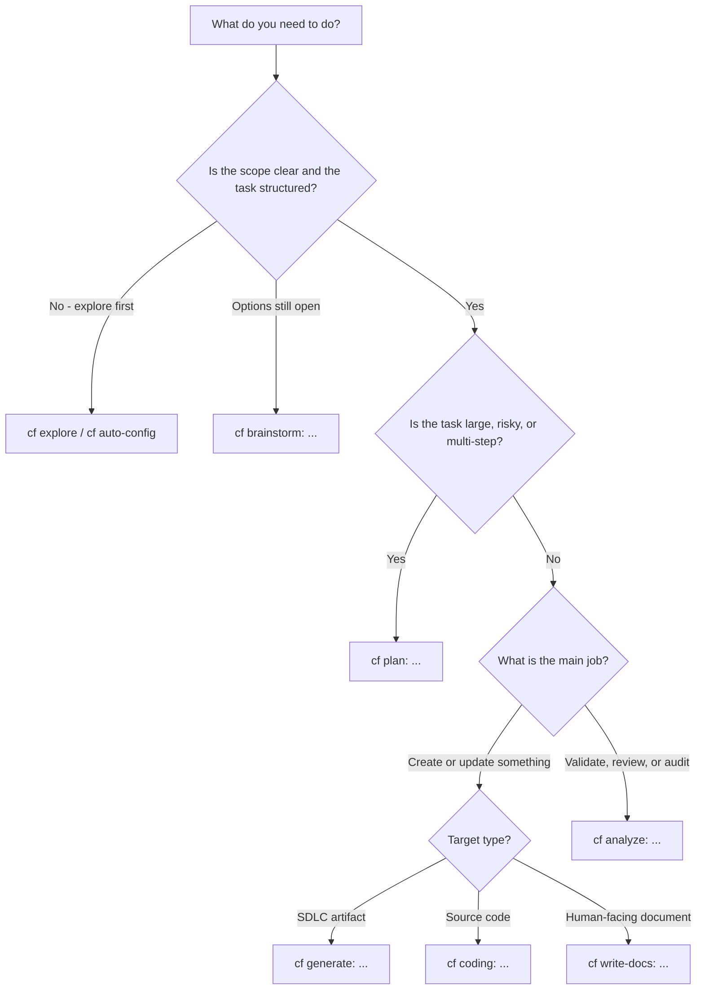

# Constructor Studio Usage Guide


<!-- toc -->

- [1. What this guide is for](#1-what-this-guide-is-for)
- [2. Installation and setup reference](#2-installation-and-setup-reference)
  - [One easy operating rule](#one-easy-operating-rule)
  - [Prerequisites](#prerequisites)
  - [If the repository already includes Constructor Studio](#if-the-repository-already-includes-constructor-studio)
  - [Install the CLI](#install-the-cli)
  - [Initialize the repository](#initialize-the-repository)
  - [Turn Constructor Studio on in chat](#turn-constructor-studio-on-in-chat)
  - [Common install/setup failures](#common-installsetup-failures)
  - [Pick the right first move](#pick-the-right-first-move)
  - [What success looks like after the first few minutes](#what-success-looks-like-after-the-first-few-minutes)
- [3. The shortest mental model](#3-the-shortest-mental-model)
- [4. When Constructor Studio is a good fit](#4-when-constructor-studio-is-a-good-fit)
- [5. When Constructor Studio is not the best first move](#5-when-constructor-studio-is-not-the-best-first-move)
- [6. Choosing the right workflow](#6-choosing-the-right-workflow)
  - [Use `plan` when](#use-plan-when)
  - [What counts as a large task](#what-counts-as-a-large-task)
  - [Quick check: should you use `plan` first?](#quick-check-should-you-use-plan-first)
  - [Best chat form](#best-chat-form)
  - [Use `help` when](#use-help-when)
  - [Use `explore` when](#use-explore-when)
  - [Use `auto-config` when](#use-auto-config-when)
  - [Use `generate` when](#use-generate-when)
  - [Use `analyze` when](#use-analyze-when)
  - [What `analyze` is for in practice](#what-analyze-is-for-in-practice)
  - [Use `brainstorm` when](#use-brainstorm-when)
  - [Use `brave-new-world` when](#use-brave-new-world-when)
  - [Use `write-skills` when](#use-write-skills-when)
  - [Use `coding` when](#use-coding-when)
  - [Use `write-docs` when](#use-write-docs-when)
  - [Default routing rule](#default-routing-rule)
  - [When to expect or ask for subagent delegation](#when-to-expect-or-ask-for-subagent-delegation)
  - [Recommended execution loop for artifacts and code](#recommended-execution-loop-for-artifacts-and-code)
- [7. Practical usage habits](#7-practical-usage-habits)
  - [CI with `cfs` tools](#ci-with-cfs-tools)
- [8. Common mistakes and anti-patterns](#8-common-mistakes-and-anti-patterns)
- [9. Situation-by-situation guidance](#9-situation-by-situation-guidance)
  - [Situation: new project setup](#situation-new-project-setup)
  - [Situation: existing repo with no conventions captured](#situation-existing-repo-with-no-conventions-captured)
  - [Situation: create or update a document](#situation-create-or-update-a-document)
  - [Situation: large implementation request](#situation-large-implementation-request)
  - [Situation: implementing code from an approved artifact](#situation-implementing-code-from-an-approved-artifact)
  - [Situation: code review or design review](#situation-code-review-or-design-review)
  - [Situation: small low-risk fix](#situation-small-low-risk-fix)
  - [Situation: code-centric implementation or refactoring](#situation-code-centric-implementation-or-refactoring)
  - [Situation: writing or revising a human-facing document](#situation-writing-or-revising-a-human-facing-document)
  - [Context hygiene](#context-hygiene)
- [10. Prompt patterns that usually work well](#10-prompt-patterns-that-usually-work-well)
  - [Structured generation](#structured-generation)
  - [Orientation and discovery](#orientation-and-discovery)
  - [Structured analysis](#structured-analysis)
  - [Planning](#planning)
  - [Context-bounded execution](#context-bounded-execution)
  - [Brownfield understanding](#brownfield-understanding)
  - [Storytelling / explain mode](#storytelling--explain-mode)
  - [Marker recovery](#marker-recovery)
- [11. Prompt patterns that usually go wrong](#11-prompt-patterns-that-usually-go-wrong)
- [12. Using Constructor Studio across multiple repositories](#12-using-constructor-studio-across-multiple-repositories)
  - [Good pattern](#good-pattern)
  - [Bad pattern](#bad-pattern)
  - [Typical commands](#typical-commands)
  - [Shared kits from Git remotes](#shared-kits-from-git-remotes)
- [13. Brownfield projects](#13-brownfield-projects)
  - [Good approach](#good-approach)
  - [Bad approach](#bad-approach)
  - [Good sequence](#good-sequence)
- [14. Delegation and autonomous execution](#14-delegation-and-autonomous-execution)
  - [When delegation is a good fit](#when-delegation-is-a-good-fit)
  - [How to reduce delegation risk](#how-to-reduce-delegation-risk)
  - [Running a delegation preflight](#running-a-delegation-preflight)
  - [`cfs delegate` CLI options](#cfs-delegate-cli-options)
  - [Managing large inputs (`cfs chunk-input`)](#managing-large-inputs-cfs-chunk-input)
- [15. Quick decision checklist](#15-quick-decision-checklist)
- [16. Mirror overrides](#16-mirror-overrides)
- [17. Dependency map (`cfs map` / `cf map`)](#17-dependency-map-cfs-map--cf-map)
  - [Why use it](#why-use-it)
  - [When to use it](#when-to-use-it)
  - [Typical commands](#typical-commands-1)
  - [Chat workflow](#chat-workflow)
- [Further reading](#further-reading)

<!-- /toc -->

How to use **Constructor Studio** well in common real-world situations: when to use it, when to skip it, and how to choose the right workflow without unnecessary overhead.

> **Convention**: 💬 = paste into AI coding tool chat. 🖥 = run in terminal.

---

## 1. What this guide is for

This guide is for the practical questions that come up after onboarding:

- **What should I do in this situation?**
- **What should I avoid?**
- **When should I use `help`, `explore`, `auto-config`, `plan`, `generate`, or `analyze`?**
- **When is Constructor Studio useful, and when is it just overhead?**
- **How do I get the benefits without using the product badly?**

Use this guide when you already know what Constructor Studio is and now need help choosing the right workflow in common real-world situations.

The focus is not abstract theory.

The focus is operational behavior: how to use Constructor Studio well in real projects.

## 2. Installation and setup reference

> **Canonical source**: The core install sequence (`pipx install`, `cfs init`, `cfs generate-agents`, activation) is maintained in **[README §Installation and setup reference](../README.md#installation-and-setup-reference)**. This section is the detailed operating path and adds platform-specific troubleshooting, failure modes, and first-move guidance not covered in the README overview.

If you need the exact setup path, complete this once before the rest of the guide.

For the short version, use the setup section in **[README](../README.md)** first. This section is the detailed operating path.

### One easy operating rule

- use `cfs` in your terminal for setup, validation, updates, and workspace commands
- use `cf ...` in your AI coding tool chat for `help`, `explore`, `auto-config`, `plan`, `generate`, `analyze`, and specialized routes such as `brainstorm` and `map`
- do **not** run `cf ...` in the terminal
- use the portable `cf <workflow>: ...` form as your default when a workflow takes a request payload; some chat routes are command-like prompts such as `cf help` and `cf auto-config`
- use `cf brave-new-world` only when you want Studio to auto-select safe, reversible workflow choices during the current session

### Prerequisites

- Python 3.11+
- Git
- one supported AI coding tool
- `pipx` — only needed if you are bootstrapping the repository yourself (see the CLI install path below)
- `gh` if you want PR review or PR status workflows

### If the repository already includes Constructor Studio

If the repository already has a Constructor Studio setup directory and generated AI coding tool integration files, you usually do **not** need to install `cfs` globally just to try the project.

In that case:

- ensure Python 3.11+ is available for the repository-local scripts and CI
- open the repository in your supported AI coding tool
- activate Constructor Studio in chat with 💬 `cf`
- start with one focused request such as 💬 `cf help`, 💬 `cf explore: ...`, 💬 `cf analyze: ...`, or 💬 `cf plan: ...`

Use the CLI install path below when you need to bootstrap the repository yourself, run terminal commands directly, or manage setup across multiple repositories.

### Install the CLI

🖥 **Terminal**:
```bash
pipx install git+https://github.com/constructorfabric/studio.git
cfs --version
```

A PyPI release (`pipx install constructor-studio`) is planned; track progress in the [issues list](https://github.com/constructorfabric/studio/issues).

If `cfs --version` prints a version, the CLI install worked. The command also reports the local Studio cache and the project-pinned Studio copy when those are available.

If `cfs` is not found, open a new terminal and try again before doing anything else.

**Only if needed on macOS**

Install `pipx` with **Homebrew**:

🖥 **Terminal**:
```bash
brew install pipx
pipx ensurepath
```

Then open a new terminal, or reload the shell config that `pipx ensurepath` updated.

For the default macOS `zsh` setup, that often means:

🖥 **Terminal**:
```bash
source ~/.zshrc
```

**Only if needed on Windows**

Install `pipx` with **Scoop**:

🖥 **Terminal**:
```bash
scoop install pipx
pipx ensurepath
```

Then open a new terminal so the updated `PATH` is picked up.

### Initialize the repository

From your repository root, run:

🖥 **Terminal**:
```bash
cfs init
cfs generate-agents
```

`cfs init` is interactive.

For a first trial, it is usually safe to accept the default project root, keep the default setup directory `.cf-studio/` unless you want a custom one, keep generated runtime and agent files ignored, and accept the default SDLC kit if prompted.

`cfs init` sets up Constructor Studio in the repository. If you run it again in a repository that is already initialized, it repairs generated Studio runtime files and agent integrations using the version already pinned in that project.

`cfs generate-agents` adds the AI coding tool integration files for that repository.

`cfs generate-agents` may preview the files it will create and ask you to confirm before writing them.

In a normal project, this creates a setup directory `.cf-studio/`, generated host integration files, and user-editable configuration under `config/` inside that setup directory.

Generated runtime files such as `.cf-studio/.core/` and `.cf-studio/.gen/` are gitignored by default. Generated host integration files are also gitignored by default. Kit files are tracked, ignored, or registered per kit: tracked kits are editable repository content, ignored kits are generated local content that Studio may repair or overwrite, and registered local kits stay in place with bindings recorded in `core.toml`.

Studio also writes `.cf-studio/version.toml` and `.cf-studio/whatsnew.toml`. `version.toml` records the pinned Studio engine request used by later repair runs. `whatsnew.toml` records core What's New entries already shown by `cfs update`.

You may also see host-specific folders such as `.windsurf/`, `.cursor/`, `.claude/`, `.github/`, `.codex/`, or `.agents/`.

For a first trial, you do not need to open or edit those generated files manually.

If your AI coding tool is already open on the repository, reload or reopen the repository after this step so the generated integration files are picked up.

### Turn Constructor Studio on in chat

In the AI coding tool chat attached to the same repository or workspace you just initialized, run:

💬 **AI coding tool chat**:
```text
cf
```

If setup worked, you should see Constructor Studio load and offer a workflow routing menu. If the chat behaves like a normal assistant and does not load the `cf` skill, reopen the repository in the AI coding tool and try again.

Some hosts may also show the resolved Constructor Studio path or loaded context.

### Common install/setup failures

- **`pipx: command not found`**
  - Install `pipx`, then update `PATH`.
  - macOS: `brew install pipx && pipx ensurepath`
  - Windows: `scoop install pipx && pipx ensurepath`

- **`cfs: command not found` after install**
  - Open a new terminal first.
  - On macOS `zsh`, run `source ~/.zshrc`.

- **Setup ran in the wrong directory**
  - Run `cfs init` from the repository root.

- **You are not sure what to choose during `cfs init`**
  - For a first trial, the default project root, default setup directory, ignored generated runtime/agent files, and default SDLC kit are usually fine.

- **`cfs generate-agents` looked like it stalled**
  - It may be previewing generated files or waiting for confirmation before writing them.

- **Generated files exist, but the AI coding tool still does not pick them up**
  - Reload or reopen the repository in the AI coding tool.

- **`cf` behaves like a normal assistant reply**
  - Make sure you opened the same repository you initialized.
  - Make sure `cfs generate-agents` already ran.
  - Then retry `cf`.

- **You expected slash commands, but only `cf ...` works**
  - That is normal. `cf <workflow>: ...` is the portable default. Slash commands are host-specific aliases.

- **Workspace-aware validation feels noisy on a first trial**
  - Start with `cfs validate --local-only`.

### Pick the right first move

- **New to Constructor Studio in this repo**: start with `cf help`
- **First 5-minute trial**: start with `cf analyze: ...` or `cf plan: ...`, not `generate`
- **Need context before editing**: start with `cf explore: ...`
- **New project or already-structured work**: start with `cf generate: ...` or `cf plan: ...`
- **Existing codebase with weak or missing conventions**: run 💬 `cf auto-config`, inspect what it inferred, and then refine the generated rules before large changes
- **After changing workflows or host integrations**: rerun `cfs generate-agents` or `cfs generate-agents --agent <tool>`
- **When you want to inspect upstream kit changes**: run `cfs kit check-updates`
- **When you want upstream kit changes**: run `cfs kit update`, or explicitly opt in during a top-level update with `cfs update --with-kits yes`
- **When you want a local kit**: use `cfs kit install --path <path> --install-mode copy` to copy it into the setup directory, or `--install-mode register` to keep it in place under the project root
- **When you want a kit from a non-GitHub Git remote**: use `cfs kit install git/<url>[//<subdir>][@<kit>] --version <ref>`

For the first trial, use one small real input only: one short requirement, one design note, or one focused change request. Do not start with a repo-wide review or a broad implementation request.

Good first requests:

- 💬 `cf analyze: review this requirement and list the top 5 unclear or missing points before implementation`
- 💬 `cf plan: break this change request into 3-7 safe reviewable phases with the main risk in each phase`

### What success looks like after the first few minutes

- **Activation is confirmed** in the repository attached to the AI coding tool chat
- **One useful result appears** such as a bounded plan, a short list of blocking questions, or a validation surface you can act on immediately
- **The next step is clearer** than it was before activation

For host-specific setup details and troubleshooting, use **[AGENT-TOOLS.md](AGENT-TOOLS.md)**.

---

## 3. The shortest mental model

Constructor Studio is most useful when a task needs more than raw prompting.

Use your AI coding tool and agent for:

- **reasoning**
- **writing**
- **transformation**
- **implementation judgment**

Use Constructor Studio for:

- **choosing the right workflow**
- **loading the right context**
- **applying rules and templates**
- **running deterministic validation**
- **keeping requirements, design, and code linked through stable identifiers**
- **breaking large tasks into phases**

If the task is tiny or exploratory, direct prompting may be enough.

If the task needs structure, validation, or safe multi-step execution, Constructor Studio is usually the better fit.


---

## 4. When Constructor Studio is a good fit

Constructor Studio is a strong fit when one or more of these are true:

- **You are transforming one structured artifact into another**
  
  Example: `PRD -> DESIGN -> DECOMPOSITION -> FEATURE`.

- **You need deterministic validation**
  
  Example: structure, IDs, references, consistency, or checklist-driven review.

- **The task is large enough to overflow one conversation**
  
  Example: migrations, refactors, multi-file changes, or big feature delivery.

- **You need traceability between docs and code**
  
  Example: regulated environments, auditability, or spec-driven development.

- **You want one repeatable workflow across multiple AI coding tools**
  
  Example: the team uses Claude Code, Cursor, Windsurf, GitHub Copilot, or more than one AI coding tool.

- **You need cross-repo coordination**
  
  Example: docs in one repo, code in another, shared kits in a third.

- **You want checklist-based review to be repeatable**
  
  Example: design review, PR review, or status reporting that should follow the same structure across runs.

- **You need a repeatable way to handle multi-step work safely**
  
  Example: multiple engineers or AI coding tools should follow the same planning, validation, and review discipline.


---

## 5. When Constructor Studio is not the best first move

Constructor Studio is often not the best first move when:

- **The task is tiny**
  
  Example: a one-file typo fix or a very small local change.

- **You want maximum free-form exploration with no structured output**
  
  Example: purely visual direction-finding, throwaway speculation, or loose ideation where a structured panel output is not the goal. For option mapping and structured ideation, `cf brainstorm` is the right route — see [When Constructor Studio is a good fit](#4-when-constructor-studio-is-a-good-fit).

- **You want maximum first-draft speed with minimum ceremony**
  
  Example: throwaway prototypes, loose ideation, or disposable spikes.

- **You do not yet have enough structure to anchor the work**
  
  Example: no source docs, no clear scope, no acceptance criteria.

- **You do not need validation, traceability, rules, or planning**
  
  Example: a small repo with lightweight expectations and low risk.

- **Your token budget is very tight**
  
  Example: the task is small enough that loading workflow context, rules, and validation logic costs more than it helps.

That is not a bug.

It is the tradeoff of using a more structured system.

For these cases, lighter approaches or direct prompting can be a better starting point.


---

## 6. Choosing the right workflow

`plan`, `generate`, and `analyze` are the three core workflows. Specialized routes (`explore`, `brainstorm`, `coding`, `write-docs`, and others) build on or precede them.



If you only need a quick route for the less-obvious cases (plan, generate, and analyze are covered in depth below):

- need product or workflow orientation first -> use `cf help`
- need project or artifact discovery first -> use `cf explore: ...`
- need inferred repo rules or setup help for brownfield work -> use `cf auto-config`
- need open-ended option mapping first -> use [`brainstorm`](#use-brainstorm-when)
- want safe low-risk workflow prompts auto-selected this session -> use [`brave-new-world`](#use-brave-new-world-when)
- need prompt / workflow / agent contract work -> use [`write-skills`](#use-write-skills-when)
- need a rendered graph of docs, links, and code references -> use [`cfs map` / `cf map`](#17-dependency-map-cfs-map--cf-map)

### Use `plan` when

- the task is large
- the task is risky
- the task touches many files or systems
- the context will likely overflow one conversation
- you need inspectable phases and recovery points

### What counts as a large task

A task is usually large enough for `plan` if one or more of these are true:

- it will likely take **multiple implementation steps** rather than one clean edit
- it touches **multiple files, modules, services, or artifacts**
- it depends on **ordering**, such as migration first, refactor second, rollout third
- it has meaningful **risk of drift**, breakage, or hidden dependency mistakes
- it will require **multiple validate-review-fix cycles**
- you cannot describe the safe implementation in one short bounded prompt without dropping important constraints
- you already expect follow-up requests such as “now do the next part”, “now validate”, or “now review what changed”

In practice, “large” does not only mean many lines of code.

It also means **too much coordination, risk, or context to trust to one generation step**.

### Quick check: should you use `plan` first?

Ask yourself:

- do I need more than one meaningful step to do this safely?
- do I need checkpoints or recovery points?
- will the agent need to remember many constraints at once?
- will I probably review intermediate results before continuing?
- would a bad first pass be expensive to unwind?

If the answer is **yes** to two or more of these, `plan` is usually the safer default.

If you are unsure, prefer `plan`.

Why this matters:

- planning keeps context smaller
- planning makes instructions more stable
- planning makes progress inspectable
- planning turns long work into an operational sequence instead of one overloaded request

### Best chat form

Use the portable workflow form by default:

- 💬 `cf help`
- 💬 `cf explore: ...`
- 💬 `cf auto-config`
- 💬 `cf plan: ...`
- 💬 `cf generate: ...`
- 💬 `cf analyze: ...`
- 💬 `cf brainstorm: ...`
- 💬 `cf map: ...`
- 💬 `cf coding: ...`
- 💬 `cf write-docs: ...`

Advanced maintainer routes exist for prompt, skill, and workflow authors:

- 💬 `cf write-skills: ...`
- 💬 `cf debug-prompts`

Some hosts also expose slash-command aliases such as `/cf-plan`, `/cf-generate`, or `/cf-analyze`.

Treat those as host-specific aliases, not separate capabilities.

**Good prompt shape**:

- 💬 `cf plan: break this auth migration into safe implementation phases`

### Use `help` when

Use `help` when you need **guided orientation to Constructor Studio itself** before choosing a workflow or command.

- 💬 `cf help`

Use it when:

- you are new to Constructor Studio in this repo
- you do not yet know whether the job should start with `explore`, `plan`, `generate`, or `analyze`
- you want a guided walkthrough of the current product surface instead of a one-shot command list

### Use `explore` when

Use `explore` for **project and artifact discovery before editing**. It is the right first move when the main problem is "find the relevant context" rather than "write the change now".

- 💬 `cf explore: trace where auth configuration is defined and loaded`
- 💬 `cf explore: find the files that define billing validation rules`
- 💬 `cf explore: gather the main artifacts and code paths for the deployment story`

Use `explore` before `plan`, `generate`, or `analyze` when the codebase is unfamiliar or the relevant surfaces are not yet clear.

### Use `auto-config` when

Use `auto-config` when you need Constructor Studio to **scan a project and infer or refresh rules/config** for a brownfield repository.

- 💬 `cf auto-config`
- 💬 `cf generate: refine the inferred rules after auto-config for this project`

Use it when:

- the repo has weak or missing conventions captured in Constructor Studio
- you want a fast first pass over current project structure, patterns, and likely rules
- you are setting up a brownfield repo before larger `plan` or `generate` work

Do not treat auto-config output as final truth. Inspect and refine what it inferred before relying on it for large changes.

### Use `generate` when

- you want to create or update an artifact
- you want to implement already-structured work
- the target and source materials are known
- the main job is producing or updating something, not diagnosing uncertainty

**Good prompt shape**:

When a prompt below references `PRD`, `DESIGN`, `DECOMPOSITION`, or `FEATURE`, it assumes the built-in SDLC kit is installed.

- 💬 `cf generate: implement the approved FEATURE for login rate limiting` *(requires SDLC kit)*

### Use `analyze` when

- you want to validate something
- you want a review or audit
- you want to compare two artifacts
- you want to inspect gaps, drift, or consistency
- you need to understand what is wrong, unclear, or missing before you change anything

**Good prompt shape**:

- 💬 `cf analyze: validate architecture/DESIGN.md against the current FEATURE docs` *(requires SDLC kit)*

### What `analyze` is for in practice

`analyze` is the review and inspection workflow.

In day-to-day use, reach for it when you need one of five things:

- **validation** of structure, references, or traceability
- **review** of prompts, instructions, or code
- **comparison** between documents, artifacts, or versions
- **drift / gap detection** across related sources
- **brownfield understanding** before you plan or generate changes in an unfamiliar codebase

If the main job is understanding what is wrong, inconsistent, missing, or risky, `analyze` is usually the right starting point.

How to choose between them:

- **Need deterministic checks?** Start with validation.
- **Need quality feedback on prompts or code?** Ask for review.
- **Need defect hunting?** Ask explicitly for bug finding.
- **Need cross-document alignment?** Ask for consistency, contradiction, gap, or drift analysis.
- **Need to understand an unfamiliar codebase first?** Start with reverse engineering or brownfield analysis before generation.
- **Need a large review?** Use `plan` first, then execute the analysis in bounded phases.

### Use `brainstorm` when

Use `brainstorm` for **open-ended exploration before scope is decided** — early-stage ideation, option mapping, structured panel critique, or "what should this look like" conversations that are too unformed for `plan` or `generate`.

Unlike chat brainstorming, the Constructor Studio brainstorm workflow runs a **facilitator + multi-expert panel** with scoped numbered options, so the output is structured enough that downstream `cf generate` / `cf plan` can consume it.

- 💬 `cf brainstorm: explore options for splitting the billing service from the monolith`
- 💬 `cf brainstorm: panel critique of our proposed retention policy`
- 💬 `cf brainstorm: map alternatives for caching layer placement`

Use `brainstorm` **before** `plan` when scope itself is the open question. Skip it when the change is already well-understood.

### Use `brave-new-world` when

Use `brave-new-world` when you want Constructor Studio to move through safe workflow choices without asking every time.

- 💬 `cf brave-new-world`
- 💬 `turn off Brave New World`

The overlay can pick non-destructive, reversible options such as continuing routing, loading a safe workflow, accepting a default discovery scope, choosing a review scope, or retrying validation.

It cannot approve destructive or irreversible work. It also cannot approve installs, updates, permission escalation, secret handling, deployment, publication, git staging, commits, pushes, or choices that need fresh human judgment.

Use it for faster flow in trusted sessions. Leave it off when you want every workflow menu shown explicitly.

### Use `write-skills` when

Use `write-skills` for authoring, transforming, or reviewing **prompt / workflow / skill / agent instruction files** as compact, explicit contracts.

The internal format is PDSL (Prompt DSL): structured `UNIT`, `DO`, `MENU`, `STATE`, and `STOP_TURN` blocks instead of free-form prose.

Use `write-skills` when:
- you need to write a new prompt / workflow / skill / agent instruction file from scratch as a precise contract
- you have prose-style instructions and want them converted to compact PDSL (preserving behavior)
- you want to review existing prompt files for state-machine correctness, missing `STOP_TURN`, hidden prose rules, or handoff bugs

- 💬 `cf write-skills: review .claude/agents/my-agent.md for state-machine correctness`
- 💬 `cf write-skills: transform this prose workflow into PDSL`
- 💬 `cf write-skills: author a new agent instruction file for code review`

Use `debug-prompts` when you need to inspect execution live instead of editing the prompt file:

- 💬 `cf debug-prompts`
- 💬 `cf debug-prompts: step through cf-write-docs and pause before each instruction`

This is an authoring/operating tool for the people who write Constructor Studio prompts and agents themselves; most end users will never need it.

### Use `coding` when

Use `coding` for **authoring, implementing, refactoring, fixing, or reviewing source code** with code-quality and bug-finding checks built in.

- 💬 `cf coding: refactor the auth module and check for correctness issues`
- 💬 `cf coding: review the changes in src/billing/ for logic bugs`

Use `coding` instead of `generate` when the work is code-centric and you want code-quality checks as part of the same flow, not as a separate `analyze` step.

### Use `write-docs` when

Use `write-docs` for **writing, revising, or reviewing documentation** — guides, reports, READMEs, or other project documents.

- 💬 `cf write-docs: write a usage guide for the billing API`
- 💬 `cf write-docs: review README.md for quality and correctness`

Use `write-docs` instead of `generate` when the target is a human-facing document and you want documentation-quality checks, consistency review, and deterministic gate checks as part of the same flow.

### Default routing rule

If a request is both **large** and **generative**, prefer:

- **plan first**
- **generate second**
- **analyze throughout**

A large request should usually become a plan first instead of being forced through one overloaded `generate` call.

### When to expect or ask for subagent delegation

Expect or ask for subagent delegation when the work has different jobs that should stay separated: context collection, planning, authorship, review, validation, or structured brainstorming.

Common examples:

- a brownfield change where one pass should map the area before another pass edits it
- a larger implementation where planning and authorship should not share one overloaded context
- review-sensitive work where analysis should be separated from the original generation pass
- validation-heavy work where deterministic checks should be run and interpreted as a distinct step

If the host supports subagents well, Constructor Studio may split those roles across specialized helpers such as explorer, planner, author, reviewer, validator, or a brainstorm panel. If the host does not, ask for the same separation manually through separate chats or explicit phased passes. In both cases, delegation improves task fit and discipline; it does not replace human approval or prove correctness.

### Recommended execution loop for artifacts and code

For most non-trivial work on artifacts or code, the safest default loop is:

- **plan or generate**
- **validate**
- **review**
- **fix errors and gaps**
- **validate again**
- **repeat until no remaining known issues are outstanding**

This applies both to:

- **artifact work** such as `PRD -> DESIGN -> DECOMPOSITION -> FEATURE`
- **code work** such as implementing a FEATURE, refactoring a module, or aligning code with a DESIGN

This loop improves quality, but it does **not** guarantee correctness.

A final **human review is still required** before treating the result as done.


---

## 7. Practical usage habits

1. **Start from a clear target**
   - Name the artifact, code area, workflow, or outcome.

2. **Prefer structured inputs over vague intent**
   - Give the agent source docs, constraints, and boundaries.

3. **Use `plan` before context gets out of control**
   - Do not wait until the conversation is already overloaded.

4. **Validate early and keep validation in the loop**
   - Generate or implement, validate, review, fix, and validate again before drift accumulates.

5. **Use Constructor Studio for structure; use the agent for judgment**
   - Let Constructor Studio enforce structure, validation, routing, and templates. Use the agent for interpretation, tradeoffs, and writing.

6. **Be explicit about what must not change**
   - Say what is in scope and what is out of scope.

7. **Use the smallest workflow that still preserves control**
   - Do not over-apply heavyweight flows to trivial tasks.

8. **Make review repeatable, then make a final human call**
   - Use repeatable checks to improve consistency, but keep final engineering judgment with a human reviewer.

9. **Use a fresh chat for new generation or review work**
   - For substantial `generate` or `analyze` tasks, prefer a new chat. If you stay in the same session, clear context before the next task.

10. **Use autonomous defaults only for low-risk workflow friction**
   - `cf brave-new-world` is for reversible workflow choices, not for approving edits, installs, git changes, or external actions.

### CI with `cfs` tools

Use the relevant deterministic `cfs` checks locally before opening a PR, and keep the same checks in CI so review is not the first place they run.

For specialized work such as template/example synchronization or kit changes, include the matching focused checks as well.

Use narrower checks while iterating and broader checks before merge. Let humans review meaning and tradeoffs, while CI enforces the deterministic rules every time.


---

## 8. Common mistakes and anti-patterns

1. **Using Constructor Studio like a generic chat tool**
   - That bypasses the workflows, structure, and validation that make it useful.

2. **Starting with `generate` on a huge ambiguous task**
   - This usually creates drift, missed constraints, and context overload.

3. **Skipping validation until the end**
   - By then the system may already have amplified upstream errors.

4. **Treating deterministic checks or repeated validate-fix loops as proof of correctness**
   - Iteration improves confidence, but it does not replace final human review.

5. **Using it for wide-open brainstorming when structure is not the goal**
   - It works best when you want guided structure, not maximum free-form exploration.

6. **Applying a full structured workflow when a small direct edit would do**
   - Sometimes the process costs more than the task.

7. **Asking for outcomes without naming the governing artifact or source**
   - The agent then guesses instead of transforming from clear input.

8. **Reusing stale context across unrelated generation or review tasks**
   - Old context can leak assumptions into the next task. Start a new chat or clear the context first.


---

## 9. Situation-by-situation guidance

### Situation: new project setup

**Do**:

- 🖥 `cfs init`
- 🖥 `cfs generate-agents`
- 💬 `cf`

**Do not**:

- assume the AI coding tool already knows the project structure
- skip agent generation and then expect integrated workflows to exist

### Situation: existing repo with no conventions captured

**Do**:

- 💬 `cf explore: find the main code and artifact surfaces if the repo is unfamiliar`
- 💬 `cf auto-config`
- inspect generated rules and config
- refine what auto-config inferred

**Do not**:

- assume auto-config is perfect
- treat inferred conventions as unquestionable truth

### Situation: create or update a document

**Do**:

- use `generate` when the target is a structured SDLC artifact such as PRD, DESIGN, DECOMPOSITION, or FEATURE
- use `write-docs` when the target is a human-facing document such as a guide, README, or report (see [Use `write-docs` when](#use-write-docs-when))
- point at the source artifact or input explicitly
- state the exact target artifact or document

**Do not**:

- ask for "a better spec" without naming the current source
- mix five unrelated artifact changes into one prompt
- use `generate` for human-facing documents when `write-docs` provides documentation-quality checks

### Situation: large implementation request

**Do**:

- start with `plan`
- execute phase by phase
- validate after meaningful steps
- review the produced code against the relevant artifacts
- fix issues and re-run validation until the known problems are addressed

**Do not**:

- try to push the full change through a single huge `generate` request
- treat one successful generation pass as final proof that the result is correct

### Situation: implementing code from an approved artifact

**Do**:

- use `generate` if the implementation target is already clear
- name the governing artifact explicitly
- preserve required traceability markers if your workflow uses them
- validate and review after implementation

**Do not**:

- ask for implementation without naming the governing artifact
- let code drift away from the approved artifact set
- ignore known missing required markers before downstream review

### Situation: code review or design review

**Do**:

- use `analyze`
- compare implementation against artifacts or checklists
- keep deterministic validation in the loop

**Do not**:

- use free-form review only when structured review is possible

### Situation: small low-risk fix

**Do**:

- ask whether Constructor Studio is actually needed
- use the smallest flow that preserves enough control

**Do not**:

- force a full structured process onto trivial edits

### Situation: code-centric implementation or refactoring

**Do**:

- use `coding` for authoring, implementing, refactoring, fixing, or reviewing source code
- let `coding` run code-quality and bug-finding checks in the same flow

**Do not**:

- use `generate` when you want code-quality checks built into the workflow
- skip validation after implementation

### Situation: writing or revising a human-facing document

**Do**:

- use `write-docs` for guides, READMEs, reports, or other project documents
- let `write-docs` run documentation-quality checks, consistency review, and the deterministic gate

**Do not**:

- use `generate` for human-facing documents when `write-docs` provides the right review and gate checks

### Context hygiene

- 💬 start a new chat before a new generation or review task
- 💬 clear the chat context before the next task if you stay in the same session


---

## 10. Prompt patterns that usually work well

Examples that reference `PRD`, `DESIGN`, `DECOMPOSITION`, or `FEATURE` assume the SDLC kit is installed; otherwise substitute your own project artifact types.

### Structured generation

- 💬 `cf generate: create a DESIGN from architecture/PRD.md for the billing service`
- 💬 `cf generate: implement the approved FEATURE for rate limiting in the auth service and preserve required @cpt-* code markers`

### Orientation and discovery

- 💬 `cf help`
- 💬 `cf explore: trace the main files and artifacts behind the auth flow`
- 💬 `cf auto-config`

### Structured analysis

- 💬 `cf analyze: validate architecture/FEATURE-login.md`
- 💬 `cf analyze: review the current code against the approved FEATURE and report missing traceability markers, validation issues, and likely implementation gaps`

### Planning

- 💬 `cf plan: break this monolith-to-service extraction into safe phases with validation points`
- 💬 `cf plan: break this FEATURE implementation into artifact-aware coding phases with validation and review checkpoints`

### Context-bounded execution

- 💬 `cf generate: implement only phase 2 of the approved migration plan`
- 💬 `cf generate: implement only phase 2 of the approved plan, then validate and summarize any remaining errors before continuing`

### Brownfield understanding

- 💬 `cf explore: gather the likely architecture boundaries and entry points for this repo`
- 💬 `cf auto-config`
- 💬 `cf analyze: explain the current project conventions and likely architecture boundaries`

### Storytelling / explain mode

`cf analyze: explain ...` is the entry point for the storytelling companion. It asks you to pick one of six modes at session start (presentation / review / onboarding / decision / socratic / change-impact), then delivers the content in small portions you navigate at your own pace. The mode is always your choice — the agent never picks one for you; your intent only pre-selects the suggested default.

Canonical prompts:

- 💬 `cf analyze: explain DESIGN.md` — pedagogical walkthrough of a local artifact (default mode = presentation; pick another at the prompt)
- 💬 `cf analyze: explain REQ-001` — explain a registered Constructor Studio artifact by ID
- 💬 `cf analyze: explain https://github.com/constructorfabric/studio/pull/25` — fetch a GitHub PR via the Phase E0 access chain (MCP → skill → CLI → user fallback) and walk through it; for review-mode pick `2.review` at the prompt
- 💬 `cf analyze: walk me through the auth flow as architect for new joiners` — explicit role + audience hint feeds the suggested default
- 💬 `cf analyze: onboard me to this repo` — onboarding mode (suggested at prompt)
- 💬 `cf analyze: quiz me on the data-model section of DESIGN.md` — socratic mode
- 💬 `cf analyze: what changed in this PR — walk me through it` — change-impact mode (note plain `review my changes` stays in standard analyze, NOT explain — explain requires explicit explain-family verbs)
- 💬 `cf analyze: explain --resume 20260506T164904Z` — resume a previously-saved session by ISO-timestamp

To produce a **hand-off-able package** (READMEs, training material, guides) instead of a chat session, route through `generate`:

- 💬 `cf generate: explain package for DESIGN.md` — full multi-file Markdown package under `{cf-studio-path}/.cache/explain/packages/`
- 💬 `cf generate: make a README from public-interface/PLID.md`
- 💬 `cf generate: build onboarding doc set for the auth subsystem`
- 💬 `cf generate: training material for new joiners covering the deployment story`

The package contains an `index.md` with a Mermaid navigation graph + per-portion Markdown files + mode-specific extras (reading roadmap for onboarding; recommendation + dissenting opinions for decision; impact map for change-impact; review-comments file for review).

**Explain vs standard analyze** — when to use which:

| Intent | Goes to | Why |
|---|---|---|
| Pedagogical walkthrough; "help me understand" | `explain` | interactive, plan + portions + navigation |
| Defect-finding review; "find bugs / issues" | standard `analyze` | deterministic gate + Fix/Plan prompts |
| Audit / inspection of an artifact | standard `analyze` | validation + checklist |
| Panel-critique walkthrough of a PR | `explain` (review mode) | structured discussion + line-anchored comments |
| Hand-off-able guide / README | `generate: explain package` | written package, not chat |

### Marker recovery

- 💬 `cf generate: add the missing @cpt-* markers to the code changed for this FEATURE and keep the implementation behavior unchanged`


---

## 11. Prompt patterns that usually go wrong

- 💬 `cf generate: build the whole system`
- 💬 `cf generate: make this project enterprise grade`
- 💬 `cf generate: improve everything`
- 💬 `cf analyze: tell me if this code is good`
- 💬 `cf generate: rewrite the app based on best practices`
- 💬 `cf generate: implement this spec in code and treat the first pass as done without validation`
- 💬 `cf generate: add the feature, markers are not important`

Why these go wrong:

- **scope is undefined**
- **target is undefined**
- **source-of-truth is missing**
- **success criteria are missing**
- **the workflow is under-specified**

Better versions:

- Instead of `cf generate: build the whole system`: 💬 `cf plan: break the auth rewrite into phases constrained to backend API first`
- Instead of `cf analyze: tell me if this code is good`: 💬 `cf analyze: review this module for correctness, regression risk, and missing tests`
- Instead of `cf generate: rewrite the app based on best practices`: 💬 `cf analyze: find the three highest-risk design and implementation issues in this module`
- Instead of `cf generate: implement this spec in code and treat the first pass as done without validation`: 💬 `cf generate: update only the login FEATURE spec using the approved auth DESIGN, then validate the result`


---

## 12. Using Constructor Studio across multiple repositories

If you work across several small repositories, avoid copying the full Constructor Studio setup into each one.

A better pattern is to keep one main orchestration repository and connect related repositories through a workspace.

Workspace federation and project extensibility solve different problems. Workspaces connect multiple repositories into one reachable validation and traceability surface. Project extensibility changes the behavior available inside a single repository through local skills, workflows, subagents, and rules. Many teams use both together.

### Good pattern

Keep one dedicated **orchestration repository** with the full Constructor Studio setup, then connect multiple smaller repos through a workspace.

That gives you:

- one place for orchestration setup
- shared rules and kits
- cross-repo traceability
- less duplication of setup across many small repos

### Bad pattern

Clone the full heavy setup into every tiny service repo even when those repos mostly need shared orchestration and occasional validation.

### Typical commands

🖥 **Terminal**:
```bash
cfs workspace-init
cfs workspace-add --name docs --path ../docs-repo --role artifacts
cfs workspace-add --name services --path ../services-repo --role codebase
cfs workspace-info
```

Useful follow-up commands:

- 🖥 `cfs validate --local-only` — validate only the current repository when you want to skip cross-repo resolution
- 🖥 `cfs where-defined --id <id>` — find where an ID is defined across reachable workspace sources
- 🖥 `cfs list-ids --source <name>` — inspect IDs from one specific workspace source
- 🖥 `cfs workspace-sync` — refresh Git URL workspace sources when your workspace uses remote sources

### Shared kits from Git remotes

When shared kits live outside the official GitHub shorthand path, install them as generic Git sources:

```bash
cfs kit install git/https://git.example.com/platform/studio-kit.git --version v1.2.3
cfs kit install git/git@example.com:platform/studio-kit.git//kits/sdlc@sdlc --version main
cfs kit update sdlc --version v1.2.4
```

Studio records both the requested ref and the resolved commit SHA. This lets later updates compare real content identity instead of only a mutable branch or tag name.

Do not put credentials in Git URLs. Use SSH config, Git credential helpers, or runtime Git auth instead. Studio rejects credential-bearing URLs, query strings, and fragments before fetching.

Kits can also ship a canonical `.cf-studio-kit.toml` manifest. When a source contains several kits, select one with `@<kit>` in the source or with the kit selector offered by the CLI. For local path installs in non-interactive use, pass `--install-mode copy` or `--install-mode register` explicitly. Register mode keeps resources in their original project-contained path and stores their bindings in `core.toml`.


---

## 13. Brownfield projects

Here, "brownfield" means an existing system with partial docs, unclear conventions, or mixed quality.

Brownfield projects are often a strong Constructor Studio use case, but only if you are disciplined.

### Good approach

- start with 💬 `cf auto-config`
- inspect inferred rules
- identify the real source-of-truth artifacts
- use analysis before generation when the current system is still unclear

### Bad approach

- start implementing immediately in an unfamiliar codebase with no conventions loaded
- assume existing code is internally consistent
- treat inferred architecture as guaranteed truth

### Good sequence

1. 🖥 `cfs init`
2. 🖥 `cfs generate-agents`
3. 💬 `cf`
4. 💬 `cf auto-config`
5. 💬 `cf analyze: summarize current conventions and likely architecture boundaries`
6. 💬 `cf plan: break the requested change into safe brownfield phases`


---

## 14. Delegation and autonomous execution

Delegation can be useful, but only when three things are clear:

- the task is bounded
- the validation loop is trustworthy enough to monitor
- a human will still make the final acceptance decision

It is usually **not** the right day-one path.

Start with normal interactive `plan`, `generate`, and `analyze` use first. Add delegation later only when the workflow is already working well interactively.

A delegated loop often looks like:

- generate
- validate
- fix
- validate again
- repeat while the loop still seems trustworthy

### When delegation is a good fit

- bounded plan already exists
- validation loop is well understood
- you are monitoring progress
- rollback points exist
- final human review is still planned before acceptance

### How to reduce delegation risk

> **Risk**: if validation produces a false positive, an autonomous loop can optimize for the wrong signal.

- prefer delegated flows that keep changes granular and preserve rollback points
- inspect status, outputs, and validation results while the loop is running
- if your AI coding tool or execution environment provides safeguards, use them, but do not treat them as a substitute for boundaries, monitoring, and final review
- stop or roll back to a known-good point if the loop goes off track
- require human review before treating the delegated result as done

### Running a delegation preflight

If your setup uses RalphEx-backed delegation (RalphEx is Constructor Studio's autonomous execution agent for supervised handoff), run a quick environment check before you rely on it:

- 🖥 `cfs doctor`

Treat warnings or failures in that preflight as a reason to stay interactive until the delegation path is healthy.

Even after a clean delegated loop, the result is still not automatically guaranteed correct.

A final **human review remains mandatory**.

### `cfs delegate` CLI options

`cfs delegate <plan-dir>` compiles a Constructor Studio plan and hands it to RalphEx. The mode controls how aggressively RalphEx acts:

| Mode | What it does | When to pick |
|---|---|---|
| `execute` (default) | Run the full plan: compile, execute phases, attempt the validation loop | You trust the plan and want hands-off execution |
| `tasks-only` | Compile and emit per-phase task files, but stop before execution | You want a review surface before any code is written |
| `review` | Generate a review of an already-executed plan against the default branch | Post-execution audit / drift detection |

Useful flags:

- 🖥 `cfs delegate {cf-studio-path}/.plans/my-plan --dry-run` — assemble and print the ralphex command without invoking it (recommended **before** every first real delegation)
- 🖥 `cfs delegate <plan-dir> --worktree` — request worktree isolation so RalphEx works on a copy (only valid for `execute` / `tasks-only`)
- 🖥 `cfs delegate <plan-dir> --no-serve` — skip the dashboard
- 🖥 `cfs delegate <plan-dir> --mode review --default-branch main` — review-mode against a non-default branch
- 🖥 `cfs delegate <plan-dir> --plans-dir custom/plans` — override the plans directory lookup

**Start with `--dry-run` before every first real delegation.** Inspect the assembled command and confirm the plan directory, mode, and worktree choice match your intent before letting RalphEx start.

### Managing large inputs (`cfs chunk-input`)

When a request brings a large external input — a long requirement doc, a wide PR diff, several files — the workflow may hit the raw-input overflow threshold. `cfs chunk-input` is a deterministic, idempotent way to **package** that input into line-bounded chunks the plan/generate workflows can consume cleanly:

- 🖥 `cfs chunk-input docs/big-spec.md --output-dir {cf-studio-path}/.cache/chunks/` — chunk one file (default 300 lines / chunk)
- 🖥 `cfs chunk-input --max-lines 500 path1.md path2.md --output-dir <dir>` — multiple files, larger chunk size
- 🖥 `echo "prompt text" | cfs chunk-input --include-stdin docs/spec.md --output-dir <dir>` — combine pasted prompt with file inputs
- 🖥 `cfs chunk-input ... --dry-run` — show what would be written, write nothing

Use this **before** invoking `cf plan: ...` on a large input. The chunked output is reproducible: the same input always yields the same chunk set, so the plan workflow sees stable context across runs.


---

## 15. Quick decision checklist

Use Constructor Studio if most answers are **yes**:

- **Is there a clear target artifact, code area, or review object?**
- **Is structure important?**
- **Is deterministic validation useful?**
- **Is traceability useful?**
- **Is the task large enough that planning helps?**
- **Would repeatability across AI coding tools or contributors help?**

Be cautious if most answers are **yes** here instead:

- **Is the task tiny?**
- **Is the task highly ambiguous?**
- **Is this mostly ideation?**
- **Would a lightweight direct prompt be enough?**
- **Would the workflow overhead exceed the task value?**

If the "Use Constructor Studio" answers are mostly yes, Constructor Studio is probably a good fit. If the "Be cautious" answers dominate, use a lighter workflow or your AI coding tool directly.

---

## 16. Mirror overrides

Use `cfs mirror override` when you want all URL lookups in Constructor Studio (init, update, asset download) to resolve against a fork instead of the default registry.

```bash
cfs mirror override github.com/constructorfabric/studio github.com/ainetx/studio
cfs mirror list       # show current overrides with source file
cfs mirror remove github.com/constructorfabric/studio
cfs mirror clear      # delete all overrides
```

Overrides are stored in `${XDG_CONFIG_HOME:-~/.config}/constructor-studio/mirrors.toml` (XDG primary) with brand-home fallback at `~/.constructor-studio/mirrors.toml`. Both locations are read on startup and merged; the last entry for a duplicate `from` wins. See [ADR-0020](../architecture/ADR/0020-cpt-studio-adr-rebrand-and-mirror-override-v1.md) for the full match and write-target semantics.

---

## 17. Dependency map (`cfs map` / `cf map`)

`cfs map` builds an interactive **markdown ↔ source dependency map** of the project — every `@cpt-*` identifier, every cross-file link, every artifact-to-code reference becomes a node and edge in a graph you can open in the browser.

### Why use it

- **See traceability at a glance** — which DESIGN docs link to which FEATURE specs, which features have code markers, which IDs are orphaned.
- **Find phantom and dangling references before review** — broken links, IDs that look defined but never resolve, drift across renames.
- **Onboard onto an unfamiliar repo** — the rendered graph is usually the fastest way to grok how artifacts, rules, workflows, and code wire together.
- **CI signal** — `--format json` gives a stable graph artifact you can diff or assert against between commits.

### When to use it

- **Before a big review** — render the map first, then ask `cf analyze: find dangling references` against it. You catch broken cross-refs without reading every file.
- **Brownfield landing** — first move in an unfamiliar repo; the categories in the legend tell you where the important surfaces are.
- **After a rename or restructure** — quickly verify nothing was orphaned by the move.
- **Workspace work** — `cfs map` (without `--local-only`) walks resolved workspace sources too.

### Typical commands

- 🖥 `cfs map` — render `md-map.html` + `md-map.json` at the project root (open the HTML file directly)
- 🖥 `cfs map --inline-data` — embed graph data inside the HTML so the file is fully self-contained (shareable in chat / PR)
- 🖥 `cfs map --format json --local-only` — JSON for CI, no workspace traversal
- 🖥 `cfs map --include-adapter` — also walk `{cf-studio-path}/` so `.cf-studio/...` references resolve

### Chat workflow

- 💬 `cf map: render the dependency map`
- 💬 `cf map: find dangling references` — routes into `analyze` on the map
- 💬 `cf map: help me configure md-map.toml` — interactive config-assist for path → category styling

To control which directories become named categories (and their colors) in the rendered graph, drop an `md-map.toml` at the project root. See the **[Configuration guide §9](CONFIGURATION.md#9-dependency-map-cfs-map--cf-map)** for the schema.

> **Read-only by design.** `cfs map` never modifies artifacts or code — safe to run anytime, in CI, or on a colleague's checkout.

## Further reading

- **[README](../README.md)** — product overview and setup context
- **[AGENT-TOOLS.md](AGENT-TOOLS.md)** — host-specific setup details and operational differences
- **[Configuration guide](CONFIGURATION.md)** — tune rules, kits, and behavior
- **[Project extensibility guide](PROJECT-EXTENSIBILITY.md)** — extend local behavior inside one repository
- **[Workspace setup reference](../requirements/workspace-setup.md)** — use this if you are running Constructor Studio across multiple repositories
- **[Historical story-driven walkthrough](STORY.md)** — older transcript, useful as archive rather than canonical guidance
