# Studio v2 — Domain Model

> Status: **draft** — result of a brainstorm session, requires final validation.

---

## Overview

Studio v2 is built on two fundamental worlds:

- **Registry entities** — definitions, rules, and configurations that live *outside* the Object graph. They describe what can happen: what Workers exist, what Flows constrain them, how Connectors integrate external systems, what Policies govern access. Registry entities are code and configuration — versioned, packaged in Kits, installed by Tenants.
- **Objects** — runtime instances that live *inside* the Object graph. They record what is happening and what happened: WorkerRuns, FlowRuns, Recommendations, Approvals, Evidence, user-created artifacts. Every Object belongs to exactly one Tenant and carries a GTS Type ID.

These two worlds are connected by execution: a Worker (definition) produces WorkerRun instances (execution records). A Flow (definition) produces FlowRun instances. Connectors sync external data as Objects. Workers modify Objects and emit Events that drive the next round of automation.

---

### DO1 — Three-Tier Architecture

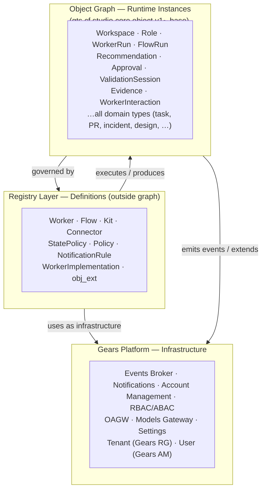
```mermaid
flowchart TB
    subgraph GEARS["Gears Platform — Infrastructure"]
        G["Events Broker · Notifications · Account Management · RBAC/ABAC\nOAGW · Models Gateway · Settings\nTenant (Gears RG) · User (Gears AM)"]
    end

    subgraph REGISTRY["Registry Layer — Definitions (outside graph)"]
        R["Worker · Flow · Kit · Connector\nStatePolicy · Policy · NotificationRule\nWorkerImplementation · obj_ext"]
    end

    subgraph GRAPH["Object Graph — Runtime Instances\n(gts.cf.studio.core.object.v1~ base)"]
        O["Workspace · Role · WorkerRun · FlowRun\nRecommendation · Approval · ValidationSession\nEvidence · WorkerInteraction\n…all domain types (task, PR, incident, design, …)"]
    end

    REGISTRY -->|executes / produces| GRAPH
    REGISTRY -->|uses as infrastructure| GEARS
    GRAPH -->|emits events / extends| GEARS
    GRAPH -->|governed by| REGISTRY
```

---

### D1 — Registry vs Object Graph (entities)

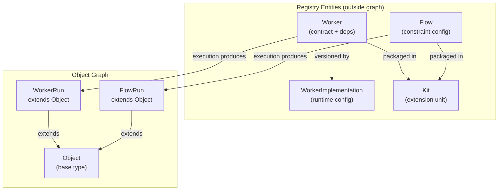
```mermaid
flowchart TD
    subgraph Registry["Registry Entities (outside graph)"]
        Worker["Worker\n(contract + deps)"]
        WI["WorkerImplementation\n(runtime config)"]
        Flow["Flow\n(constraint config)"]
        Kit["Kit\n(extension unit)"]
    end

    subgraph Graph["Object Graph"]
        Object["Object\n(base type)"]
        WorkerRun["WorkerRun\nextends Object"]
        FlowRun["FlowRun\nextends Object"]
    end

    Worker -->|versioned by| WI
    Worker -->|packaged in| Kit
    Flow -->|packaged in| Kit
    Worker -->|execution produces| WorkerRun
    Flow -->|execution produces| FlowRun
    WorkerRun -->|extends| Object
    FlowRun -->|extends| Object
```

---

### DO1b — Layers with Entity Names

```
┌─────────────────────────────────────────────────────────────┐
│               GEARS INFRASTRUCTURE                          │
│  Events Broker · Notifications · Approvals · Jobs Manager   │
│  LLM Gateway · AI Agents Registry · Settings Service        │
└─────────────────────────────────────────────────────────────┘
                          ▲ Studio builds on Gears
┌─────────────────────────────────────────────────────────────┐
│                     REGISTRY ENTITIES                       │
│                                                             │
│  Worker ──────────── WorkerImplementation                   │
│  Flow    obj_ext    Kit    StatePolicy    NotificationRule   │
│  Policy                                                     │
└─────────────────────────────────┬───────────────────────────┘
                                  │ executes / produces
                                  ▼
┌─────────────────────────────────────────────────────────────┐
│               GEARS INFRASTRUCTURE                          │
│  Events Broker · Notifications · Approvals · Jobs Manager   │
│  LLM Gateway · AI Agents Registry · Settings Service        │
│  Tenant  (gts.cf.core.rg.type.v1~...cf.studio.tenant.v1~) │
│  User    (gts.cf.core.am.user.v1~...cf.studio.user.v1~)   │
└─────────────────────────────────────────────────────────────┘
                          ▲ Studio builds on Gears
┌─────────────────────────────────────────────────────────────┐
│                     REGISTRY ENTITIES                       │
│                                                             │
│  Worker ──────────── WorkerImplementation                   │
│  Flow    obj_ext    Kit    StatePolicy    NotificationRule   │
│  Policy                                                     │
└─────────────────────────────────┬───────────────────────────┘
                                  │ executes / produces
                                  ▼
┌─────────────────────────────────────────────────────────────┐
│              OBJECT GRAPH (gts.cf.studio.core.object.v1~)  │
│                                                             │
│  Workspace       WorkerRun        FlowRun       Role        │
│  Requirement     Task             PullRequest   Build       │
│  Design          Incident         Recommendation            │
│  IdentityMapping PolicyOverride   PolicyDelegation          │
│  SavedAuditQuery NotificationRuleOverride  NotificationSub  │
└─────────────────────────────────────────────────────────────┘
```

---

### DO2 — Registry Entity Relationships

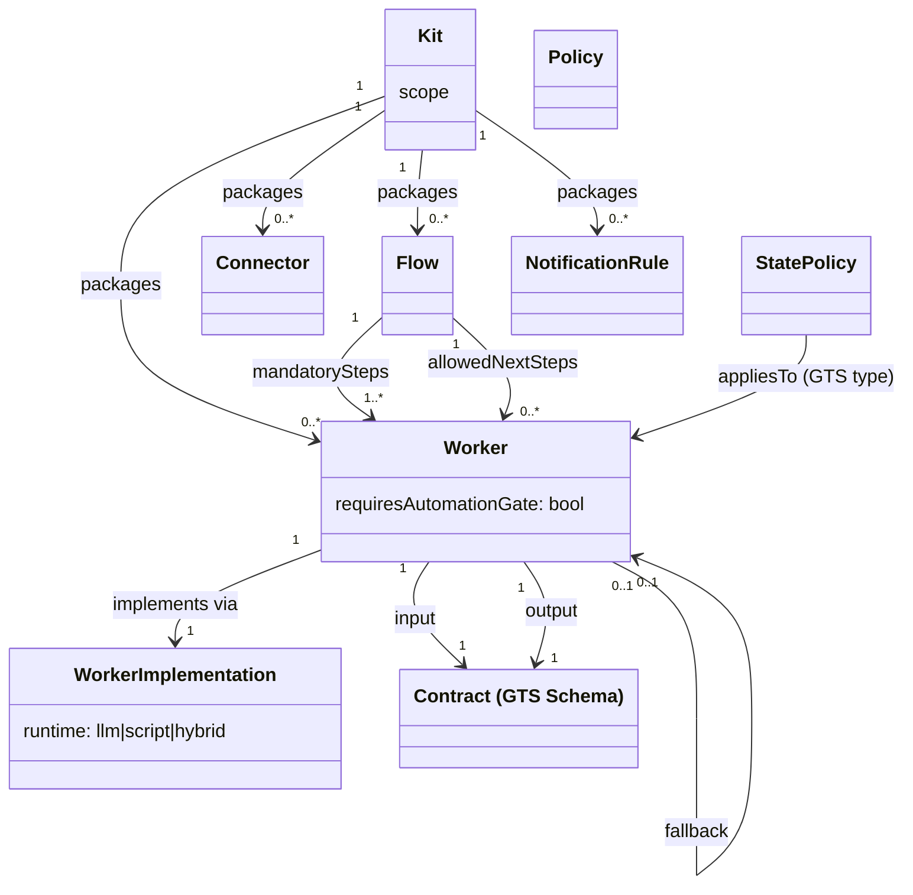
```mermaid
classDiagram
    class Kit {
        scope
    }
    class Worker {
        requiresAutomationGate: bool
    }
    class Flow
    class Connector
    class WorkerImplementation {
        runtime: llm|script|hybrid
    }
    class Contract["Contract (GTS Schema)"]
    class StatePolicy
    class Policy
    class NotificationRule

    Kit "1" --> "0..*" Worker       : packages
    Kit "1" --> "0..*" Flow         : packages
    Kit "1" --> "0..*" Connector    : packages
    Kit "1" --> "0..*" NotificationRule : packages

    Worker "1" --> "1"   WorkerImplementation : implements via
    Worker "1" --> "1"   Contract             : input
    Worker "1" --> "1"   Contract             : output
    Worker "0..*" --> "0..*" Worker           : dependencies (static)
    Worker "0..1" --> "0..1" Worker           : fallback

    Flow "1" --> "1..*" Worker  : mandatorySteps
    Flow "1" --> "0..*" Worker  : allowedNextSteps

    StatePolicy --> Worker : appliesTo (GTS type)
```

---

### DO3 — Object Graph Foundations

Note: `Tenant` and `User` extend **Gears base types** (RG and AM respectively) via GTS
chaining — they do not extend `gts.cf.studio.core.object.v1~`. See §2.2.

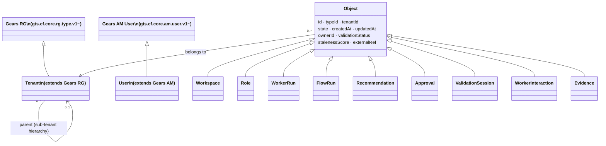
```mermaid
classDiagram
    class Object {
        id · typeId · tenantId
        state · createdAt · updatedAt
        ownerId · validationStatus
        stalenessScore · externalRef
    }
    class GearsRG["Gears RG\n(gts.cf.core.rg.type.v1~)"]
    class GearsAM["Gears AM User\n(gts.cf.core.am.user.v1~)"]
    class Tenant["Tenant\n(extends Gears RG)"]
    class User["User\n(extends Gears AM)"]
    class Workspace
    class Role
    class WorkerRun
    class FlowRun
    class Recommendation
    class Approval
    class ValidationSession
    class WorkerInteraction
    class Evidence

    GearsRG <|-- Tenant
    GearsAM <|-- User
    Object <|-- Workspace
    Object <|-- Role
    Object <|-- WorkerRun
    Object <|-- FlowRun
    Object <|-- Recommendation
    Object <|-- Approval
    Object <|-- ValidationSession
    Object <|-- WorkerInteraction
    Object <|-- Evidence

    Tenant "0..*" --> "0..1" Tenant  : parent (sub-tenant hierarchy)
    Object "0..*" --> "1"   Tenant   : belongs to
```

---

### DO4 — Execution Model

How definitions become execution records, and how execution records relate to each other.

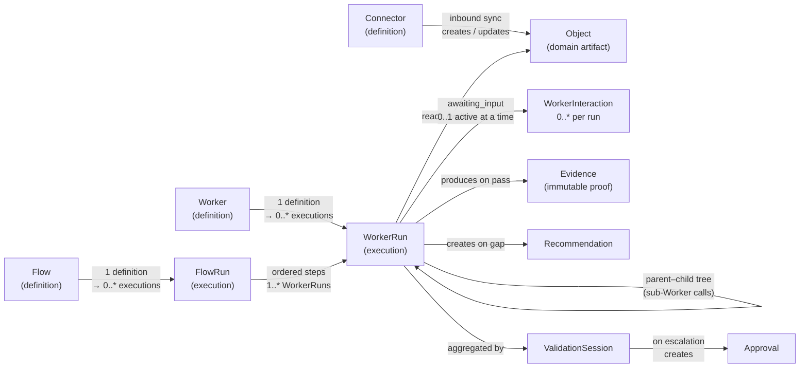
```mermaid
flowchart LR
    W["Worker\n(definition)"]
    F["Flow\n(definition)"]
    C["Connector\n(definition)"]

    WR["WorkerRun\n(execution)"]
    FR["FlowRun\n(execution)"]
    OBJ["Object\n(domain artifact)"]
    WI["WorkerInteraction\n0..* per run"]
    EV["Evidence\n(immutable proof)"]
    REC["Recommendation"]
    VS["ValidationSession"]

    W -->|"1 definition\n→ 0..* executions"| WR
    F -->|"1 definition\n→ 0..* executions"| FR
    FR -->|"ordered steps\n1..* WorkerRuns"| WR
    WR -->|"parent–child tree\n(sub-Worker calls)"| WR
    C -->|"inbound sync\ncreates / updates"| OBJ
    WR -->|"reads / writes"| OBJ
    WR -->|"awaiting_input\n0..1 active at a time"| WI
    WR -->|"produces on pass"| EV
    WR -->|"creates on gap"| REC
    WR -->|"aggregated by"| VS
    VS -->|"on escalation\ncreates"| Approval["Approval"]
```

---

### DO5 — Authorization & Tenant Model

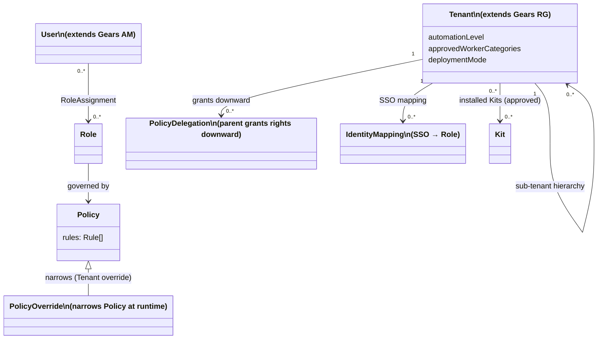
```mermaid
classDiagram
    class Tenant["Tenant\n(extends Gears RG)"] {
        automationLevel
        approvedWorkerCategories
        deploymentMode
    }
    class User["User\n(extends Gears AM)"]
    class Role
    class Policy {
        rules: Rule[]
    }
    class PolicyOverride["PolicyOverride\n(narrows Policy at runtime)"]
    class PolicyDelegation["PolicyDelegation\n(parent grants rights downward)"]
    class IdentityMapping["IdentityMapping\n(SSO → Role)"]
    class Kit

    User "0..*" --> "0..*" Role             : RoleAssignment
    Role --> Policy                          : governed by
    Policy <|-- PolicyOverride              : narrows (Tenant override)
    Tenant "1" --> "0..*" Tenant            : sub-tenant hierarchy
    Tenant "1" --> "0..*" PolicyDelegation  : grants downward
    Tenant "1" --> "0..*" IdentityMapping   : SSO mapping
    Tenant "0..*" --> "0..*" Kit            : installed Kits (approved)
```

---

### DO6 — Cardinality Reference

| Relationship | Cardinality | Notes |
|---|---|---|
| Tenant → Object | 1 : many | Every Object belongs to exactly one Tenant |
| Tenant → Tenant | 0..1 : many | Sub-tenant hierarchy; narrowing only |
| Tenant → Kit | many : many | Kit installed per Tenant with explicit approval |
| Kit → Worker | 1 : many | Kit packages and owns its Workers |
| Worker → WorkerImplementation | 1 : 1 | Versioned independently |
| Worker → Contract (input/output) | 1 : 1 each | Typed GTS Schema |
| Worker → Worker (dependencies) | many : many | Static, declared, security boundary |
| Worker → WorkerRun | 1 : many | One definition, many execution records |
| Flow → Worker (steps) | 1 : many | mandatorySteps + allowedNextSteps |
| Flow → FlowRun | 1 : many | |
| FlowRun → WorkerRun | 1 : many | Ordered step executions |
| WorkerRun → WorkerRun | 1 : many | Parent–child sub-Worker call tree |
| WorkerRun → WorkerInteraction | 1 : many | Max 1 pending at a time |
| ValidationSession → WorkerRun | 1 : many | Retry attempts |
| ValidationSession → Evidence | 1 : 0..1 | Final Evidence on pass |
| Recommendation → WorkerRun | many : 1 | sourceRunId (Analyzer that found gap) |
| User → Role | many : many | Via RoleAssignment |
| Role → Policy | many : many | |
| PolicyOverride → Policy | many : 1 | Narrows, never expands |

---

The system consists of two categories of entities:

- **Object** — data and artifacts that flow through the system (the graph)
- **Registry entities** — Worker, Flow, Kit, etc. (outside the graph; templates/configurations)

## 1. Entities

### 1.1 Object

The base type for all domain objects in the system.

```
Object {
  id:               GTS Instance Identifier
  typeId:           GTS Type Identifier
  tenantId:         ref → Tenant
  state:            string
  createdAt:        datetime
  updatedAt:        datetime
  // Vision-required attributes (gap analysis, staleness, ownership, external sync):
  ownerId:          ref team | person?
  validationStatus: none|pending|pass|fail
  stalenessScore:   float?              // 0.0 = fresh, 1.0 = stale
                                        // = max(timeStaleness, dependencyStaleness, syncStaleness)
  externalRef?: {
    connectorId:  ref Connector
    externalId:   string
    externalUrl:  string
    lastSyncedAt: datetime
  }
  createdObjectIds?: ref → Object[]   // Objects materialized by platform from this WorkerRun
                                      // "Attached" WorkerRun = has createdObjectIds
                                      // "Free-standing" = no Objects created (Analyzer runs, etc.)
                                      // Inverse of Object.createdByRunId

  // --- PROVENANCE (system-managed, immutable after set) ---
  // Distinct from links[] (semantic, user/Worker declared, mutable).
  // Provenance = "who created/modified this Object" (system fact).
  // Semantic links = "how this Object relates to others in business context".
  createdByRunId?:      ref → WorkerRun  // WorkerRun that created this Object; null if user-created
  lastModifiedByRunId?: ref → WorkerRun  // WorkerRun that last modified; null if user-modified
  // Cost attribution chain: Object → WorkerRun.cost → WorkerRun.costAttributedTo → User/Flow

  // --- CAPABILITIES (opt-in via x-gts-traits.capabilities) ---
  // Object types declare which capabilities they support:
  //   "linkable"  → links[], concurrentEditors, writeLock are meaningful
  //   "tracked"   → createdByRunId, lastModifiedByRunId are set by platform
  //   "versioned" → supersedes pattern; state "superseded" reserved
  // Execution records (WorkerRun, Evidence, etc.) and infra types declare no capabilities.
  workspaceId?: ref → Workspace       // workspace scope; set by platform from WorkerRun.costAttributedTo
                                      // used by is_workspace_member_worker for ABAC conditions
  // NOT applicable to execution records (WorkerRun, Evidence, ValidationSession,
  // WorkerInteraction, FlowRun) — they are immutable or have specialized lifecycle
  concurrentEditors?: [               // "you are not alone" — visibility of concurrent access
    {
      agentId:   ref → Object         // WorkerRun or User (both extend Object)
      agentType: worker_run | user    // discriminator
      intent:    read | write
      since:     datetime
      expiresAt: datetime             // safety timeout; platform expires if agent dies
    }
  ]
  // Platform auto-registers WorkerRun on start; auto-deregisters on complete/fail
  // Workers react via WorkerInteraction or queue; this is NOT a lock
  writeLock?: {                       // optional hard exclusive lock
    lockedBy:  ref → Object           // WorkerRun or User
    lockedType: worker_run | user
    lockedAt:  datetime
    expiresAt: datetime               // auto-expires; prevents deadlock on Worker failure
    // platform auto-releases on WorkerRun complete/fail
    // other write attempts → ConflictError while lock held
  }
  links?: [                           // Jira-style typed graph edges
                                      // NOT applicable to execution records:
                                      // WorkerRun, Evidence, ValidationSession,
                                      // WorkerInteraction, FlowRun use specialized refs
    {
      targetId:    ref → Object        // any Object in the graph (typeId derived from target)
      kind:        GTS Type ID          // link kind — all kinds are GTS Type IDs
                                      // core kinds: gts.cf.studio.link.kind.v1~{name}.v1~
                                      // kit kinds: same format, registered in Types Registry at Kit install
                                      // UI shows displayName from Types Registry
      // source: exactly one of createdBy or sourceRunId must be set
      createdBy?:  ref → User          // set when user-declared
      sourceRunId?: ref → WorkerRun    // set when platform-inferred from WorkerRun provenance
    }
  ]
}

// Core LINK_KIND GTS Type IDs (pre-registered in Gears Types Registry):
//   gts.cf.studio.link.kind.v1~derived_from.v1~    — B created from A (prd→design)
//   gts.cf.studio.link.kind.v1~decomposes_into.v1~ — A breaks down into B items
//   gts.cf.studio.link.kind.v1~implements.v1~       — A implements requirement B
//   gts.cf.studio.link.kind.v1~references.v1~       — weak link: A uses B as context
//   gts.cf.studio.link.kind.v1~incorporates.v1~     — A merges or extends B
//   gts.cf.studio.link.kind.v1~validates.v1~        — A proves B correct
//   gts.cf.studio.link.kind.v1~supersedes.v1~       — A replaces B (versioning)
//   gts.cf.studio.link.kind.v1~informs.v1~          — A provides context for B
//
// Kit-extensible: Kit registers custom link kinds in Types Registry at install.
//   Platform traverses core kinds in traceability computation;
//   custom kinds stored and returned in queries but not analysed for gaps.
//
// Two-layer model:
//   Object.links[] = flexible, user- and platform-declared contextual links
//   Spec-level fields (pull_request.conformsToDesign, test_case.verifiesRequirements)
//     remain as explicit Contract fields — required by Validator Workers
//
// Graph traversal API (Gears platform):
//   GET /objects/{id}/links?kind={GTS_kind_ID}&depth=N&direction=outgoing|incoming|both
//   GET /objects/{id} + OData $filter for filtered Object queries
//   effectiveLimits.depth = max traversal depth backstop per WorkerRun
//   Workers maintain visited-set to prevent cycles; depth limit as safety net
```

### D2 — Object Base Hierarchy

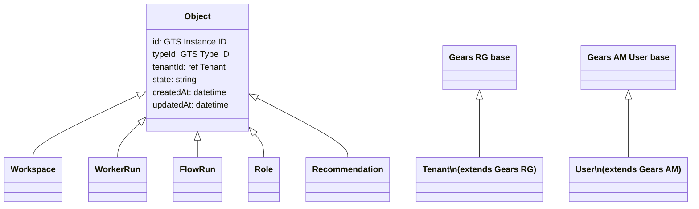
```mermaid
classDiagram
    class Object {
        id: GTS Instance ID
        typeId: GTS Type ID
        tenantId: ref Tenant
        state: string
        createdAt: datetime
        updatedAt: datetime
    }
    class GearsRG["Gears RG base"]
    class GearsAM["Gears AM User base"]
    class Tenant["Tenant\n(extends Gears RG)"]
    class User["User\n(extends Gears AM)"]
    class Workspace
    class WorkerRun
    class FlowRun
    class Role
    class Recommendation

    GearsRG <|-- Tenant
    GearsAM <|-- User
    Object <|-- Workspace
    Object <|-- WorkerRun
    Object <|-- FlowRun
    Object <|-- Role
    Object <|-- Recommendation
```

Studio Objects derive from `gts.cf.studio.core.object.v1~` via GTS chaining.
`Tenant` and `User` are Gears-native types extended via GTS — see §2.2.

### 1.2 Registry Entities

Outside the graph. Describe rules and configurations, not data.

| Entity | Purpose |
|---|---|
| `Worker` | **Definition** of a typed, reusable capability (not a process). Execution creates a WorkerRun. |
| `Validator` | Extends Worker; adds retry loop, escalation, maxRetries semantics |
| `WorkerImplementation` | Runtime configuration of a Worker (model, prompt, script) |
| `Flow` | Worker extension (GTS chain) — sequences mandatory steps; packaged in Kit alongside other Workers |
| `Connector` | Integration with external system via Gears OAGW (field mapping, write-back, sync) |
| `Kit` | Extension packaging unit (types, Workers of all kinds incl. orchestrators, Connectors) |
| `obj_ext` | Attribute extension for existing types |
| `StatePolicy` | Per-property transition rules (separate from type schema) |

---

## 2. GTS Identifiers

**Convention:** `gts.<vendor>.<package>.<namespace>.<type>.v<N>`

Studio vendor = `cf` (same as Constructor Fabric Gears).

### 2.0 GTS Type ID Versioning Policy

| Change tier | Contract rule | typeId rule | Existing Objects |
|---|---|---|---|
| PATCH | WorkerImpl only; Contract unchanged | Same typeId | Unaffected |
| MINOR | Additive (optional fields only) | New typeId via **GTS subtype chaining** from previous | Backward compat; v1 readable as v2 |
| MAJOR | Breaking (required fields, removals, renames) | New independent typeId; old Worker.deprecatedBy → new | Frozen at old typeId; never retroactively changed |

**Execution records (WorkerRun, Evidence):** typeId is **immutable** after creation. WorkerRun.workerId always reflects the Worker version that produced it. Retroactive re-typing is forbidden — it violates the audit trail invariant.

**Domain Objects (design, requirement, etc.) on MAJOR change:** Kit may provide an opt-in `migration_worker` that produces a new Object at the new typeId. The old Object survives unchanged. `migration_worker` cannot modify WorkerRun or Evidence.

**MINOR enforcement:** Kit Registry rejects publish of a MINOR version whose new Contract typeId does not chain from the previous version typeId via GTS subtype chaining.

**Active version discovery:** Query Gears Types Registry (`GET /types/active?workerId=X`) to enumerate all active Contract typeIds for a Worker. This is Gears infrastructure — not a domain model field.

### 2.1 Studio Base Types

Studio-owned base types:

```
gts.cf.studio.core.object.v1~      ← base Object (all Studio domain objects)
gts.cf.studio.core.worker.v1~      ← base Worker (definition)
gts.cf.studio.core.worker.v1~cf.studio.core.validator.v1~
                                   ← Validator = Worker extension via GTS chaining
gts.cf.studio.core.worker.v1~cf.studio.core.flow.v1~
                                   ← Flow = Worker extension via GTS chaining (orchestration semantics)
gts.cf.studio.core.connector.v1~   ← registry entity; uses Gears OAGW as infrastructure
gts.cf.studio.core.kit.v1~         ← extension packaging unit
gts.cf.studio.core.obj_ext.v1~     ← attribute extension
gts.cf.studio.link.kind.v1~        ← base type for all Object link kinds (core + Kit-extensible)
```

Studio event types extend the **Gears platform event base type**:

```
gts.cf.core.events.type.v1~        ← Gears platform event base type (DO NOT redefine)
```

### 2.2 Gears Base Types Extended by Studio

Studio extends existing Gears base types where applicable:

| Studio Type | Extends Gears Type | Chained GTS ID |
|---|---|---|
| `Tenant` | `gts.cf.core.rg.type.v1~cf.core._.tenant.v1~` | `gts.cf.core.rg.type.v1~cf.core._.tenant.v1~cf.studio.core.tenant.v1~` |
| `User` | `gts.cf.core.am.user.v1~` | `gts.cf.core.am.user.v1~cf.studio.core.user.v1~` |
| `Permission` | `gts.cf.toolkit.authz.permission.v1~` | `gts.cf.toolkit.authz.permission.v1~cf.studio.core.permission.v1~` |

### 2.3 Studio Core Object Types (derived from Studio base)

```
gts.cf.studio.core.object.v1~cf.studio.core.workspace.v1~
gts.cf.studio.core.object.v1~cf.studio.core.requirement.v1~
gts.cf.studio.core.object.v1~cf.studio.core.task.v1~
gts.cf.studio.core.object.v1~cf.studio.core.pull_request.v1~
gts.cf.studio.core.object.v1~cf.studio.core.build.v1~
gts.cf.studio.core.object.v1~cf.studio.core.incident.v1~
gts.cf.studio.core.object.v1~cf.studio.core.design.v1~
gts.cf.studio.core.object.v1~cf.studio.core.worker_run.v1~
gts.cf.studio.core.object.v1~cf.studio.core.flow_run.v1~
gts.cf.studio.core.object.v1~cf.studio.core.role.v1~
gts.cf.studio.core.object.v1~cf.studio.core.recommendation.v1~
gts.cf.studio.core.object.v1~cf.studio.core.identity_mapping.v1~
gts.cf.studio.core.object.v1~cf.studio.core.policy_override.v1~
gts.cf.studio.core.object.v1~cf.studio.core.policy_delegation.v1~
gts.cf.studio.core.object.v1~cf.studio.core.saved_audit_query.v1~
gts.cf.studio.core.object.v1~cf.studio.core.notification_rule_override.v1~
gts.cf.studio.core.object.v1~cf.studio.core.notification_subscription.v1~
gts.cf.studio.core.object.v1~cf.studio.core.worker_interaction.v1~
gts.cf.studio.core.object.v1~cf.studio.core.prompt_experiment.v1~
gts.cf.studio.core.object.v1~cf.studio.core.event_subscription.v1~
gts.cf.studio.core.object.v1~cf.studio.core.kit_installation.v1~
gts.cf.studio.core.object.v1~cf.studio.core.data_erasure_request.v1~
```

### 2.4 Vendor (Kit) Extensions

```
// Narrowing — new semantic type:
gts.cf.studio.core.object.v1~cf.studio.core.task.v1~jira.studio.core.jira_task.v1~

// Attribute extension via obj_ext:
gts.cf.studio.core.obj_ext.v1~jira.studio.core.jira_task_ext.v1~
```

---

## 3. Contract

Contract = **GTS Type Schema** (JSONSchema + `x-gts-*` extensions).

Describes what a Worker expects as input and what it produces as output.
Object type references use `$ref` → GTS Type Identifier. Scalar properties
use standard JSON Schema fields. **GTS does not duplicate JSON Schema features:**
required fields use the standard `required` array, not a custom annotation.

`x-gts-*` extensions are only for concepts JSON Schema does not have: state
awareness (`x-gts-state-requires`, `x-gts-state-sets`), platform security
(`x-gts-source: platform | never-user`), traits + indexes (`x-gts-traits`),
output materialization (`x-gts-creates`).

`x-gts-creates: boolean` — on output Contract fields: platform materializes Object in graph
on WorkerRun completion. Worker returns raw data; platform creates Object with full security
context (tenantId, workspaceId, ownerId, createdByRunId auto-set):

```json
// Output Contract example:
{
  "properties": {
    "design": {
      "$ref": "gts://...design.v1~",
      "x-gts-creates": true     // platform creates design Object in graph
    },
    "debug_info": { "type": "string" }  // no x-gts-creates → raw data only
  }
}
```

Materialization flow (order matters; non-atomic — retry via WorkerRun.checkpoint):
  1. x-gts-creates: create new Objects; set Object.createdByRunId, workspaceId, ownerId
  2. x-gts-state-sets: update input Object states
  3. Auto-create `derived_from` links (confidence: inferred) from new Objects to input Objects:
     - Only for input Contract fields with `$ref` (Object refs), NOT scalar fields
     - Opt-out: `x-gts-link: false` on $ref field = skip auto-link (e.g. workspace context fields)
  4. WorkerRun.createdObjectIds = [new Object ids]

`x-gts-traits.capabilities` — opt-in Object capabilities declaration:

```json
"x-gts-traits": {
  "capabilities": ["linkable", "tracked"]
}
```

- `linkable`  — Object supports `links[]`, `concurrentEditors`, `writeLock`
- `tracked`   — Object supports `createdByRunId`, `lastModifiedByRunId`
- `versioned` — SDLC artifact; uses supersedes pattern when content changes:
  create new Object + `links[kind=supersedes]` + old Object.state → `superseded`.
  Evidence and links remain accurate for old version.
  `traceability_analysis` excludes `superseded` Objects from coverage computation.
  Applies to: prd, design, requirement, decomposition, feature_spec, adr.
  Auto-transition: platform sets old Object.state → superseded when supersedes link added.
  StatePolicy may require Approval for superseded transition on critical types (prd, design).
- Execution records and infra types declare no capabilities.
- Platform uses capabilities to apply appropriate behaviors.

**Reserved `Object.state` value:** `superseded` — Object replaced by newer version.
Available to `versioned` types. Excluded from default traceability queries.

**Two versioning strategies:**
- SDLC Artifacts (versioned): create new Object + supersedes link + old → superseded.
  Preserves Evidence integrity for old version.
- Operational Entities (task, bug, pull_request): mutable via StatePolicy; no versioning.

`x-gts-traits.indexes` — hint to persistence layer which fields to index:

```json
"x-gts-traits": {
  "indexes": [
    { "fields": ["tenantId", "state"],                       "unique": false },
    { "fields": ["workerId"],                                 "unique": false },
    { "fields": ["externalRef.externalId", "externalRef.connectorId"], "unique": true }
  ]
}
```

`x-gts-traits.contains_pii` — marks Object types that carry personally identifiable information:

```json
"x-gts-traits": {
  "contains_pii": true,
  "pii_fields": ["assignee", "description", "externalRef.externalId", "payload.*"]
  // dot-notation paths; wildcard * = all fields within that prefix
}
```

Platform applies strict retention policy to Objects of PII-annotated types.
WorkerRuns whose input/output Objects are PII-annotated inherit strict TTL enforcement.

```json
{
  "$id": "gts.cf.studio.core.worker.v1~cf.studio.core.create_design_input.v1~",
  "type": "object",
  "required": ["requirement", "workspace"],
  "properties": {
    "requirement": {
      "$ref": "gts://cf.studio.core.object.v1~cf.studio.core.requirement.v1~"
    },
    "workspace": {
      "$ref": "gts://cf.studio.core.object.v1~cf.studio.core.workspace.v1~",
      "x-gts-source": "platform"
    },
    "style": { "type": "string", "enum": ["detailed", "sketch"] },
    "language": { "type": "string" }
  }
}
```

Contract carries two security-scoped `x-gts-source` values only:

| Value | Meaning | Enforcement |
|---|---|---|
| `platform` | Always resolved by platform (tenantId, workspace, timestamps). Reject if user provides. | Contract validation rejects user-supplied values |
| `never-user` | Must not originate from user input under any circumstances. | Hard reject; audit-logged if attempted |

All other resolution hints (graph picker, chain, form) live in `Worker.inputBindings[]` — not in Contract.

---

## 4. Worker

**Worker = registry definition.** WorkerRun (§5) = execution instance.

**Design rule — when to extend Worker:**
> A registry entity extends Worker (via GTS chaining) *if and only if* it autonomously
> produces a WorkerRun upon execution. Entities that are configuration read by Workers
> remain separate registry entities.
>
> - `Validator` → extends Worker ✅ (produces WorkerRun)
> - `Flow` → extends Worker ✅ (produces FlowRun which extends WorkerRun)
> - `Connector` → separate entity ✅ (execution delegated to platform Workers)
> - `StatePolicy`, `Kit`, `Policy` → separate entities ✅ (no execution)

A Worker is a typed, reusable capability registered in the Studio registry. It defines
what it consumes and produces (Contract), how it runs (WorkerImplementation), and what
it is allowed to call (dependencies). Workers do not execute themselves — execution
creates a WorkerRun.

**Categorization:** Workers have no `kind` field. Structural subtypes (Validator, Flow)
are expressed through GTS chaining. Behavioral policy is carried by two fields:

- `requiresAutomationGate` — `true` when execution requires `automationLevel >=
  approved_automation`. Replaces the old `kind == action` check.
- `metadata.category` — semantic label for UI grouping and `approvedWorkerCategories`
  matching: `quality | security | ops | ai-cost | traceability | retrieval | platform`.

**"Action" is a UI concept,** not a type. A Worker appears as a clickable "Action"
button in Studio UI when `requiresAutomationGate = true` and the user has permission.
This is declared in `metadata.action`:

```
Worker {
  id:                GTS Type Identifier  (gts.cf.studio.core.worker.v1~...)
  input:             Contract             (GTS Type Schema)
  output:            Contract             (GTS Type Schema)
  dependencies: [                          // static list — security boundary
    {
      workerId: ref → Worker
      required: boolean    // default: true; false = optional call
                           // enforced for runtime: script|hybrid (DAG execution)
                           // advisory only for runtime: llm (LLM decides dynamically)
    }
  ]
  // mode (sync|async) per dependency → WorkerImplementation.dependencyModes
  // Kit Registry validates DAG acyclicity at install — circular deps = hard block
  // Runtime backstop: WorkerRun.effectiveLimits.depth caps transitive call depth
  scope:             local | project | workspace | published
  implementationId:  ref → WorkerImplementation
  requiresAutomationGate: boolean         // default: false
                                          // true = Gate 1 applies (automationLevel check)
  canInvokeOnDemand:      boolean         // default: true
                                          // false = only schedule/event can activate
  eventTrigger?: {                        // capability: which event activates this Worker
    pattern:  GTS Type Identifier
    debounce: duration                    // default: 0
  }
  // schedule → WorkerImplementation.defaultSchedule (deployment config, Tenant-overridable)
  inputBindings?: [                   // runtime input resolution hints (per field)
    {
      field:    string                // matches a property name in input Contract
      source:   graph | user | chain | platform | default
      query?:   object                // filter for source: graph (e.g. { state: "approved" })
      fromStep?: string               // for source: chain — which Flow step's output
      default?: any                   // fallback value when source unavailable
    }
  ]
  // Flow.config.steps[].inputBinding overrides Worker.inputBindings per step
  deprecation?: {                      // set on MAJOR contract change
    successorId:       ref → Worker    // new Worker replacing this one
    deprecatedAt:      datetime
    gracePeriodEndsAt: datetime        // after this date platform warns on new WorkerRun creation
  }
  // deprecated Workers remain in Registry; old WorkerRuns and Evidence are valid forever
  fallbackWorkerId?:  ref → Worker    // output Contract must be compatible with primary
                                      // Kit Registry validates at install: fallback output
                                      // must be GTS subtype or exact match of primary output
                                      // incompatible fallback → Kit install warning (not block)
  fallbackCondition?: on_error | on_budget_exceeded | on_timeout
  interactionModel?: {
    canRequestInput:        boolean   // can emit input_request WorkerInteraction
    canPresentMenu:         boolean   // can emit menu WorkerInteraction
    maxPendingInteractions: int       // default: 1
    cancellable:            boolean   // default: true
  }
  metadata: {
    displayName: string
    description: string
    category:    quality | security | ops | ai-cost | traceability | retrieval | platform
    icon?:       string
    profile:     realtime | scheduled | on_demand
    action?: {
      label: string    // UI button label, e.g. "Fix Bug", "Create Design"
      icon?:  string
    }
  }
}
```

### D4 — Worker & Contract

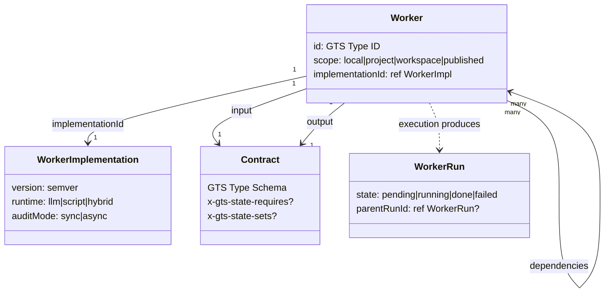
```mermaid
classDiagram
    class Worker {
        id: GTS Type ID
        scope: local|project|workspace|published
        implementationId: ref WorkerImpl
    }
    class WorkerImplementation {
        version: semver
        runtime: llm|script|hybrid
        auditMode: sync|async
    }
    class Contract {
        GTS Type Schema
        x-gts-state-requires?
        x-gts-state-sets?
    }
    class WorkerRun {
        state: pending|running|done|failed
        parentRunId: ref WorkerRun?
    }

    Worker "1" --> "1" WorkerImplementation : implementationId
    Worker "1" --> "1" Contract : input
    Worker "1" --> "1" Contract : output
    Worker "many" --> "many" Worker : dependencies
    Worker ..> WorkerRun : execution produces
```

### 4.1 WorkerImplementation

Runtime configuration, versioned independently from the contract.

```
WorkerImplementation {
  id:      string
  version: semver
  runtime: llm | script | hybrid
  config: {
    // llm:    { model: GTS Model ID, prompt, temperature, ...
    //           modelRouterId?: ref → ModelRouter  // dynamic model selection
    //         }
    // script: { entrypoint, language, ... }
    // hybrid: { steps[] }
  }
  dependencyModes?: map<workerId, sync | async>
                              // per-dependency call mode; default: sync
                              // overrides Worker.dependencies default without changing Worker schema
  checkpoint: {
    enabled: boolean
    ttl:     duration
  }
  auditMode:       sync | async           // default: async
  retentionPolicy: {
    inputTTL:        duration
    outputTTL:       duration
    metadataTTL:     duration
    retentionAction: archive | delete     // default: archive
  }
  defaultSchedule?: cron string           // Kit-declared default schedule
                                          // Tenant can override at Kit install time
  parallelOutputMerge?: last | append | merge_by_key | custom
                        // default: last; applies when DAG branches run in parallel
  retrieval?: {         // only for Workers with metadata.category: retrieval
    indexKind:  object_graph | document_index | code_index
    scope:      workspace | tenant          // tenant-isolation boundary
    indexRef?:  string                      // Gears Models index ID
    strategy:   dense | sparse | hybrid     // vector / BM25 / combined
    topK:       int                         // default: 5
  }
  pausePoints?: [
    {
      afterStep:     string           // step name within hybrid Worker
      prompt:        string           // shown to user at pause
      requiresRole:  RolePattern?
      timeoutAction: continue | abort
    }
  ]                                   // creates WorkerRun.state: paused (not Approval)
}
```

### 4.2 ModelRouter

Registry entity for dynamic model selection at WorkerRun creation time.

```
ModelRouter {
  id:             string
  defaultModelId: GTS Type ID        // Gears Models Registry ref; used when no rule matches
  rules: [
    {
      condition: {
        tenantTier?:   string         // e.g. enterprise | pro | free
        inputTokens?:  { gt?: int, lt?: int }
        category?:     string         // Worker metadata.category
      }
      modelId:   GTS Type ID
      priority:  int                  // higher value = evaluated first
    }
  ]
}
```

**Model selection priority (highest to lowest):**
```
1. Tenant.modelOverrides[workerId]         ← enterprise custom model
2. ModelRouter.rules[] (first match)       ← dynamic routing
3. WorkerImplementation.config.llm.model   ← Kit default
```

### 4.3 PromptExperiment

A/B test between two `WorkerImplementation` versions on live traffic.

```
PromptExperiment extends Object {
  typeId:                  gts.cf.studio.core.object.v1~cf.studio.core.prompt_experiment.v1~
  workerId:                ref → Worker
  variants: [
    {
      implementationId:    ref → WorkerImplementation
      trafficWeight:       int      // relative weight e.g. [70, 30]; must sum > 0
    }
  ]
  state:                   running | paused | concluded
  startedAt:               datetime
  concludedAt?:            datetime
  winnerImplementationId?: ref → WorkerImplementation
  minRunsPerVariant?:      int           // default: 100; platform waits before suggesting winner
  significanceThreshold?:  float         // default: 0.1 (10% difference in avgCostUSD or quality)
  metrics?: [              // one entry per variant, same order as variants[]
    {
      totalRuns:           int
      avgCostUSD:          float
      avgInputTokens:      int
      avgOutputTokens:     int
    }
  ]
}
```

Worker link (platform routes to variant when experiment is running):

```
Worker {
  ...
  activeExperimentId?: ref → PromptExperiment
}
```

### 4.4 Composability

A Worker may call other Workers from its `dependencies` list.
An LLM-Worker may call them in any order, conditionally, iteratively —
but **only from the declared list**. Calls outside the list are forbidden.

The system automatically builds a **DAG** from dependencies and executes
independent branches in parallel.

---

## 5. WorkerRun

A record of a specific Worker execution. **Extends Object.**

```
WorkerRun extends Object {
  typeId:              gts.cf.studio.core.object.v1~cf.studio.core.worker_run.v1~
  workerId:            ref → Worker
  parentRunId:         ref → WorkerRun?
  inputData:           any
  outputData:          any
  state:               pending | running | awaiting_input | paused | done | failed
  progress: {
    message:  string?
    percent:  0..100?
    eta:      datetime?        // strictly optional
  }
  effectiveLimits: {
    timeout:      duration
    depth:        int
    token_budget: int
    source:       kit | tenant | call
  }
  externalEvents: [
    {
      source:     string     // e.g. "connector:jira", "retriever:document_retriever"
      type:       string
      externalId: string
      url:        string
      chunkRef?:  string     // Gears Models chunk ID when source is a Retriever Worker
      score?:     float      // similarity score for retrieval events
    }
  ]
  checkpointExpiresAt: datetime?
  interactions:        WorkerInteraction[]  // history of all interactions (immutable once answered)
  cancelledBy?:        ref → User
  cancelCascade?:      boolean              // were child WorkerRuns also cancelled
  costAttributedTo?: {                     // platform sets at creation from trigger context
    userId?:      ref → User
    workspaceId?: ref → Workspace
    parentFlowRunId?: ref → WorkerRun      // enables per-Flow cost aggregation
                                           // (FlowRun extends WorkerRun; use WorkerRun ref)
  }
  trigger: {                               // immutable after set; platform sets at creation
    kind:           scheduled | onEvent | onDemand
    // scheduled: Gears Jobs Manager created this run from Worker.defaultSchedule
    // onEvent:   Worker.eventTrigger pattern matched a Gears Events Broker event
    // onDemand:  user action (Action button, API call, Flow step)
    // sub-Worker calls: detected via parentRunId != null (no separate kind needed)
    parentEventId?: string                 // Gears Event ID (for kind: onEvent)
    scheduleName?:  string                 // Gears Jobs Manager schedule name (for kind: scheduled)
  }
  cost?: {
    promptTokens:     int
    completionTokens: int
    modelId:          string        // GTS Type ID from Gears Models Registry
    estimatedCostUSD: float
  }                                 // only populated for runtime: llm | hybrid
  staticChildren:      WorkerRun[]
}
```

### 5.1 WorkerRun Lifecycle (Write-Ahead)

```
1. START        → WorkerRun created, state: pending
2. WRITE-AHEAD  → externalEvents recorded (before any reads)
3. EXECUTE      → Worker runs (DAG, parallel branches)
4. COMPLETE     → outputData written, state: done | failed
```

### D5 — WorkerRun Execution Lifecycle


```mermaid
flowchart TD
    START([START]) --> WA[Write-Ahead\nexternalEvents recorded]
    WA --> EXEC[Execute\nDAG parallel branches]
    EXEC --> DONE([done])
    EXEC --> FAILED([failed])

    FAILED --> CHK{checkpoint\nenabled?}
    CHK -->|yes + TTL valid| RETRY[Checkpoint-based\nRetry]
    CHK -->|no / TTL expired| FULL[Full Restart]
    RETRY --> EXEC
    FULL --> WA

    EXEC --> LIMITS["effectiveLimits applied\nkit → tenant → call"]
```

### 5.2 Retry

- **Checkpoint-based** (`checkpoint.enabled = true`): successful sub-Workers
  not re-executed; results reused until `checkpointTTL` expires.
- **Full restart** (`checkpoint.enabled = false` or TTL expired).
- Every WorkerRun is **idempotent** by `id`.

### 5.3 Limits (three levels, each can only narrow)

```
Kit defaults:         timeout, depth, token_budget
Tenant max limits:    ← ceiling
Call (at invocation): ← can narrow, not exceed Tenant
```

### D18 — WorkerRun Cross-References

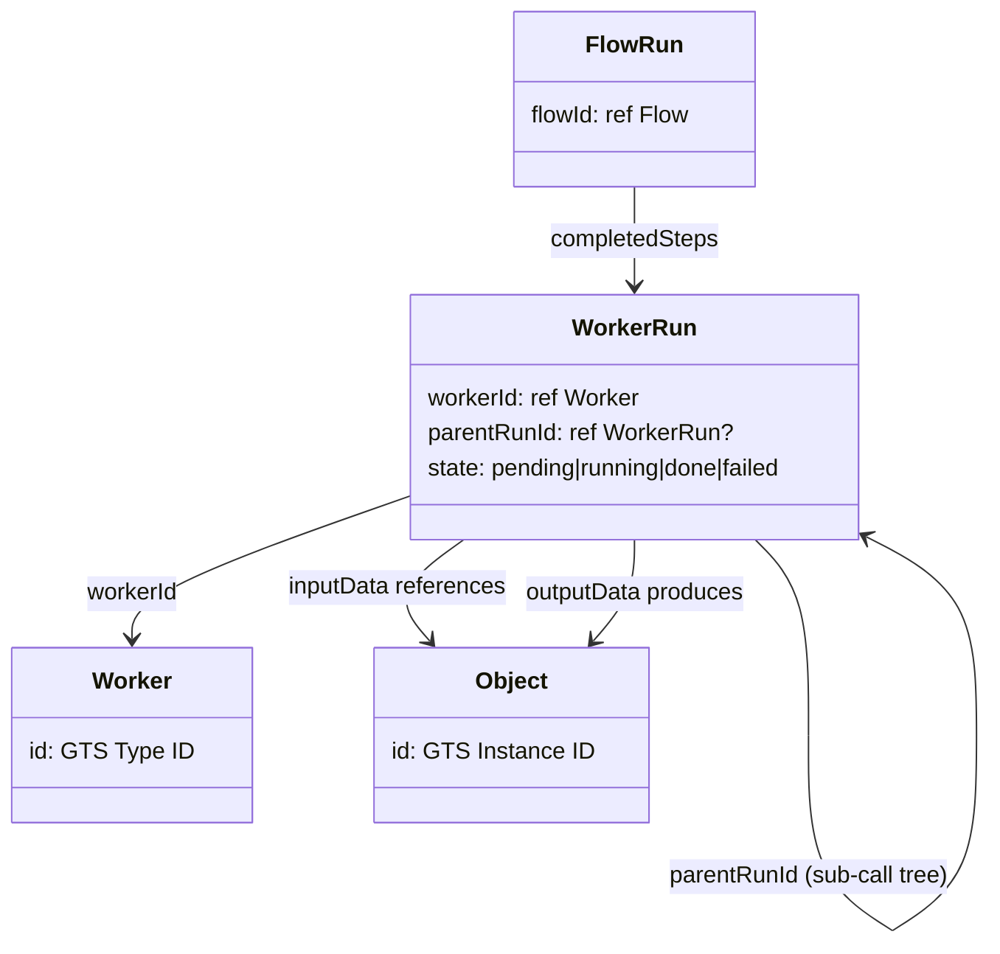
```mermaid
classDiagram
    class WorkerRun {
        workerId: ref Worker
        parentRunId: ref WorkerRun?
        state: pending|running|done|failed
    }
    class Worker {
        id: GTS Type ID
    }
    class Object {
        id: GTS Instance ID
    }
    class FlowRun {
        flowId: ref Flow
    }

    WorkerRun --> Worker : workerId
    WorkerRun --> WorkerRun : parentRunId (sub-call tree)
    WorkerRun --> Object : inputData references
    WorkerRun --> Object : outputData produces
    FlowRun --> WorkerRun : completedSteps
```

---

## 6. Flow

**Flow = Worker extension (via GTS chaining).** A Flow is not a separate registry
entity — it extends Worker through GTS chaining. Flows have `runtime: orchestrator`
(declarative constraint config, no LLM/script code) and sequence mandatory steps.
`requiresAutomationGate` on a Flow depends on whether its mandatory steps require it.

```
// GTS type: gts.cf.studio.core.worker.v1~cf.studio.core.flow.v1~

Flow extends Worker {
  // no kind field — structural identity expressed through GTS type
  input:             Contract[]                         // entryConstraints
  output:            Contract                           // { completedSteps, skipped }
  implementationId:  WorkerImplementation {
    runtime: orchestrator
    config: {
      steps: [
        {
          workerId:      ref → Worker
          required:      boolean          // default: true; false = optional step
                                          // mandatorySteps = steps.filter(required == true)
          inputBinding?: {            // overrides Worker.inputBindings for this step
            // field → { source, query?, fromStep?, default? }
            // e.g. "prd": { source: "chain", fromStep: "step-0" }
          }
        }
      ]
      // mandatorySteps: Worker[] — deprecated; derived from steps.filter(required == true)
      stepDependencies?:  map<workerId, workerId[]>
                                       // explicit deps for UI dependency graph;
                                       // if absent: steps assumed sequential per steps[] order
      allowedNextSteps:   map<Worker, Worker[]>
      conditionalRoutes?: [
        {
          fromWorker: ref → Worker
          condition:  string          // JSONPath expression over outputData
                                      // Phase 1-2: JSONPath; Phase 3+: CEL considered
          nextWorker: ref → Worker
        }
      ]                               // evaluated after allowedNextSteps; wins on match
    }
  }
  scope:             local | project | workspace | published
  // Not applicable to orchestrators: fallbackWorkerId, interactionModel
}
```

### 6.1 FlowRun

FlowRun extends WorkerRun — the execution record of an orchestrator Worker.

```
FlowRun extends WorkerRun {
  // inherits all WorkerRun fields
  typeId:          gts.cf.studio.core.object.v1~cf.studio.core.flow_run.v1~
  // orchestrator step tracking:
  completedSteps:  Worker[]
  skippedSteps:    Worker[]
  activeStepId?:   ref → Worker      // currently executing step; null when idle
  stepStatus?:     map<workerId,      // denormalized read-model for checklist UI
                     pending | running | done | skipped | failed>
                                      // updated by platform on each child WorkerRun state change
                                      // source of truth: child WorkerRun tree
  // note: outputData = { completedSteps, skipped } (FlowRunResult, not a domain Object)
}
```

---

## 7. Tenant

Recursive hierarchy. Extends Gears Resource Group tenant type.

```
Tenant {
  typeId:          gts.cf.core.rg.type.v1~cf.core._.tenant.v1~cf.studio.core.tenant.v1~
  parentId:        ref → Tenant?
  name:            string
  checkpointTTL:   duration      // default: 24h
  modelOverrides?: map<workerId, GTS Model ID>
                                 // Enterprise: override model per Worker
                                 // priority: Tenant override > ModelRouter > WorkerImpl default
  allowedKitPatterns?: [
    saas_multitenant | service_provider | enterprise_private | hybrid_cloud | on_prem | any
  ]                              // soft governance: Kit with incompatible deploymentPattern
                                 // requires Approval (kind: architecture_decision) to install
  mcpSettings?: {
    enabled:          boolean    // default: false; MCP access disabled unless explicitly enabled
    allowedKits?:     string[]   // null = all installed Kits with mcpTools; whitelist otherwise
    mcpRole:          ref → Role // MCP clients authenticate with permissions of this Role only
                                 // Role survives DataErasureRequest; avoids full User identity
  }
  aiCostBudget?: {
    monthly_usd:          float    // monthly AI spending cap
    alert_threshold_pct:  float    // default: 0.8; Recommendation(severity: warning) at threshold
    // on limit reached: new WorkerRun creation blocked for runtime: llm | hybrid
  }
  worldModelParticipation: opted_in | opted_out | not_configured
  // opted_in: BenchmarkSamples may be used (anonymized) for cross-tenant World Model training
  // opted_out: strictly private; BenchmarkSamples used only for this Tenant's models
  // not_configured (default): org-private training only; no cross-tenant sharing
}
```

### BenchmarkSample

```
BenchmarkSample extends Object {
  typeId:            gts.cf.studio.core.object.v1~cf.studio.core.benchmark_sample.v1~
  workerRunId:       ref → WorkerRun   // the run whose output is the approved example
  workerId:          ref → Worker
  approvedBy:        ref → User        // human who verified this as a high-quality example
  approvedAt:        datetime
  qualityScore?:     float             // 0.0–1.0; optional human quality rating
  includeInTraining: boolean           // consent to use for Worker fine-tuning
  // Platform feeds approved BenchmarkSamples to Gears Model Runtime Controller
  // for fine-tuning WorkerImplementation.config.llm.model per Tenant
}
```

### World Model flywheel

```
WorkerRun (output) → human review → BenchmarkSample (if quality approved)
  → Gears Model Runtime Controller (fine-tuning job)
    → new model version in Gears Models Registry
      → Tenant.modelOverrides[workerId] = fine-tuned model
        → next WorkerRun uses org-adapted model
```
```

Every Object belongs to exactly one Tenant (`tenantId`).
Isolation enforced via ABAC policies using GTS wildcard patterns.

### D3 — Tenant Hierarchy & Isolation

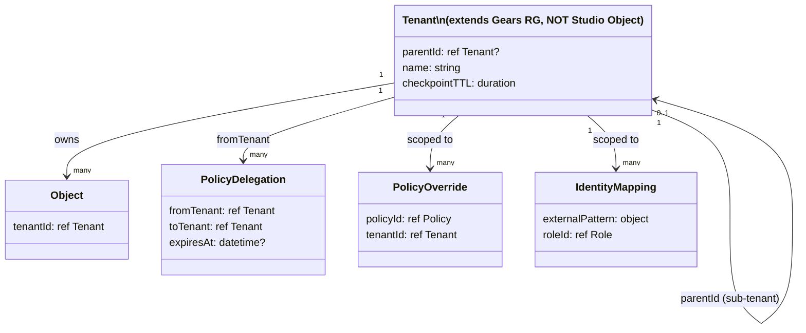
```mermaid
classDiagram
    class Tenant["Tenant\n(extends Gears RG, NOT Studio Object)"] {
        parentId: ref Tenant?
        name: string
        checkpointTTL: duration
    }
    class Object {
        tenantId: ref Tenant
    }
    class PolicyDelegation {
        fromTenant: ref Tenant
        toTenant: ref Tenant
        expiresAt: datetime?
    }
    class PolicyOverride {
        policyId: ref Policy
        tenantId: ref Tenant
    }
    class IdentityMapping {
        externalPattern: object
        roleId: ref Role
    }

    Tenant "1" --> "0..1" Tenant : parentId (sub-tenant)
    Tenant "1" --> "many" Object : owns
    Tenant "1" --> "many" PolicyDelegation : fromTenant
    Tenant "1" --> "many" PolicyOverride : scoped to
    Tenant "1" --> "many" IdentityMapping : scoped to
```

---

## 8. User

Extends Gears Account Management user type.

```
User {
  typeId: gts.cf.core.am.user.v1~cf.studio.core.user.v1~
  // inherits: id, email, display_name from Gears AM
  tenantId: ref → Tenant
}
```

---

## 9. Workspace

Multi-repo configuration. **Extends Object.**

```
Workspace extends Object {
  typeId:  gts.cf.studio.core.object.v1~cf.studio.core.workspace.v1~
  name:    string
  sources: [
    {
      repositoryId?: ref → repository  // link to synced repo Object (Connector active)
      path?:         string            // local filesystem path (CLI / local context)
      url?:          string            // remote URL — fallback when repo not yet synced
      branch?:       string            // branch override; default: repository.defaultBranch
      role:          main | docs | platform | shared | test | config
      adapter?:      string            // hint: git | github | gitlab | local
      // constraint: at least one of repositoryId, path, or url required
    }
  ]
}
```

When a Connector (GitHub/GitLab) syncs a repository, the platform resolves
`repositoryId` automatically by matching `url`. Before Connector setup, `path`
or `url` alone is sufficient (CLI-only or unsynced workspace).

### D27 — Workspace & Kit Cross-References

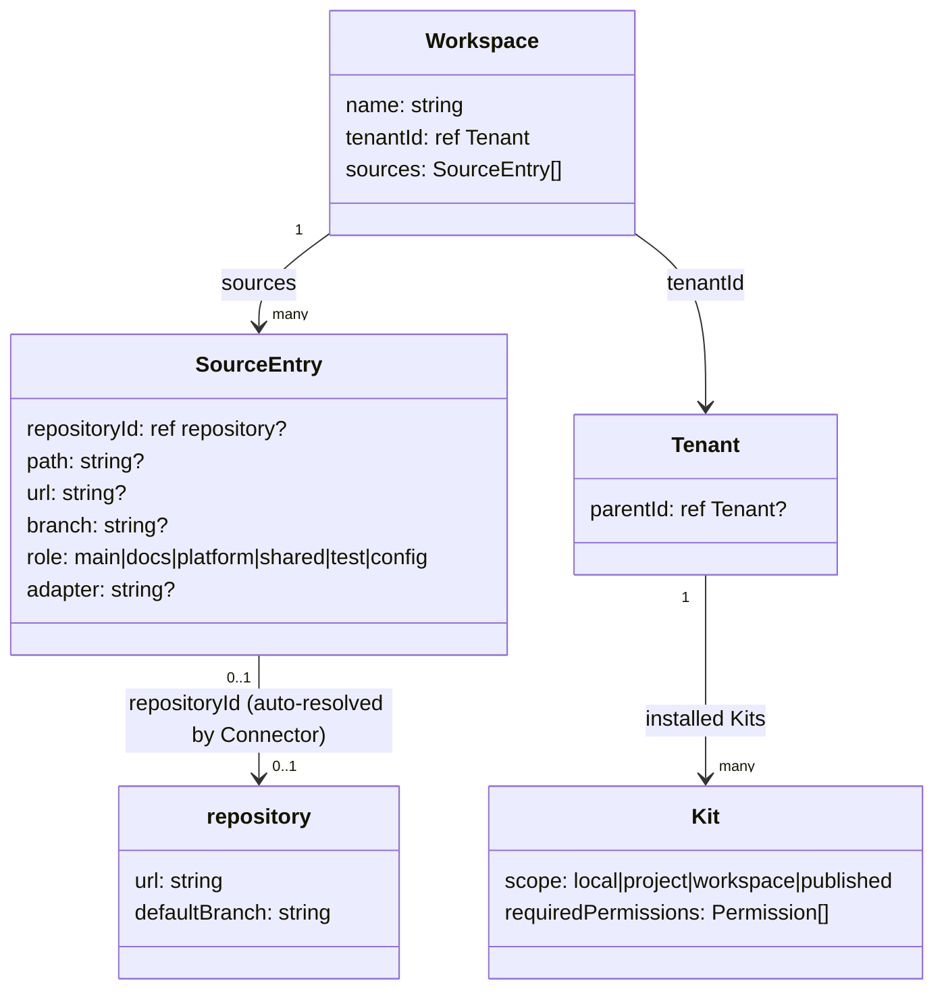
```mermaid
classDiagram
    class Workspace {
        name: string
        tenantId: ref Tenant
        sources: SourceEntry[]
    }
    class SourceEntry {
        repositoryId: ref repository?
        path: string?
        url: string?
        branch: string?
        role: main|docs|platform|shared|test|config
        adapter: string?
    }
    class repository {
        url: string
        defaultBranch: string
    }
    class Kit {
        scope: local|project|workspace|published
        requiredPermissions: Permission[]
    }
    class Tenant {
        parentId: ref Tenant?
    }

    Workspace "1" --> "many" SourceEntry : sources
    SourceEntry "0..1" --> "0..1" repository : repositoryId (auto-resolved by Connector)
    Tenant "1" --> "many" Kit : installed Kits
    Workspace --> Tenant : tenantId
```

---

## 10. Extensibility (Kit)

### 10.1 Kit — the only extension unit

A Kit packages: new Object types, Workers of all kinds (including orchestrators / Flows),
obj_ext definitions.

```
Kit scopes:
  local      ← developer's machine
  project    ← project repository
  workspace  ← workspace configuration
  published  ← marketplace / Registry
```

### 10.2 Two type extension mechanisms

**Narrowing** (new semantic type) → GTS derived type via chaining:
```
gts.cf.studio.core.object.v1~cf.studio.core.task.v1~jira.studio.core.jira_task.v1~
```

**Attribute extension** → `obj_ext` registry entity:
```
obj_ext {
  // GTS ID: gts.cf.studio.core.obj_ext.v1~jira.studio.core.jira_task_ext.v1~
  x-gts-traits: {
    extends: [ "gts.cf.studio.core.object.v1~cf.studio.core.task.v1~" ]
  }
  properties: GTS Type Schema
}
```

### D15 — Kit Extensibility (GTS Chaining)

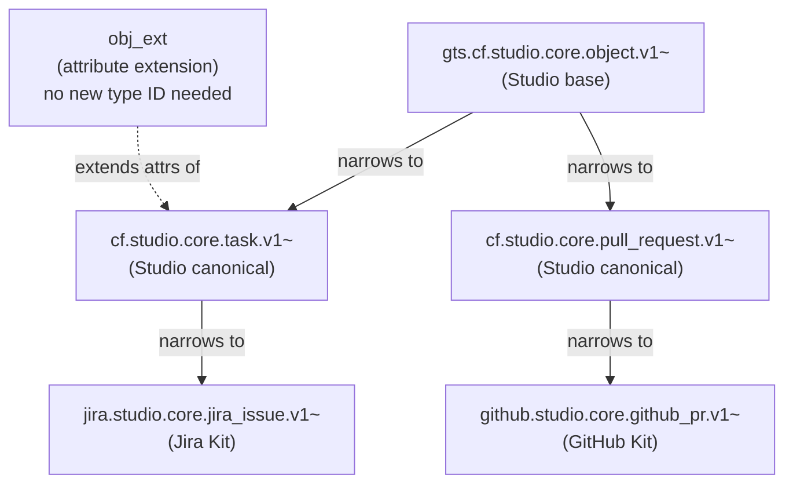
```mermaid
flowchart TD
    B1["gts.cf.studio.core.object.v1~\n(Studio base)"]
    B2["cf.studio.core.task.v1~\n(Studio canonical)"]
    B3["jira.studio.core.jira_issue.v1~\n(Jira Kit)"]
    B4["cf.studio.core.pull_request.v1~\n(Studio canonical)"]
    B5["github.studio.core.github_pr.v1~\n(GitHub Kit)"]

    B1 -->|narrows to| B2
    B2 -->|narrows to| B3
    B1 -->|narrows to| B4
    B4 -->|narrows to| B5

    OE["obj_ext\n(attribute extension)\nno new type ID needed"] -.->|extends attrs of| B2
```

### 10.3 Compatibility

- Vendor declares `compatibleWith` in Kit manifest
- Registry verifies via GTS compatibility rules at installation
- Smoke tests not run (too costly for LLM Workers)

### 10.3a Kit Semver Convention

| Semver | Change type | Examples |
|---|---|---|
| PATCH | WorkerImplementation only (same Contract) | prompt tweak, model upgrade |
| MINOR | Additive — new optional fields, new Workers, new Flows | new Worker added |
| MAJOR | Breaking — required Contract fields changed, Worker removed, FieldMapping changed | new required input field |

`changelog` in `Kit.metadata` is **required** for MAJOR version bumps.
Kit Registry rejects MAJOR publish without a non-empty changelog.

### 10.3b KitInstallation

Tenant→Kit relationship is tracked as a first-class Object:

```
KitInstallation extends Object {
  typeId:            gts.cf.studio.core.object.v1~cf.studio.core.kit_installation.v1~
  kitId:             string               // Kit registry ID
  kitVersion:        semver               // currently installed version
  tenantId:          ref → Tenant
  installedAt:       datetime
  installedBy:       ref → User
  updatePolicy:      auto | notify | manual   // default: notify
                                              // auto = PATCH only (non-breaking)
                                              // notify = MINOR + PATCH
                                              // MAJOR always requires explicit Approval regardless of policy
  state:             active | update_available | rolling_back | failed
  availableVersion?: semver               // set when update is detected
  rollbackVersion?:  semver               // previous version (for rollback)
}
```

Update flow for breaking changes:
1. Registry detects MAJOR update → `KitInstallation.state: update_available`
2. Tenant admin notified (NotificationRule)
3. Admin reviews `Kit.metadata.changelog`
4. Approval (kind: architecture_decision) required for MAJOR update
5. On approval: `rollbackVersion` saved → Kit updated
6. On failure: rollback to `rollbackVersion` (also requires Approval)

### 10.4 Permissions

```
Kit manifest:
  requiredPermissions:
    - read:  [ GTS Type Identifier, ... ]
    - write: [ GTS Type Identifier, ... ]
    - call:  [ GTS Type Identifier, ... ]
  requiredSettings:
    - { key: string, secret: boolean }    // secrets stored in Gears Credentials Store
```

- Tenant explicitly approves at installation
- Expanding permissions in new version → blocks auto-update, requires re-approval
- Reducing permissions → auto-update

### 10.5 Kit Discovery Metadata

Optional metadata for Kit marketplace discovery and governance filtering.

```
Kit manifest:
  metadata:
    displayName:            string
    description:            string
    version:                semver
    referenceArchitecture?: {
      name:        string   // e.g. "Artifact-first SDLC", "Multi-tenant SaaS Platform"
      description: string
      url?:        string   // link to architecture documentation
    }
    deploymentPatterns?: [
      saas_multitenant | service_provider | enterprise_private
      | hybrid_cloud | on_prem | any
    ]                       // default: [any] if omitted
    tags?:        string[]  // free-form discovery tags
    targetTeamSize?: { min?: int, max?: int }
    changelog?:   string    // REQUIRED for MAJOR version bumps; Kit Registry rejects without it
  mcpTools?: [              // opt-in MCP tool declarations (not auto-exposed)
    {
      workerId:    ref → Worker
      toolName:    string           // MCP tool name, e.g. "studio_create_design"
      description?: string          // overrides Worker.metadata.llmDescription
      exposed:     boolean          // default: true
    }
  ]
```

`Tenant.allowedKitPatterns` (see §7) acts as a soft governance filter: installing
a Kit whose `deploymentPatterns` do not intersect `allowedKitPatterns` requires
an explicit Approval (kind: architecture_decision) — same gate as raising automationLevel.

---

## 11. System Overview

See D1 and DO1–DO6 in the Overview section above for high-level diagrams.

### D31 — Full Object Reference Map (top-level)

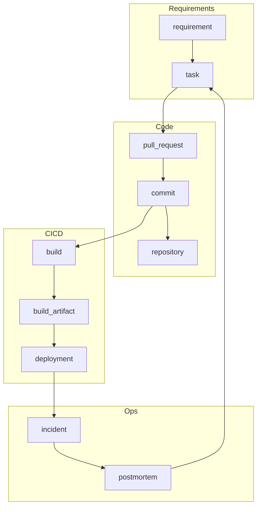
```mermaid
flowchart TD
    subgraph Requirements
        REQ["requirement"] --> TASK["task"]
    end
    subgraph Code
        TASK --> PR["pull_request"]
        PR --> CMT["commit"]
        CMT --> REPO["repository"]
    end
    subgraph CICD
        CMT --> BUILD["build"]
        BUILD --> ART["build_artifact"]
        ART --> DEP["deployment"]
    end
    subgraph Ops
        DEP --> INC["incident"]
        INC --> PM["postmortem"]
        PM --> TASK
    end
```

---

## 12. Object Lifecycle & State Transitions

### 12.1 StatePolicy

Registry entity — separates process (transitions) from data (type schema).

```
StatePolicy {
  appliesTo:   GTS Type Identifier
  scope:       tenant | kit | global
  transitions: {
    "<property>": [
      {
        from:              value
        to:                value
        requiresApproval?: {
          role:           RolePattern
          escalateAfter?: duration
          escalateTo?:    RolePattern | "reject"
        }
      }
    ]
  }
}
```

### D6 — StatePolicy & Transitions

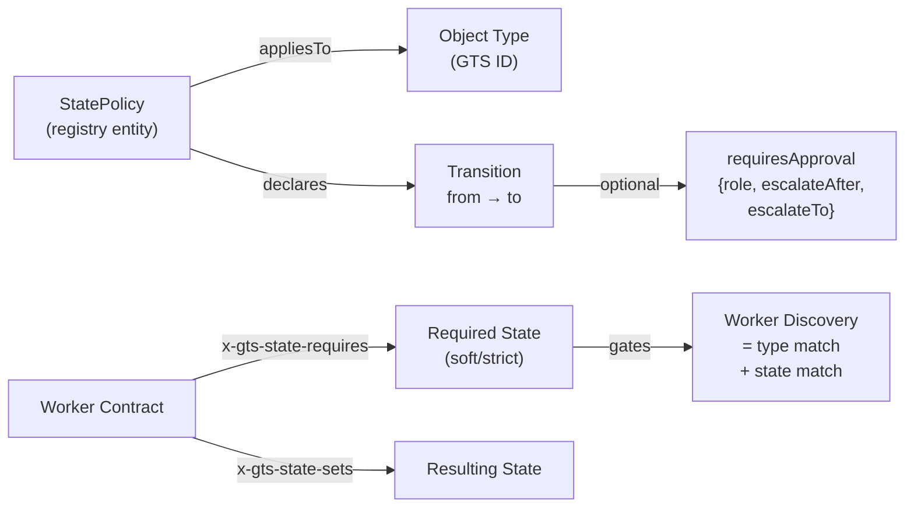
```mermaid
flowchart LR
    SP["StatePolicy\n(registry entity)"] -->|appliesTo| OT["Object Type\n(GTS ID)"]
    SP -->|declares| TR["Transition\nfrom → to"]
    TR -->|optional| RA["requiresApproval\n{role, escalateAfter,\nescalateTo}"]

    WC["Worker Contract"] -->|x-gts-state-requires| REQ["Required State\n(soft/strict)"]
    WC -->|x-gts-state-sets| SET["Resulting State"]

    REQ -->|gates| WD["Worker Discovery\n= type match\n+ state match"]
```

Tenant StatePolicy overrides Kit StatePolicy (tenant > kit > global).

### 12.2 Worker Contract — State Awareness

```json
// input Contract
"task": {
  "$ref": "gts://cf.studio.core.object.v1~cf.studio.core.task.v1~",
  "x-gts-state-requires": {
    "state": "in_progress",
    "strict": false    // default: warning + override; true = hard block
  }
}

// output Contract
"task": {
  "$ref": "gts://cf.studio.core.object.v1~cf.studio.core.task.v1~",
  "x-gts-state-sets": { "state": "review" }
}
```

**Worker Discovery** = GTS type match + state match. Contracts are always
vendor-agnostic — external states are mapped to Studio states at Kit
installation time (per Tenant config).

### 12.3 State Transition History

`StateTransitionEvent` is a **computed projection** over the WorkerRun tree.

```
StateTransitionEvent (projection) {
  objectId:    from WorkerRun input/output diff
  property:    derived
  fromValue:   WorkerRun.inputData[property]
  toValue:     WorkerRun.outputData[property]
  workerRunId: WorkerRun.id
  timestamp:   WorkerRun.timestamp
  evidence?:   WorkerRun.outputData[evidence]
}
```

---

## 13. Role, Policy & Authorization

### D7 — Authorization Model

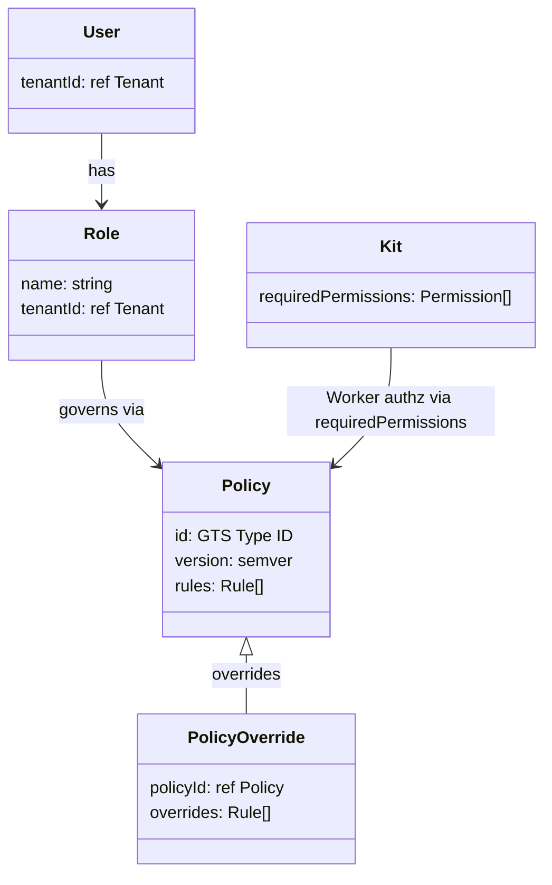
```mermaid
classDiagram
    class Policy {
        id: GTS Type ID
        version: semver
        rules: Rule[]
    }
    class PolicyOverride {
        policyId: ref Policy
        overrides: Rule[]
    }
    class Role {
        name: string
        tenantId: ref Tenant
    }
    class User {
        tenantId: ref Tenant
    }
    class Kit {
        requiredPermissions: Permission[]
    }

    User --> Role : has
    Role --> Policy : governs via
    Policy <|-- PolicyOverride : overrides
    Kit --> Policy : Worker authz via requiredPermissions
```

### 13.1 Role

```
Role extends Object {
  typeId:   gts.cf.studio.core.object.v1~cf.studio.core.role.v1~
  name:     string
  tenantId: ref → Tenant
}
```

### 13.2 Permission

Extends Gears authz permission base type.

```
Permission {
  typeId:        gts.cf.toolkit.authz.permission.v1~cf.studio.core.permission.v1~
  resource_type: GTS Type Identifier (wildcard ok)
  action:        string
  display_name:  string
}
```

### 13.3 Policy & PolicyOverride

**`Policy`** — registry entity (Kit, versioned as code).
**`PolicyOverride`** — Object in graph (Tenant runtime corrections).
Priority: `PolicyOverride > Policy` (Override cannot expand beyond Policy).

```
Policy (registry) {
  id:      GTS Type Identifier
  version: semver
  rules: [
    {
      principal:      Role pattern
      action:         "run" | "read" | "write" | "delete"
      target:         GTS Type Identifier (wildcard ok)
      condition?:     ref → Worker    // { principal, object, action } → { allowed, reason }
                                     // pre-built: is_assigned_to_principal_worker,
                                     //            is_workspace_member_worker, is_object_owner_worker
      conditionCache: { ttl: duration }    // default: 60s
      // Phase 3 TODO: allowedFields?: string[] — field-level restriction (not yet implemented)
    }
  ]
}

PolicyOverride extends Object {
  typeId:    gts.cf.studio.core.object.v1~cf.studio.core.policy_override.v1~
  policyId:  ref → Policy
  tenantId:  ref → Tenant
  overrides: Policy.rules[]    // can only narrow
}
```

### 13.4 Authorization Model

| Subject | Mechanism |
|---|---|
| **User** | `Role` + `Policy` / `PolicyOverride` |
| **Worker** | `Kit.requiredPermissions` (approved at Kit installation) |

Worker→Worker: implicit via `dependencies` — both Kits approved by Tenant → call authorized.

### 13.5 IdentityMapping

```
IdentityMapping extends Object {
  typeId: gts.cf.studio.core.object.v1~cf.studio.core.identity_mapping.v1~
  externalPattern: {
    provider: GTS Type Identifier    // from SSO Kit, GitHub Kit, etc.
    pattern:  string
  }
  roleId:   ref → Role
  tenantId: ref → Tenant
  active:   boolean
}
```

### D28 — Role & Identity Cross-References

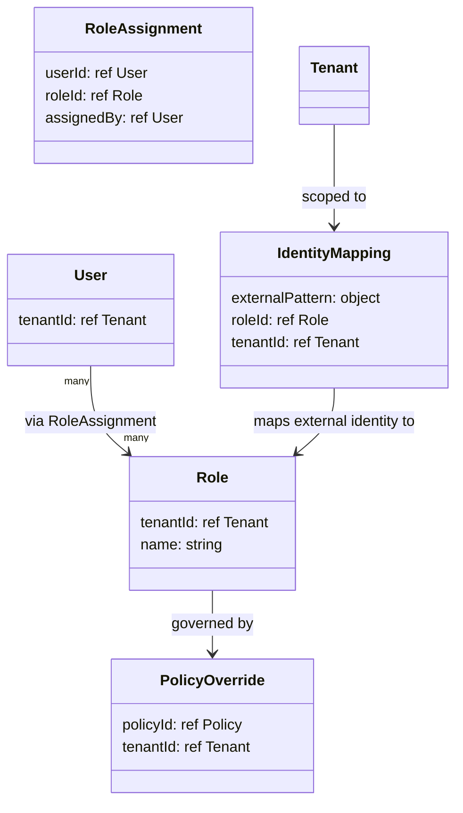
```mermaid
classDiagram
    class User {
        tenantId: ref Tenant
    }
    class Role {
        tenantId: ref Tenant
        name: string
    }
    class RoleAssignment {
        userId: ref User
        roleId: ref Role
        assignedBy: ref User
    }
    class IdentityMapping {
        externalPattern: object
        roleId: ref Role
        tenantId: ref Tenant
    }
    class PolicyOverride {
        policyId: ref Policy
        tenantId: ref Tenant
    }

    User "many" --> "many" Role : via RoleAssignment
    IdentityMapping --> Role : maps external identity to
    Role --> PolicyOverride : governed by
    Tenant --> IdentityMapping : scoped to
```

### 13.6 Tenant Policy Hierarchy

Sub-Tenant inherits parent Policy. Default: **narrowing only**.

`PolicyDelegation` — parent explicitly grants specific rights downward:

```
PolicyDelegation extends Object {
  typeId:      gts.cf.studio.core.object.v1~cf.studio.core.policy_delegation.v1~
  fromTenant:  ref → Tenant
  toTenant:    ref → Tenant
  permissions: [ { action: string, target: GTS Type Identifier } ]
  expiresAt:   datetime?
}
```

---

## 14. AuditLog

### 14.1 Storage Model

Materialized view over WorkerRun tree (CQRS + Event Sourcing).
Source of truth: WorkerRun tree.

Critical events: `auditMode: sync`. Others: `auditMode: async` (default).
Tenant can override per Worker via PolicyOverride.

Materialized view: `WorkerRun tree → AuditLog`.

### D8 — AuditLog & History

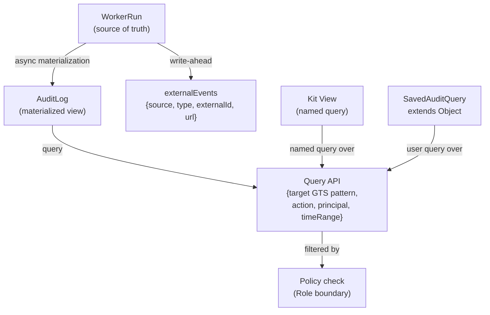
```mermaid
flowchart TD
    WR["WorkerRun\n(source of truth)"] -->|async materialization| AL["AuditLog\n(materialized view)"]
    WR -->|write-ahead| EV["externalEvents\n{source, type, externalId, url}"]

    AL -->|query| API["Query API\n{target GTS pattern,\naction, principal, timeRange}"]
    API -->|filtered by| POL["Policy check\n(Role boundary)"]

    KV["Kit View\n(named query)"] -->|named query over| API
    SAQ["SavedAuditQuery\nextends Object"] -->|user query over| API
```

### 14.2 Query API & Views

```
auditLog.query({
  target:     GTS pattern,
  action?:    string,
  principal?: string,
  timeRange?: { from, to }
})
```

| View Type | Source | Creator |
|---|---|---|
| Kit View | Named queries in Kit | Vendor |
| User View | `SavedAuditQuery extends Object` | User via UI |

```
SavedAuditQuery extends Object {
  typeId:    gts.cf.studio.core.object.v1~cf.studio.core.saved_audit_query.v1~
  name:      string
  query:     { target, action?, principal?, timeRange? }
  tenantId:  ref → Tenant
  createdBy: ref → User
}
```

### D29 — AuditLog & SavedQuery Cross-References

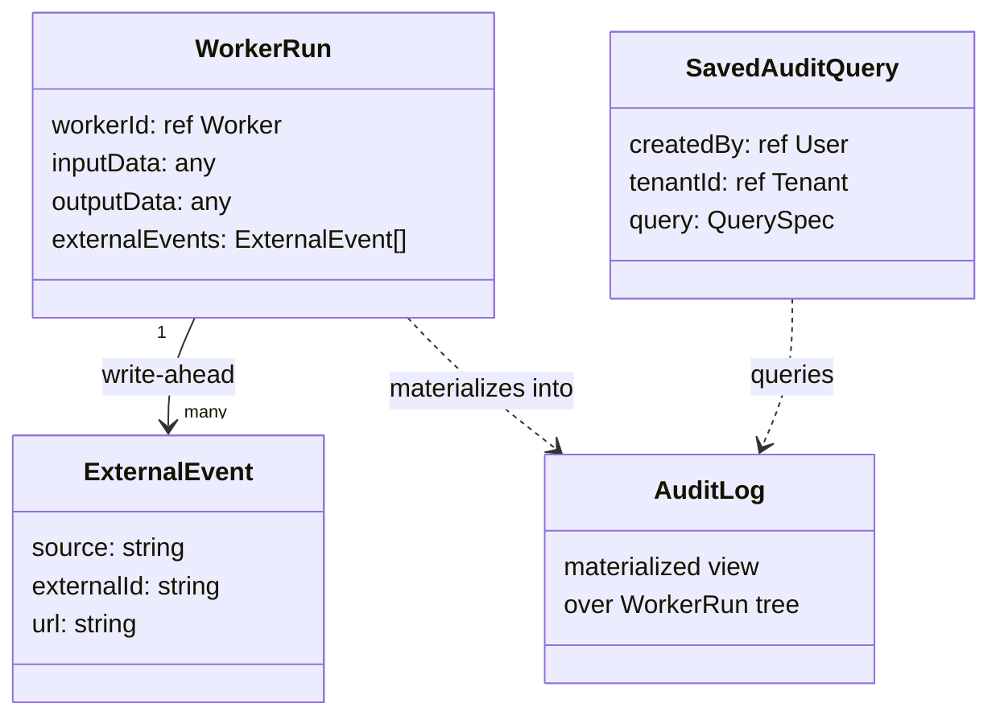
```mermaid
classDiagram
    class WorkerRun {
        workerId: ref Worker
        inputData: any
        outputData: any
        externalEvents: ExternalEvent[]
    }
    class ExternalEvent {
        source: string
        externalId: string
        url: string
    }
    class SavedAuditQuery {
        createdBy: ref User
        tenantId: ref Tenant
        query: QuerySpec
    }
    class AuditLog {
        materialized view
        over WorkerRun tree
    }

    WorkerRun "1" --> "many" ExternalEvent : write-ahead
    WorkerRun ..> AuditLog : materializes into
    SavedAuditQuery ..> AuditLog : queries
```

### 14.3 Retention

Declared per Worker in Kit. Tenant can override globally.
Default `retentionAction: archive` (cold storage). Hard delete only when
explicitly configured or required by compliance.

### 14.4 Export

Core `audit_exporter` Worker pre-installed in every Tenant (webhook, JSON).
Vendor-specific formats (Splunk, Datadog, Elastic) via Kits.

---

## 15. Recommendation

### 15.1 Recommendation Object

```
Recommendation extends Object {
  typeId:            gts.cf.studio.core.object.v1~cf.studio.core.recommendation.v1~
  state:             pending | accepted | executing | done | dismissed | invalidated
  sourceRunId:       ref → WorkerRun
  suggestedWorker:   ref → Worker
  suggestedInput:    Contract data         // refreshed on Re-check
  reason:            string
  severity:          info | warning | critical
  severityWorker?:   ref → Worker          // dynamic severity recompute
  confidence:        full | partial | low  // partial = external systems unavailable
  validationWorker?: ref → Worker          // auto/manual invalidation
}
```

### D9 — Recommendation Lifecycle


```mermaid
flowchart TD
    AW["Analyzer Worker\n(defaultSchedule/eventTrigger)"] -->|creates| REC["Recommendation\nextends Object"]

    REC -->|state| S1[pending]
    S1 -->|user accepts| S2[accepted]
    S2 -->|Worker runs| S3[executing]
    S3 --> S4[done]
    S1 -->|user dismisses| S5[dismissed]
    S1 -->|Re-check / auto| S6[invalidated]

    REC -->|validationWorker| VW["Validation Worker\n(re-check + refresh input)"]
    REC -->|suggestedWorker| SW["Suggested Worker\n(actionable fix)"]
```

### 15.2 Analyzer Workers

Detect gaps and create Recommendations. Use `eventTrigger` (capability binding)
and `WorkerImplementation.defaultSchedule` (deployment default). `canInvokeOnDemand: true`.

Read external systems via `dependencies` (standard composability).
On external system unavailability → `confidence: partial` instead of failure.

### 15.3 Re-check & Accepting

**Re-check** (manual or automatic via `validationWorker`):
- Checks if gap still exists
- Refreshes `suggestedInput` to current Object state
- Recomputes `severity` if `severityWorker` set

**Accepting**:
```
User accepts → Re-check runs → diff shown if inputs changed
  → user confirms → suggestedWorker launched → state: executing → done
```

### D26 — Recommendation Cross-References

```mermaid
classDiagram
    class Recommendation {
        sourceRunId: ref WorkerRun
        suggestedWorker: ref Worker
        validationWorker: ref Worker?
        severityWorker: ref Worker?
        confidence: full|partial|low
    }
    class WorkerRun {
        workerId: ref Worker
    }
    class Worker {
        id: GTS Type ID
    }
    class Object {
        id: GTS Instance ID
    }

    Recommendation --> WorkerRun : sourceRunId (Analyzer that found gap)
    Recommendation --> Worker : suggestedWorker (actionable fix)
    Recommendation --> Worker : validationWorker (re-check)
    WorkerRun --> Object : gap detected in (input/output)
    Worker --> Object : fix will produce (output Contract)
```

---

## 16. Events

Studio is built on **Constructor Fabric Gears**. Event infrastructure
(bus, routing, delivery, backpressure, authz filtering) — Gears Events Broker.
Studio defines event types via GTS.

### D10 — Events & Notifications

```mermaid
flowchart LR
    OBJ["Object change"] -->|emits| EB["Gears Events Broker\n(GTS-typed events)"]
    EB -->|authz filtered| NR["NotificationRule\n(registry, from Kit)"]
    NR -->|delivers via| NS["Gears Notifications\nService"]
    NS -->|channels| CH["in_app / email\nwebhook / Slack..."]

    NSU["NotificationSubscription\nextends Object"] -->|personal filter| EB
    NRO["NotificationRuleOverride\nextends Object"] -->|on/off + expiresAt| NR
```

### 16.1 Studio Event Types

Studio event types extend the Gears platform event base type
`gts.cf.core.events.type.v1~` — Studio does **not** define its own base
event type.

```
// Object lifecycle
gts.cf.core.events.type.v1~cf.studio.core.object_created.v1~
gts.cf.core.events.type.v1~cf.studio.core.object_updated.v1~
gts.cf.core.events.type.v1~cf.studio.core.object_deleted.v1~

// State transitions
gts.cf.core.events.type.v1~cf.studio.core.state_changed.v1~

// WorkerRun
gts.cf.core.events.type.v1~cf.studio.core.worker_run_started.v1~
gts.cf.core.events.type.v1~cf.studio.core.worker_run_completed.v1~
gts.cf.core.events.type.v1~cf.studio.core.worker_run_cancelled.v1~
gts.cf.core.events.type.v1~cf.studio.core.worker_interaction_created.v1~
gts.cf.core.events.type.v1~cf.studio.core.worker_interaction_answered.v1~

// Recommendations
gts.cf.core.events.type.v1~cf.studio.core.recommendation_created.v1~
gts.cf.core.events.type.v1~cf.studio.core.recommendation_invalidated.v1~

// Kit lifecycle
gts.cf.core.events.type.v1~cf.studio.core.kit_installed.v1~
gts.cf.core.events.type.v1~cf.studio.core.kit_updated.v1~

// EventSubscription delivery
gts.cf.core.events.type.v1~cf.studio.core.event_delivery_failed.v1~
```

Wildcard-based authz example (per Gears GTS guidelines):
```
gts.cf.core.events.type.v1~cf.studio.core.*   ← all Studio events
gts.cf.core.events.type.v1~cf.studio.core.object_*  ← only Object lifecycle events
```

Gears Events Broker has built-in authz — subscribers receive only events
for Objects they have Policy rights to read.

---

## 17. Notifications

Studio defines rules; Gears Notifications Service delivers.

### 17.1 NotificationRule

Registry entity from Kit.

```
NotificationRule (registry) {
  id:       GTS Type Identifier
  trigger:  { onEvent: GTS pattern, debounce?: duration }
  audience: RolePattern
  channel:  "in_app" | "email" | "webhook" | GTS Type Identifier (vendor)
  template: string    // primary Object data + Studio deep link only
  digest?:  {
    window:   duration
    maxItems: int
    groupBy:  "objectId" | "eventType" | "none"    // default: "none"
  }
}
```

### 17.2 NotificationRuleOverride

Runtime on/off without Kit release.

```
NotificationRuleOverride extends Object {
  typeId:    gts.cf.studio.core.object.v1~cf.studio.core.notification_rule_override.v1~
  ruleId:    ref → NotificationRule
  active:    boolean
  expiresAt: datetime?
}
```

### 17.3 NotificationSubscription

Personal user subscriptions on top of Kit rules.

```
NotificationSubscription extends Object {
  typeId:    gts.cf.studio.core.object.v1~cf.studio.core.notification_subscription.v1~
  userId:    ref → User
  tenantId:  ref → Tenant
  filter: {
    eventPattern:  GTS pattern
    severity?:     string[]
    objectFilter?: GTS pattern
  }
  channel:  "in_app" | "email" | "webhook" | GTS Type Identifier
  urgency:  immediate | digest | muted
  active:   boolean
}
```

### D30 — Notification Cross-References

```mermaid
classDiagram
    class NotificationRule {
        trigger: EventPattern
        audience: RolePattern
        channel: string
    }
    class NotificationRuleOverride {
        ruleId: ref NotificationRule
        active: boolean
        expiresAt: datetime?
    }
    class NotificationSubscription {
        userId: ref User
        tenantId: ref Tenant
        urgency: immediate|digest|muted
    }
    class User {
        tenantId: ref Tenant
    }

    NotificationRuleOverride --> NotificationRule : ruleId
    NotificationSubscription --> User : userId
    User --> NotificationSubscription : personal subscriptions
    NotificationRule --> NotificationRuleOverride : overridden by
```

### 17.4 Channels

**Core (Gears, pre-installed):** `in_app`, `email`, `webhook`

**Vendor Kits** register additional channels. Kit declares `requiredSettings`
for credentials; Tenant fills via Gears Credentials Store. No secrets in Kit.
// Note: Gears Settings Service = preferences/feature flags (not secrets)

---

## 18. Validator & Validation Loop

### 18.1 Validator

Derived from Worker. Adds retry/escalation semantics.

```
Validator extends Worker {
  // GTS: gts.cf.studio.core.worker.v1~cf.studio.core.validator.v1~
  maxRetries:   int            // default: 3 (Kit) → Tenant override → call
  escalateTo:   RolePattern?   // who decides on limit reached
  abortOnLimit: boolean        // default: false
  // output Contract always includes ValidationResult
}
```

Three-level policy: Kit defaults → Tenant override (narrowing only) → call (narrowing only).

### 18.2 ValidationSession

Aggregates the full retry loop for one Validator run on one Object.

```
ValidationSession extends Object {
  typeId:      gts.cf.studio.core.object.v1~cf.studio.core.validation_session.v1~
  validatorId: ref Validator
  targetId:    ref Object          // what is being validated
  state:       running|pass|fail|escalated|aborted
  retryCount:  int
  maxRetries:  int
  runs:        WorkerRun[]         // all attempts
  evidenceId:  ref Evidence?       // final Evidence on pass
}
```

### 18.3 ValidationResult

Output of one Validator WorkerRun. Independent lifecycle.

```
ValidationResult extends Object {
  typeId:      gts.cf.studio.core.object.v1~cf.studio.core.validation_result.v1~
  sessionId:   ref ValidationSession
  validatorId: ref Validator
  targetId:    ref Object
  workerRunId: ref WorkerRun
  state:       pass|fail|superseded|revoked
  reason:      string
  evidenceId:  ref Evidence?
  revokedBy:   ref User?
  revokedAt:   datetime?
}
```

### 18.4 Evidence

Structured proof that an action or validation occurred and is valid.

```
Evidence extends Object {
  typeId:      gts.cf.studio.core.object.v1~cf.studio.core.evidence.v1~
  workerRunId: ref WorkerRun      // who produced it
  targetId:    ref Object         // what it proves
  kind:        validation|approval|execution|review
  payload:     GTS Type Schema    // structured proof data
  state:       valid|superseded|revoked
}
```

Worker output Contract declares `produces: evidence` when it generates Evidence.

### 18.5 WorkerRun State Machine (updated)

```
pending → running → awaiting_input  (WorkerInteraction created; waiting for user)
                 → paused           (pausePoint reached; awaiting human resume)
                 → done
                 → failed           (error, can retry)
                 → escalated        (awaiting Approval from human)
                 → aborted          (limit reached or human rejected)

awaiting_input → running    (WorkerInteraction answered)
awaiting_input → aborted    (timeoutAction: abort OR cancel())
awaiting_input → escalated  (timeoutAction: escalate)

paused → running  (human resumes)
paused → aborted  (timeoutAction: abort OR cancel())

// cancel(workerRunId, cascade: boolean = true)
//   → state: aborted, cancelledBy = User
//   → active WorkerInteraction.state → cancelled
//   → if cascade: child WorkerRuns → aborted
```

### 18.6 Escalation Flow

```
ValidationSession.retryCount >= maxRetries
  → CREATE Approval {
      kind:         "risk_acceptance" | custom
      sessionId:    ref ValidationSession
      requiredRole: Validator.escalateTo
      question:     "Validation failed N times. Proceed?"
    }
  → ValidationSession.state = escalated
  → WorkerRun.state = escalated

Human approves  → resume → new WorkerRun
Human rejects   → ValidationSession.state = aborted
```

---

## 19. Connector

Registry entity in Kit. Uses Gears OAGW as networking infrastructure.

```
Connector (registry) {
  id:           GTS Type Identifier  (gts.cf.studio.core.connector.v1~...)
  sourceSystem: string               // "jira", "github", "datadog"
  oagwUpstreamRef: string            // Gears Outbound API Gateway upstream resource ID
                                     // created at Kit install via Outbound API Interface
  rateLimit: {
    requestsPerHour: int
    burstSize:       int
    retryAfter:      duration
  }
  syncProtocol: {
    push?: {
      webhookPath:     string
      secret:          ref requiredSettings
      supportedEvents: string[]
    }
    pull?: {
      interval:    duration
      pageSize:    int
      incremental: boolean
    }
    preferred: push|pull             // default: push if available
  }
  fieldMappings: FieldMapping[]
  writeBackPolicy: WriteBackPolicy
  workerIds:    Worker[]
}
```

### 19.1 FieldMapping

```
FieldMapping {
  externalField:    string
  studioField:      string         // dot-notation: "obj_ext.jira_priority"
  kind:             direct|lookup|transform
  lookupTable?:     { [externalValue]: studioValue }
  transformWorker?: ref Worker
}
```

### 19.2 WriteBackPolicy

```
WriteBackPolicy {
  allowedActions:   string[]       // ["create:task", "update:task.state"]
  requiresApproval: boolean        // default: false
  conflictStrategy: overwrite|skip|merge|escalate  // default: escalate
}
```

### 19.3 Scope Filter (per Tenant)

Configured at Kit installation time. Schema declared by Connector Kit via GTS Type Schema.

```
// example: Jira Connector scopeFilter
scopeFilter: {
  "projects":   ["STUDIO", "PLATFORM"],
  "issueTypes": ["Bug", "Story", "Epic"],
  "maxAge":     "180d"
}
```

---

## 20. Staleness Model

### 20.1 stalenessScore Formula

```
timeStaleness       = (now - updatedAt) / type.stalenessPolicy.timeTTL
dependencyStaleness = 1.0 if any linked Object in dependencyTypes changed after updatedAt
syncStaleness       = (now - externalRef.lastSyncedAt) / connector.syncExpectedInterval
                      // only for Objects with externalRef

stalenessScore = max(timeStaleness, dependencyStaleness, syncStaleness)
```

### 20.2 Staleness Policy (in x-gts-traits)

Declared per Object type. Tenant can override via `obj_ext`.

```json
"x-gts-traits": {
  "stalenessPolicy": {
    "timeTTL":                 "14d",
    "dependencyTypes":         ["gts...design.v1~", "gts...requirement.v1~"],
    "recommendationThreshold": 0.7
  }
}
```

### 20.3 Staleness Analyzer

`stale_artifact_detection` Analyzer Worker (from Flow Library):
- Updates `stalenessScore` on affected Objects
- Profile: `realtime`; `defaultSchedule: "*/15 * * * *"`; `eventTrigger.debounce: 5m`
- Creates `Recommendation` when `stalenessScore >= recommendationThreshold`

---

## 21. Approval & Human Control Points

```
Approval extends Object {
  typeId:          gts.cf.studio.core.object.v1~cf.studio.core.approval.v1~
  kind:            risk_acceptance|security_exception|release_approval
                   |architecture_decision|custom
  requiredRole:    RolePattern
  state:           pending|approved|rejected|expired
  payload:         GTS Type Schema (typed per kind)
  sessionId?:      ref ValidationSession   // if from Validator escalation
  decidedBy:       ref User?
  decidedAt:       datetime?
  expiresAt:       datetime?
  customerImpact?: {
    scope:         none|internal|subset|all
    affectedUsers: string?
    rollbackPlan:  string?
  }
  // Chain support:
  prerequisiteApprovalId?: ref → Approval  // blocked until prerequisite is approved
  stepNumber?:             int              // 1-based position in chain
  totalSteps?:             int              // total chain length
  approvalSetId?:          string           // UUID; all Approvals in set must be approved
  distinctApprovers?:      boolean          // default: true in sets; prevents single-person all-approval
  // Delegation:
  delegatedBy?:            ref → User       // original required approver
  delegatedTo?:            ref → User       // delegate (platform validates role compatibility)
  delegatedAt?:            datetime
}
```

### 21.1 Security Exception Payload

```json
{
  "expiresAt":        "2026-10-01T00:00:00Z",
  "acceptedRisk":     "Known XSS in legacy component",
  "mitigations":      ["WAF rule", "monitoring alert"],
  "secondaryApprover": "user-456",
  "autoReviewAfter":  "90d"
}
```

`autoReviewAfter` triggers a new `Approval` via scheduled Worker.

---

## 22. Flow Library Catalog

### 22.1 Analyzer Workers (12) — detect gaps → create Recommendations

All Analyzers are read-only except `stale_artifact_detection` which also writes `Object.stalenessScore`.

**Supersedes chain awareness:** `gap_analysis` and `traceability_analysis` understand the supersedes chain.
If requirement_v1 has ValidationSession (tested) and requirement_v2 supersedes requirement_v1:
→ Recommendation: "requirement R-17 v2 requires new validation" (not "untested").
Analyzers traverse `links[kind=supersedes]` to find the versioning chain.

| Name | Runtime | Profile | Input Objects | Output |
|---|---|---|---|---|
| `gap_analysis` | hybrid | scheduled | requirement, task, test_case, pull_request | Recommendation[] |
| `traceability_analysis` | hybrid | scheduled | requirement, design, task, pull_request, test_case | TraceabilityReport + Recommendation[] |
| `contradiction_detection` | llm | on_demand | document[] (any two or more) | Recommendation[] |
| `bloat_detection` | hybrid | on_demand | requirement[], task[] | Recommendation[] |
| `stale_artifact_detection` | script | realtime | Object (wildcard — any type) | **Object.stalenessScore updated** + Recommendation[] |
| `ownership_gap_analysis` | script | realtime | Object (wildcard — ownerId == null) | Recommendation[] |
| `duplicate_work_detection` | llm | on_demand | task[], requirement[] | Recommendation[] |
| `architecture_drift_detection` | hybrid | scheduled | component, component_dependency, design | Recommendation[] |
| `security_impact_analysis` | hybrid | scheduled | pull_request, vulnerability, security_finding | Recommendation[] |
| `test_gap_detection` | hybrid | scheduled | requirement, test_case | Recommendation[] |
| `operations_metrics_analysis` | hybrid | scheduled | slo, sli, metric_definition, alert | Recommendation[] |
| `ai_cost_efficiency_analysis` | script | scheduled | WorkerRun[] (runtime: llm\|hybrid) | CostReport + Recommendation[] |

### 22.2 Flows — mandatory step sequences

**Note on Runbook execution:** Runbook execution is implemented as a Kit-specific Flow
(kind: orchestrator). A `runbook` document defines the steps; a Kit packages a
corresponding Flow with `steps[]` derived from the runbook procedure. There is no
single `runbook_execution_worker` — each runbook step becomes a Flow step Worker.

**`bug_to_fix_pr_flow`** — Killer Workflow 1:
```
entryConstraints:  bug (state: open)
mandatorySteps:    bug_description_validator
                   confirm_test_fails_validator
                   confirm_test_passes_validator
allowedNextSteps:
  bug_description_validator   → find_suspected_component
  find_suspected_component    → deploy_test_environment
  deploy_test_environment     → reproduce_bug
  reproduce_bug               → create_failing_test
  create_failing_test         → confirm_test_fails_validator
  confirm_test_fails_validator → implement_fix
  implement_fix               → confirm_test_passes_validator
  confirm_test_passes_validator → create_pr
```

**`release_readiness_review`** — Killer Workflow 2 gate:
```
entryConstraints:  release (state: candidate)
mandatorySteps:    gap_analysis_validator
                   test_coverage_validator   (>= 80%)
                   security_scan_validator
                   tech_lead_approval
```

**`incident_to_postmortem_flow`** — Incident postmortem automation:
```
entryConstraints:  incident (state: resolved)
mandatorySteps:    incident_summary_validator
                   postmortem_draft_worker
                   prevention_tasks_worker
allowedNextSteps:
  incident_summary_validator → postmortem_draft_worker
  postmortem_draft_worker    → prevention_tasks_worker
```

### 22.3 Validator Workers

Validators referenced by Flows and Killer Workflows:

| Worker | Runtime | Profile | Flow / Scenario |
|---|---|---|---|
| `bug_description_validator` | hybrid | realtime | `bug_to_fix_pr_flow` mandatory step 1 |
| `confirm_test_fails_validator` | script | realtime | `bug_to_fix_pr_flow` mandatory step 2 |
| `confirm_test_passes_validator` | script | realtime | `bug_to_fix_pr_flow` mandatory step 3 |
| `gap_analysis_validator` | hybrid | realtime | `release_readiness_review` mandatory step 1 |
| `test_coverage_validator` | script | realtime | `release_readiness_review` mandatory step 2 |
| `security_scan_validator` | hybrid | realtime | `release_readiness_review` mandatory step 3 |
| `pr_design_validator` | hybrid | realtime | SDLC Kit: PR → design conformance (§23.3) |
| `incident_summary_validator` | hybrid | realtime | `incident_to_postmortem_flow` mandatory step 1 |

### 22.4 Worker Metadata

All Workers and Flows carry UI metadata:
```
metadata: {
  displayName: string
  description: string
  category:    quality|security|ops|ai-cost|traceability
  icon?:       string
  profile:     realtime|scheduled|on_demand
}
```

---

## 23. Traceability Cross-References (Killer Workflows)

Studio uses a **two-layer link model**:

1. **`Object.links[]`** — generic Jira-style typed graph edges (see §1.1) for contextual
   relationships. Used for: prd→design (derived_from), design→adr (references), etc.
   Traversed via: `GET /objects/{id}/links?kind=...&depth=N&direction=outgoing|incoming`

2. **Spec-level Contract fields** — explicit refs required by Validator Workers:
   `pull_request.conformsToDesign`, `pull_request.implementsRequirements`,
   `test_case.verifiesRequirements`. Contract inputs — NOT in `links[]`.

**Mixed traversal pattern** (used by `traceability_analysis`):

```
// task.links = [{ targetId: requirement, kind: implements }]
// Direction: task ──→ requirement (task implements requirement)
// Traversal from requirement: GET /objects/{req_id}/links/incoming?kind=implements

requirement ←──[links[]: implements]── task   (task declares it implements requirement)
  task ←── pull_request.closesIssues          (spec-level Contract field)
       pull_request.verifiedBy ──→ test_case  (spec-level Contract field)
```

Note: `links[]` traversal uses **incoming direction** when starting from requirement.
Platform API: `GET /objects/{id}/links?direction=incoming|outgoing|both`.

`traceability_analysis` uses BOTH mechanisms — they serve different purposes and
are not interchangeable. Platform provides unified Object fetch API for both paths.

### D19 — SDLC Traceability Chain

```mermaid
flowchart LR
    REQ["requirement"] -->|implemented by| TASK["task"]
    TASK -->|closed by| PR["pull_request"]
    PR -->|triggers| BUILD["build"]
    BUILD -->|produces| ART["build_artifact"]
    ART -->|deployed as| DEP["deployment"]
    DEP -->|targets| ENV["environment"]
```

### D20 — Design-to-Code Traceability

```mermaid
flowchart LR
    PRD["prd"] -->|elaborated by| DES["design"]
    DES -->|decomposed into| DEC["decomposition"]
    DEC -->|specifies| FS["feature_spec"]
    FS -->|implemented in| SF["source_file"]
    SF -->|lives in| REPO["repository"]
```

### 23.1 pull_request references

```
pull_request {
  closesIssues:          task[]           // tasks resolved by this PR
  implementsRequirements: requirement[]   // requirements implemented
  conformsToDesign:      design[]         // design documents validated against
  verifiedBy:            test_case[]      // tests that verify the fix
}
```

### 23.2 test_case references

```
test_case {
  verifiesRequirements: requirement[]    // direct coverage link
  verifiesFeature?:     feature_spec     // optional detailed spec
}
```

### 23.3 pr_design_validator (SDLC Kit)

```
pr_design_validator extends Validator {
  runtime: hybrid
  profile: realtime
  trigger: { onEvent: { pattern: state_changed, filter: "pull_request → review" } }
  input:   { pull_request, design[], acceptance_criteria[] }
  output:  { validation_result, evidence }
}
```

---

## 24. SDLC Workers (producers)

These Workers are the "executable edges" of the Studio graph — they drive state
transitions between Objects and may write back to external systems. All have
`requiresAutomationGate: true` and require Gate 1 before a WorkerRun is created.

In Studio UI they appear as **Actions** (clickable buttons) when the user has
sufficient permissions and `automationLevel >= approved_automation`.

### 24.1 Worker Catalog

| Worker | Runtime | Profile | Input → Output |
|---|---|---|---|
| `create_design_worker` | llm | on_demand | prd → design |
| `decompose_feature_worker` | llm | on_demand | design → decomposition + task[] |
| `implement_code_worker` | llm | on_demand | feature_spec → source_file[] |
| `create_pr_worker` | hybrid | on_demand | source_file[], branch → pull_request |
| `deploy_worker` | script | on_demand | build_artifact, environment → deployment |
| `create_postmortem_worker` | llm | on_demand | incident → postmortem |
| `find_suspected_component` | hybrid | on_demand | bug → component[] |
| `deploy_test_environment` | script | on_demand | component → environment |
| `reproduce_bug` | hybrid | on_demand | bug, environment → WorkerRun (repro evidence) |
| `create_failing_test` | llm | on_demand | bug, reproduce output → test_case |
| `implement_fix` | llm | on_demand | bug, test_case → source_file[] |
| `postmortem_draft_worker` | llm | on_demand | incident, WorkerRun[] → postmortem |
| `prevention_tasks_worker` | hybrid | on_demand | postmortem → task[] |
| `alert_to_incident_worker` | hybrid | onEvent | alert [sync: datadog\|pagerduty] → incident (open) + on_call assignment; `eventTrigger.pattern: object_created, filter: typeId=alert.v1~` |
| `incident_triage_worker` | llm | on_demand | incident, alert[], recent WorkerRun[] → incident.severity updated + task[] (triage) |
| `deployment_rollback_worker` | script | on_demand | deployment (failed), build_artifact (previous) → deployment (rollback); Gate 2 for prod |

### 24.2 Approval Gates

Workers with `requiresAutomationGate: true` are governed by two independent gates:

**Gate 1 — Studio execution gate** (checked at WorkerRun creation):
```
Worker.requiresAutomationGate == true
AND automationLevel >= approved_automation
AND Worker.metadata.category in Tenant.approvedWorkerCategories
```

**Gate 2 — Connector write-back gate** (checked before external system write):
```
WriteBackPolicy.requiresApproval == true
→ CREATE Approval { kind: "custom", requiredRole: ... }
→ await approval before executing write-back
```

Gate 1 controls whether Studio can run the Worker at all.
Gate 2 controls whether the Worker's output can be written back to an external system.
Both gates are independent and both may apply to the same WorkerRun.

---

## 25. Platform Workers

Platform Workers are pre-installed in every Tenant. They are not Kit Workers and do not require Kit approval. They are not subject to the `automationLevel` Gate 1.

```
pre-installed:            true
requires_kit_approval:    false
requiresAutomationGate:   false
metadata.category:        platform
```

| Worker | Runtime | Profile | Purpose |
|---|---|---|---|
| `audit_exporter` | script | on_demand | Export AuditLog (webhook, JSON). Vendor-specific formats via Kits. |
| `connector_inbound_sync_worker` | script | realtime | Receive Gears OAGW event → create/update Object in graph. Calls per-Kit `event_handler_worker` for custom mapping. |
| `connector_outbound_sync_worker` | script | on_demand | Object change → Connector write-back via WriteBackPolicy. |
| `data_erasure_worker` | script | on_demand | Process DataErasureRequest — anonymize or delete PII-containing Objects per GDPR request. Creates WorkerRun on request activation. |
| `is_assigned_to_principal_worker` | script | on_demand | ABAC condition: checks `object.ownerId == principal.id` (base field) then `object.assigneeId == principal.id` (type-specific, if present). Standard building block for Policy.rules.condition. |
| `is_workspace_member_worker` | script | on_demand | ABAC condition: `allowed = principal is member of object.workspaceId`. If `object.workspaceId == null` (Tenant-level Object) → `allowed: true` (no workspace restriction). |
| `is_object_owner_worker` | script | on_demand | ABAC condition: `allowed = object.ownerId == principal.id`. Owner-only write access pattern. |

Per-Kit Connectors may register additional `event_handler_worker` Workers in their Kit manifest using the naming convention `{vendor}_{connector}_event_handler` (e.g. `jira_jira_event_handler`, `github_github_event_handler`). These are registered through the standard Worker registry and are not platform Workers.

### 25.2 Retriever Workers

Retriever Workers are pre-installed platform Workers (`metadata.category: retrieval`, `requiresAutomationGate: false`) that provide semantic retrieval for LLM Workers. Embedding generation and vector storage are owned by **Gears Models** (tenant-isolated); Studio Workers only call the retrieval interface.

LLM Workers declare Retriever Workers in `dependencies[]`. Document chunks live outside the Object graph (in Gears Models); retrieval events are recorded in `WorkerRun.externalEvents[].chunkRef` for audit trail.

| Worker | Index Kind | Scope | Purpose |
|---|---|---|---|
| `object_graph_retriever` | object_graph | workspace | Semantic search over Object attributes in the Studio graph |
| `document_retriever` | document_index | workspace | Chunk search over document content (PRD, design, specs, wiki) |
| `code_retriever` | code_index | workspace | Semantic code search over source_file content |

Indexing is triggered automatically via `onEvent: object_created / object_updated` for Objects with indexable content fields. Chunking and embedding generation are handled by Gears Models indexing pipeline.

---

## 26. Gears Integration Reference

Studio v2 is a **Business Logic Gear** built on Constructor Fabric Gears. This table
maps Studio domain concepts to the Gears they depend on.

| Studio concept | Gears gear | Integration pattern |
|---|---|---|
| `Tenant` | Resource Groups | Tenant extends Gears RG type via GTS chaining |
| `User` | Account Manager | User extends Gears AM user via GTS chaining |
| `Object graph` | Durable Objects (possible) | Object persistence MAY use Durable Objects as backend; architecture decision not finalized in domain model |
| `GTS Type IDs` | Types Registry | Schema storage and validation for all GTS types |
| Worker (runtime: llm) | LLM Gateway | All LLM calls → LLM Gateway; cost response → WorkerRun.cost |
| Worker model selection | Models Registry | `Worker.config.llm.model` = GTS Type ID from Models Registry |
| Worker (runtime: script) | Serverless Gateway + Runtimes | Script Workers run as Starlark/Python serverless functions |
| `PromptExperiment` | Prompts Registry | PromptExperiment uses Prompts Registry versioning + A/B rollout |
| `Worker.defaultSchedule` | Jobs Manager | Jobs Manager creates WorkerRuns on schedule; WorkerRun.trigger.kind: scheduled |
| `eventTrigger` | Events Broker | Events Broker fires WorkerRun on GTS event pattern match |
| Studio events | Events Broker | All Object lifecycle + WorkerRun events published to Events Broker |
| `EventSubscription` | Events Broker | Outbound delivery via Events Broker subscription |
| `NotificationRule` delivery | Notifications Service | Notifications Service handles in-app/email/webhook channels |
| `Approval` | Approvals gear (delivery only) | Studio Approval = rich Domain Object with own semantics (chains, delegation, payload); Gears Approvals used for notification delivery and SLA reminders only |
| `AuditLog` | Audit gear | WorkerRun audit trail → Gears Audit (immutable events) |
| `WorkerRun.cost` | Usage Collector | Usage Collector records LLM usage per tenant |
| `effectiveLimits.token_budget` | Quota Enforcer | Quota Enforcer checks budget before WorkerRun creation |
| `Kit.requiredSettings[secret=true]` | **Credentials Store** | Secrets stored in Gears Credentials Store (NOT Settings Service) |
| `Kit.requiredSettings[secret=false]` | Settings Service | Non-secret preferences stored in Gears Settings Service |
| `Connector.oagwUpstreamRef` | Outbound API Gateway | Reference to Gears Outbound API Gateway upstream resource |
| `connector_inbound_sync_worker` | Outbound API Interface | Inbound events received via Outbound API Gateway (push) |
| `Retriever Workers` (RAG) | Local Search Index | `document_retriever` + `code_retriever` use Local Search Index |
| `document_retriever` parsing | File Parser | File Parser (PDF/DOCX/Markdown) used for document ingestion |
| `Policy.condition` Worker | Policy Manager | ABAC condition evaluation via Gears Policy Manager |
| `Tenant Resolver` | Tenant Resolver | Multi-tenant hierarchy resolution |
| Studio API | API Gateway | All external HTTP traffic through Gears API Gateway |
| `WorkerRun` AI Agents | AI Agents Registry | LLM Workers can register as AI Agents in Gears registry |
| Studio as MCP | MCP Registry | Studio exposes tools via Gears MCP Registry |

**Key distinction: Credentials Store vs Settings Service**

- **Credentials Store** — API keys, tokens, secrets (`secret: true` in Kit.requiredSettings)
- **Settings Service** — tenant/user preferences, feature flags, non-secret configuration

These are different Gears. Kit secrets always go to Credentials Store; never to Settings Service.

---

## Appendix A — Studio v2 Object Type Catalog

All types follow the pattern:
```
gts.cf.studio.core.object.v1~cf.studio.core.<type>.v1~
```

### Base Types (abstract)

```
cf.studio.core.document.v1~      // base for all textual/structured artifacts
cf.studio.core.infra_config.v1~  // base for all infrastructure configurations
cf.studio.core.prompt.v1~        // base for all AI prompt artifacts
```

### Domain 1 — Product / Requirements

```
cf.studio.core.prd.v1~                   // → document
cf.studio.core.epic.v1~
cf.studio.core.user_story.v1~
cf.studio.core.requirement.v1~          // priority: critical|high|medium|low
                                         // allCriticalRequirementsTraced computed from priority==critical
cf.studio.core.acceptance_criteria.v1~
cf.studio.core.use_case.v1~
cf.studio.core.user_persona.v1~
cf.studio.core.product_roadmap.v1~
cf.studio.core.feature_spec.v1~          // → document (Studio SDLC FEATURE)
cf.studio.core.decomposition.v1~         // → document (Studio SDLC DECOMPOSITION)
```

### Domain 2 — Architecture / Design

```
cf.studio.core.design.v1~                // → document (Studio SDLC DESIGN)
cf.studio.core.adr.v1~                   // → document (Architecture Decision Record)
cf.studio.core.component.v1~             // architectural component
                                         // kind: service|library|module|subsystem|
                                         //   frontend|backend|data-pipeline|sdk|plugin|cli|agent|gateway
cf.studio.core.component_version.v1~     // versioned snapshot of a component
cf.studio.core.component_dependency.v1~  // directed dependency between two components
cf.studio.core.interface_definition.v1~
cf.studio.core.api_spec.v1~              // OpenAPI / GraphQL / gRPC
cf.studio.core.data_model.v1~
cf.studio.core.architecture_diagram.v1~
```

### D32 — Component Cross-References

```mermaid
classDiagram
    class component {
        name: string
        kind: service|library|module|subsystem|frontend|backend|data-pipeline|sdk|plugin|cli|agent|gateway
        ownerId: ref team
        repositoryId: ref repository
    }
    class component_version {
        componentId: ref component
        version: semver
        commitId: ref commit
    }
    class component_dependency {
        sourceId: ref component
        targetId: ref component
        kind: uses|implements|extends|calls
    }
    class team {
        name: string
    }
    class repository {
        url: string
    }

    component "1" --> "many" component_version
    component "1" --> "many" component_dependency : sourceId
    component_dependency --> component : targetId
    component --> team : ownerId
    component --> repository : repositoryId
```

### D33 — Component ↔ Documentation & Architecture

```mermaid
flowchart LR
    COMP["component"] -->|documented by| DES["design\n→ document"]
    COMP -->|decided by| ADR["adr\n→ document"]
    COMP -->|specifies| IFACE["interface_definition"]
    COMP -->|exposes| API["api_spec"]
    COMP -->|visualized in| DIAG["architecture_diagram"]
    COMP -->|traces to| REQ["requirement"]
```

### D38 — Dependency Graph Between Components

```mermaid
flowchart LR
    A["component A\n(frontend)"] -->|uses| B["component B\n(API gateway)"]
    B -->|calls| C["component C\n(auth)"]
    B -->|calls| D["component D\n(data)"]
    D -->|extends| E["component E\n(shared lib)"]
    C -->|extends| E
```

### Domain 3 — Source Code

```
cf.studio.core.repository.v1~
cf.studio.core.source_file.v1~
cf.studio.core.module.v1~               // package, namespace, library
cf.studio.core.complexity_metric.v1~    // cyclomatic/cognitive complexity
```

### Domain 3a — Technology Stack

```
cf.studio.core.tech_stack.v1~           // declared technology stack of a component/project
cf.studio.core.library.v1~              // software library / package (npm, PyPI, Maven, etc.)
cf.studio.core.library_version.v1~      // specific pinned version of a library
cf.studio.core.framework.v1~            // framework (React, Django, Spring, Rails, etc.)
cf.studio.core.runtime.v1~              // runtime environment (Node.js v20, Python 3.11, JVM 21)
cf.studio.core.database.v1~             // database technology (PostgreSQL, MongoDB, Redis, etc.)
cf.studio.core.database_instance.v1~    // specific deployed database instance
cf.studio.core.third_party_service.v1~  // external SaaS dependency (Stripe, SendGrid, Auth0)
cf.studio.core.cloud_service.v1~        // managed cloud service (AWS S3, GCP Pub/Sub, Azure SB)
cf.studio.core.tech_dependency.v1~      // directed: component uses library_version / database / service
```

### D39 — Technology Stack Types

```mermaid
classDiagram
    class tech_stack {
        componentId: ref component
        description: string
    }
    class library {
        name: string
        ecosystem: npm|pypi|maven|cargo|nuget|gem
    }
    class library_version {
        libraryId: ref library
        version: semver
        licenseId: string?
    }
    class framework {
        name: string
        language: string
    }
    class runtime {
        name: string
        version: string
    }

    tech_stack --> library_version : uses
    tech_stack --> framework : uses
    tech_stack --> runtime : targets
    library_version --> library : libraryId
```

### D40 — Data & External Service Dependencies

```mermaid
classDiagram
    class tech_stack {
        componentId: ref component
    }
    class database {
        engine: postgres|mongo|redis|mysql|elastic
        kind: relational|document|kv|search|timeseries
    }
    class database_instance {
        databaseId: ref database
        environmentId: ref environment
        host: string
    }
    class third_party_service {
        name: string
        category: payments|email|auth|analytics|crm
        url: string
    }
    class cloud_service {
        provider: aws|gcp|azure
        service: s3|pubsub|sqs|rds|bigquery
    }

    tech_stack --> database : uses
    tech_stack --> third_party_service : depends on
    tech_stack --> cloud_service : uses
    database "1" --> "many" database_instance
    database_instance --> environment : deployed in
```

### D41 — Component ↔ Technology Stack

```mermaid
flowchart LR
    COMP["component"] -->|has| TS["tech_stack"]
    TS -->|runtime| RUN["runtime\n(Node.js 20, JVM 21)"]
    TS -->|framework| FW["framework\n(React, Django)"]
    TS -->|libraries| LV["library_version\n(lodash 4.17)"]
    TS -->|database| DB["database\n(PostgreSQL, Redis)"]
    TS -->|external| SVC["third_party_service\n(Stripe, Auth0)"]
    TS -->|cloud| CSC["cloud_service\n(AWS S3, GCP Pub/Sub)"]
```

### Domain 4 — Work Items

```
cf.studio.core.task.v1~
cf.studio.core.bug.v1~
cf.studio.core.spike.v1~
cf.studio.core.tech_debt_item.v1~
cf.studio.core.change_request.v1~
```

### Domain 5 — Collaboration & Human Control

```
cf.studio.core.comment.v1~
cf.studio.core.review_comment.v1~
cf.studio.core.decision.v1~
cf.studio.core.meeting_note.v1~          // → document
cf.studio.core.approval.v1~              // generic: kind=risk_acceptance|security_exception|
                                         //   release_approval|architecture_decision|custom
                                         // payload typed per kind via GTS Type Schema
```

### Domain 6 — Version Control

```
// cf.studio.core.repository.v1~         // defined in Domain 3
cf.studio.core.branch.v1~
cf.studio.core.commit.v1~
cf.studio.core.tag.v1~
cf.studio.core.pull_request.v1~          // canonical (PR + MR)
cf.studio.core.diff.v1~
cf.studio.core.merge_conflict.v1~
```

### D21 — Version Control Cross-References

```mermaid
classDiagram
    class repository {
        url: string
        defaultBranch: string
    }
    class branch {
        repositoryId: ref repository
        name: string
    }
    class commit {
        branchId: ref branch
        sha: string
        authorId: ref person
    }
    class pull_request {
        repositoryId: ref repository
        sourceBranch: ref branch
        targetBranch: ref branch
    }
    class tag {
        commitId: ref commit
        name: string
    }

    repository "1" --> "many" branch
    branch "1" --> "many" commit
    commit "many" --> "1" pull_request : included in
    commit "1" --> "many" tag
```

### Domain 7 — CI/CD / Build

```
cf.studio.core.pipeline.v1~              // pipeline definition
cf.studio.core.pipeline_run.v1~          // execution instance
cf.studio.core.build.v1~
cf.studio.core.pipeline_job.v1~          // job within pipeline
cf.studio.core.pipeline_step.v1~         // step within job
cf.studio.core.test_run.v1~
cf.studio.core.test_case.v1~
cf.studio.core.test_result.v1~
cf.studio.core.code_coverage_report.v1~
cf.studio.core.build_artifact.v1~        // binary, package, image
cf.studio.core.deployment.v1~
cf.studio.core.deployment_status.v1~
cf.studio.core.runner.v1~               // GitHub runner, Jenkins agent, GitLab runner
cf.studio.core.performance_benchmark.v1~ // k6, Locust, JMH
```

### D16 — CI/CD Object Relationships

```mermaid
classDiagram
    class pipeline {
        definition: YAML ref
        scope: string
    }
    class pipeline_run {
        pipelineId: ref pipeline
        state: pending|running|done|failed
        triggeredBy: commit|schedule|manual
    }
    class pipeline_job {
        runId: ref pipeline_run
        runner: ref runner
    }
    class pipeline_step {
        jobId: ref pipeline_job
        state: string
    }
    class build_artifact {
        jobId: ref pipeline_job
        path: string
        expiresAt: datetime?
    }
    class deployment {
        artifactId: ref build_artifact
        environment: ref environment
    }

    pipeline "1" --> "many" pipeline_run
    pipeline_run "1" --> "many" pipeline_job
    pipeline_job "1" --> "many" pipeline_step
    pipeline_job "1" --> "many" build_artifact
    build_artifact "1" --> "many" deployment
```

### D22 — CI/CD Chain Cross-References

```mermaid
flowchart TD
    CMT["commit"] -->|triggers| PR["pipeline_run"]
    PR -->|contains| JOB["pipeline_job"]
    JOB -->|runs on| RUN["runner"]
    JOB -->|executes| TST["test_run"]
    JOB -->|produces| ART["build_artifact"]
    TST -->|results in| TR["test_result"]
    TR -->|references| TC["test_case"]
```

### D23 — Deployment & Environment Cross-References

```mermaid
classDiagram
    class deployment {
        artifactId: ref build_artifact
        environmentId: ref environment
        state: pending|running|done|failed
    }
    class build_artifact {
        jobId: ref pipeline_job
        version: string
    }
    class environment {
        name: dev|staging|prod
        tenantId: ref Tenant
    }
    class deployment_status {
        deploymentId: ref deployment
        state: string
        workerRunId: ref WorkerRun
    }

    deployment --> build_artifact : artifactId
    deployment --> environment : environmentId
    deployment "1" --> "many" deployment_status
```

### Domain 8 — Artifacts / Packages

```
cf.studio.core.package.v1~
cf.studio.core.package_version.v1~
cf.studio.core.container_image.v1~
cf.studio.core.container_image_tag.v1~
```

### Domain 8a — SBOM (Software Bill of Materials)

```
cf.studio.core.sbom.v1~                  // SBOM document (SPDX / CycloneDX / SWID)
cf.studio.core.sbom_component.v1~        // a package/library entry within an SBOM
cf.studio.core.sbom_relationship.v1~     // directed relationship between sbom_components
                                         // kinds: CONTAINS, DEPENDS_ON, DESCRIBES,
                                         //        GENERATED_FROM, VARIANT_OF, PATCH_OF
cf.studio.core.sbom_license.v1~          // license declaration for an sbom_component
                                         // (SPDX expression: MIT, Apache-2.0, GPL-3.0-only)
cf.studio.core.sbom_checksum.v1~         // cryptographic hash of an sbom_component
                                         // (SHA256, SHA1, MD5, BLAKE2)
```

### D44 — SBOM Structure

```mermaid
classDiagram
    class sbom {
        format: spdx|cyclonedx|swid
        version: string
        createdAt: datetime
        artifactId: ref build_artifact
        releaseId: ref release?
    }
    class sbom_component {
        sbomId: ref sbom
        name: string
        version: string
        supplier: string?
    }
    class sbom_relationship {
        sbomId: ref sbom
        sourceId: ref sbom_component
        targetId: ref sbom_component
        kind: CONTAINS|DEPENDS_ON|DESCRIBES|GENERATED_FROM|VARIANT_OF
    }

    sbom "1" --> "many" sbom_component : DESCRIBES
    sbom "1" --> "many" sbom_relationship
    sbom_relationship --> sbom_component : sourceId
    sbom_relationship --> sbom_component : targetId
```

### D45 — SBOM Component Details

```mermaid
classDiagram
    class sbom_component {
        sbomId: ref sbom
        name: string
        version: string
    }
    class sbom_license {
        componentId: ref sbom_component
        spdxExpression: string
        concluded: string?
        declared: string?
    }
    class sbom_checksum {
        componentId: ref sbom_component
        algorithm: SHA256|SHA1|MD5|BLAKE2
        value: string
    }
    class library_version {
        libraryId: ref library
        version: semver
    }
    class dependency_vulnerability {
        packageName: string
        affectedVersions: string[]
    }

    sbom_component "1" --> "many" sbom_license
    sbom_component "1" --> "many" sbom_checksum
    sbom_component --> library_version : maps to
    sbom_component --> dependency_vulnerability : may have
```

### D46 — SBOM Cross-References

```mermaid
flowchart LR
    ART["build_artifact"] -->|generates| SBOM["sbom"]
    REL["release"] -->|attaches| SBOM
    SBOM -->|lists| COMP["sbom_component[]"]
    COMP -->|license| LIC["sbom_license\n(MIT, Apache-2.0)"]
    COMP -->|maps to| LV["library_version"]
    LV -->|has| DV["dependency_vulnerability"]
    DV -->|creates| TASK["task\n(remediation)"]
```

### D47 — SBOM ↔ Security & Compliance

```mermaid
flowchart TD
    SBOM["sbom"] -->|scanned by| SCAN["security_review\n(SCA scan)"]
    SCAN -->|finds| DV["dependency_vulnerability[]"]
    DV -->|references| CVE["cve"]
    SBOM -->|license audit| CC["compliance_check\n(license policy)"]
    CC -->|pass/fail| CCR["compliance_check_result"]
    CCR -->|fail creates| PE["policy_exception\n(GPL in proprietary)"]
```

### Domain 9 — Release

```
cf.studio.core.release.v1~
cf.studio.core.release_notes.v1~         // → document
cf.studio.core.changelog.v1~             // → document
cf.studio.core.version.v1~
cf.studio.core.release_candidate.v1~
cf.studio.core.release_component.v1~     // join: which component_version is included in a release
```

### D35 — Release Cross-References

```mermaid
classDiagram
    class release {
        version: semver
        state: draft|rc|published
        repositoryId: ref repository
    }
    class release_component {
        releaseId: ref release
        componentVersionId: ref component_version
    }
    class component_version {
        componentId: ref component
        version: semver
        commitId: ref commit
    }
    class build_artifact {
        version: string
    }
    class deployment {
        environmentId: ref environment
    }

    release "1" --> "many" release_component
    release_component --> component_version
    component_version --> build_artifact : built as
    build_artifact --> deployment : deployed as
```

### D36 — Release ↔ Work Items & Traceability

```mermaid
flowchart LR
    REL["release"] -->|includes| RC["release_component"]
    RC -->|points to| CV["component_version"]
    CV -->|tagged at| CMT["commit"]
    CMT -->|closes| PR["pull_request"]
    PR -->|resolves| TASK["task / bug"]
    TASK -->|traces to| REQ["requirement"]
    REL -->|documents| RN["release_notes\n→ document"]
```

### D37 — Full Component → Release → Deployment Chain

```mermaid
flowchart TD
    TEAM["team"] -->|owns| COMP["component"]
    COMP -->|lives in| REPO["repository"]
    REPO -->|triggers| PIPE["pipeline_run"]
    PIPE -->|produces| ART["build_artifact"]
    COMP -->|versioned as| CV["component_version"]
    CV -->|included in| REL["release"]
    REL -->|deployed via| DEP["deployment"]
    DEP -->|targets| ENV["environment"]
```

### D43 — Tech Stack ↔ Release & Compliance

```mermaid
flowchart TD
    REL["release"] -->|pins| TS["tech_stack\n(versions locked)"]
    TS -->|includes| LV["library_version[]"]
    LV -->|license| LIC["license info"]
    LIC -->|checked by| CC["compliance_check"]
    TS -->|scanned into| SBOM["sbom\n(bill of materials)"]
    SBOM -->|input to| SR["security_review\n→ document"]
```

### Domain 10 — Operations / Incidents

```
cf.studio.core.incident.v1~
cf.studio.core.alert.v1~
cf.studio.core.runbook.v1~               // → document
cf.studio.core.postmortem.v1~            // → document
cf.studio.core.slo.v1~                   // Service Level Objective
cf.studio.core.sli.v1~                   // Service Level Indicator
cf.studio.core.on_call_schedule.v1~
cf.studio.core.escalation_policy.v1~
cf.studio.core.health_check.v1~
cf.studio.core.metric_definition.v1~     // metric schema/definition, not time-series data
cf.studio.core.quality_metric.v1~        // code quality, test coverage metrics
```

### D24 — Incident & Operations Cross-References

```mermaid
flowchart LR
    ALERT["alert"] -->|escalates to| INC["incident"]
    INC -->|assigned via| ESC["escalation_policy"]
    ESC -->|references| OCS["on_call_schedule"]
    OCS -->|assigns| PER["person"]
    INC -->|produces| PM["postmortem\n→ document"]
    PM -->|creates| TASK["task\n(prevention)"]
```

### Domain 11 — Security

```
cf.studio.core.vulnerability.v1~
cf.studio.core.cve.v1~
cf.studio.core.security_finding.v1~      // pentest, code scan, secret scan
cf.studio.core.threat_model.v1~          // → document
cf.studio.core.security_review.v1~       // → document
cf.studio.core.dependency_vulnerability.v1~ // Dependabot, Snyk
```

### D17 — Security & Vulnerability Objects (type hierarchy)

```mermaid
classDiagram
    class vulnerability {
        severity: critical|high|medium|low
        cveId: string?
        state: open|fixed|ignored
    }
    class cve {
        cvssScore: float
        description: string
    }
    class security_finding {
        source: pentest|code_scan|secret_scan
        severity: string
    }
    class dependency_vulnerability {
        packageName: string
        affectedVersions: string[]
        fixedVersion: string?
    }
    class compliance_check {
        standard: string
        control: string
    }
    class compliance_check_result {
        checkId: ref compliance_check
        state: pass|fail|skip
    }

    vulnerability --> cve : references
    dependency_vulnerability --|> vulnerability
    security_finding --|> vulnerability
    compliance_check "1" --> "many" compliance_check_result
```

### D25 — Security Cross-References

```mermaid
flowchart LR
    SF["source_file"] -->|contains| DV["dependency_vulnerability"]
    DV -->|references| CVE["cve"]
    CVE -->|details in| VUL["vulnerability"]
    VUL -->|found by| SR["security_finding"]
    VUL -->|remediated by| TASK["task"]
    SR -->|reported in| SREP["security_review\n→ document"]
```

### D42 — Library Version ↔ Security

```mermaid
flowchart LR
    LV["library_version\n(lodash 4.17.20)"] -->|has| DV["dependency_vulnerability"]
    DV -->|references| CVE["cve\n(CVE-2021-23337)"]
    CVE -->|severity| SEV["critical / high / medium"]
    DV -->|fixed in| FLV["library_version\n(lodash 4.17.21)"]
    FLV -->|upgrade via| TASK["task\n(remediation)"]
```

### Domain 12 — Compliance / Governance

```
cf.studio.core.audit_finding.v1~
cf.studio.core.compliance_check.v1~
cf.studio.core.compliance_check_result.v1~
cf.studio.core.policy_exception.v1~
cf.studio.core.compliance_report.v1~     // → document
cf.studio.core.data_erasure_request.v1~  // GDPR right-to-erasure tracking
                                          // strategy: anonymize | delete
                                          // anonymize = replace PII with [redacted]
cf.studio.core.cost_report.v1~           // AI cost aggregated report (see schema below)
```

```
CostReport extends Object {
  typeId:        gts.cf.studio.core.object.v1~cf.studio.core.cost_report.v1~
  tenantId:      ref → Tenant
  period: {
    from:  datetime
    to:    datetime
    grain: day | week | month
  }
  totalCostUSD:  float
  breakdown: [
    {
      workerId?:     ref → Worker
      category?:     string          // Worker metadata.category
      modelId?:      GTS Type ID     // Gears Models Registry ref
      runCount:      int
      totalCostUSD:  float
      avgCostUSD:    float
    }
  ]
  costPerAcceptedChange?: float      // totalCost / merged pull_requests in period
  generatedAt:            datetime
  // materialized from Gears Usage Collector by ai_cost_efficiency_analysis Analyzer
}
```

### Domain 13 — People / Teams

```
cf.studio.core.person.v1~
cf.studio.core.team.v1~
cf.studio.core.org_unit.v1~             // department, division
```

### D34 — Component ↔ People & Teams

```mermaid
classDiagram
    class component {
        ownerId: ref team
        kind: service|library|module
    }
    class team {
        name: string
    }
    class person {
        userId: ref User
    }
    class on_call_schedule {
        teamId: ref team
    }
    class role {
        name: string
    }

    component --> team : owned by
    team "1" --> "many" person : members
    team --> on_call_schedule : on-call
    person --> role : has
```

### Domain 14 — Infrastructure

```
cf.studio.core.environment.v1~          // dev, staging, prod
cf.studio.core.service.v1~              // microservice, cloud service
cf.studio.core.cluster.v1~              // K8s, ECS, EKS
cf.studio.core.resource.v1~             // generic cloud resource
cf.studio.core.namespace.v1~            // K8s namespace, logical grouping
cf.studio.core.secret_reference.v1~     // reference only: name, vault_path, provider — no value stored
cf.studio.core.certificate.v1~
cf.studio.core.infra_config.v1~         // base (abstract)
  // narrowed by Kit:
  //   ~cf.studio.core.terraform_resource.v1~
  //   ~cf.studio.core.helm_release.v1~
  //   ~cf.studio.core.k8s_manifest.v1~
```

### D14 — Infrastructure Config Hierarchy

```mermaid
classDiagram
    class infra_config {
        environment: ref environment
        version: string
    }

    infra_config <|-- terraform_resource
    infra_config <|-- helm_release
    infra_config <|-- k8s_manifest
```

### Domain 15 — Documents

```
cf.studio.core.document.v1~             // base (abstract)
  // narrowed types:
  cf.studio.core.spec.v1~               // → document
  cf.studio.core.guide.v1~              // → document
  cf.studio.core.readme.v1~             // → document
  cf.studio.core.wiki_page.v1~          // → document
  cf.studio.core.api_documentation.v1~  // → document
  cf.studio.core.glossary.v1~           // → document
  // policy/governance docs use document with category tag
```

### D11 — Document Type Hierarchy

```mermaid
classDiagram
    class document {
        content: string
        version: semver
        ownerId: ref User
    }

    document <|-- spec
    document <|-- guide
    document <|-- readme
    document <|-- wiki_page
    document <|-- api_documentation
    document <|-- prd
    document <|-- adr
```

### D12 — Document Type Hierarchy (continued)

```mermaid
classDiagram
    class document

    document <|-- design
    document <|-- feature_spec
    document <|-- decomposition
    document <|-- runbook
    document <|-- postmortem
    document <|-- release_notes
    document <|-- meeting_note
```

### Domain 16 — AI / Agents

```
cf.studio.core.prompt.v1~               // base (abstract)
  cf.studio.core.skill.v1~              // → prompt (reusable agent instruction)
  cf.studio.core.system_prompt.v1~      // → prompt
  cf.studio.core.prompt_template.v1~    // → prompt
  cf.studio.core.prompt_variant.v1~     // → prompt (A/B variant)
cf.studio.core.ai_agent.v1~
cf.studio.core.ai_tool.v1~
cf.studio.core.evaluation_run.v1~
cf.studio.core.evaluation_result.v1~
cf.studio.core.benchmark_sample.v1~     // human-approved WorkerRun example for World Model training
                                         // feeds fine-tuning via Gears Model Runtime Controller
// llm_model → reference to Gears Models Registry (no separate Object type)
```

### D13 — Prompt Type Hierarchy

```mermaid
classDiagram
    class prompt {
        content: string
        version: semver
    }

    prompt <|-- skill
    prompt <|-- system_prompt
    prompt <|-- prompt_template
    prompt <|-- prompt_variant
```

---

### Domain 19 — Validation & Evidence

```
cf.studio.core.validation_session.v1~    // aggregates retry loop for one Validator run
                                         // on one Object: retryCount, state, runs[]
cf.studio.core.validation_result.v1~     // output of one Validator WorkerRun
                                         // state: pass|fail|superseded|revoked
cf.studio.core.evidence.v1~              // structured proof of action/validation
                                         // state: valid|superseded|revoked
                                         // produced by Worker output Contract
```

---

### Domain 19a — Traceability

```
cf.studio.core.traceability_report.v1~   // aggregated requirement coverage analysis
                                          // output of traceability_analysis Analyzer Worker
```

```
TraceabilityReport extends Object {
  typeId:       gts.cf.studio.core.object.v1~cf.studio.core.traceability_report.v1~
  workspaceId:  ref → Workspace
  sourceRunId:  ref → WorkerRun           // traceability_analysis Analyzer run
  generatedAt:  datetime
  coverage: {
    requirements: {
      total:          int
      withDesign:     int                  // have design ref
      withTasks:      int                  // have task[]
      withTests:      int                  // have test_case[]
      withPRs:        int                  // have merged pull_request[]
      fullyTraced:    int                  // all four layers present
      coveragePct:    float                // fullyTraced / total
    }
  }
  staleLinks: [
    {
      sourceId:        ref → Object        // requirement or design that changed
      targetId:        ref → Object        // linked artifact now stale
      sourceUpdatedAt: datetime
      staleSince:      datetime
    }
  ]
  gaps: [                                  // Recommendation[] created per gap
    {
      objectId:        ref → Object
      missingLayers:   string[]            // e.g. ["test_case", "pull_request"]
    }
  ]
  allCriticalRequirementsTraced: boolean   // compliance gate
}
```

---

### Domain 20 — Outbound Event Subscriptions

```
cf.studio.core.event_subscription.v1~    // external webhook/event-bus subscription
                                          // format: cloudevents (default) | raw
                                          // state: active | paused | failed
```

```
EventSubscription extends Object {
  typeId:        gts.cf.studio.core.object.v1~cf.studio.core.event_subscription.v1~
  name:          string
  filter: {
    eventPattern:   GTS Type pattern    // e.g. gts.cf.core.events.type.v1~cf.studio.core.*
    objectPattern?: GTS Type pattern    // optional: filter by Object type that triggered event
  }
  delivery: {
    kind:       webhook | event_bus
    endpoint?:  string                  // HTTPS URL (kind: webhook)
    secret?:    ref requiredSettings    // HMAC signing secret
    sinkRef?:   string                  // Gears sink ID (kind: event_bus)
  }
  format:        cloudevents | gts_native      // default: cloudevents
  state:         active | paused | failed
  retryPolicy: {
    maxRetries:  int                    // default: 3
    backoff:     linear | exponential
  }
}
```

// gts_native = raw GTS event JSON without CloudEvents envelope
//   (for Tenants already consuming Gears Events Broker directly)

CloudEvents envelope (when format: cloudevents):
```json
{
  "specversion": "1.0",
  "type":   "gts.cf.core.events.type.v1~cf.studio.core.worker_run_completed.v1~",
  "source": "https://studio.cf/tenants/{tenantId}",
  "id":     "{workerRunId}",
  "time":   "...",
  "data":   { }
}
```

---

### Domain 21 — Worker Interactions

```
cf.studio.core.worker_interaction.v1~    // interactive exchange between Worker and user
                                         // kind: input_request | menu | free_form_intent
                                         // state: pending | answered | timed_out | cancelled
                                         // max 1 pending per WorkerRun at any time
```

```
WorkerInteraction extends Object {
  typeId:        gts.cf.studio.core.object.v1~cf.studio.core.worker_interaction.v1~
  workerRunId:   ref → WorkerRun
  kind:          input_request | menu | free_form_intent
  prompt:        string                // what the Worker is asking
  context?:      string                // why it is asking (LLM reasoning context)
  options?:      [                     // kind: menu only
    { value: string, label: string, description?: string }
  ]
  inputSchema?:  Contract              // kind: input_request — validates response
  requiredRole?: RolePattern           // who may answer; null = any authorized user
  response?:     any                   // filled by user
  state:         pending | answered | timed_out | cancelled
  expiresAt?:    datetime
  timeoutAction: continue | abort | escalate   // default: abort
}
```

---

### Notes

- **Dashboard** — implemented in Constructor Fabric Insight, not Studio.
- **Business/Strategy domain** (`market_research`, `opportunity`, `business_case`) — separate Kit (Phase 4+).
- **`function`, `type_definition`, `code_dependency`** — IDE/static analysis concern, not Studio core.
- **`llm_model`** — reference to Gears Models Registry by GTS ID.
- **`metric_definition`** defines what is measured; actual time-series data lives in Insight/Datadog/Prometheus.
- **`secret_reference`** stores only the reference (name, path, provider) — never the secret value.

---

### Vendor Kit Extension Examples

```
// Jira Kit
gts.cf.studio.core.object.v1~cf.studio.core.task.v1~jira.studio.core.jira_issue.v1~
gts.cf.studio.core.object.v1~cf.studio.core.bug.v1~jira.studio.core.jira_bug.v1~
gts.cf.studio.core.object.v1~cf.studio.core.epic.v1~jira.studio.core.jira_epic.v1~

// GitHub Kit
gts.cf.studio.core.object.v1~cf.studio.core.pull_request.v1~github.studio.core.github_pr.v1~
gts.cf.studio.core.object.v1~cf.studio.core.pipeline_run.v1~github.studio.core.actions_run.v1~
gts.cf.studio.core.object.v1~cf.studio.core.vulnerability.v1~github.studio.core.dependabot_alert.v1~

// GitLab Kit
gts.cf.studio.core.object.v1~cf.studio.core.pull_request.v1~gitlab.studio.core.merge_request.v1~
gts.cf.studio.core.object.v1~cf.studio.core.pipeline_run.v1~gitlab.studio.core.gitlab_pipeline.v1~

// Jenkins Kit
gts.cf.studio.core.object.v1~cf.studio.core.build.v1~jenkins.studio.core.jenkins_build.v1~
gts.cf.studio.core.object.v1~cf.studio.core.pipeline_job.v1~jenkins.studio.core.jenkins_job.v1~

// Kubernetes Kit
gts.cf.studio.core.object.v1~cf.studio.core.infra_config.v1~k8s.studio.core.k8s_manifest.v1~
gts.cf.studio.core.object.v1~cf.studio.core.service.v1~k8s.studio.core.k8s_service.v1~
gts.cf.studio.core.object.v1~cf.studio.core.cluster.v1~k8s.studio.core.k8s_cluster.v1~

// PagerDuty Kit
gts.cf.studio.core.object.v1~cf.studio.core.incident.v1~pagerduty.studio.core.pd_incident.v1~
gts.cf.studio.core.object.v1~cf.studio.core.alert.v1~pagerduty.studio.core.pd_alert.v1~

// Datadog Kit
gts.cf.studio.core.object.v1~cf.studio.core.alert.v1~datadog.studio.core.dd_monitor.v1~
gts.cf.studio.core.object.v1~cf.studio.core.incident.v1~datadog.studio.core.dd_incident.v1~
gts.cf.studio.core.object.v1~cf.studio.core.metric_definition.v1~datadog.studio.core.dd_metric.v1~

// Snyk Kit
gts.cf.studio.core.object.v1~cf.studio.core.vulnerability.v1~snyk.studio.core.snyk_issue.v1~

// Confluence Kit
gts.cf.studio.core.object.v1~cf.studio.core.wiki_page.v1~confluence.studio.core.confluence_page.v1~
```

---

*Generated during Studio v2 Domain Model brainstorm session.*
*Date: 2026-07-02*
