# Studio v2 — Domain Model

> Status: **draft** — result of a brainstorm session, requires final validation.

---

## Diagrams

### D1 — System Overview: Registry vs Object Graph

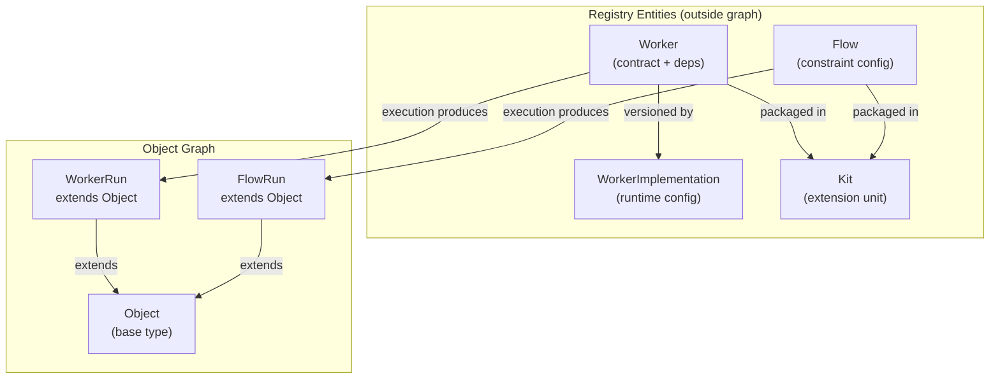

---

### D2 — Object Base Hierarchy

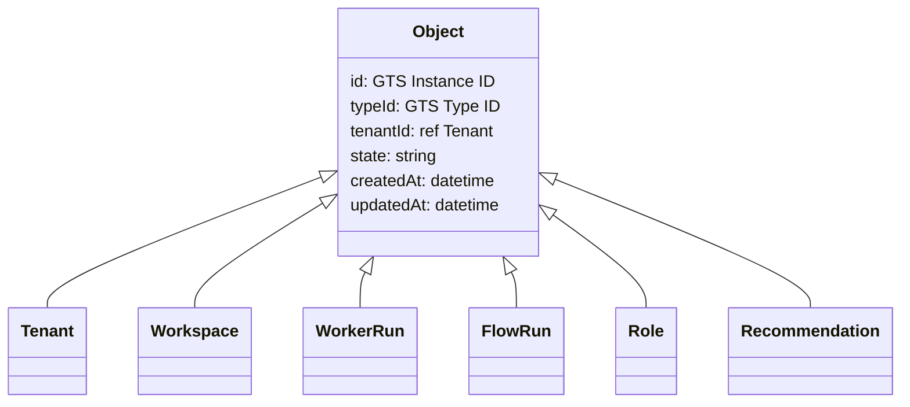

---

### D3 — Tenant Hierarchy & Isolation

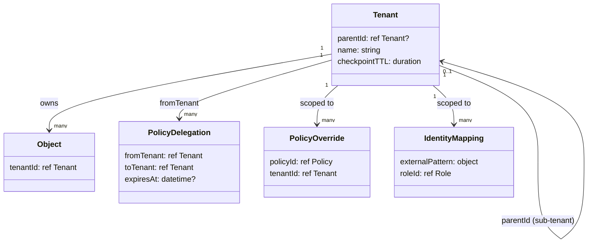

---

### D4 — Worker & Contract

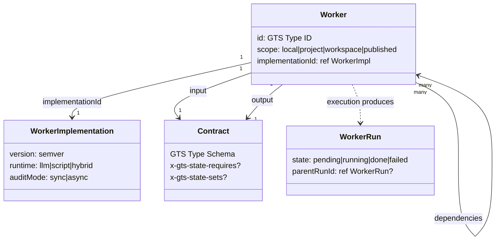

---

### D5 — WorkerRun Execution Lifecycle

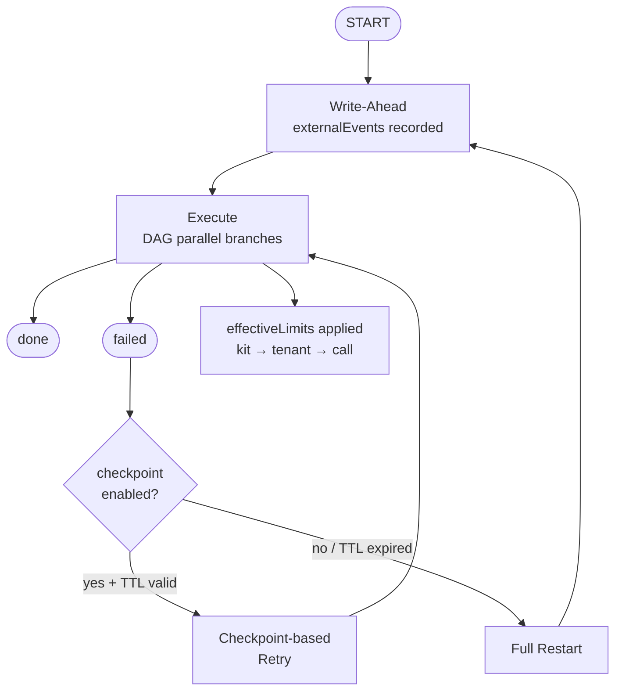

---

### D6 — StatePolicy & Transitions

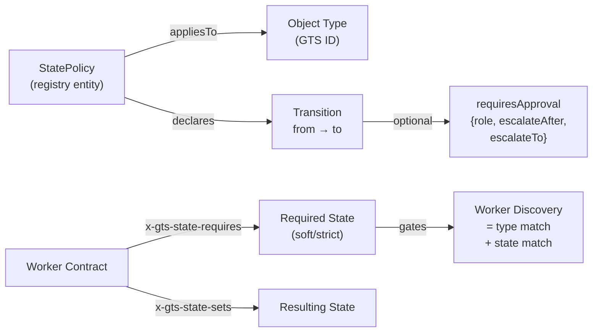

---

### D7 — Authorization Model

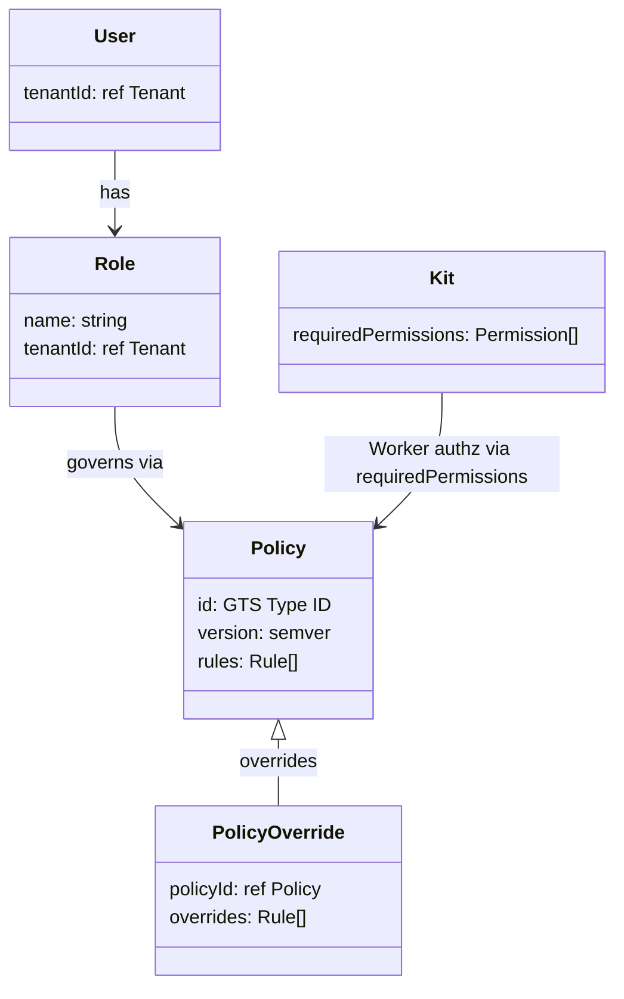

---

### D8 — AuditLog & History

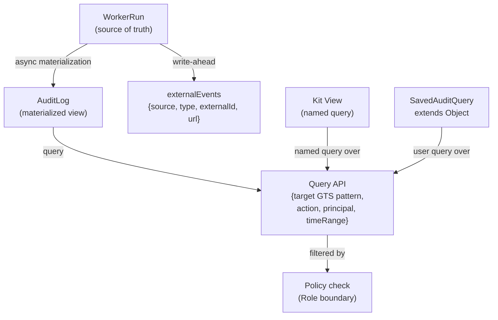

---

### D9 — Recommendation Lifecycle

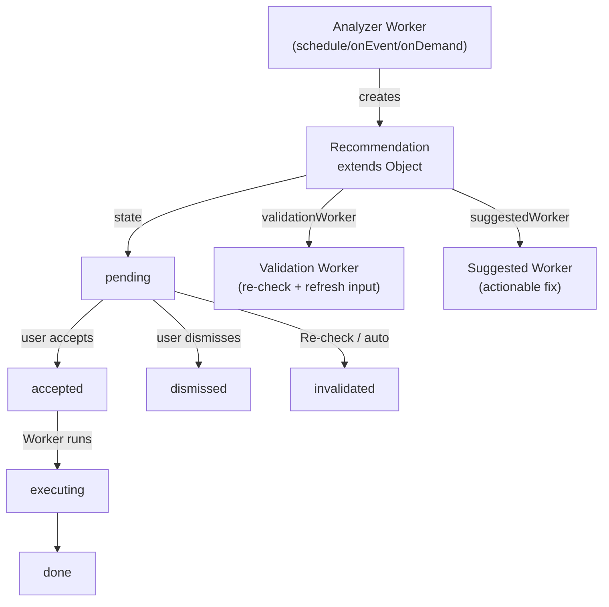

---

### D10 — Events & Notifications

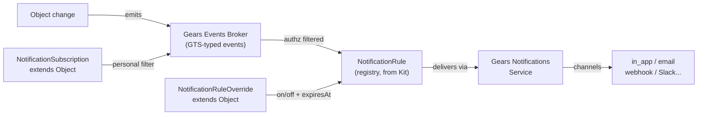

---

### D11 — Document Type Hierarchy

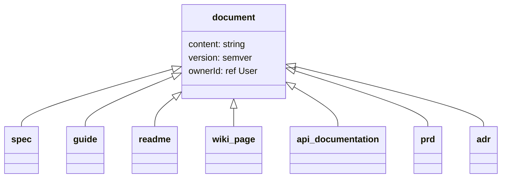

---

### D12 — Document Type Hierarchy (continued)

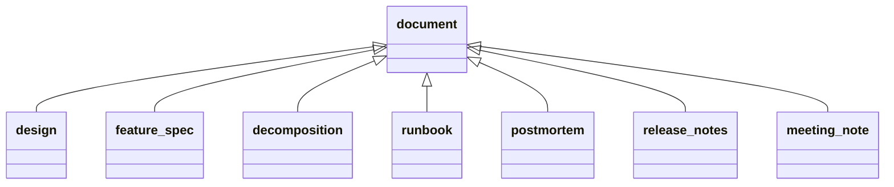

---

### D13 — Prompt Type Hierarchy

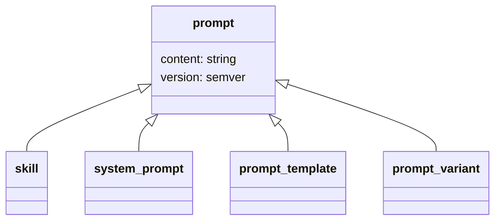

---

### D14 — Infrastructure Config Hierarchy

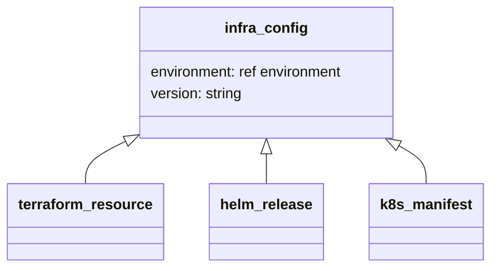

---

### D15 — Kit Extensibility (GTS Chaining)

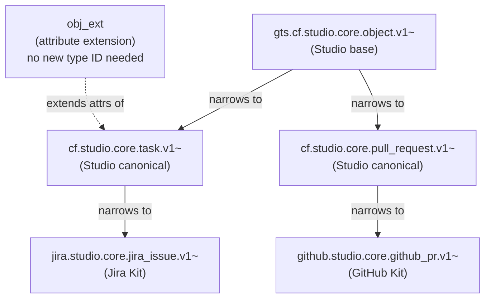

---

### D16 — CI/CD Object Relationships

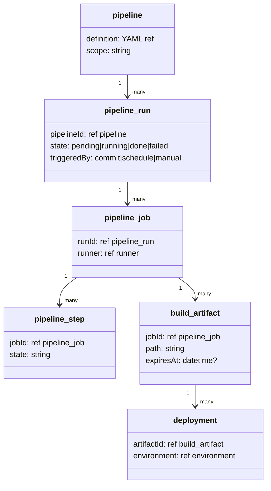

---

### D17 — Security & Vulnerability Objects (type hierarchy)

> See D24 for cross-references between security objects and the rest of the graph.


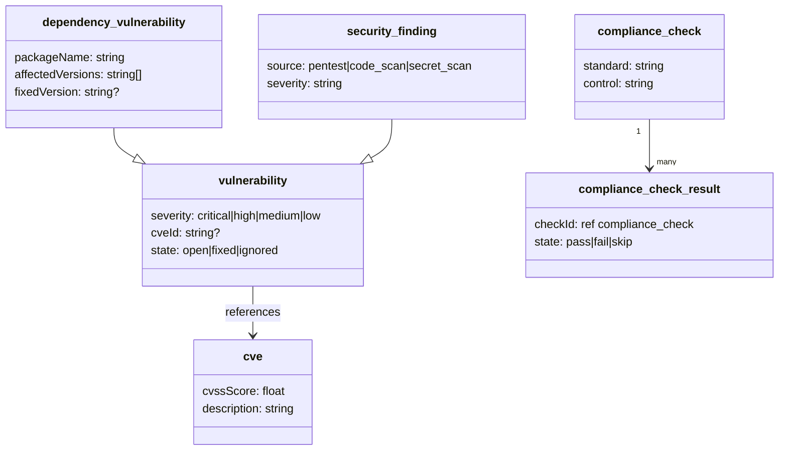

---

*Generated during Studio v2 Domain Model brainstorm session.*
*Date: 2026-07-02*

The system consists of two categories of entities:

- **Object** — data and artifacts that flow through the system (the graph)
- **Registry entities** — Worker, Flow, Kit, etc. (outside the graph; templates/configurations)

### 1.1 Object

The base type for all domain objects in the system.

```
Object {
  id:        GTS Instance Identifier
  typeId:    GTS Type Identifier
  tenantId:  ref → Tenant
  state:     string
  createdAt: datetime
  updatedAt: datetime
}
```

All object types are derived from the base `Object` via GTS chained IDs.

### 1.2 Registry Entities

Outside the graph. Describe rules and configurations, not data.

| Entity | Purpose |
|---|---|
| `Worker` | Executor — consumes and produces Objects |
| `WorkerImplementation` | Runtime configuration of a Worker (model, prompt, script) |
| `Flow` | Configuration of constraints and mandatory steps |
| `Kit` | Extension packaging unit (types, Workers, Flows) |
| `obj_ext` | Attribute extension for existing types |

---

## 2. GTS Identifiers

**Convention:** `gts.<vendor>.<package>.<namespace>.<type>.v<N>`

Studio vendor = `cf` (same as Constructor Fabric Gears).

### 2.1 Studio Base Types

Studio-owned base types:

```
gts.cf.studio.core.object.v1~      ← base Object (all Studio domain objects)
gts.cf.studio.core.worker.v1~      ← base Worker
gts.cf.studio.core.flow.v1~        ← base Flow
gts.cf.studio.core.obj_ext.v1~     ← attribute extension
```

Studio event types extend the **Gears platform event base type**:

```
gts.cf.core.events.type.v1~        ← Gears platform event base type (DO NOT redefine)
```

### 2.2 Gears Base Types Extended by Studio

Studio extends existing Gears base types where applicable:

| Studio Type | Extends Gears Type | Chained GTS ID |
|---|---|---|
| `Tenant` | `gts.cf.core.rg.type.v1~cf.core._.tenant.v1~` | `gts.cf.core.rg.type.v1~cf.core._.tenant.v1~cf.studio.core.tenant.v1~` |
| `User` | `gts.cf.core.am.user.v1~` | `gts.cf.core.am.user.v1~cf.studio.core.user.v1~` |
| `Permission` | `gts.cf.toolkit.authz.permission.v1~` | `gts.cf.toolkit.authz.permission.v1~cf.studio.core.permission.v1~` |

### 2.3 Studio Core Object Types (derived from Studio base)

```
gts.cf.studio.core.object.v1~cf.studio.core.workspace.v1~
gts.cf.studio.core.object.v1~cf.studio.core.requirement.v1~
gts.cf.studio.core.object.v1~cf.studio.core.task.v1~
gts.cf.studio.core.object.v1~cf.studio.core.pull_request.v1~
gts.cf.studio.core.object.v1~cf.studio.core.build.v1~
gts.cf.studio.core.object.v1~cf.studio.core.incident.v1~
gts.cf.studio.core.object.v1~cf.studio.core.design.v1~
gts.cf.studio.core.object.v1~cf.studio.core.worker_run.v1~
gts.cf.studio.core.object.v1~cf.studio.core.flow_run.v1~
gts.cf.studio.core.object.v1~cf.studio.core.role.v1~
gts.cf.studio.core.object.v1~cf.studio.core.recommendation.v1~
gts.cf.studio.core.object.v1~cf.studio.core.identity_mapping.v1~
gts.cf.studio.core.object.v1~cf.studio.core.policy_override.v1~
gts.cf.studio.core.object.v1~cf.studio.core.policy_delegation.v1~
gts.cf.studio.core.object.v1~cf.studio.core.saved_audit_query.v1~
gts.cf.studio.core.object.v1~cf.studio.core.notification_rule_override.v1~
gts.cf.studio.core.object.v1~cf.studio.core.notification_subscription.v1~
```

### 2.4 Vendor (Kit) Extensions

```
// Narrowing — new semantic type:
gts.cf.studio.core.object.v1~cf.studio.core.task.v1~jira.studio.core.jira_task.v1~

// Attribute extension via obj_ext:
gts.cf.studio.core.obj_ext.v1~jira.studio.core.jira_task_ext.v1~
```

---

## 3. Contract

Contract = **GTS Type Schema** (JSONSchema + `x-gts-*`).

Describes what a Worker expects as input and what it produces as output.
Object type references use `$ref` → GTS Type Identifier. Scalar properties
are standard JSON Schema fields.

```json
{
  "$id": "gts.cf.studio.core.worker.v1~cf.studio.core.create_design_input.v1~",
  "type": "object",
  "properties": {
    "requirement": {
      "$ref": "gts://cf.studio.core.object.v1~cf.studio.core.requirement.v1~",
      "x-gts-required": true
    },
    "workspace": {
      "$ref": "gts://cf.studio.core.object.v1~cf.studio.core.workspace.v1~",
      "x-gts-required": true
    },
    "style": { "type": "string", "enum": ["detailed", "sketch"] },
    "language": { "type": "string" }
  }
}
```

---

## 4. Worker

Executor — consumes Objects, produces Objects. Registry entity.

```
Worker {
  id:                GTS Type Identifier  (gts.cf.studio.core.worker.v1~...)
  input:             Contract             (GTS Type Schema)
  output:            Contract             (GTS Type Schema)
  dependencies:      Worker[]             (static list — security boundary)
  scope:             local | project | workspace | published
  implementationId:  ref → WorkerImplementation
  trigger?: {
    schedule?:  cron string
    onEvent?: {
      pattern:  GTS Type Identifier
      debounce: duration               // default: 0
    }
    onDemand:   boolean                // default: true
  }
}
```

### 4.1 WorkerImplementation

Runtime configuration, versioned independently from the contract.

```
WorkerImplementation {
  id:      string
  version: semver
  runtime: llm | script | hybrid
  config: {
    // llm:    { model, prompt, temperature, ... }
    // script: { entrypoint, language, ... }
    // hybrid: { steps[] }
  }
  dependencies_mode: {
    // workerId → { mode: sync | async }
  }
  checkpoint: {
    enabled: boolean
    ttl:     duration
  }
  auditMode:       sync | async           // default: async
  retentionPolicy: {
    inputTTL:        duration
    outputTTL:       duration
    metadataTTL:     duration
    retentionAction: archive | delete     // default: archive
  }
}
```

### 4.2 Composability

A Worker may call other Workers from its `dependencies` list.
An LLM-Worker may call them in any order, conditionally, iteratively —
but **only from the declared list**. Calls outside the list are forbidden.

The system automatically builds a **DAG** from dependencies and executes
independent branches in parallel.

---

## 5. WorkerRun

A record of a specific Worker execution. **Extends Object.**

```
WorkerRun extends Object {
  typeId:              gts.cf.studio.core.object.v1~cf.studio.core.worker_run.v1~
  workerId:            ref → Worker
  parentRunId:         ref → WorkerRun?
  inputData:           any
  outputData:          any
  state:               pending | running | done | failed
  progress: {
    message:  string?
    percent:  0..100?
    eta:      datetime?        // strictly optional
  }
  effectiveLimits: {
    timeout:      duration
    depth:        int
    token_budget: int
    source:       kit | tenant | call
  }
  externalEvents: [
    { source: string, type: string, externalId: string, url: string }
  ]
  checkpointExpiresAt: datetime?
  staticChildren:      WorkerRun[]
}
```

### 5.1 WorkerRun Lifecycle (Write-Ahead)

```
1. START        → WorkerRun created, state: pending
2. WRITE-AHEAD  → externalEvents recorded (before any reads)
3. EXECUTE      → Worker runs (DAG, parallel branches)
4. COMPLETE     → outputData written, state: done | failed
```

### 5.2 Retry

- **Checkpoint-based** (`checkpoint.enabled = true`): successful sub-Workers
  not re-executed; results reused until `checkpointTTL` expires.
- **Full restart** (`checkpoint.enabled = false` or TTL expired).
- Every WorkerRun is **idempotent** by `id`.

### 5.3 Limits (three levels, each can only narrow)

```
Kit defaults:         timeout, depth, token_budget
Tenant max limits:    ← ceiling
Call (at invocation): ← can narrow, not exceed Tenant
```

---

## 6. Flow

Constraint configuration layered on top of Workers + Contracts. Registry entity.

```
Flow {
  id:                GTS Type Identifier  (gts.cf.studio.core.flow.v1~...)
  entryConstraints:  Contract[]
  mandatorySteps:    Worker[]
  allowedNextSteps:  map<Worker, Worker[]>
  scope:             local | project | workspace | published
}
```

### 6.1 FlowRun

```
FlowRun extends Object {
  typeId:          gts.cf.studio.core.object.v1~cf.studio.core.flow_run.v1~
  flowId:          ref → Flow
  completedSteps:  Worker[]
  skippedSteps:    Worker[]
  state:           running | done | failed | aborted
}
```

---

## 7. Tenant

Recursive hierarchy. Extends Gears Resource Group tenant type.

```
Tenant {
  typeId:        gts.cf.core.rg.type.v1~cf.core._.tenant.v1~cf.studio.core.tenant.v1~
  parentId:      ref → Tenant?
  name:          string
  checkpointTTL: duration      // default: 24h
}
```

Every Object belongs to exactly one Tenant (`tenantId`).
Isolation enforced via ABAC policies using GTS wildcard patterns.

---

## 8. User

Extends Gears Account Management user type.

```
User {
  typeId: gts.cf.core.am.user.v1~cf.studio.core.user.v1~
  // inherits: id, email, display_name from Gears AM
  tenantId: ref → Tenant
}
```

---

## 9. Workspace

Multi-repo configuration. **Extends Object.**

```
Workspace extends Object {
  typeId:  gts.cf.studio.core.object.v1~cf.studio.core.workspace.v1~
  sources: [
    { path: string, role: string, adapter?: string, url?: string, branch?: string }
  ]
}
```

---

## 10. Extensibility (Kit)

### 10.1 Kit — the only extension unit

A Kit packages: new Object types, Workers, WorkerImplementations, Flows,
obj_ext definitions.

```
Kit scopes:
  local      ← developer's machine
  project    ← project repository
  workspace  ← workspace configuration
  published  ← marketplace / Registry
```

### 10.2 Two type extension mechanisms

**Narrowing** (new semantic type) → GTS derived type via chaining:
```
gts.cf.studio.core.object.v1~cf.studio.core.task.v1~jira.studio.core.jira_task.v1~
```

**Attribute extension** → `obj_ext` registry entity:
```
obj_ext {
  // GTS ID: gts.cf.studio.core.obj_ext.v1~jira.studio.core.jira_task_ext.v1~
  x-gts-traits: {
    extends: [ "gts.cf.studio.core.object.v1~cf.studio.core.task.v1~" ]
  }
  properties: GTS Type Schema
}
```

### 10.3 Compatibility

- Vendor declares `compatibleWith` in Kit manifest
- Registry verifies via GTS compatibility rules at installation
- Smoke tests not run (too costly for LLM Workers)

### 10.4 Permissions

```
Kit manifest:
  requiredPermissions:
    - read:  [ GTS Type Identifier, ... ]
    - write: [ GTS Type Identifier, ... ]
    - call:  [ GTS Type Identifier, ... ]
  requiredSettings:
    - { key: string, secret: boolean }    // credentials stored in Gears Settings
```

- Tenant explicitly approves at installation
- Expanding permissions in new version → blocks auto-update, requires re-approval
- Reducing permissions → auto-update

---

## 11. System Overview

```
┌─────────────────────────────────────────────────────────────┐
│               GEARS INFRASTRUCTURE                          │
│  Events Broker · Notifications · Approvals · Jobs Manager   │
│  LLM Gateway · AI Agents Registry · Settings Service        │
└─────────────────────────────────────────────────────────────┘
                          ▲ Studio builds on Gears
┌─────────────────────────────────────────────────────────────┐
│                     REGISTRY ENTITIES                       │
│                                                             │
│  Worker ──────────── WorkerImplementation                   │
│  Flow    obj_ext    Kit    StatePolicy    NotificationRule   │
│  Policy                                                     │
└─────────────────────────────────┬───────────────────────────┘
                                  │ executes / produces
                                  ▼
┌─────────────────────────────────────────────────────────────┐
│                       OBJECT GRAPH                          │
│           gts.cf.studio.core.object.v1~ (base)             │
│                                                             │
│  Tenant*         Workspace        WorkerRun      FlowRun   │
│  User*           Role             Recommendation            │
│  Requirement     Task             PullRequest    Build      │
│  Design          Incident         IdentityMapping           │
│  PolicyOverride  PolicyDelegation SavedAuditQuery           │
│  NotificationRuleOverride  NotificationSubscription         │
│                                                             │
│  * extends Gears base types (AM/RG)                        │
└─────────────────────────────────────────────────────────────┘
```

---

## 12. Object Lifecycle & State Transitions

### 12.1 StatePolicy

Registry entity — separates process (transitions) from data (type schema).

```
StatePolicy {
  appliesTo:   GTS Type Identifier
  scope:       tenant | kit | global
  transitions: {
    "<property>": [
      {
        from:              value
        to:                value
        requiresApproval?: {
          role:           RolePattern
          escalateAfter?: duration
          escalateTo?:    RolePattern | "reject"
        }
      }
    ]
  }
}
```

Tenant StatePolicy overrides Kit StatePolicy (tenant > kit > global).

### 12.2 Worker Contract — State Awareness

```json
// input Contract
"task": {
  "$ref": "gts://cf.studio.core.object.v1~cf.studio.core.task.v1~",
  "x-gts-state-requires": {
    "state": "in_progress",
    "strict": false    // default: warning + override; true = hard block
  }
}

// output Contract
"task": {
  "$ref": "gts://cf.studio.core.object.v1~cf.studio.core.task.v1~",
  "x-gts-state-sets": { "state": "review" }
}
```

**Worker Discovery** = GTS type match + state match. Contracts are always
vendor-agnostic — external states are mapped to Studio states at Kit
installation time (per Tenant config).

### 12.3 State Transition History

`StateTransitionEvent` is a **computed projection** over the WorkerRun tree.

```
StateTransitionEvent (projection) {
  objectId:    from WorkerRun input/output diff
  property:    derived
  fromValue:   WorkerRun.inputData[property]
  toValue:     WorkerRun.outputData[property]
  workerRunId: WorkerRun.id
  timestamp:   WorkerRun.timestamp
  evidence?:   WorkerRun.outputData[evidence]
}
```

---

## 13. Role, Policy & Authorization

### 13.1 Role

```
Role extends Object {
  typeId:   gts.cf.studio.core.object.v1~cf.studio.core.role.v1~
  name:     string
  tenantId: ref → Tenant
}
```

### 13.2 Permission

Extends Gears authz permission base type.

```
Permission {
  typeId:        gts.cf.toolkit.authz.permission.v1~cf.studio.core.permission.v1~
  resource_type: GTS Type Identifier (wildcard ok)
  action:        string
  display_name:  string
}
```

### 13.3 Policy & PolicyOverride

**`Policy`** — registry entity (Kit, versioned as code).
**`PolicyOverride`** — Object in graph (Tenant runtime corrections).
Priority: `PolicyOverride > Policy` (Override cannot expand beyond Policy).

```
Policy (registry) {
  id:      GTS Type Identifier
  version: semver
  rules: [
    {
      principal:      Role pattern
      action:         "run" | "read" | "write" | "delete"
      target:         GTS Type Identifier (wildcard ok)
      condition?:     ref → Worker    // { principal, object, action } → { allowed, reason }
      conditionCache: { ttl: duration }    // default: 60s
    }
  ]
}

PolicyOverride extends Object {
  typeId:    gts.cf.studio.core.object.v1~cf.studio.core.policy_override.v1~
  policyId:  ref → Policy
  tenantId:  ref → Tenant
  overrides: Policy.rules[]    // can only narrow
}
```

### 13.4 Authorization Model

| Subject | Mechanism |
|---|---|
| **User** | `Role` + `Policy` / `PolicyOverride` |
| **Worker** | `Kit.requiredPermissions` (approved at Kit installation) |

Worker→Worker: implicit via `dependencies` — both Kits approved by Tenant → call authorized.

### 13.5 IdentityMapping

```
IdentityMapping extends Object {
  typeId: gts.cf.studio.core.object.v1~cf.studio.core.identity_mapping.v1~
  externalPattern: {
    provider: GTS Type Identifier    // from SSO Kit, GitHub Kit, etc.
    pattern:  string
  }
  roleId:   ref → Role
  tenantId: ref → Tenant
  active:   boolean
}
```

### 13.6 Tenant Policy Hierarchy

Sub-Tenant inherits parent Policy. Default: **narrowing only**.

`PolicyDelegation` — parent explicitly grants specific rights downward:

```
PolicyDelegation extends Object {
  typeId:      gts.cf.studio.core.object.v1~cf.studio.core.policy_delegation.v1~
  fromTenant:  ref → Tenant
  toTenant:    ref → Tenant
  permissions: [ { action: string, target: GTS Type Identifier } ]
  expiresAt:   datetime?
}
```

---

## 14. AuditLog

### 14.1 Storage Model

Materialized view over WorkerRun tree (CQRS + Event Sourcing).
Source of truth: WorkerRun tree.

Critical events: `auditMode: sync`. Others: `auditMode: async` (default).
Tenant can override per Worker via PolicyOverride.

### 14.2 Query API & Views

```
auditLog.query({
  target:     GTS pattern,
  action?:    string,
  principal?: string,
  timeRange?: { from, to }
})
```

| View Type | Source | Creator |
|---|---|---|
| Kit View | Named queries in Kit | Vendor |
| User View | `SavedAuditQuery extends Object` | User via UI |

```
SavedAuditQuery extends Object {
  typeId:    gts.cf.studio.core.object.v1~cf.studio.core.saved_audit_query.v1~
  name:      string
  query:     { target, action?, principal?, timeRange? }
  tenantId:  ref → Tenant
  createdBy: ref → User
}
```

### 14.3 Retention

Declared per Worker in Kit. Tenant can override globally.
Default `retentionAction: archive` (cold storage). Hard delete only when
explicitly configured or required by compliance.

### 14.4 Export

Core `audit_exporter` Worker pre-installed in every Tenant (webhook, JSON).
Vendor-specific formats (Splunk, Datadog, Elastic) via Kits.

---

## 15. Recommendation

### 15.1 Recommendation Object

```
Recommendation extends Object {
  typeId:            gts.cf.studio.core.object.v1~cf.studio.core.recommendation.v1~
  state:             pending | accepted | executing | done | dismissed | invalidated
  sourceRunId:       ref → WorkerRun
  suggestedWorker:   ref → Worker
  suggestedInput:    Contract data         // refreshed on Re-check
  reason:            string
  severity:          info | warning | critical
  severityWorker?:   ref → Worker          // dynamic severity recompute
  confidence:        full | partial | low  // partial = external systems unavailable
  validationWorker?: ref → Worker          // auto/manual invalidation
}
```

### 15.2 Analyzer Workers

Detect gaps and create Recommendations. Use standard Worker `trigger` with
`schedule`, `onEvent` (+ `debounce`), and `onDemand`.

Read external systems via `dependencies` (standard composability).
On external system unavailability → `confidence: partial` instead of failure.

### 15.3 Re-check & Accepting

**Re-check** (manual or automatic via `validationWorker`):
- Checks if gap still exists
- Refreshes `suggestedInput` to current Object state
- Recomputes `severity` if `severityWorker` set

**Accepting**:
```
User accepts → Re-check runs → diff shown if inputs changed
  → user confirms → suggestedWorker launched → state: executing → done
```

---

## 16. Events

Studio is built on **Constructor Fabric Gears**. Event infrastructure
(bus, routing, delivery, backpressure, authz filtering) — Gears Events Broker.
Studio defines event types via GTS.

### 16.1 Studio Event Types

Studio event types extend the Gears platform event base type
`gts.cf.core.events.type.v1~` — Studio does **not** define its own base
event type.

```
// Object lifecycle
gts.cf.core.events.type.v1~cf.studio.core.object_created.v1~
gts.cf.core.events.type.v1~cf.studio.core.object_updated.v1~
gts.cf.core.events.type.v1~cf.studio.core.object_deleted.v1~

// State transitions
gts.cf.core.events.type.v1~cf.studio.core.state_changed.v1~

// WorkerRun
gts.cf.core.events.type.v1~cf.studio.core.worker_run_started.v1~
gts.cf.core.events.type.v1~cf.studio.core.worker_run_completed.v1~

// Recommendations
gts.cf.core.events.type.v1~cf.studio.core.recommendation_created.v1~
gts.cf.core.events.type.v1~cf.studio.core.recommendation_invalidated.v1~

// Kit lifecycle
gts.cf.core.events.type.v1~cf.studio.core.kit_installed.v1~
gts.cf.core.events.type.v1~cf.studio.core.kit_updated.v1~
```

Wildcard-based authz example (per Gears GTS guidelines):
```
gts.cf.core.events.type.v1~cf.studio.core.*   ← all Studio events
gts.cf.core.events.type.v1~cf.studio.core.object_*  ← only Object lifecycle events
```

Gears Events Broker has built-in authz — subscribers receive only events
for Objects they have Policy rights to read.

---

## 17. Notifications

Studio defines rules; Gears Notifications Service delivers.

### 17.1 NotificationRule

Registry entity from Kit.

```
NotificationRule (registry) {
  id:       GTS Type Identifier
  trigger:  { onEvent: GTS pattern, debounce?: duration }
  audience: RolePattern
  channel:  "in_app" | "email" | "webhook" | GTS Type Identifier (vendor)
  template: string    // primary Object data + Studio deep link only
  digest?:  {
    window:   duration
    maxItems: int
    groupBy:  "objectId" | "eventType" | "none"    // default: "none"
  }
}
```

### 17.2 NotificationRuleOverride

Runtime on/off without Kit release.

```
NotificationRuleOverride extends Object {
  typeId:    gts.cf.studio.core.object.v1~cf.studio.core.notification_rule_override.v1~
  ruleId:    ref → NotificationRule
  active:    boolean
  expiresAt: datetime?
}
```

### 17.3 NotificationSubscription

Personal user subscriptions on top of Kit rules.

```
NotificationSubscription extends Object {
  typeId:    gts.cf.studio.core.object.v1~cf.studio.core.notification_subscription.v1~
  userId:    ref → User
  tenantId:  ref → Tenant
  filter: {
    eventPattern:  GTS pattern
    severity?:     string[]
    objectFilter?: GTS pattern
  }
  channel:  "in_app" | "email" | "webhook" | GTS Type Identifier
  urgency:  immediate | digest | muted
  active:   boolean
}
```

### 17.4 Channels

**Core (Gears, pre-installed):** `in_app`, `email`, `webhook`

**Vendor Kits** register additional channels. Kit declares `requiredSettings`
for credentials; Tenant fills via Gears Settings Service. No secrets in Kit.

---

## Appendix A — Studio v2 Object Type Catalog

All types follow the pattern:
```
gts.cf.studio.core.object.v1~cf.studio.core.<type>.v1~
```

### Base Types (abstract)

```
cf.studio.core.document.v1~      // base for all textual/structured artifacts
cf.studio.core.infra_config.v1~  // base for all infrastructure configurations
cf.studio.core.prompt.v1~        // base for all AI prompt artifacts
```

### Domain 1 — Product / Requirements

```
cf.studio.core.prd.v1~                   // → document
cf.studio.core.epic.v1~
cf.studio.core.user_story.v1~
cf.studio.core.requirement.v1~
cf.studio.core.acceptance_criteria.v1~
cf.studio.core.use_case.v1~
cf.studio.core.user_persona.v1~
cf.studio.core.product_roadmap.v1~
cf.studio.core.feature_spec.v1~          // → document (Studio SDLC FEATURE)
cf.studio.core.decomposition.v1~         // → document (Studio SDLC DECOMPOSITION)
```

### Domain 2 — Architecture / Design

```
cf.studio.core.design.v1~                // → document (Studio SDLC DESIGN)
cf.studio.core.adr.v1~                   // → document (Architecture Decision Record)
cf.studio.core.component.v1~             // architectural component (service, module, library, subsystem)
cf.studio.core.component_version.v1~     // versioned snapshot of a component
cf.studio.core.component_dependency.v1~  // directed dependency between two components
cf.studio.core.interface_definition.v1~
cf.studio.core.api_spec.v1~              // OpenAPI / GraphQL / gRPC
cf.studio.core.data_model.v1~
cf.studio.core.architecture_diagram.v1~
```

### Domain 3 — Source Code

```
cf.studio.core.repository.v1~
cf.studio.core.source_file.v1~
cf.studio.core.module.v1~               // package, namespace, library
cf.studio.core.complexity_metric.v1~    // cyclomatic/cognitive complexity
```

### Domain 3a — Technology Stack

```
cf.studio.core.tech_stack.v1~           // declared technology stack of a component/project
cf.studio.core.library.v1~              // software library / package (npm, PyPI, Maven, etc.)
cf.studio.core.library_version.v1~      // specific pinned version of a library
cf.studio.core.framework.v1~            // framework (React, Django, Spring, Rails, etc.)
cf.studio.core.runtime.v1~              // runtime environment (Node.js v20, Python 3.11, JVM 21)
cf.studio.core.database.v1~             // database technology (PostgreSQL, MongoDB, Redis, etc.)
cf.studio.core.database_instance.v1~    // specific deployed database instance
cf.studio.core.third_party_service.v1~  // external SaaS dependency (Stripe, SendGrid, Auth0)
cf.studio.core.cloud_service.v1~        // managed cloud service (AWS S3, GCP Pub/Sub, Azure SB)
cf.studio.core.tech_dependency.v1~      // directed: component uses library_version / database / service
```

### Domain 4 — Work Items

```
cf.studio.core.task.v1~
cf.studio.core.bug.v1~
cf.studio.core.spike.v1~
cf.studio.core.tech_debt_item.v1~
cf.studio.core.change_request.v1~
```

### Domain 5 — Collaboration

```
cf.studio.core.comment.v1~
cf.studio.core.review_comment.v1~
cf.studio.core.decision.v1~
cf.studio.core.meeting_note.v1~          // → document
cf.studio.core.approval.v1~
```

### Domain 6 — Version Control

```
// cf.studio.core.repository.v1~         // defined in Domain 3
cf.studio.core.branch.v1~
cf.studio.core.commit.v1~
cf.studio.core.tag.v1~
cf.studio.core.pull_request.v1~          // canonical (PR + MR)
cf.studio.core.diff.v1~
cf.studio.core.merge_conflict.v1~
```

### Domain 7 — CI/CD / Build

```
cf.studio.core.pipeline.v1~              // pipeline definition
cf.studio.core.pipeline_run.v1~          // execution instance
cf.studio.core.build.v1~
cf.studio.core.pipeline_job.v1~          // job within pipeline
cf.studio.core.pipeline_step.v1~         // step within job
cf.studio.core.test_run.v1~
cf.studio.core.test_case.v1~
cf.studio.core.test_result.v1~
cf.studio.core.code_coverage_report.v1~
cf.studio.core.build_artifact.v1~        // binary, package, image
cf.studio.core.deployment.v1~
cf.studio.core.deployment_status.v1~
cf.studio.core.runner.v1~               // GitHub runner, Jenkins agent, GitLab runner
cf.studio.core.performance_benchmark.v1~ // k6, Locust, JMH
```

### Domain 8 — Artifacts / Packages

```
cf.studio.core.package.v1~
cf.studio.core.package_version.v1~
cf.studio.core.container_image.v1~
cf.studio.core.container_image_tag.v1~
cf.studio.core.sbom.v1~                  // Software Bill of Materials
```

### Domain 9 — Release

```
cf.studio.core.release.v1~
cf.studio.core.release_notes.v1~         // → document
cf.studio.core.changelog.v1~             // → document
cf.studio.core.version.v1~
cf.studio.core.release_candidate.v1~
cf.studio.core.release_component.v1~     // join: which component_version is included in a release
```

### Domain 10 — Operations / Incidents

```
cf.studio.core.incident.v1~
cf.studio.core.alert.v1~
cf.studio.core.runbook.v1~               // → document
cf.studio.core.postmortem.v1~            // → document
cf.studio.core.slo.v1~                   // Service Level Objective
cf.studio.core.sli.v1~                   // Service Level Indicator
cf.studio.core.on_call_schedule.v1~
cf.studio.core.escalation_policy.v1~
cf.studio.core.health_check.v1~
cf.studio.core.metric_definition.v1~     // metric schema/definition, not time-series data
cf.studio.core.quality_metric.v1~        // code quality, test coverage metrics
```

### Domain 11 — Security

```
cf.studio.core.vulnerability.v1~
cf.studio.core.cve.v1~
cf.studio.core.security_finding.v1~      // pentest, code scan, secret scan
cf.studio.core.threat_model.v1~          // → document
cf.studio.core.security_review.v1~       // → document
cf.studio.core.dependency_vulnerability.v1~ // Dependabot, Snyk
```

### Domain 12 — Compliance / Governance

```
cf.studio.core.audit_finding.v1~
cf.studio.core.compliance_check.v1~
cf.studio.core.compliance_check_result.v1~
cf.studio.core.policy_exception.v1~
cf.studio.core.compliance_report.v1~     // → document
cf.studio.core.cost_report.v1~           // AI cost, infrastructure cost
```

### Domain 13 — People / Teams

```
cf.studio.core.person.v1~
cf.studio.core.team.v1~
cf.studio.core.org_unit.v1~             // department, division
```

### Domain 14 — Infrastructure

```
cf.studio.core.environment.v1~          // dev, staging, prod
cf.studio.core.service.v1~              // microservice, cloud service
cf.studio.core.cluster.v1~              // K8s, ECS, EKS
cf.studio.core.resource.v1~             // generic cloud resource
cf.studio.core.namespace.v1~            // K8s namespace, logical grouping
cf.studio.core.secret_reference.v1~     // reference only: name, vault_path, provider — no value stored
cf.studio.core.certificate.v1~
cf.studio.core.infra_config.v1~         // base (abstract)
  // narrowed by Kit:
  //   ~cf.studio.core.terraform_resource.v1~
  //   ~cf.studio.core.helm_release.v1~
  //   ~cf.studio.core.k8s_manifest.v1~
```

### Domain 15 — Documents

```
cf.studio.core.document.v1~             // base (abstract)
  // narrowed types:
  cf.studio.core.spec.v1~               // → document
  cf.studio.core.guide.v1~              // → document
  cf.studio.core.readme.v1~             // → document
  cf.studio.core.wiki_page.v1~          // → document
  cf.studio.core.api_documentation.v1~  // → document
  cf.studio.core.glossary.v1~           // → document
  // policy/governance docs use document with category tag
```

### Domain 16 — AI / Agents

```
cf.studio.core.prompt.v1~               // base (abstract)
  cf.studio.core.skill.v1~              // → prompt (reusable agent instruction)
  cf.studio.core.system_prompt.v1~      // → prompt
  cf.studio.core.prompt_template.v1~    // → prompt
  cf.studio.core.prompt_variant.v1~     // → prompt (A/B variant)
cf.studio.core.ai_agent.v1~
cf.studio.core.ai_tool.v1~
cf.studio.core.evaluation_run.v1~
cf.studio.core.evaluation_result.v1~
// llm_model → reference to Gears Models Registry (no separate Object type)
```

---

### Notes

- **Dashboard** — implemented in Constructor Fabric Insight, not Studio.
- **Business/Strategy domain** (`market_research`, `opportunity`, `business_case`) — separate Kit (Phase 4+).
- **`function`, `type_definition`, `code_dependency`** — IDE/static analysis concern, not Studio core.
- **`llm_model`** — reference to Gears Models Registry by GTS ID.
- **`metric_definition`** defines what is measured; actual time-series data lives in Insight/Datadog/Prometheus.
- **`secret_reference`** stores only the reference (name, path, provider) — never the secret value.

---

### Vendor Kit Extension Examples

```
// Jira Kit
gts.cf.studio.core.object.v1~cf.studio.core.task.v1~jira.studio.core.jira_issue.v1~
gts.cf.studio.core.object.v1~cf.studio.core.bug.v1~jira.studio.core.jira_bug.v1~
gts.cf.studio.core.object.v1~cf.studio.core.epic.v1~jira.studio.core.jira_epic.v1~

// GitHub Kit
gts.cf.studio.core.object.v1~cf.studio.core.pull_request.v1~github.studio.core.github_pr.v1~
gts.cf.studio.core.object.v1~cf.studio.core.pipeline_run.v1~github.studio.core.actions_run.v1~
gts.cf.studio.core.object.v1~cf.studio.core.vulnerability.v1~github.studio.core.dependabot_alert.v1~

// GitLab Kit
gts.cf.studio.core.object.v1~cf.studio.core.pull_request.v1~gitlab.studio.core.merge_request.v1~
gts.cf.studio.core.object.v1~cf.studio.core.pipeline_run.v1~gitlab.studio.core.gitlab_pipeline.v1~

// Jenkins Kit
gts.cf.studio.core.object.v1~cf.studio.core.build.v1~jenkins.studio.core.jenkins_build.v1~
gts.cf.studio.core.object.v1~cf.studio.core.pipeline_job.v1~jenkins.studio.core.jenkins_job.v1~

// Kubernetes Kit
gts.cf.studio.core.object.v1~cf.studio.core.infra_config.v1~k8s.studio.core.k8s_manifest.v1~
gts.cf.studio.core.object.v1~cf.studio.core.service.v1~k8s.studio.core.k8s_service.v1~
gts.cf.studio.core.object.v1~cf.studio.core.cluster.v1~k8s.studio.core.k8s_cluster.v1~

// PagerDuty Kit
gts.cf.studio.core.object.v1~cf.studio.core.incident.v1~pagerduty.studio.core.pd_incident.v1~
gts.cf.studio.core.object.v1~cf.studio.core.alert.v1~pagerduty.studio.core.pd_alert.v1~

// Datadog Kit
gts.cf.studio.core.object.v1~cf.studio.core.alert.v1~datadog.studio.core.dd_monitor.v1~
gts.cf.studio.core.object.v1~cf.studio.core.incident.v1~datadog.studio.core.dd_incident.v1~
gts.cf.studio.core.object.v1~cf.studio.core.metric_definition.v1~datadog.studio.core.dd_metric.v1~

// Snyk Kit
gts.cf.studio.core.object.v1~cf.studio.core.vulnerability.v1~snyk.studio.core.snyk_issue.v1~

// Confluence Kit
gts.cf.studio.core.object.v1~cf.studio.core.wiki_page.v1~confluence.studio.core.confluence_page.v1~
```

---

## Object Reference Diagrams

> These diagrams show **cross-references** between Studio Objects — who points to whom in the live graph.

---

### D18 — WorkerRun Cross-References

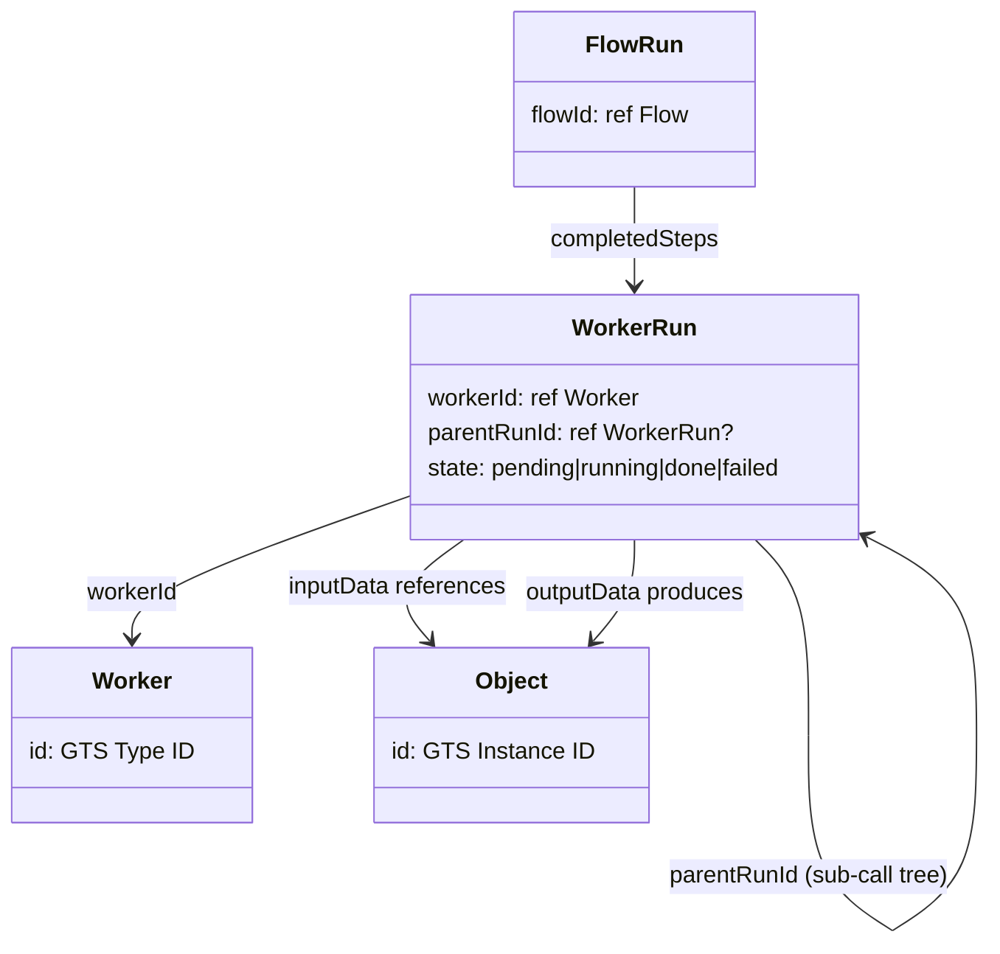

---

### D19 — SDLC Traceability Chain

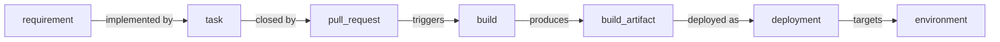

---

### D20 — Design-to-Code Traceability

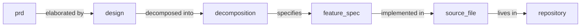

---

### D21 — Version Control Cross-References

```mermaid
classDiagram
    class repository {
        url: string
        defaultBranch: string
    }
    class branch {
        repositoryId: ref repository
        name: string
    }
    class commit {
        branchId: ref branch
        sha: string
        authorId: ref person
    }
    class pull_request {
        repositoryId: ref repository
        sourceBranch: ref branch
        targetBranch: ref branch
    }
    class tag {
        commitId: ref commit
        name: string
    }

    repository "1" --> "many" branch
    branch "1" --> "many" commit
    commit "many" --> "1" pull_request : included in
    commit "1" --> "many" tag
```

---

### D22 — CI/CD Chain Cross-References

```mermaid
flowchart TD
    CMT["commit"] -->|triggers| PR["pipeline_run"]
    PR -->|contains| JOB["pipeline_job"]
    JOB -->|runs on| RUN["runner"]
    JOB -->|executes| TST["test_run"]
    JOB -->|produces| ART["build_artifact"]
    TST -->|results in| TR["test_result"]
    TR -->|references| TC["test_case"]
```

---

### D23 — Deployment & Environment Cross-References

```mermaid
classDiagram
    class deployment {
        artifactId: ref build_artifact
        environmentId: ref environment
        state: pending|running|done|failed
    }
    class build_artifact {
        jobId: ref pipeline_job
        version: string
    }
    class environment {
        name: dev|staging|prod
        tenantId: ref Tenant
    }
    class deployment_status {
        deploymentId: ref deployment
        state: string
        workerRunId: ref WorkerRun
    }

    deployment --> build_artifact : artifactId
    deployment --> environment : environmentId
    deployment "1" --> "many" deployment_status
```

---

### D24 — Incident & Operations Cross-References

```mermaid
flowchart LR
    ALERT["alert"] -->|escalates to| INC["incident"]
    INC -->|assigned via| ESC["escalation_policy"]
    ESC -->|references| OCS["on_call_schedule"]
    OCS -->|assigns| PER["person"]
    INC -->|produces| PM["postmortem\n→ document"]
    PM -->|creates| TASK["task\n(prevention)"]
```

---

### D25 — Security Cross-References

```mermaid
flowchart LR
    SF["source_file"] -->|contains| DV["dependency_vulnerability"]
    DV -->|references| CVE["cve"]
    CVE -->|details in| VUL["vulnerability"]
    VUL -->|found by| SR["security_finding"]
    VUL -->|remediated by| TASK["task"]
    SR -->|reported in| SREP["security_review\n→ document"]
```

---

### D26 — Recommendation Cross-References

```mermaid
classDiagram
    class Recommendation {
        sourceRunId: ref WorkerRun
        suggestedWorker: ref Worker
        validationWorker: ref Worker?
        severityWorker: ref Worker?
        confidence: full|partial|low
    }
    class WorkerRun {
        workerId: ref Worker
    }
    class Worker {
        id: GTS Type ID
    }
    class Object {
        id: GTS Instance ID
    }

    Recommendation --> WorkerRun : sourceRunId (Analyzer that found gap)
    Recommendation --> Worker : suggestedWorker (actionable fix)
    Recommendation --> Worker : validationWorker (re-check)
    WorkerRun --> Object : gap detected in (input/output)
    Worker --> Object : fix will produce (output Contract)
```

---

### D27 — Workspace & Kit Cross-References

```mermaid
classDiagram
    class Workspace {
        tenantId: ref Tenant
        sources: SourceEntry[]
    }
    class SourceEntry {
        path: string
        url: string?
        role: string
    }
    class repository {
        url: string
    }
    class Kit {
        scope: local|project|workspace|published
        requiredPermissions: Permission[]
    }
    class Tenant {
        parentId: ref Tenant?
    }

    Workspace "1" --> "many" SourceEntry : sources
    SourceEntry --> repository : resolves to
    Tenant "1" --> "many" Kit : installed Kits
    Workspace --> Tenant : tenantId
```

---

### D28 — Role & Identity Cross-References

```mermaid
classDiagram
    class User {
        tenantId: ref Tenant
    }
    class Role {
        tenantId: ref Tenant
        name: string
    }
    class RoleAssignment {
        userId: ref User
        roleId: ref Role
        assignedBy: ref User
    }
    class IdentityMapping {
        externalPattern: object
        roleId: ref Role
        tenantId: ref Tenant
    }
    class PolicyOverride {
        policyId: ref Policy
        tenantId: ref Tenant
    }

    User "many" --> "many" Role : via RoleAssignment
    IdentityMapping --> Role : maps external identity to
    Role --> PolicyOverride : governed by
    Tenant --> IdentityMapping : scoped to
```

---

### D29 — AuditLog & SavedQuery Cross-References

```mermaid
classDiagram
    class WorkerRun {
        workerId: ref Worker
        inputData: any
        outputData: any
        externalEvents: ExternalEvent[]
    }
    class ExternalEvent {
        source: string
        externalId: string
        url: string
    }
    class SavedAuditQuery {
        createdBy: ref User
        tenantId: ref Tenant
        query: QuerySpec
    }
    class AuditLog {
        materialized view
        over WorkerRun tree
    }

    WorkerRun "1" --> "many" ExternalEvent : write-ahead
    WorkerRun ..> AuditLog : materializes into
    SavedAuditQuery ..> AuditLog : queries
```

---

### D30 — Notification Cross-References

```mermaid
classDiagram
    class NotificationRule {
        trigger: EventPattern
        audience: RolePattern
        channel: string
    }
    class NotificationRuleOverride {
        ruleId: ref NotificationRule
        active: boolean
        expiresAt: datetime?
    }
    class NotificationSubscription {
        userId: ref User
        tenantId: ref Tenant
        urgency: immediate|digest|muted
    }
    class User {
        tenantId: ref Tenant
    }

    NotificationRuleOverride --> NotificationRule : ruleId
    NotificationSubscription --> User : userId
    User --> NotificationSubscription : personal subscriptions
    NotificationRule --> NotificationRuleOverride : overridden by
```

---

### D31 — Full Object Reference Map (top-level)

```mermaid
flowchart TD
    subgraph Requirements
        REQ["requirement"] --> TASK["task"]
    end
    subgraph Code
        TASK --> PR["pull_request"]
        PR --> CMT["commit"]
        CMT --> REPO["repository"]
    end
    subgraph CICD
        CMT --> BUILD["build"]
        BUILD --> ART["build_artifact"]
        ART --> DEP["deployment"]
    end
    subgraph Ops
        DEP --> INC["incident"]
        INC --> PM["postmortem"]
        PM --> TASK
    end
```

---

### D32 — Component Cross-References

```mermaid
classDiagram
    class component {
        name: string
        kind: service|library|module|subsystem
        ownerId: ref team
        repositoryId: ref repository
    }
    class component_version {
        componentId: ref component
        version: semver
        commitId: ref commit
    }
    class component_dependency {
        sourceId: ref component
        targetId: ref component
        kind: uses|implements|extends|calls
    }
    class team {
        name: string
    }
    class repository {
        url: string
    }

    component "1" --> "many" component_version
    component "1" --> "many" component_dependency : sourceId
    component_dependency --> component : targetId
    component --> team : ownerId
    component --> repository : repositoryId
```

---

### D33 — Component ↔ Documentation & Architecture

```mermaid
flowchart LR
    COMP["component"] -->|documented by| DES["design\n→ document"]
    COMP -->|decided by| ADR["adr\n→ document"]
    COMP -->|specifies| IFACE["interface_definition"]
    COMP -->|exposes| API["api_spec"]
    COMP -->|visualized in| DIAG["architecture_diagram"]
    COMP -->|traces to| REQ["requirement"]
```

---

### D34 — Component ↔ People & Teams

```mermaid
classDiagram
    class component {
        ownerId: ref team
        kind: service|library|module
    }
    class team {
        name: string
    }
    class person {
        userId: ref User
    }
    class on_call_schedule {
        teamId: ref team
    }
    class role {
        name: string
    }

    component --> team : owned by
    team "1" --> "many" person : members
    team --> on_call_schedule : on-call
    person --> role : has
```

---

### D35 — Release Cross-References

```mermaid
classDiagram
    class release {
        version: semver
        state: draft|rc|published
        repositoryId: ref repository
    }
    class release_component {
        releaseId: ref release
        componentVersionId: ref component_version
    }
    class component_version {
        componentId: ref component
        version: semver
        commitId: ref commit
    }
    class build_artifact {
        version: string
    }
    class deployment {
        environmentId: ref environment
    }

    release "1" --> "many" release_component
    release_component --> component_version
    component_version --> build_artifact : built as
    build_artifact --> deployment : deployed as
```

---

### D36 — Release ↔ Work Items & Traceability

```mermaid
flowchart LR
    REL["release"] -->|includes| RC["release_component"]
    RC -->|points to| CV["component_version"]
    CV -->|tagged at| CMT["commit"]
    CMT -->|closes| PR["pull_request"]
    PR -->|resolves| TASK["task / bug"]
    TASK -->|traces to| REQ["requirement"]
    REL -->|documents| RN["release_notes\n→ document"]
```

---

### D37 — Full Component → Release → Deployment Chain

```mermaid
flowchart TD
    TEAM["team"] -->|owns| COMP["component"]
    COMP -->|lives in| REPO["repository"]
    REPO -->|triggers| PIPE["pipeline_run"]
    PIPE -->|produces| ART["build_artifact"]
    COMP -->|versioned as| CV["component_version"]
    CV -->|included in| REL["release"]
    REL -->|deployed via| DEP["deployment"]
    DEP -->|targets| ENV["environment"]
```

---

### D38 — Dependency Graph Between Components

```mermaid
flowchart LR
    A["component A\n(frontend)"] -->|uses| B["component B\n(API gateway)"]
    B -->|calls| C["component C\n(auth)"]
    B -->|calls| D["component D\n(data)"]
    D -->|extends| E["component E\n(shared lib)"]
    C -->|extends| E
```

---

### D39 — Technology Stack Types

```mermaid
classDiagram
    class tech_stack {
        componentId: ref component
        description: string
    }
    class library {
        name: string
        ecosystem: npm|pypi|maven|cargo|nuget|gem
    }
    class library_version {
        libraryId: ref library
        version: semver
        licenseId: string?
    }
    class framework {
        name: string
        language: string
    }
    class runtime {
        name: string
        version: string
    }

    tech_stack --> library_version : uses
    tech_stack --> framework : uses
    tech_stack --> runtime : targets
    library_version --> library : libraryId
```

---

### D40 — Data & External Service Dependencies

```mermaid
classDiagram
    class tech_stack {
        componentId: ref component
    }
    class database {
        engine: postgres|mongo|redis|mysql|elastic
        kind: relational|document|kv|search|timeseries
    }
    class database_instance {
        databaseId: ref database
        environmentId: ref environment
        host: string
    }
    class third_party_service {
        name: string
        category: payments|email|auth|analytics|crm
        url: string
    }
    class cloud_service {
        provider: aws|gcp|azure
        service: s3|pubsub|sqs|rds|bigquery
    }

    tech_stack --> database : uses
    tech_stack --> third_party_service : depends on
    tech_stack --> cloud_service : uses
    database "1" --> "many" database_instance
    database_instance --> environment : deployed in
```

---

### D41 — Component ↔ Technology Stack

```mermaid
flowchart LR
    COMP["component"] -->|has| TS["tech_stack"]
    TS -->|runtime| RUN["runtime\n(Node.js 20, JVM 21)"]
    TS -->|framework| FW["framework\n(React, Django)"]
    TS -->|libraries| LV["library_version\n(lodash 4.17)"]
    TS -->|database| DB["database\n(PostgreSQL, Redis)"]
    TS -->|external| SVC["third_party_service\n(Stripe, Auth0)"]
    TS -->|cloud| CSC["cloud_service\n(AWS S3, GCP Pub/Sub)"]
```

---

### D42 — Library Version ↔ Security

```mermaid
flowchart LR
    LV["library_version\n(lodash 4.17.20)"] -->|has| DV["dependency_vulnerability"]
    DV -->|references| CVE["cve\n(CVE-2021-23337)"]
    CVE -->|severity| SEV["critical / high / medium"]
    DV -->|fixed in| FLV["library_version\n(lodash 4.17.21)"]
    FLV -->|upgrade via| TASK["task\n(remediation)"]
```

---

### D43 — Tech Stack ↔ Release & Compliance

```mermaid
flowchart TD
    REL["release"] -->|pins| TS["tech_stack\n(versions locked)"]
    TS -->|includes| LV["library_version[]"]
    LV -->|license| LIC["license info"]
    LIC -->|checked by| CC["compliance_check"]
    TS -->|scanned into| SBOM["sbom\n(bill of materials)"]
    SBOM -->|input to| SR["security_review\n→ document"]
```

---

*Generated during Studio v2 Domain Model brainstorm session.*
*Date: 2026-07-02*
